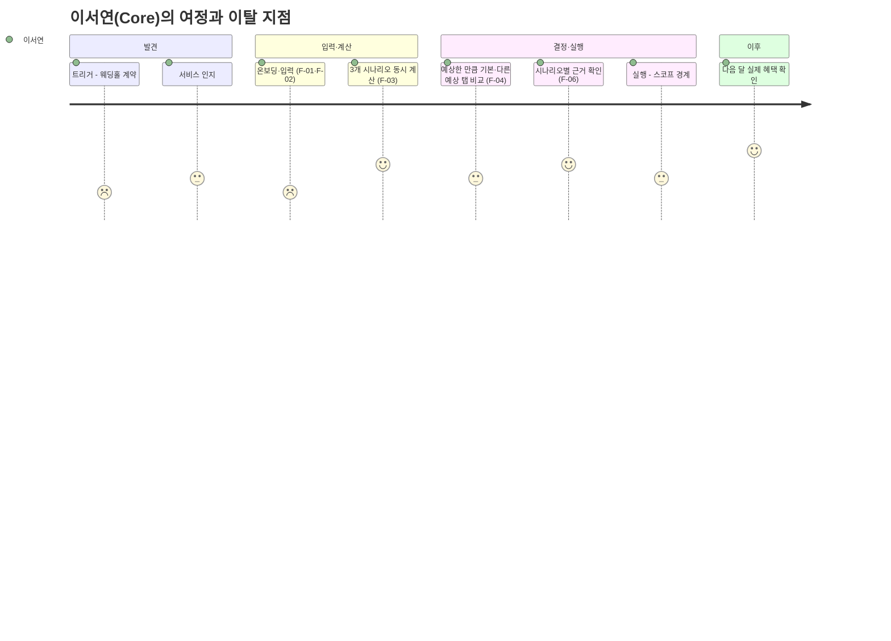
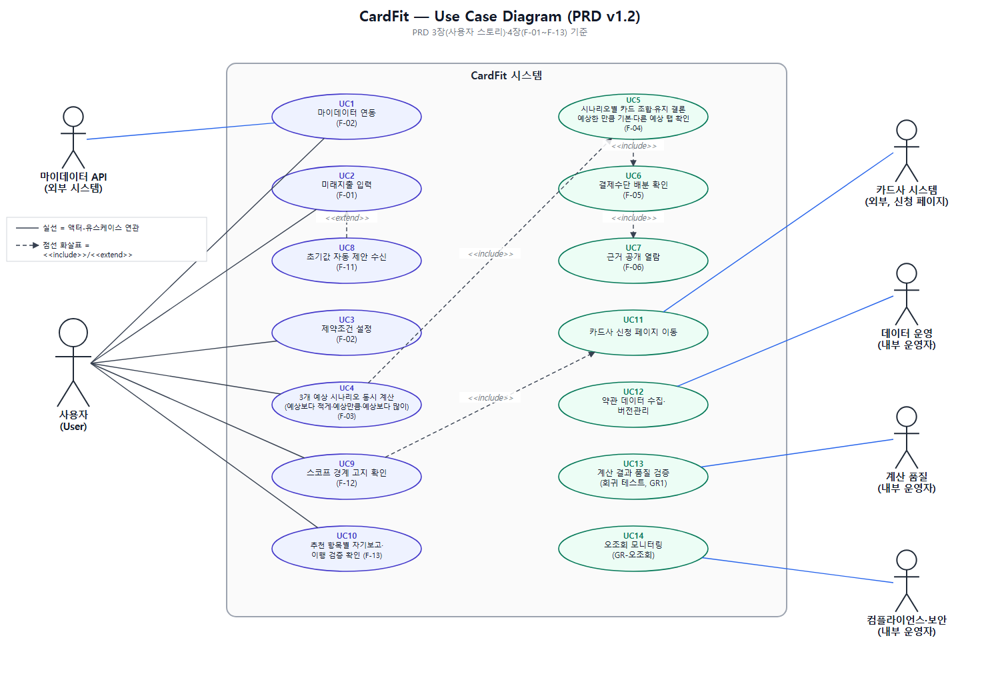
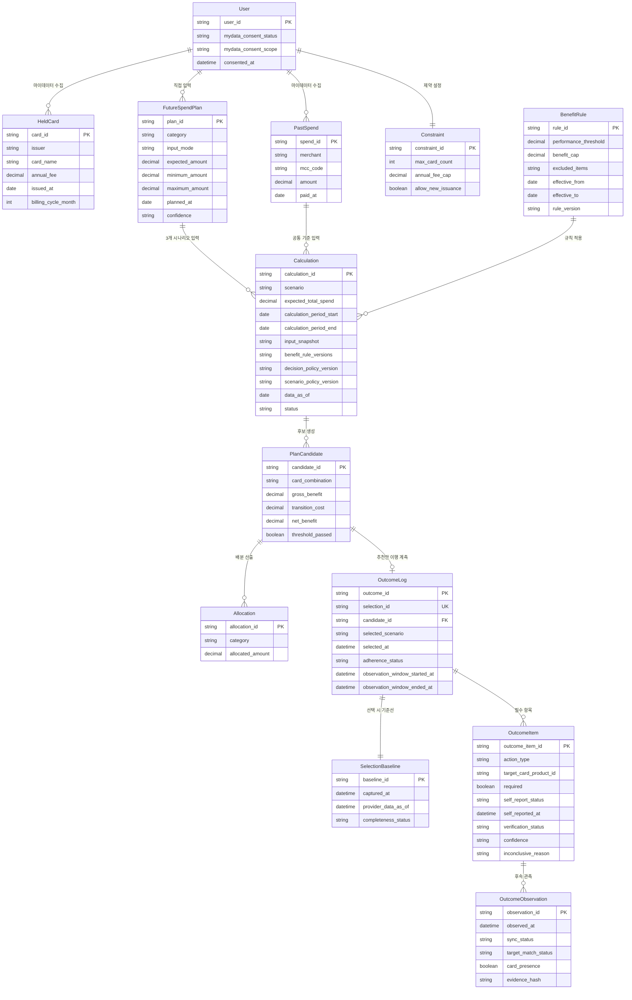
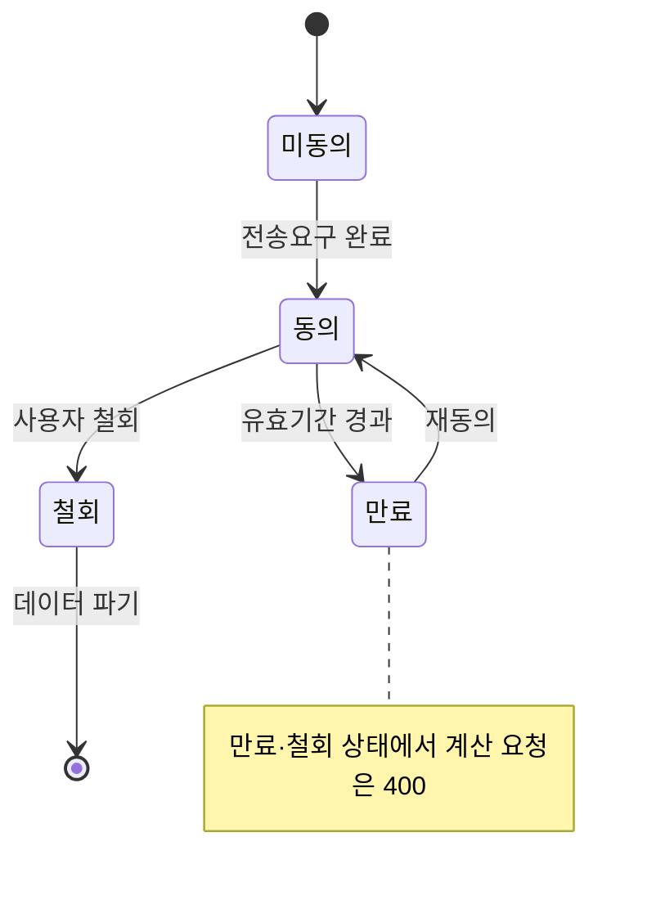

# [CardFit 미래지출 카드설계 서비스] v1.2
- Owner 팀: 진정가
- 최종 업데이트: 2026-08-24
- 변경 이력:
  - v0.1 → v0.2: 팀 결정사항을 기준선으로 정리하고 측정 경로·실패 케이스·의존성·ADR을 보강
  - v0.2 → v1.0 — 완성도 검토 6개 항목(목표·지표/스토리·AC/기능요구/비기능/리스크·가정/범위) 전항 통과 확인 후 확정 배포
  - v1.0 정합성 보정: Requirement Trace와 decision log의 3개 시나리오별 독립 카드 조합 추천 요구사항을 복원
  - v1.0 → v1.1: 사용자 시나리오를 **예상보다 적게 쓸 때·예상한 만큼 쓸 때·예상보다 많이 쓸 때**로 변경하고 계산 정책을 확정. 추천안 이행을 자기보고·마이데이터 관측으로 검증하는 제품 요구사항과 최종 품질검토를 추가
  - v1.1 → v1.2: 시나리오·Net Benefit 수치를 베타 운영 기본값으로 명확히 분류하고, 단일값·범위 입력 모델, 항목별 자기보고, BASE 기준 KPI 분모, 계산 정책 버전, AC 추적성과 전용 Use Case Diagram을 보완

> 출처: `master-deck/p01~p32` 발표 원고, 정본 `효진/0820/final/01_서비스_역기획서.md` 및 `09_PRD_Requirement_Trace_v0.1.md`
> 본 문서에 명시된 기능 범위와 판정 구조는 v1.2의 제품 결정사항이다. D2·D5·D6의 수치는 Owner 승인 전 베타 운영 기본값(Proposed)이다. 아직 운영 이력이 없는 지표는 `미측정`으로 표시하고 8장의 실험을 통해 기준선을 최초 확보한다.

## 문서 요약

CardFit은 사용자가 입력한 예상 미래지출을 기준으로 카드 조합을 계산하고, 지출 변동에도 추천 결론이 유지되는지 함께 보여주는 서비스다. 사용자는 예상금액을 한 번만 입력하며 시스템은 베타 운영 기본값인 `예상보다 적게 쓸 때(80%)`, `예상한 만큼 쓸 때(100%)`, `예상보다 많이 쓸 때(120%)`를 자동 계산한다. 추천 이후에는 자기보고와 동의 범위 안의 마이데이터 후속 관측을 독립적으로 수집해 행동 완주·유지 준수·조합안 이행을 구분한다.

본 PRD는 제품 목표와 사용자 요구를 정의한다. 후속 SRS는 AD-Core-Platform 예시의 7개 섹션을 기본으로 사용하며, PRD 내용이 그 범위를 벗어날 때만 ISO/IEC/IEEE 29148:2018의 제한·가정과 의존성·검증·논리 데이터 요구사항·품질 속성 등 관련 항목을 확장한다. 표준 전체 항목을 채우는 풀 버전 SRS는 이번 변환 목표가 아니다.

### 목차

1. 개요·목표
2. 사용자와 페르소나
3. 사용자 스토리와 수용 기준
4. 기능 요구사항
5. 비기능 요구사항
6. 데이터·인터페이스 개요
7. 범위·리스크·ADR·가정·의존성
8. 실험·롤아웃·측정
9. 근거
10. PRD 최종 품질검토
11. 결론 및 제품 인사이트
12. 출처

---

## 1. 개요·목표

### 문제 정의 (Pain 지표 포함)

| # | Pain | 실패 KPI (수치화) | 측정 경로 | 연결된 Needs |
| :---: | --- | --- | --- | --- |
| P1 | 전월실적 구간·혜택한도·연회비가 얽혀 사용자가 스스로 카드 조합을 계산할 수 없다 | 수기 판단 소요시간 **240분** — 목표(p95 ≤ 5분) 대비 **48배** 이상 소요 | **E0 베이스라인 실험**(8장): 실사용자 n=15~20 스톱워치 실측·자기보고, 베타 착수 전 확정 | N1 계산 대행 |
| P2 | 기존 카드 추천 서비스는 과거 소비만 기준으로 삼는다 | 경쟁 6곳(뱅크샐러드·카드고릴라·더쎈카드·토스·Credit Karma·NerdWallet) 중 미래소비 반영 서비스 **0/6 = 0%** | 경쟁사 UI·PDF 실측 조사(`윤정/0818` 자료), 반기 1회 재조사 | N2 미래지출 기준 계산 |
| P3 | 계산이 맞아도 해지·전환 실행 단계에서 마찰이 크다 | 카드 해지 관련 민원 **6,720건(2022) → 12,661건(2025), +88.4%**(금감원) — 발급매수 증가율(+8.5%) 대비 **약 10.4배** | 금감원 민원 통계 공시자료, 연 1회 갱신 확인 | N3 추천안 이행 가시화 |
| P4 (결과) | 위 세 가지가 겹쳐 사용자가 근거 없는 카드사 자동대체에 결제 포트폴리오를 위임한다 | 자동대체 시 공개되는 계산 근거 항목 수 **0개** | 카드사 자동대체 안내 UI 정성 조사, 반기 1회 | N4 근거 공개 |

**Needs (실패 KPI 대비 목표 임계치)**

| Needs | 목표 임계치 | 현재 상태(기준선) |
| --- | --- | --- |
| N1 계산 대행 | 결론 도달 소요시간 p95 **≤ 5분** | 수기 240분 — E0 실험으로 베타 착수 전 확정 |
| N2 미래지출 기준 계산 | 계산 시 미래 입력 반영률 **100%** | 0%(경쟁사 전부 과거 1년 기준) |
| N3 추천안 이행 가시화 | 선택된 추천안의 자기보고 대상 생성률 **100%**, 마이데이터 검증 가능·판정 불가·불일치 상태 분리율 **100%** | 미측정 — E7에서 최초 기준선 확보 |
| N4 근거 공개 | 결과 1건당 공개 근거 항목 **≥ 6개** | 0개(경쟁사는 결과 금액만 노출) |

### 목표 (Desired Outcome 수치화)

| 목표 | 수치화된 정의 |
| --- | --- |
| G1 계산을 대신한다 | 수기 240분 판단을 **p95 5분 이내** 결론 하나로 압축 |
| G2 미래를 기준으로 삼는다 | 계산에 **미래 입력 반영률 100%** — 미래 입력 없는 산출물은 결과로 취급하지 않음(400 반환) |
| G3 바꿀 가치가 있을 때만 권한다 | Net Benefit 임계 미달 시 **"유지" 반환률 100%** |
| G4 검증 가능하게 만든다 | 결과 1건당 **공개 근거 항목 ≥ 6개** |
| G5 이행을 정확히 측정한다 | 자기보고와 마이데이터 관측을 독립 저장하고 행동 완주·유지 준수·조합안 이행·판정 불가를 **24시간 이내** 대시보드에 반영한다 |
| G6 예상이 달라져도 조건을 보여준다 | 지출 시나리오 **3개(예상보다 적게 쓸 때·예상한 만큼 쓸 때·예상보다 많이 쓸 때)**를 모두 계산한다. 첫 화면은 **예상한 만큼 쓸 때**의 결론을 기본 노출한다 |

### 성공 지표 (북극성 KPI / 보조 KPI)

**북극성 KPI**

| 지표 | 정의(분자/분모) | 기준선 | 목표값 | 측정 경로 | 측정 주기 |
| --- | --- | :---: | :---: | --- | :---: |
| **조합안 선택률** | BASE 결과가 "현재 조합 유지"가 아닌 결과 화면 도달자 중, 결과 열람 후 7일 이내 어느 시나리오에서든 조합안을 저장·확정한 인원 수 ÷ BASE 결과가 "현재 조합 유지"가 아닌 결과 화면 도달 인원 수. 사람 단위로 중복 제거 | 운영 이력 없음, E2 Concierge Test에서 최초 기준선 확보 | **≥ 40%**(중단선 20%) | `result_viewed`·`plan_selected(selected_scenario, candidate_id)` 이벤트 로그 집계 | 주간 |

**보조 KPI**

| 계열 | 지표 | 정의(분자/분모) | 기준선 | 목표값 | 측정 경로 | 주기 |
| :---: | --- | --- | :---: | :---: | --- | :---: |
| 전환 | 결론 도달 소요시간 p95 | 온보딩 진입 ~ 결과 화면 표시까지 소요시간 분포의 p95 | E0로 확정 | ≤ 5분 | `onboarding_started`~`result_viewed` 타임스탬프 차 | 주간 |
| 전환 | 온보딩 완료율 | 마이데이터 연동+미래지출 1건 이상 입력+제약조건 저장을 모두 마친 인원 수 ÷ 온보딩(F-02 화면) 진입 인원 수 | 베타 1주차 실측으로 확정 | ≥ 60% | `onboarding_started`/`onboarding_completed` 이벤트 로그 | 주간 |
| 전환 | 근거 열람률 | 근거 패널을 1회 이상 연 인원 수 ÷ 결과 화면 도달 인원 수 | 베타 1주차 실측으로 확정 | ≥ 50% | `evidence_panel_opened` 클릭 로그 | 주간 |
| 유지 | 자기보고 이행률 | 완료 자기보고 항목 수 ÷ 유효 응답 항목 수. 무응답 제외 | 미측정 — E7에서 최초 기준선 확보 | 기준선 측정 | `POST /outcomes/{id}/self-report` 응답 로그 | 월간 |
| 유지 | 관측 검증 행동 완주율 | High 신뢰도로 판정 가능한 발급·해지 항목 중 완료 항목 비율 | 미측정 — E7에서 최초 기준선 확보 | 기준선 측정 | `OutcomeItem.verification_status` | 월간 |
| 유지 | 유지 준수율 | High 신뢰도로 판정 가능한 유지 항목 중 관측 종료 시 계속 보유한 항목 비율 | 미측정 — E7에서 최초 기준선 확보 | 기준선 측정, 행동 완주율과 분리 | `OutcomeItem=MAINTAIN_CARD` | 월간 |
| 유지 | 조합안 이행률 | 모든 필수 항목을 High 신뢰도로 판정 가능한 조합안 중 완전 이행 조합안 비율 | 미측정 — E7에서 최초 기준선 확보 | 기준선 측정 | `OutcomeLog.adherence_status` | 월간 |
| 데이터 품질 | 검증 가능률·판정 불가율·불일치율 | 검증 가능/전체, 판정 불가/전체, 자기보고-관측 불일치/양쪽 증거 보유 대상을 각각 집계 | 미측정 — E7에서 최초 기준선 확보 | 세 지표 분리율 100% | `OutcomeObservation`·사유코드 | 주간 |
| 유지 | 이벤트 비종속 진입률 | 사전 정의 이벤트명 미선택·자유 카테고리로 온보딩을 완료한 인원 수 ÷ 전체 온보딩 완료 인원 수 | 베타 1개월차 실측으로 확정 | ≥ 20% | `FutureSpendPlan.category` 자유입력 플래그 집계 | 월간 |
| 탐색 | 다른 예상 탭 열람률 | 결과 화면 도달자 중 `예상보다 적게 쓸 때` 또는 `예상보다 많이 쓸 때` 탭을 1회 이상 연 인원 수 ÷ 결과 화면 도달 인원 수 | 미측정 — 베타 첫 주 최초 산출 | 기준선 측정 | `scenario_tab_viewed` 이벤트 로그 | 주간 |
| 유지 | D+90 재방문율 | 결과 확정일 기준 D+90 재방문 인원 수 ÷ 결과 확정 인원 수 | 정식 서비스 전환 후 확정 | 베타 검증 기간(12주)에는 측정 대상에서 제외 — 정식 전환 후 D+90 코호트로 측정 이관 | 앱 방문 로그(D+90 코호트) | — |

**Guardrail (하나라도 초과 시 롤아웃 즉시 중단)**

| # | 지표 | 임계 | 이유 |
| :---: | --- | :---: | --- |
| GR1 | 계산 오류율 | ≤ 0.1% | 규칙 엔진은 결정론적 — 오류는 곧 버그 |
| GR2 | 불필요 신규카드 추천 | 0%(베타 운영 임계값 기준 12개월 Net Benefit이 **50,000원 미만**인데 변경을 추천한 건수 0건) | G3 위반 = 차별점 붕괴 |
| GR3 | 근거 미공개 결과 노출 | 0건 | 차별점 ③(검증 가능한 계산)의 전제 |
| GR4 | 실행 지원 오인 문구 노출 | 0건 | 스코프 위반 = 규제 리스크 |
| GR5 | 데이터 최신성 경고 미표시 | 0%(세부 임계치는 5장 참고) | Table Stakes |

### 차별 가치 (Differential Value)

기존 대안(수기 계산, 뱅크샐러드형 서비스) 대비 5개 지표를 수치로 비교한다.

| 지표 | 기존 대안 | CardFit | 개선폭 | 검증 근거 |
| --- | :---: | :---: | :---: | --- |
| 판단 소요시간(성능) | 수기 240분 | p95 **5분** | **약 48배 단축** | E0 베이스라인 실험 |
| 비교 계산 단위(범위) | 후보 카드 **1장**에 재적용(뱅크샐러드 PDF 실측) | Constraint(F-02) 설정 상한 이내 **전 조합 계산**(예: 최대 5장 설정 시 2⁵−1=31개 조합까지 전수 계산하며 p95 5초 SLA 유지) | 1장 → 최대 31개 조합(설정값 기준) | NFR(5장) p95 SLA와 결합 검증 |
| **계산 정확도(순혜택 우위 비율)** | 조합 계산 자체가 없어 비교 불가 | 동일 스냅샷 비교에서 **순혜택 차액 > 0 케이스 ≥ 70%** | 0% → 70%(목표) | **E5 벤치마크**(n=20, 뱅크샐러드 vs CardFit) |
| 계산 근거 공개 항목(신뢰) | **0개**(결과 금액만 노출) | **6개 이상**(실적구간·한도·연회비·제외조건·기준일·rule_version) | 0 → 6개 | US-B AC1, GR3 |
| 전환비용 반영 항목(비용) | **1개**(연회비만 반영) | **3개**(연회비·실적 재적립 손실·발급 대기) | 1 → 3개 | F-04 Net Benefit 산식 |

> 성능(판단 소요시간)·정확도(순혜택 우위 비율)·비용(전환비용 반영 항목) 3개 축 모두 수치와 검증 실험을 갖춘다. 동일 스냅샷 n=20 벤치마크(E5)로 "3축 전부 우위·순혜택 차액 > 0인 케이스 ≥ 70%"를 검증한다 — 8장 실험표 참고.

---

## 2. 사용자와 페르소나

### 페르소나 스펙트럼 (12명, 4계층)

| 유형 | 인원 | 대표 인물 | 이 계층의 역할 |
| --- | :---: | --- | --- |
| 핵심(Core) | 5 | 이서연(혼인)·김도윤(결혼+이사)·박서준(자동대체 불신)·한지민(프리랜서·이사)·최유리(발령·회계전문가) | 기준 수요 — Job A·B 원천 |
| 확장(Adjacent) | 3 | 정하늘(기존 서비스 이용자)·오세훈(이직)·강민재(자녀 독립·지출 감소) | Job F — 이벤트명에 안 걸리는 수요 |
| 극단(Extreme) | 2 | 윤태호(카드 20장+, 관리 포기)·신은서(해지 3회 시도·0회 성공, 인터뷰 1건 기반 사례) | 실패의 두 원인 — 내부 과부하 vs 외부 마찰 |
| 비활성(Non-user) | 2 | 배정호(디지털 비친화)·조민아(예측 자체를 불신) | v0.1 명시적 제외 대상 |

**대표 4인과 Pain·Needs 연결**

| 인물 | Pain | Needs | 서비스 대응 |
| --- | --- | --- | --- |
| 이서연(Core) | P1 스스로 계산 불가, P4 근거 없는 위임 | N1·N2·N4 | F-01~F-04, F-06 |
| 박서준(Core) | P3 실행 마찰, 카드사 설명 불신 | N3·N4 | F-06(근거), F-13(추천안 이행 측정) |
| 신은서(Extreme, 인터뷰 1건 기반 사례) | P3 실행 실패(상담사 만류, 3회 시도 0회 성공) | N3 | F-13 측정만 — 대행 권한 없음 |
| 조민아(Non-user) | 예측 입력 자체 불신 → 온보딩 이탈 | N1 완화 필요 | F-11 과거 패턴 기반 초기값 자동 제안 |

> 신은서와 조민아는 이 프로젝트의 두 반증 사례다. 신은서는 추천안 이행 지표 설계를, 조민아는 온보딩 설계(F-11)를 바꿨다.

### 고객 여정 — 이서연(Core) 기준, 7단계

**12명 중 4명이 여정을 끝까지 이어가지 못한다: 이탈 지점과 대응**

| 인물 | 단절 지점 | 원인 | 대응 |
| --- | :---: | --- | --- |
| 배정호 | 인지 | 디지털 채널 자체 거부 | ❌ 앱으로 해결 불가 — v0.1 제외 |
| 조민아 | 온보딩 | 미래 예측 입력 자체 불신 | ✅ F-11 초기값 자동 제안 |
| 윤태호 | 조합 비교~실행 | 카드 20장+ 정보 과부하 | 🔶 F-07 단계적 제시(Could) |
| 신은서 | 실행 | 상담사 만류(인터뷰 1건 기반) | 📊 F-13 측정만 — 대행 권한 없음 |

> 가장 취약한 전환점은 온보딩과 실행 두 곳이다. 온보딩은 제품이 개입(F-11)하고, 실행은 개입하지 않고 측정만 한다(F-13) — 이 원칙이 스코프 경계 전체를 요약한다.

---

## 3. 사용자 스토리와 수용 기준(AC, Acceptance Criteria)

### Use Case Diagram

아래 4장(기능 요구사항)의 F-01~F-13과 3장 사용자 스토리(US-A~US-F)를 액터·유스케이스 관계로 정리한 다이어그램이다. UC4는 3개 지출 시나리오의 동시 계산, UC5는 시나리오별 독립 카드 조합·유지 결론과 탭 확인을 나타낸다. 실선은 액터-유스케이스 연관, 점선 화살표는 `<<include>>`/`<<extend>>` 관계를 의미한다.

> 이미지 파일: `diagrams/usecase_diagram_cardfit_v1.2.png` (수정용 벡터 원본: `diagrams/usecase_diagram_cardfit_v1.2.svg`)

### US-A (우선순위 1) — 미래지출 기반 계산

**Story**: As a 소비 구조가 곧 바뀔 사용자(이서연·김도윤·한지민·최유리·정하늘), I want 미래 지출을 카드 혜택과 미리 연결해 계산받기, so that 스스로 카드 조합 변경 여부를 판단할 수 있다.

- **AC1**: Given 마이데이터 연동을 완료하고 보유카드가 1장 이상이며 미래지출을 1건 이상 입력한 사용자가, When `POST /calculate`를 요청하면, Then **p95 응답시간 ≤ 5초** 이내에 `예상보다 적게 쓸 때`·`예상한 만큼 쓸 때`·`예상보다 많이 쓸 때` 3개 시나리오가 모두 산출되고 **예상한 만큼 쓸 때 탭의 결론이 기본 노출**된다.
- **AC2 (실패 케이스)**: Given 미래지출 입력이 0건인 상태에서, When 계산을 요청하면, Then 시스템은 **400을 반환**하고 과거 데이터만으로 산출한 결과를 노출하지 않는다(거부율 100%).
- **AC3**: Given 사용자가 `SINGLE` 입력을 선택한 경우, When 시나리오를 생성하면, Then 베타 운영 기본값으로 `LOW=expected_amount×80%`, `BASE=expected_amount`, `HIGH=expected_amount×120%`를 적용하고 원 단위로 반올림한다.
- **AC4**: Given 사용자가 `RANGE` 입력을 선택한 경우, When 최소·예상·최대 금액을 저장하면, Then `minimum_amount ≤ expected_amount ≤ maximum_amount`를 만족해야 하며 LOW·BASE·HIGH에는 각각 최소·예상·최대 금액을 적용한다.
- **AC5 (실패 케이스)**: Given 생성 금액이 음수·상한 초과이거나 범위 순서가 잘못된 경우, When 계산을 시작하면, Then 유효성 오류를 표시하고 계산 요청을 거부한다(잘못된 시나리오 계산 0건).
- **AC6**: Given 계산이 완료된 상태에서, When 결과 화면에 진입하거나 3개 예상 탭을 전환하면, Then **추가 서버 재계산 없이** 각 시나리오의 독립 카드 조합 또는 유지 결론, 실제 적용 금액, 유지 대비 혜택 차액이 원 단위로 표시된다(표시 누락 0건).
- **AC7 (실패 케이스)**: Given 12개월 Net Benefit이 베타 운영 임계값 50,000원 미만인 조합인 경우, When 계산 결과가 반환되면, Then **"현재 조합 유지" 반환률 100%**이며 임계 미달인데 변경을 제안한 건수는 0건이다.
- **AC8 (실패 케이스)**: Given 3개 시나리오 중 하나라도 필수 데이터 누락 또는 계산 실패가 발생한 경우, When 결과를 반환하려 하면, Then 전체 계산을 `부분` 상태로 처리하고 **어느 탭의 추천 결과도 노출하지 않는다**.

### US-B (우선순위 4) — 근거 검증

**Story**: As a 계산 결과를 받은 사용자(이서연·박서준·최유리·정하늘), I want 계산 근거를 직접 검증하기, so that 카드사의 권유가 아니라 내가 확인한 숫자로 결정할 수 있다.

- **AC1**: Given 계산 결과 화면에서 "근거 보기"를 클릭하면, When 근거 패널이 열리면, Then 실적구간·통합할인한도·연회비·제외조건·기준일·rule_version 등 근거 항목이 **≥ 6개** 펼쳐진다.
- **AC2**: Given 계산에 포함되지 않은 비용(포인트 소멸·자동납부 승계 등)이 있는 경우, When 근거 패널을 열람하면, Then "이 계산에는 포함되지 않았습니다" 문구가 **누락률 0%**로 표시된다.
- **AC3 (실패 케이스)**: Given 근거 항목이 6개 미만으로 산출되는 경우, When 결과를 반환하려 하면, Then 시스템은 **응답을 거부**한다(GR3 위반 **0건** 유지).
- **AC4 (실패 케이스)**: Given 마이데이터 응답 지연·장애로 최신 데이터를 확보하지 못한 경우, When 근거 패널을 열람하면, Then **"최근 확인된 데이터 기준"** 경고와 데이터 기준일이 함께 표시되며, 기준일 미표시 건수는 **0건**이다.

### US-C (우선순위 1) — 추천안 이행 측정 (스코프 경계 스토리)

**Story**: As a 계산 결과대로 카드를 정리하려는 사용자(이서연·박서준, 극단 사례 신은서), I want 자기보고와 마이데이터 관측으로 추천안 이행 여부가 구분되기를, so that 서비스가 대행 권한 없이도 행동 완료·유지·판정 불가를 정확히 측정할 수 있다.

- **AC1**: Given 사용자가 조합안을 선택하면, When 선택 이벤트를 저장할 때, Then 당시 보유카드·대상 상품·동의 범위·데이터 기준일을 기준 스냅샷으로 저장한다(누락 0건).
- **AC2**: Given 선택 후 30일이 지난 사용자가 재방문하면, When 이행 질문을 표시할 때, Then `OutcomeItem`별 자기보고를 **1회만** 수집하고 자기보고와 마이데이터 검증 상태를 독립 저장한다(상호 덮어쓰기 0건).
- **AC3**: Given 유효한 동의와 완전한 마이데이터 응답이 있는 경우, When 발급·해지·유지 항목을 검증하면, Then 카드 식별 정확도와 연속 관측 규칙에 따라 행동 완주·유지 준수·미이행을 구분한다.
- **AC4 (실패 케이스)**: Given 사용자가 완료했다고 응답했으나 마이데이터 동의 만료·부분 응답·오래된 데이터·식별 충돌 때문에 확인할 수 없는 경우, When 결과를 집계하면, Then `자기보고 완료 / INCONCLUSIVE 또는 UNAVAILABLE`로 유지하고 미완료로 변경하지 않는다(오분류 0건).
- **AC5 (실패 케이스)**: Given 정상 조회에서 목표 카드가 한 번 보이지 않는 경우, When 해지 완료 여부를 판정하면, Then 명시적 해지 상태가 없는 한 24시간 이상 간격의 정상·완전 동기화 2회가 충족될 때까지 `PENDING`으로 유지한다(단일 미관측 해지 확정 0건).
- **AC6**: Given 유지 추천을 선택한 사용자가 관측 종료 시 해당 카드를 계속 보유한 경우, When 이행 결과를 집계하면, Then `VERIFIED_MAINTAINED`로 기록하되 행동 완주율에는 포함하지 않는다.
- **AC7 (실패 케이스)**: Given 동일 `selection_id`로 자기보고가 중복 제출되는 경우, When 저장 요청을 처리하면, Then 최초 1건만 유효 처리하며 중복 집계는 0건이다.
- **AC8**: Given 온보딩 및 결과 화면을 거친 사용자에게, When 스코프 고지 문구를 노출하면, Then "해지·전환 대행을 제공하지 않는다"에 대한 **사용자 범위 인지율 ≥ 90%**로 측정된다.

### US-F (우선순위 3) — 이벤트 비종속 입력

**Story**: As a 이벤트명과 무관하게 소비가 변하는 사용자(오세훈·강민재), I want 특정 이벤트 유형을 고르지 않고도 지출 변화를 입력하기, so that 내 소비 변화가 그대로 인정받는다.

- **AC1**: Given 미래지출 입력 화면에서, When 카테고리를 선택하면, Then **이벤트 종류 필수 선택 단계는 0개**다.
- **AC2**: Given 지출 증가 또는 감소 방향을 입력할 때, When 시스템이 값을 처리하면, Then **양방향 입력 처리 오류율 0%**다.
- **AC3**: Given 사전 정의되지 않은 자유 입력 카테고리를 사용할 때, When 계산을 수행하면, Then 해당 카테고리가 계산 결과에 **반영률 100%**로 포함된다.
- **AC4 (실패 케이스)**: Given 지출 금액에 **음수·비숫자·정의된 상한 초과** 값이 입력되는 경우, When 시스템이 입력을 검증하면, Then 저장 전 **오류 메시지가 표시**되고 해당 입력이 계산에 반영되는 건수는 **0건**이다.
- **AC5 (실패 케이스)**: Given 자유 입력 카테고리에 특수문자·이모지 등 비정형 텍스트가 포함된 경우, When 계산 엔진이 처리하면, Then 시스템은 **크래시 없이** 해당 텍스트를 "기타" 카테고리로 정규화하여 처리한다(처리 실패율 0%).

### US-D (우선순위 5) — 유연한 입력

**Story**: As a 정확한 지출 금액을 모르는 사용자(김도윤·한지민·정하늘·강민재), I want 부담 없이 유연하게 입력하기, so that 온보딩에서 이탈하지 않는다.

- **AC1**: Given 과거 마이데이터 소비 패턴이 존재하는 사용자에게, When 미래지출 입력 화면에 진입하면, Then **F-11 초기값이 자동 제안**되어 노출된다(제안 커버리지 100%).
- **AC2**: Given 초기값이 제안된 상태에서, When A/B 실험(n=500, 250/250)을 수행하면, Then 온보딩 완료율이 대조군 대비 **+15%p 이상** 개선된다.
- **AC3**: Given 금액을 단일값이 아닌 범위로 입력할 때, When 최소·예상·최대 금액을 저장하면, Then 세 값이 LOW·BASE·HIGH에 각각 반영된다(범위 입력 처리 성공률 100%).
- **AC4 (실패 케이스)**: Given 마이데이터 과거 소비 이력이 **3개월 미만이거나 존재하지 않는 신규 사용자**에게, When 미래지출 입력 화면에 진입하면, Then F-11 개인화 제안 대신 **카테고리별 업계 평균 기반 기본값**이 제시되고 화면에 "과거 데이터 기반 제안이 아닙니다"가 명시된다(대체 제안 커버리지 100%, 무제안 상태 노출 0건).
- **AC5 (실패 케이스)**: Given 범위 입력 시 `최소 ≤ 예상 ≤ 최대` 조건을 위반한 경우, When 시스템이 값을 검증하면, Then 저장 전 오류 메시지가 표시되고 잘못된 범위가 계산에 반영되는 건수는 **0건**이다.

> US-E(지속 사용 동기, Job E)는 우선순위 5·비MVP로 본 v1.2 범위에서 제외한다(4장 F-10 참고).

---

## 4. 기능 요구사항(Functional)

**MoSCoW 우선순위·근거(대안 대비 가치)·의존성**

| ID | 기능 | Job | MoSCoW | 우선순위 근거(대안 대비 가치) | 의존성 |
| :---: | --- | :---: | :---: | --- | --- |
| **F-01** | 미래지출 입력(카테고리·금액·시점) | A·F | **Must** | 경쟁 6곳 중 이 단계를 가진 곳 0곳 — 유일한 차별 진입점 | 없음(최초 입력 화면) |
| **F-02** | 마이데이터 연동 + 제약조건 입력 | A·D | **Must** | Table Stakes — 카드 내역은 마이데이터 API로만 확보 가능, 없으면 계산 불성립 | 마이데이터 인가·제휴(7장 리스크 선결 조건) |
| **F-03** | 3개 지출 시나리오 동시 계산: `예상보다 적게 쓸 때(LOW)`·`예상한 만큼 쓸 때(BASE)`·`예상보다 많이 쓸 때(HIGH)` | A | **Must** | 대안은 후보 카드 1장과 비교한다. 베타 기본값 80%·100%·120%는 추가 입력 없이 미래지출 오차를 탐색한다 | F-01, F-02, BenefitRule 수집·버전관리 체계, D5 승인 |
| **F-04** | 시나리오별 독립 조합 최적화 + Net Benefit 게이팅: `예상한 만큼 쓸 때` 기본 노출 | A·B | **Must** | 각 지출 수준에서 변경 가치가 작으면 "유지"를 정답으로 반환한다 | F-03, D2·D6 승인 |
| **F-05** | 결제수단 배분(계산·배분까지만) | B·C | **Must** | 경쟁자 체인에 없는 두 번째 단계. 실행 대행 아님 | F-04 |
| **F-06** | 근거 공개(적용 규칙 + 제외조건·기준일) | B | **Must** | 대안은 결과 금액만 노출 → 산출 과정·제외조건까지 6항목 이상 | F-03, F-04(계산 스냅샷·rule_version) |
| **F-11** | 과거 패턴 기반 초기값 자동 제안 | D·A | **Must** | 가장 큰 가정(A1)의 완화 장치 — 온보딩 이탈이 실패 경로, MVP 성립 조건 | F-02 과거 소비 데이터(마이데이터) |
| F-08 | 이벤트 비종속 입력(자유 카테고리·양방향) | F | Should | 이벤트 선택 단계를 두지 않는 것만으로 대부분 충족 | F-01 |
| F-12 | 스코프 경계 고지 + 금지어 자동 검수 | C | Should | 구현 난이도 낮음 대비 규제 리스크 차단 효과 큼 | 없음(문구 자산) |
| F-13 | 추천안 이행 계측(자기보고 + 마이데이터 관측, 측정 전용) | C | Should | 선택률 이후의 행동 완주·유지 준수·판정 불가를 구분한다. 실행 대행은 하지 않는다 | F-04 선택 이벤트, F-02 유효 동의, 마이데이터 호출 예산·동의 목적 승인 |
| F-07 | 단계적 전환 제안(효과 큰 카드부터) | C | Could | 카드 다량 보유자(윤태호형) 과부하 완화. **구현 규모**: F-04/F-06 결과를 재정렬하는 표시 로직만 추가, 신규 계산 로직 없음 → **1 스프린트(2주) 내 구현 가능** | F-04, F-06 |
| F-09 | 소득·지출 범위 입력 | D | Could | 이탈 방지(한지민형). **구현 규모**: F-02 입력 폼에 범위 필드 추가 + 기존 검증 로직 재사용 → **1 스프린트(2주) 내 구현 가능** | F-01 |
| F-10 | 정기 재진단 알림 | E | **Won't v1** | Job E 후순위 — 지속 사용 동기는 비MVP | 해당 없음(v1 범위 밖) |
| F-14 | 카드 20장+ 대량 처리 최적화 | — | **Won't v1** | 대상 세그먼트 우선순위 최저 | 해당 없음(v1 범위 밖) |

> 핵심 기능 1개는 **F-04 조합 최적화(Net Benefit 게이팅)**다. 나머지는 이 계산이 성립하기 위한 전후 단계이며, 보조 기능은 F-06(근거 공개)·F-11(초기값 제안)이다. 실측 데이터가 없어 RICE의 Reach·Confidence를 채울 수 없으므로 범위 합의를 우선하는 MoSCoW를 채택했다. Could 등급 2건(F-07·F-09)은 각각 1 스프린트 내 구현 가능한 경량 확장으로 한정해 우선순위와 구현 규모를 일치시켰다.

---

## 5. 비기능 요구사항(NFR, Non-Functional Requirement)

- **성능**:
  - `POST /calculate`로 3개 시나리오를 모두 산출하는 응답시간 p95 ≤ **5초**
  - 탭 전환은 사전 계산된 결과를 사용하며 추가 계산 API 호출을 발생시키지 않음
  - `GET /calculations/{id}/evidence` 근거 검증 응답 p95 ≤ **500ms**. 근거 6항목 미달 시 같은 SLO 안에서 거부
  - 선택 후 30일 이행 대상 생성과 관측 결과 집계는 예정 시각부터 **24시간 이내** 완료
- **신뢰성**:
  - 계산 오류율 ≤ **0.1%**(GR1)
  - 월 가용성 목표 ≥ **99.5%**(내부 SLO) — **측정 도구**: 헬스체크 1분 주기 업타임 모니터링 / **다운타임 정의**: `POST /calculate` 5xx 응답 또는 10초 초과 타임아웃이 연속 3회 이상 발생한 구간
  - 규칙 엔진 결정론성 — `rule_version` 변경 시마다 회귀 테스트 재실행
- **보안/비용**:
  - 마이데이터 전송요구 범위 초과 조회(오조회) **0건** — **탐지 방법**: 요청 스코프와 응답 데이터 범위를 대조하는 실시간 접근 로그 규칙(동의 범위 외 필드 조회 시 자동 플래그) — 발생 시 서비스 중단 + 감독당국 신고
  - 마이데이터 API는 **호출당 과금**(단일 채널, 대체 공급자 없음) — 계산 요청 건수를 성과 지표가 아닌 **비용**으로 관리
  - 계산 요청·응답, 적용 `rule_version`, 입력 스냅샷, 마이데이터 응답 코드 전건 로그 보존(사후 감사 대응)
  - 후속 이행 관측은 고지·승인된 목적·범위·기간 안에서만 활성화하고, 동의 만료·철회 시 신규 관측 요청 **0건**을 유지
  - `OutcomeObservation`에는 판정 최소 필드와 증거 해시만 저장하고 마이데이터 원본 응답은 저장하지 않음. 항목별 관측 레코드는 판정 종료 후 **90일**에 삭제하고 익명 집계만 유지
  - 일별 후속 관측 호출량은 PM이 승인한 월 예산 상한을 일 단위로 환산한 한도를 초과하지 않으며, 한도 도달 건은 실패가 아닌 `PENDING`으로 다음 실행 창에 이월
- **데이터 최신성(GR5 세부 임계치)**:
  - 카드사 약관 갱신 지연 **7일 초과** → 최신성 경고 표시 + 데이터 운영에 **일간 알림**
  - 갱신 지연 **30일 초과** → 해당 카드는 **계산 대상에서 자동 제외**
- **모니터링 항목**: 로그·대시보드·알림 기준

| 지표 | 발의 | 결정 | 조치 | 탐지 방법 | 알림 지연 SLA |
| :---: | :---: | :---: | --- | --- | :---: |
| GR1 계산 오류율 | 계산 품질 | PM | 즉시 롤아웃 중단 | 회귀 테스트 자동 집계(rule_version 변경 시마다) | ≤ 15분 |
| GR2 불필요 추천 | 계산 품질 | PM | 즉시 중단 + 임계값(D2) 재검토 | US-A AC7 위반 건수 실시간 카운트 | ≤ 15분 |
| GR3 근거 미공개 | 계산 품질 | PM | 즉시 중단 | `GET /evidence` 거부 응답 로그 | ≤ 15분 |
| GR4 오인 문구 | 제품 | PM | 문구 회수 + 금지어 스캐너 패턴 추가 | 금지어 자동 스캐너(UI·푸시·FAQ·CS 문구 전수 스캔) | ≤ 24시간 |
| GR5 최신성 경고 | 데이터 운영 | 데이터 운영 | 경고 표시 복구(7일)/계산 대상 제외(30일) | 약관 수집 배치 결과 대조 | ≤ 24시간(일간 배치) |
| 오조회 | 컴플라이언스 | **컴플라이언스(PM 우회)** | 서비스 중단 + 감독당국 신고 | 실시간 접근 로그 규칙 | ≤ 5분(실시간) |

> 운영 역할 4개(데이터 운영/계산 품질/제품(PM)/컴플라이언스·보안)로 나누어 각 Guardrail의 발의·결정·조치 주체를 분리했다. 오조회만 PM을 우회해 컴플라이언스가 단독 중단할 수 있다 — 타인 데이터 노출은 사업 판단이 아니라 즉시 신고 의무이기 때문이다.

---

## 6. 데이터·인터페이스 개요

### 핵심 엔터티

> ERD 상자에는 구현·검증에 필요한 주요 필드를 함께 표시한다. `FutureSpendPlan.input_mode`는 `SINGLE`·`RANGE`, `Calculation.scenario`는 `LOW`·`BASE`·`HIGH`를 사용한다. RANGE 입력은 최소·예상·최대 금액을 모두 저장한다. 계산 기간은 계산일로부터 12개월이며 계획 지출은 `planned_at`이 속한 결제주기에 반영한다.

| 엔터티 | 주요 필드 | 출처 |
| --- | --- | --- |
| User | user_id, 마이데이터 동의 상태·범위·일시 | 자체 |
| HeldCard | 카드사, 카드명, 연회비, 발급일, 실적 기준월 | 마이데이터 API |
| PastSpend | 가맹점, 업종코드, 금액, 결제일 | 마이데이터 API |
| FutureSpendPlan | 카테고리, 입력 모드(`SINGLE`·`RANGE`), 예상금액, 최소·최대금액, 시점, 확실도 | 사용자(F-01) |
| Constraint | 최대 카드 수, 연회비 상한, 신규 발급 허용 여부 | 사용자(F-02) |
| BenefitRule | 전월실적 구간, 통합할인한도, 제외 항목, 적용 시작·종료일, rule_version | 카드사 약관(수집·버전관리) |
| Calculation | 입력 스냅샷, `scenario`, 예상 총지출액, 계산 시작·종료일, 혜택 규칙·의사결정·시나리오 정책 버전, 기준일, 미반영 항목 | 규칙 엔진 |
| PlanCandidate | 조합 구성, Gross Benefit, 전환비용 3항목, Net Benefit, 임계 통과 여부 | 규칙 엔진 |
| Allocation | 배정 카테고리, 배분 금액 | 규칙 엔진 |
| OutcomeLog | 선택 ID·후보 ID·선택 시나리오·일시, 관측 기간, 조합안 이행 집계 상태 | 자체(F-13) |
| SelectionBaseline | 선택 당시 보유카드·동의 범위·데이터 기준일·완전성 | 자체+마이데이터(F-13) |
| OutcomeItem | 발급·해지·유지 항목, 필수 여부, 항목별 자기보고·검증 결과·판정 불가 사유 | 자체(F-13) |
| OutcomeObservation | 관측 시각·데이터 기준일·동기화 상태·식별 방식·카드 존재 여부·증거 해시 | 자체+마이데이터(F-13) |

### 외부/내부 API 개요

| 인터페이스 | 입출력·제약 |
| --- | --- |
| 마이데이터 카드 업권 API | 단일 채널, 대체 공급자 없음. 장애 시 우회 경로 없음. 호출당 과금 |
| 카드 혜택 Rule 데이터 | 공식 통합 API 없음 — 8개 카드사·겸영은행 파편화. 자체 수집·버전관리 필수 |
| `POST /calculate` | 입력: 미래지출·제약조건 / 출력: 3개 시나리오와 시나리오별 조합안 또는 유지 결론, 적용 금액·기간·3종 정책 버전. 3개를 함께 반환하며 p95 ≤ 5s. 미래 입력 0건이면 400 |
| `GET /calculations/{id}/evidence` | 출력: 근거 항목 목록. 6항목 미달 시 응답 거부 |
| `POST /outcomes/{id}/self-report` | 입력: 항목별 이행 여부 자기보고. 최초 제출만 유효하며 실행 개입 없음 |
| `POST /internal/outcomes/observe` | Vercel Cron이 호출하는 후속 관측 배치. 유효 동의·조회량 한도·멱등성 검증 후 마이데이터 관측 상태 갱신 |

### 상태 전이 — 6개 객체

| 객체 | 상태값 | 전이 규칙 |
| --- | --- | --- |
| 마이데이터 동의 | 미동의 → 동의 → (만료/철회) | 만료·철회 시 계산 요청 400. 철회 시 데이터 파기 |
| 계산(Calculation) | 요청 → (성공/실패/부분) | `LOW`·`BASE`·`HIGH` 중 하나라도 필수 데이터 누락 또는 계산 실패이면 전체를 부분으로 처리하고 세 탭 모두 추천 노출 중단 |
| 조합안(PlanCandidate) | 제시 → (선택/미선택) → 만료 | `rule_version` 변경 또는 기준일 +30일 경과 시 만료 — 재계산 없이 실행 대상 아님 |
| 자기보고(OutcomeLog) | NOT_ASKED → (COMPLETED/NOT_COMPLETED/NO_RESPONSE) | 재방문 시 1회 노출. 무응답을 미완료로 바꾸지 않음 |
| 관측 검증(OutcomeItem) | PENDING → (VERIFIED_COMPLETED/VERIFIED_MAINTAINED/VERIFIED_NOT_COMPLETED/INCONCLUSIVE/UNAVAILABLE) | 자기보고와 독립 전이. 데이터 부재만으로 미완료 확정 금지 |
| 조합안 이행(OutcomeLog) | PENDING → (FULLY_ADHERED/PARTIALLY_ADHERED/NOT_ADHERED/INCONCLUSIVE) | 필수 항목을 종합하되 유지 준수는 행동 완주와 분리 |

**관측 검증 제품 규칙**

1. 발급 추천은 기준 스냅샷에 없던 대상 카드가 Exact 또는 Strong 식별로 확인되고, 24시간 이상 간격의 정상·완전 동기화 2회에서 연속 관측될 때 `VERIFIED_COMPLETED`로 확정한다.
2. 해지 추천은 기준 스냅샷에 있던 대상 카드가 같은 카드사의 정상·완전 동기화 2회에서 연속 미관측될 때 `VERIFIED_COMPLETED`로 확정한다.
3. 마이데이터가 명시적인 발급·해지 상태를 제공하면 정상 관측 1회로 확정할 수 있다.
4. 유지 추천은 관측 종료 시 대상 카드 보유가 확인되면 `VERIFIED_MAINTAINED`로 판정한다. 이는 추천안 이행에는 포함하지만 행동 완주율에는 포함하지 않는다.
5. 동의 만료·철회, 범위 부족, 조회 실패, 부분 응답, 오래된 데이터, 약한 식별, 상품 전환, 증거 충돌, 관측 횟수 부족은 미완료가 아니라 `INCONCLUSIVE` 또는 `UNAVAILABLE`로 기록한다.
6. 자기보고와 관측 결과는 서로 덮어쓰지 않는다. `자기보고 완료 / 검증 불가`와 `자기보고 완료 / 관측 불일치`를 모두 허용한다.
7. 판정 불가 사유는 `CONSENT_EXPIRED`, `CONSENT_WITHDRAWN`, `SCOPE_INSUFFICIENT`, `PROVIDER_TIMEOUT`, `PARTIAL_RESPONSE`, `STALE_DATA`, `IDENTITY_WEAK`, `CARD_REPLACED`, `PRODUCT_CONVERTED`, `CONFLICTING_EVIDENCE`, `OBSERVATION_INSUFFICIENT`, `WINDOW_EXPIRED`, `BASELINE_MISSING`, `ALREADY_HELD`, `MULTIPLE_MATCHES`로 구분한다.

---

## 7. 범위(In/Out), 리스크·주요 설계 결정(ADR)·가정·의존성

### 범위

| In | Out |
| --- | --- |
| F-01 미래지출 입력 · F-02 마이데이터 연동 · **F-03 사용자 입력 1회 기반 3개 예상 시나리오 동시 계산** · **F-04 시나리오별 독립 조합 최적화와 탭 제공** · F-05 결제수단 배분 · F-06 근거 공개 · F-07 단계적 전환 제안 · F-08 이벤트 비종속 입력 · F-09 소득·지출 범위 입력 · F-11 초기값 제안 · F-12 스코프 고지 · F-13 자기보고·마이데이터 관측 기반 추천안 이행 계측 | F-10 정기 재진단 알림 · F-14 카드 20장+ 대량 처리 최적화 · 해지·전환 실행 대행·상담·만류 대응 안내 · 신규카드 자동 발급 · 자동결제 · 대출·BNPL · 리텐션 전용 기능 · 외부 이메일·SMS·Push 독려 |

> 4장 MoSCoW의 Must·Should·Could 등급(F-01~F-09, F-11~F-13)은 전부 In-Scope다. Won't v1(F-10, F-14)만 Out으로 분류해 우선순위 등급과 범위 표기의 충돌을 없앴다.

### 리스크 (최소 3개)

| 축 | 리스크 | 대응 | 상태 |
| --- | --- | --- | :---: |
| 인가 | 마이데이터 인가·제휴가 없으면 핵심 계산과 후속 관측이 성립하지 않음 | 기존 마이데이터 사업자 제휴를 베타 진입 게이트로 운영하고 미체결 시 베타를 시작하지 않음 | 베타 진입 게이트 |
| 업역 | 카드사 신청 페이지 연결이나 실행 독려가 모집·대행으로 해석될 수 있음 | 공식 링크 이동만 제공하고 신청서 작성·제출·해지 대행·외부 독려를 금지. 베타 전 컴플라이언스 검수 | 통제 적용 |
| 인센티브 | 발급 연계 수익이 "유지" 결론과 충돌할 수 있음 | 12개월 Net Benefit 50,000원 게이트를 수익모델보다 우선하고 유지 결론 비율을 독립 보고 | 통제 적용 |
| 데이터 | 카드 약관 통합 API 부재 — 수집 실패 시 계산 신뢰도 붕괴 | rule_version 관리 + 최신성 경고(GR5) + 초기 범위 축소(ADR-004) | 관리 중 — 운영 절차로 상시 대응 |
| 운영 | 마이데이터 호출당 과금 — 사용자 증가가 곧 비용 증가 | 계산 요청 건수를 비용으로 관리, 성과 지표로 사용하지 않음 | 관리 중 — 비용 모니터링으로 상시 대응 |
| 관측 | 마이데이터 데이터 지연·부분 응답으로 해지나 미이행을 잘못 확정할 수 있음 | 기준 스냅샷, High 신뢰도, 연속 정상 관측 2회, 판정 불가 사유코드를 강제하고 단일 미관측 확정을 금지 | 통제 적용 |
| 편향 | 마이데이터 동의를 유지한 사용자만 자동 검증되어 이행률이 과대 추정될 수 있음 | 관측 검증 이행률과 함께 검증 가능률·판정 불가율을 동일 화면에 병렬 보고 | 통제 적용 |

### 주요 설계 결정 (ADR, Architecture Decision Record)

| ID | 결정 | 배경/이유 | 상태 |
| :---: | --- | --- | :---: |
| ADR-001 | 계산 로직은 결정론적 규칙 엔진으로 구현하고, AI는 근거 설명에만 사용한다 | "AI가 혜택을 보장한다"는 오해를 방지해 재무자문·투자권유 분류 리스크(업역 리스크)를 차단한다 | 확정 |
| ADR-002 | 카드 해지·전환 실행은 시스템 범위에서 제외하고 측정(F-13)으로만 대응한다 | 카드 해지 절차에 대한 직권·대행 권한이 없으며, 대행 시 모집인 등록 등 업역 리스크가 발생한다(리스크: 업역) | 확정 |
| ADR-003 | Net Benefit 게이팅에서 "유지"를 정상 결과로 반환하며, 무조건적 신규카드 추천을 하지 않는다 | 무조건 신규카드를 추천하면 차별점 ③(검증 가능한 계산)이 무너지고, 발급 연계 수익모델과 충돌한다(리스크: 인센티브) | 확정 |
| ADR-004 | 마이데이터 API를 카드 데이터의 유일한 채널로 사용하고 자체 크롤링·스크래핑은 하지 않는다 | 카드 약관 통합 API가 없고(리스크: 데이터), 개인신용정보 수집은 마이데이터 표준 인가 체계를 통해서만 한다 | 확정 |
| ADR-005 | 자기보고는 재방문 시 1회만 노출하고 외부 발송·재노출·독려하지 않는다 | 반복 독려는 실행 개입으로 해석될 수 있고 GR4 위험을 높인다 | 확정 |
| ADR-006 | 한 번의 `POST /calculate` 요청에서 동일한 스냅샷으로 베타 기본값 LOW 80%·BASE 100%·HIGH 120%를 계산하고 `예상한 만큼 쓸 때`를 기본 노출한다 | 사용자 입력을 세 번 요구하지 않으면서 예상 오차를 비교한다. 비율은 E6 결과에 따라 버전 변경한다 | 구조 확정·비율은 베타 기본값 |
| ADR-007 | 사용자 화면에는 LOW/BASE/HIGH 대신 `예상보다 적게 쓸 때`·`예상한 만큼 쓸 때`·`예상보다 많이 쓸 때`를 표시한다 | 분석 용어보다 사용자가 자신의 지출 상황을 바로 이해할 수 있는 문장을 사용한다 | 확정 |
| ADR-008 | 자기보고와 마이데이터 관측을 독립 증거로 저장하고 유지 추천은 행동 완주와 분리한다 | 확인 불가를 실패로 오분류하거나 유지 결론으로 전체 완주율을 부풀리는 것을 방지한다 | 확정 |

### 제품 전제와 검증 우선순위

| # | 가정 | 검증 우선순위 | 반증되면 무엇이 무너지나 | 검증 |
| :---: | --- | --- | --- | :---: |
| A5 | 마이데이터 인가·제휴를 확보할 수 있다 | 0순위 — 착수 전 선결 | 계산 성립 자체 | 착수 전 선결 |
| A1 | 미래 지출 입력의 수고가 혜택 최적화 보상으로 정당화된다 | 1순위 — 서비스 성립 전제 | 서비스 전체 — 온보딩이 성립하지 않음 | E2 |
| A4 | 계산상 유리하면 사용자가 선택한다 | 1순위 — 북극성 전제 | 북극성 지표 자체 | E2 |
| A2 | 사용자가 미래 지출을 숫자로 표현할 수 있다 | 2순위 | F-01 입력 설계(F-11로 완화) | E1·E3 |
| A3 | 근거 공개가 신뢰를 만든다 | 2순위 | 차별점 ③ | E2(2군 비교) |
| A6 | 선택과 실제 추천안 이행 사이에는 측정할 가치가 있는 격차가 존재한다 | 3순위 | F-13 보조 지표의 운영 가치 | E7 |
| A7 | 다른 예상 시나리오가 미래지출 오차를 이해하고 조건부 결정을 내리는 데 도움을 준다 | 2순위 | F-03·F-04의 3개 시나리오 UX | 다른 예상 탭 열람률·E2 인터뷰 |

### 의존성

- 마이데이터 카드 업권 API 인가·제휴(베타 진입 게이트이며 체결 전에는 베타를 시작하지 않음)
- 카드사 8곳 약관 데이터 수집·`rule_version` 관리 체계
- 12개월 Net Benefit 50,000원 임계값 적용 → 이후 수익모델 결정 순서 준수
- 후속 관측 목적·범위에 대한 사용자 고지와 컴플라이언스 승인

### 계산 정책과 승인 상태

| ID | 결정 항목 | v1.2 정책 | 상태·Owner | 변경 통제 |
| :---: | --- | --- | --- | --- |
| D2 | Net Benefit 게이팅 임계값 | 계산일 이후 12개월 Net Benefit **50,000원 이상**일 때만 변경 추천. 미만이면 유지 | 베타 운영 기본값·PM 승인 필요 | `decision_policy_version`으로 버전 관리, E2 검증 |
| D5 | 3개 시나리오 산식 | `SINGLE`: LOW 80%·BASE 100%·HIGH 120%. `RANGE`: 최소·예상·최대를 LOW·BASE·HIGH에 적용. 원 단위 반올림, 음수 금지 | 구조 확정·비율은 베타 운영 기본값·PM 승인 필요 | `scenario_policy_version`으로 버전 관리, E4·E6 회귀 필수 |
| D6 | 계산 기간과 지출 귀속 | 계산일로부터 12개월. 계획 지출은 `planned_at`이 속한 결제주기에 귀속하고 연회비·전환비용도 같은 기간에 반영 | 설계안·PM·계산 품질 승인 필요 | `decision_policy_version`으로 버전 관리, 결과에 기간·기준일 표시 |

> D2·D5·D6의 현재 수치는 베타 구현을 준비하기 위한 운영 기본값이며 검증된 사용자 선호나 영구 정책이 아니다. Owner 승인 전에는 `Proposed`로 취급하고, 승인 후 최초 정책 버전을 발급한다. 변경 시 과거 계산 재현을 위해 적용 버전을 계산 스냅샷과 함께 보존한다.

---

## 8. 실험·롤아웃·측정

**베타 채널**: 혼인(Q1) 세그먼트를 SOM Beachhead로 선정 — Trigger 감지가능성(웨딩업체 신호)과 1인당 지출강도(1,473만~2,203만원)가 가장 높은 세그먼트.

### 실험 로드맵

| 실험 | 검증 질문 | 설계 | 성공 기준 |
| :---: | --- | --- | --- |
| **E0 베이스라인** | 수기 계산 소요시간이 실제로 약 240분 수준이다 | 실사용자 n=15~20, 수기로 카드 조합을 계산하게 하고 스톱워치 실측·자기보고 병행. E2 착수 전 완료 | 소요시간 분포(p50·p95) 확정 — G1·차별가치 "48배" 수치의 분모로 확정 사용 |
| **E2 Concierge** | 계산 결과를 받으면 조합안을 선택한다 | 혼인 모집 40 / 유효 30, 사람이 직접 계산. 근거 공개 유/무 2군 | 선택률 ≥ 40%(중단선 20%) · 신뢰 점수 전후 상승 |
| E1 인터뷰 | 미래 입력 의향이 실재한다 | 실제 사용자 n=15 | Job A 언급률 ≥ 60% |
| E3 A/B | F-11이 온보딩 이탈을 줄인다 | n=500(250/250) | B군 ≥ 60% 및 A군 대비 +15%p, 수정률 정상 |
| E4 회귀 | 규칙 엔진이 경계값에서 정확하다 | 경계값 케이스 ≥ 200건 | 오류율 ≤ 0.1% · 재계산 불일치 0건 |
| E5 벤치마크 | 동일 데이터에서 더 정확한 조합을 낸다(경쟁 대안 대비) | 같은 스냅샷 n=20으로 뱅크샐러드 vs CardFit | 3축 전부 우위 · 순혜택 차액 > 0인 케이스 ≥ 70% |
| E6 시나리오 정합성 | 3개 시나리오가 한 번에 일관되게 산출되고 예상 오차 탐색을 돕는가 | 동일 입력 스냅샷으로 `LOW`·`BASE`·`HIGH` 결과와 사용자 문구·적용 금액을 검증하고, E2 참여자의 다른 예상 탭 열람·이해도를 관찰 | 3개 결과 동시 산출 성공률 100% · 탭 전환 추가 계산 호출 0건 · 적용 금액 누락 0건 · 부분 결과 노출 0건 |
| E7a 이행 분류 | 자기보고와 관측 결과를 독립적으로 분류할 수 있는가 | E2 선택자, 기준 스냅샷과 30일 후 자기보고·후속 관측 | 상태·사유코드 분류 누락 0건, 데이터 부재의 미완료 오분류 0건 |
| E7b 기준선 | 행동 완주·유지 준수·조합안 이행과 검증 가능성을 측정할 수 있는가 | 베타 선택자, 30일 후 High 신뢰도 판정과 자기보고 비교 | 5개 이행·데이터 품질 지표의 기준선 확보, 유지 항목의 행동 완주율 혼입 0건 |

**중단 조건**
- **E0 미완료 = E2 착수 불가** — 기준선 없이는 목표 대비 성과를 판정할 수 없음
- GR1 초과 또는 GR2·GR3·GR4 1건 = 즉시 중단
- E2 선택률 < 20% = A1 전제 재검토(피벗)
- E2 제외군("유지" 결론) 비율 > 30% = 북극성 산식 재설계
- E3 +15%p 미달 또는 수정률 비정상 = F-11 재설계
- 마이데이터 인가·제휴 미체결 = 베타 진입 불가

> 표본 수는 목표값과 중단선의 간격에서 역산했다 — 40% vs 20%를 가르는 데는 n=30이면 충분(오판 확률 1.7%).

---

## 9. 근거(Proof)

각 핵심 주장을 실험 설계(Design)와 측정 도구(Metrics)에 연결한다.

| 주장 | 실험 설계(Design) | 측정 지표(Metrics) |
| --- | --- | --- |
| 판단 소요시간이 약 240분이다(기준선 자체) | **E0 베이스라인 실험**(n=15~20, 스톱워치 실측·자기보고) | 소요시간 분포 p50·p95 |
| 판단 소요시간 240분 → p95 5분(약 48배 개선) | E0(기준선 확정) + E2 Concierge Test(혼인 모집 n=40, 유효 30) | 결론 도달 소요시간 p95, 조합안 선택률 |
| 조합 단위 계산이 카드 1장 비교보다 정확도 우위 | E5 벤치마크 — 동일 스냅샷 n=20, 뱅크샐러드 vs CardFit | 순혜택 차액 > 0 케이스 비율(≥70% 목표), 3축(성능·정확도·비용) 비교 |
| F-11 초기값 제안이 온보딩 이탈을 줄인다 | E3 A/B 테스트, n=500(250/250) | 온보딩 완료율(B군 ≥60%, A군 대비 +15%p), 수정률 |
| 미래 지출 입력 의향이 실재한다(A2) | E1 실사용자 인터뷰 n=15 | Job A 언급률(≥60%) |
| 규칙 엔진이 경계값에서 정확하다(GR1 근거) | E4 회귀 테스트 — 경계값 케이스 ≥200건(실적 1원 부족·한도 초과·실적 충돌·정책혜택 중복) | 오류율(≤0.1%), 재계산 불일치 건수(0건) |
| 3개 시나리오가 예상 오차를 흡수하면서 일관된 결과를 제공한다(G6·A7) | E6 시나리오 정합성 테스트 + E2 다른 예상 탭 관찰 | 3개 동시 산출 성공률, 추가 계산 호출 건수, 적용 금액 누락 건수, 부분 결과 노출 건수, 다른 예상 탭 열람률 |
| 선택과 실제 추천안 이행 사이의 격차를 구분할 수 있다(A6) | E7a 상태 분류 · E7b 자기보고와 High 신뢰도 관측 비교 | 자기보고 이행률, 행동 완주율, 유지 준수율, 조합안 이행률, 검증 가능·판정 불가·불일치율 |
| 해지 실행 마찰이 실재한다(P3) | 로그 분석 — 금감원 민원 통계 | 카드 해지 민원 건수(2022 6,720건 → 2025 12,661건, +88.4%), 발급매수 증가율(+8.5%) 대비 배율 |
| 미래소비 반영 서비스가 시장에 없다(P2) | 경쟁사 리서치 — 뱅크샐러드·카드고릴라·더쎈카드·토스·Credit Karma·NerdWallet 6곳 기능 실측 | 미래소비 반영 기능 보유 비율(0/6) |

---

## 10. PRD 최종 품질검토

| 항목 | 검토 결과 | 근거 | 판정 |
| --- | --- | --- | :---: |
| 목표·지표 | 북극성 1개와 보조 KPI를 수치화하고 기준선·목표·측정 이벤트·주기를 명시했다. 운영 이력이 없는 지표는 0%가 아니라 `미측정`으로 표시하고 최초 측정 실험을 연결했다 | 1장 KPI·Guardrail, 8장 E0~E7 | **PASS** |
| 스토리·AC | 모든 MVP Story를 Given/When/Then으로 작성하고 p95 5초, 500ms, 오류·누락 0건, 24시간, 30일 등 SLO를 연결했다. 각 Story에 실패 케이스가 2개 이상 있다 | 3장 US-A·B·C·F·D | **PASS** |
| 기능 요구 | Must·Should·Could·Won't, 근거와 선행 의존성을 명시했다. Could인 F-07·F-09는 기존 결과·입력 로직을 재사용해 각각 1스프린트(2주) 안에 구현할 수 있다 | 4장 기능 요구사항 표 | **PASS** |
| 비기능 | 성능·신뢰성·가용성·보안·비용·최신성의 임계치와 탐지 방법·알림 SLA·책임자를 명시했다 | 5장 NFR·모니터링 표 | **PASS** |
| 리스크·가정·ADR | 인가·업역·인센티브·데이터·비용·관측 오판정·선택 편향 등 주요 리스크 7개와 대응을 정의했다. ADR 8건은 제품 전제 A1~A7의 검증과 범위 통제에 연결된다. D2·D5·D6 수치는 Owner 승인 전 Proposed다 | 7장 리스크·ADR·제품 전제 | **조건부 PASS — 정책 승인 필요** |
| 범위 | Must·Should·Could를 In-Scope로, Won't와 실행 대행·외부 독려를 Out-of-Scope로 구분했다. 유지 결론과 발급 수익 충돌은 Net Benefit 게이트로 통제한다 | 7장 범위·ADR-002/003/005 | **PASS** |

### SRS 변환 적용 원칙

후속 SRS는 예시 AD-Core-Platform의 `서론 → 이해관계자 → 시스템 맥락 및 인터페이스 → 구체적 요구사항 → 추적성 매트릭스 → 부록` 구조를 기본으로 따른다. 예시가 다루지 않는 다음 PRD 내용만 ISO/IEC/IEEE 29148:2018 구성에 따라 확장한다.

- C-TEC 기술 제한과 규제·보안 통제는 `Limitations`에 대응시킨다.
- 마이데이터 인가·제휴와 외부 데이터 의존성은 `Assumptions and dependencies`에 대응시킨다.
- 기능·비기능·제품 지표·Guardrail은 고유 ID와 검증 방법을 부여하고 추적성 매트릭스에 연결한다.
- 기준 스냅샷·관측·판정 상태는 논리 데이터 요구사항과 상태 전이로 확장한다.
- E0~E7과 합격·중단 기준은 `Verification`에 대응시킨다.

따라서 후속 SRS는 ISO 29148의 모든 항목을 채우는 풀 버전이 아니라, 예시 형식을 유지하면서 PRD에서 필요한 내용만 표준 항목으로 확장하는 문서가 된다.

---

## 11. 결론 및 제품 인사이트

CardFit v1.2는 예상 미래지출을 한 번 입력하면 세 가지 예상 범위를 자동 계산하고, 각 범위에서 카드 변경이 실제로 유리한 조건을 보여주는 제품으로 정의됐다. 베타 운영 기본값으로 12개월 Net Benefit 50,000원 미만에서는 현재 조합 유지를 반환하므로 미세한 혜택 차이로 신규 발급을 권하지 않는다. 이 수치와 시나리오 비율은 Owner 승인 후 정책 버전을 발급하고 E2·E6 결과에 따라 변경 통제한다.

추천 이후의 성과는 단일 완주율로 축약하지 않는다. 발급·해지는 행동 완주, 유지는 유지 준수, 복합 추천은 조합안 이행으로 측정한다. 자기보고와 마이데이터 관측이 다르거나 관측할 수 없는 경우에도 어느 한쪽을 임의로 정답 처리하지 않는다. 이 설계의 핵심 인사이트는 추천의 강도를 높이는 것이 아니라, 추천이 성립하는 조건과 실행 결과의 불확실성을 사용자가 이해할 수 있게 만드는 데 있다.

구조·추적성·측정 정의는 보완됐다. 후속 SRS는 본 PRD를 요구사항 기준선으로 사용할 수 있지만, D2·D5·D6의 수치는 Owner 승인 전 `[Proposed]`로 전달해야 한다. 예시 SRS의 구조를 유지하면서 기술 제한·검증·논리 데이터·상태 모델만 ISO 29148 항목에 따라 확장한다.

---

## 12. 출처

- 인터뷰: E0(신규, n=15~20), E1(n=15, 실제 사용자 인터뷰로 전면 실행 예정), E2 Concierge Test 결과 로그
- 로그: 금감원 민원 통계(2022~2025), 여신금융협회 월간 카드 통계
- 벤치마크: `윤정/0818/경쟁사_유저플로우_뱅크샐러드.pdf`, E5 동일 스냅샷 n=20 비교표
- 리서치: `윤정/확정본/04_TAM_SAM_SOM_Segment_Map.md`, `가람/확정본/05_Persona_Spectrum_Journey.md`, `가람/확정본/07_JTBD.md`, `가람/확정본/06_Opportunity_Score.md`, `효진/0820/09_PRD_Requirement_Trace_v0.1.md`, `효진/0820/09-1_KPI_Design_Worksheet_v0.1.md`, `master-deck/README.md`(페이지별 근거 인덱스)
- SRS 예시: [SRS AD-Core-Platform](https://wildmental.notion.site/SRS-AD-Core-Platform-5f1d03212bd4823ba8428142bc22ef76)
- 표준: [ISO/IEC/IEEE 29148:2018 공식 개요](https://committee.iso.org/standard/72089.html), 사용자 제공 `29148-2018-ISOIECIEEE.pdf`
