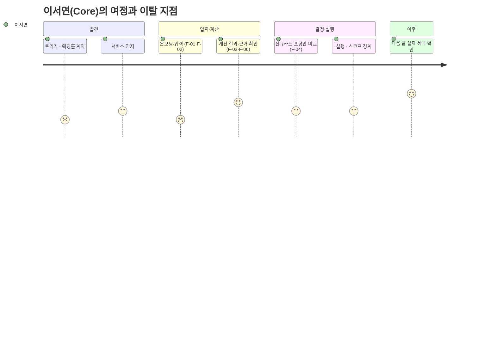
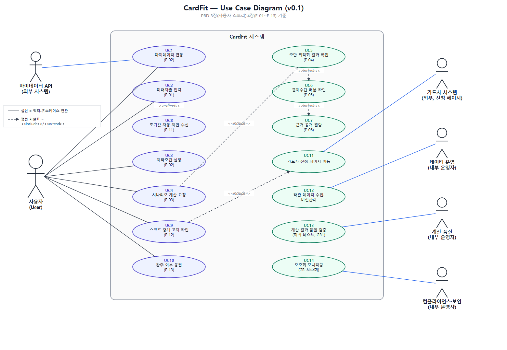
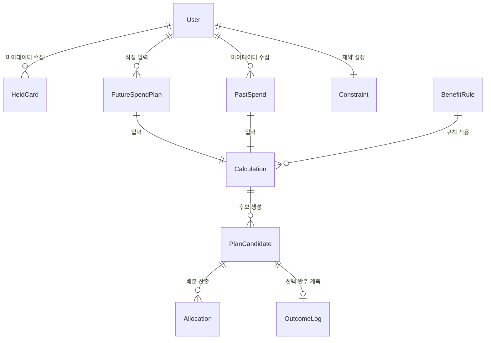
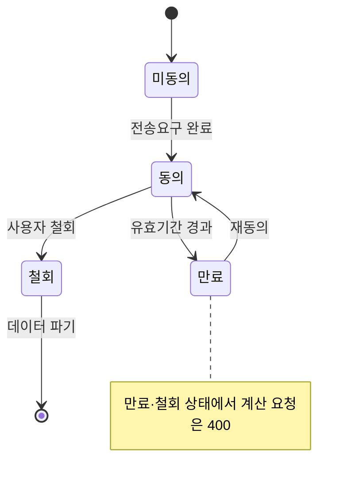

# [CardFit 미래지출 카드설계 서비스] v0.1
- Owner 팀: 진정가
- 최종 업데이트: 2026-08-24

> 표기 — 근거: 🔵 확인된 사실 · ⚪ 추론 · 🟡 가정 · 🟠 미확인
> 출처: `master-deck/p01~p32` 발표 원고, 정본 `효진/0820/final/01_서비스_역기획서.md` 및 `09_PRD_Requirement_Trace_v0.1.md`

---

## 1. 개요·목표

### 문제 정의 (Pain 지표 포함)

| # | Pain | 실패 KPI (수치화) | 연결된 Needs |
| :---: | --- | --- | --- |
| P1 | 전월실적 구간·혜택한도·연회비가 얽혀 사용자가 스스로 카드 조합을 계산할 수 없다 | 수기 판단 소요시간 **240분**(⚪ 추정, 기준선 미측정 🟠) — 목표(p95 ≤ 5분) 대비 **48배** 이상 소요 | N1 계산 대행 |
| P2 | 기존 카드 추천 서비스는 과거 소비만 기준으로 삼는다 | 경쟁 6곳(뱅크샐러드·카드고릴라·더쎈카드·토스·Credit Karma·NerdWallet) 중 미래소비 반영 서비스 **0/6 = 0%** 🔵 | N2 미래지출 기준 계산 |
| P3 | 계산이 맞아도 해지·전환 실행 단계에서 마찰이 크다 | 카드 해지 관련 민원 **6,720건(2022) → 12,661건(2025), +88.4%** 🔵(금감원) — 같은 기간 카드 발급매수 증가율(+8.5%) 대비 **약 10.4배** 속도 | N3 실행 완주 가시화 |
| P4 (결과) | 위 세 가지가 겹쳐 사용자가 근거 없는 카드사 자동대체에 결제 포트폴리오를 위임한다 | 자동대체 시 공개되는 계산 근거 항목 수 **0개** | N4 근거 공개 |

**Needs (실패 KPI 대비 목표 임계치)**

| Needs | 목표 임계치 | 현재 상태(기준선) |
| --- | --- | --- |
| N1 계산 대행 | 결론 도달 소요시간 p95 **≤ 5분** | 🟠 미측정 (수기 240분 ⚪ 추정) |
| N2 미래지출 기준 계산 | 계산 시 미래 입력 반영률 **100%** | 0% (경쟁사 전부 과거 1년 기준) |
| N3 실행 완주 가시화 | 완주 여부 측정 커버리지 **100%**(목표값은 없음 — 실태 파악 전용) | 0% (측정 자체가 없음) |
| N4 근거 공개 | 결과 1건당 공개 근거 항목 **≥ 6개** | 0개(경쟁사는 결과 금액만 노출) |

### 목표 (Desired Outcome 수치화)

| 목표 | 수치화된 정의 |
| --- | --- |
| G1 계산을 대신한다 | 수기 240분 판단을 **p95 5분 이내** 결론 하나로 압축 |
| G2 미래를 기준으로 삼는다 | 계산에 **미래 입력 반영률 100%** — 미래 입력 없는 산출물은 결과로 취급하지 않음(400 반환) |
| G3 바꿀 가치가 있을 때만 권한다 | Net Benefit 임계 미달 시 **"유지" 반환률 100%** |
| G4 검증 가능하게 만든다 | 결과 1건당 **공개 근거 항목 ≥ 6개** |
| G5 실패를 보이게 만든다 | 실행 완주율을 **상시 노출**(개입 없이 사각지대 제거) |

### 성공 지표 (북극성 KPI / 보조 KPI)

**북극성 KPI**

| 지표 | 정의 | 기준선 | 목표값 | 측정 주기 |
| --- | --- | :---: | :---: | :---: |
| **조합안 선택률** | 결과 화면 도달자 중 조합안을 저장·확정한 비율(사람 단위, 결과 열람 후 7일 이내 선택 인정, "유지" 결론 대상자는 분모 제외) | 🟠 미측정 | **≥ 40%** 🟡(팀 합의 임계치, 외부 벤치마크 없음 — 미달 시 중단선 20%) | 주간 |

**보조 KPI**

| 계열 | 지표 | 기준선 | 목표값 | 측정 주기 |
| :---: | --- | :---: | :---: | :---: |
| 전환 | 결론 도달 소요시간 p95 | 🟠(수기 240분 ⚪) | ≤ 5분 | 주간 |
| 전환 | 온보딩 완료율 | 🟠 미측정 | ≥ 60% | 주간 |
| 전환 | 근거 열람률 | 🟠 미측정 | ≥ 50% | 주간 |
| 유지 | 실행 완주율(측정 전용) | 0% ⚪ | 목표 없음 — 실태 파악 | 월간 |
| 유지 | 이벤트 비종속 진입률 | 🟠 미측정 | ≥ 20% | 월간 |
| 유지 | D+90 재방문율 | 🟠 미측정 | ⚠️ 검증 기간 내 측정 불가 | — |

**Guardrail (하나라도 초과 시 롤아웃 즉시 중단)**

| # | 지표 | 임계 | 이유 |
| :---: | --- | :---: | --- |
| GR1 | 계산 오류율 | ≤ 0.1% | 규칙 엔진은 결정론적 — 오류는 곧 버그 |
| GR2 | 불필요 신규카드 추천 | 0% | G3 위반 = 차별점 붕괴 |
| GR3 | 근거 미공개 결과 노출 | 0건 | 차별점 ③(검증 가능한 계산)의 전제 |
| GR4 | 실행 지원 오인 문구 노출 | 0건 | 스코프 위반 = 규제 리스크 |
| GR5 | 데이터 최신성 경고 미표시 | 0% | Table Stakes |

### 차별 가치 (Differential Value)

기존 대안(수기 계산, 뱅크샐러드형 서비스) 대비 4개 지표를 수치로 비교한다.

| 지표 | 기존 대안 | CardFit | 개선폭 |
| --- | :---: | :---: | :---: |
| 판단 소요시간(성능) | 수기 240분 ⚪ | p95 **5분** | **약 48배 단축** |
| 비교 계산 단위(정확도) | 후보 카드 **1장**에 재적용 🔵(뱅크샐러드 PDF 실측) | 보유·신규카드 **조합** 단위 재배분 | 단일 카드 → N장 조합 |
| 계산 근거 공개 항목(정확도/신뢰) | **0개**(결과 금액만 노출 🔵) | **6개 이상**(실적구간·한도·연회비·제외조건·기준일·rule_version) | 0 → 6개 |
| 전환비용 반영 항목(비용) | **1개**(연회비 정도로 추정 ⚪) | **3개**(연회비·실적 재적립 손실·발급 대기) | 1 → 3개 |

> 동일 스냅샷 n=20 벤치마크(E5)로 "3축 전부 우위·순혜택 차액 > 0인 케이스 ≥ 70%"를 검증 대상으로 삼는다 — 8장 실험표 참고.

---

## 2. 사용자와 페르소나

### 페르소나 스펙트럼 (12명, 4계층)

| 유형 | 인원 | 대표 인물 | 이 계층의 역할 |
| --- | :---: | --- | --- |
| 핵심(Core) | 5 | 이서연(혼인)·김도윤(결혼+이사)·박서준(자동대체 불신)·한지민(프리랜서·이사)·최유리(발령·회계전문가) | 기준 수요 — Job A·B 원천 |
| 확장(Adjacent) | 3 | 정하늘(기존 서비스 이용자)·오세훈(이직)·강민재(자녀 독립·지출 감소) | Job F — 이벤트명에 안 걸리는 수요 |
| 극단(Extreme) | 2 | 윤태호(카드 20장+, 관리 포기)·신은서(해지 3회 시도·0회 성공 ⚪ 단일 사례) | 실패의 두 원인 — 내부 과부하 vs 외부 마찰 |
| 비활성(Non-user) | 2 | 배정호(디지털 비친화)·조민아(예측 자체를 불신) | v0.1 명시적 제외 대상 |

**대표 4인과 Pain·Needs 연결**

| 인물 | Pain | Needs | 서비스 대응 |
| --- | --- | --- | --- |
| 이서연(Core) | P1 스스로 계산 불가, P4 근거 없는 위임 | N1·N2·N4 | F-01~F-04, F-06 |
| 박서준(Core) | P3 실행 마찰, 카드사 설명 불신 | N3·N4 | F-06(근거), F-13(완주 측정) |
| 신은서(Extreme, ⚪ 단일 사례) | P3 실행 실패(상담사 만류, 3회 시도 0회 성공) | N3 | F-13 측정만 — 대행 권한 없음 |
| 조민아(Non-user) | 예측 입력 자체 불신 → 온보딩 이탈 | N1 완화 필요 | F-11 과거 패턴 기반 초기값 자동 제안 |

> 신은서와 조민아는 이 프로젝트의 두 반증 사례다 — 신은서는 지표 설계(실행 완주율)를, 조민아는 온보딩 설계(F-11)를 바꿨다.

### 고객 여정 — 이서연(Core) 기준, 7단계

**12명 중 4명이 완주에 실패한다 — 이탈 지점과 대응**

| 인물 | 단절 지점 | 원인 | 대응 |
| --- | :---: | --- | --- |
| 배정호 | 인지 | 디지털 채널 자체 거부 | ❌ 앱으로 해결 불가 — v0.1 제외 |
| 조민아 | 온보딩 | 미래 예측 입력 자체 불신 | ✅ F-11 초기값 자동 제안 |
| 윤태호 | 조합 비교~실행 | 카드 20장+ 정보 과부하 | 🔶 F-07 단계적 제시(Could) |
| 신은서 | 실행 | 상담사 만류(⚪ 단일 사례) | 📊 F-13 측정만 — 대행 권한 없음 |

> 가장 취약한 전환점은 온보딩과 실행 두 곳이다. 온보딩은 제품이 개입(F-11)하고, 실행은 개입하지 않고 측정만 한다(F-13) — 이 원칙이 스코프 경계 전체를 요약한다.

---

## 3. 사용자 스토리와 수용 기준(AC, Acceptance Criteria)

### Use Case Diagram

아래 4장(기능 요구사항)의 F-01~F-13과 3장 사용자 스토리(US-A~US-F)를 액터·유스케이스 관계로 정리한 다이어그램이다. 실선은 액터-유스케이스 연관, 점선 화살표는 `<<include>>`/`<<extend>>` 관계를 의미한다.

> 이미지 파일: `diagrams/usecase_diagram_cardfit_v0.1.png` (수정용 벡터 원본: `diagrams/usecase_diagram_cardfit_v0.1.svg`)

### US-A (우선순위 1) — 미래지출 기반 계산

**Story**: As a 소비 구조가 곧 바뀔 사용자(이서연·김도윤·한지민·최유리·정하늘), I want 미래 지출을 카드 혜택과 미리 연결해 계산받기, so that 스스로 카드 조합 변경 여부를 판단할 수 있다.

- **AC1**: Given 마이데이터 연동을 완료하고 미래지출을 1건 이상 입력한 사용자가, When `POST /calculate`를 요청하면, Then **p95 응답시간 ≤ 5초** 이내에 결과가 표시된다.
- **AC2**: Given 미래지출 입력이 0건인 상태에서, When 계산을 요청하면, Then 시스템은 **400을 반환**하고 과거 데이터만으로 산출한 결과를 노출하지 않는다(거부율 100%).
- **AC3**: Given 계산이 완료된 상태에서, When 결과 화면에 진입하면, Then 유지 시 예상혜택과 추천 조합 예상혜택의 **차액이 원 단위로 표시**된다(표시 누락률 0%).
- **AC4**: Given Net Benefit이 임계값 미만인 조합인 경우, When 계산 결과가 반환되면, Then **"현재 조합 유지" 반환률 100%**이며 임계 미달인데 변경을 제안한 건수는 **0건**이다(1건이라도 발생 시 롤아웃 중단).

### US-B (우선순위 4) — 근거 검증

**Story**: As a 계산 결과를 받은 사용자(이서연·박서준·최유리·정하늘), I want 계산 근거를 직접 검증하기, so that 카드사의 권유가 아니라 내가 확인한 숫자로 결정할 수 있다.

- **AC1**: Given 계산 결과 화면에서 "근거 보기"를 클릭하면, When 근거 패널이 열리면, Then 실적구간·통합할인한도·연회비·제외조건·기준일·rule_version 등 근거 항목이 **≥ 6개** 펼쳐진다.
- **AC2**: Given 계산에 포함되지 않은 비용(포인트 소멸·자동납부 승계 등)이 있는 경우, When 근거 패널을 열람하면, Then "이 계산에는 포함되지 않았습니다" 문구가 **누락률 0%**로 표시된다.
- **AC3**: Given 근거 항목이 6개 미만으로 산출되는 경우, When 결과를 반환하려 하면, Then 시스템은 **응답을 거부**한다(GR3 위반 **0건** 유지).

### US-C (우선순위 1) — 실행 완주 측정 (스코프 경계 스토리)

**Story**: As a 계산 결과대로 카드를 정리하려는 사용자(이서연·박서준, 극단 사례 신은서), I want 실제 해지·전환까지의 완주 여부가 추적되기를, so that 서비스가 대행 권한 없이도 실패 지점을 놓치지 않는다.

- **AC1**: Given 사용자가 조합안을 선택한 시점으로부터, When **30일**이 경과하면, Then 자기신고 또는 재방문 기반으로 완주 여부가 **1회만** 집계된다(재발송 0회).
- **AC2**: Given 완주율 데이터가 집계된 상태에서, When 북극성 지표(조합안 선택률)와 나란히 리포트를 생성하면, Then 두 지표 간 **격차 20%p 이상**일 경우 경보가 발생한다.
- **AC3**: Given 미완주 사유가 수집된 경우, When 데이터가 저장되면, Then 어떤 후속 액션(안내·독려 등)도 **자동 트리거되지 않는다**(트리거 건수 0건).
- **AC4**: Given 온보딩 및 결과 화면을 거친 사용자에게, When 스코프 고지 문구를 노출하면, Then "해지·전환 대행을 제공하지 않는다"에 대한 **사용자 범위 인지율 ≥ 90%**로 측정된다.

### US-F (우선순위 3) — 이벤트 비종속 입력

**Story**: As a 이벤트명과 무관하게 소비가 변하는 사용자(오세훈·강민재), I want 특정 이벤트 유형을 고르지 않고도 지출 변화를 입력하기, so that 내 소비 변화가 그대로 인정받는다.

- **AC1**: Given 미래지출 입력 화면에서, When 카테고리를 선택하면, Then **이벤트 종류 필수 선택 단계는 0개**다.
- **AC2**: Given 지출 증가 또는 감소 방향을 입력할 때, When 시스템이 값을 처리하면, Then **양방향 입력 처리 오류율 0%**다.
- **AC3**: Given 사전 정의되지 않은 자유 입력 카테고리를 사용할 때, When 계산을 수행하면, Then 해당 카테고리가 계산 결과에 **반영률 100%**로 포함된다.

### US-D (우선순위 5) — 유연한 입력

**Story**: As a 정확한 지출 금액을 모르는 사용자(김도윤·한지민·정하늘·강민재), I want 부담 없이 유연하게 입력하기, so that 온보딩에서 이탈하지 않는다.

- **AC1**: Given 과거 마이데이터 소비 패턴이 존재하는 사용자에게, When 미래지출 입력 화면에 진입하면, Then **F-11 초기값이 자동 제안**되어 노출된다(제안 커버리지 100%).
- **AC2**: Given 초기값이 제안된 상태에서, When A/B 실험(n=500, 250/250)을 수행하면, Then 온보딩 완료율이 대조군 대비 **+15%p 이상** 개선된다.
- **AC3**: Given 금액을 단일값이 아닌 범위(최소·최대)로 입력할 때, When 계산 엔진이 처리하면, Then **범위 입력 처리 성공률 100%**로 계산에 반영된다.

> US-E(지속 사용 동기, Job E)는 우선순위 5·비MVP로 본 v0.1 범위에서 제외한다(4장 F-10 참고).

---

## 4. 기능 요구사항(Functional)

**MoSCoW 우선순위와 근거(대안 대비 가치)**

| ID | 기능 | Job | MoSCoW | 우선순위 근거(대안 대비 가치) |
| :---: | --- | :---: | :---: | --- |
| **F-01** | 미래지출 입력(카테고리·금액·시점) | A·F | **Must** | 경쟁 6곳 중 이 단계를 가진 곳 **0곳** 🔵 — 유일한 차별 진입점 |
| **F-02** | 마이데이터 연동 + 제약조건 입력 | A·D | **Must** | Table Stakes — 카드 내역은 마이데이터 API로만 확보 가능, 없으면 계산 불성립 |
| **F-03** | 시나리오 계산(실적구간·한도·연회비 반영) | A·B | **Must** | 대안(뱅크샐러드)은 후보 카드 1장과 비교 🔵 → 조합 단위로 확장 |
| **F-04** | 조합 최적화 + Net Benefit 게이팅 | A·B | **Must** | 경쟁자 체인에 없는 단계 — "유지"를 정답으로 반환하는 유일한 설계 |
| **F-05** | 결제수단 배분(계산·배분까지만) | B·C | **Must** | 경쟁자 체인에 없는 두 번째 단계. 실행 대행 아님 |
| **F-06** | 근거 공개(적용 규칙 + 제외조건·기준일) | B | **Must** | 대안은 결과 금액만 노출 🔵 → 산출 과정·제외조건까지 6항목 이상 |
| **F-11** | 과거 패턴 기반 초기값 자동 제안 | D·A | **Must** | 가장 큰 가정(A1)의 완화 장치 — 온보딩 이탈이 실패 경로, MVP 성립 조건 |
| F-08 | 이벤트 비종속 입력(자유 카테고리·양방향) | F | Should | 이벤트 선택 단계를 두지 않는 것만으로 대부분 충족 |
| F-12 | 스코프 경계 고지 + 금지어 자동 검수 | C | Should | 구현 난이도 낮음 대비 규제 리스크 차단 효과 큼 |
| F-13 | 실행 완주율 계측(측정 전용) | C | Should | 북극성의 사각지대를 드러냄 — 대행이 아닌 측정이라 스코프 위반 아님 |
| F-07 | 단계적 전환 제안(효과 큰 카드부터) | C | Could | 카드 다량 보유자(윤태호형) 과부하 완화 |
| F-09 | 소득·지출 범위 입력 | D | Could | 이탈 방지(한지민형) |
| F-10 | 정기 재진단 알림 | E | **Won't v1** | Job E 후순위 — 지속 사용 동기는 비MVP |
| F-14 | 카드 20장+ 대량 처리 최적화 | — | **Won't v1** | 대상 세그먼트 우선순위 최저 |

> 핵심 기능 1개는 **F-04 조합 최적화(Net Benefit 게이팅)**다. 나머지는 이 계산이 성립하기 위한 전후 단계이며, 보조 기능은 F-06(근거 공개)·F-11(초기값 제안)이다. 실측 데이터가 없어 RICE의 Reach·Confidence를 채울 수 없으므로 범위 합의를 우선하는 MoSCoW를 채택했다.

---

## 5. 비기능 요구사항(NFR, Non-Functional Requirement)

- **성능**:
  - `POST /calculate` p95 응답 ≤ **5초**
  - `GET /calculations/{id}/evidence` 근거 6항목 미달 시 응답 거부(지연 아님, 즉시 거부)
- **신뢰성**:
  - 계산 오류율 ≤ **0.1%**(GR1)
  - 월 가용성 ≥ **99.5%** 🟡(팀 가정 — 외부 SLA 벤치마크 없음, 별도 측정 필요)
  - 규칙 엔진 결정론성 — `rule_version` 변경 시마다 회귀 테스트 재실행
- **보안/비용**:
  - 마이데이터 전송요구 범위 초과 조회(오조회) **0건** — 발생 시 서비스 중단 + 감독당국 신고
  - 마이데이터 API는 **호출당 과금**(단일 채널, 대체 공급자 없음) — 계산 요청 건수를 성과 지표가 아닌 **비용**으로 관리
  - 계산 요청·응답, 적용 `rule_version`, 입력 스냅샷, 마이데이터 응답 코드 전건 로그 보존(사후 감사 대응)
- **모니터링 항목**: 로그·대시보드·알림 기준

| 지표 | 발의 | 결정 | 조치 |
| :---: | :---: | :---: | --- |
| GR1 계산 오류율 | 계산 품질 | PM | 즉시 롤아웃 중단 |
| GR2 불필요 추천 | 계산 품질 | PM | 즉시 중단 + 임계값 재검토 |
| GR3 근거 미공개 | 계산 품질 | PM | 즉시 중단 |
| GR4 오인 문구 | 제품 | PM | 문구 회수 + 금지어 스캐너 패턴 추가 |
| GR5 최신성 경고 미표시 | 데이터 운영 | 데이터 운영 | 경고 표시 복구 |
| 오조회 | 컴플라이언스 | **컴플라이언스(PM 우회)** | 서비스 중단 + 감독당국 신고 |

> 운영 역할 4개(데이터 운영/계산 품질/제품(PM)/컴플라이언스·보안)로 나누어 각 Guardrail의 발의·결정·조치 주체를 분리했다. 오조회만 PM을 우회해 컴플라이언스가 단독 중단할 수 있다 — 타인 데이터 노출은 사업 판단이 아니라 즉시 신고 의무이기 때문이다.

---

## 6. 데이터·인터페이스 개요

### 핵심 엔터티

| 엔터티 | 주요 필드 | 출처 |
| --- | --- | --- |
| User | user_id, 마이데이터 동의 상태·범위·일시 | 자체 |
| HeldCard | 카드사, 카드명, 연회비, 발급일, 실적 기준월 | 마이데이터 API |
| PastSpend | 가맹점, 업종코드, 금액, 결제일 | 마이데이터 API |
| FutureSpendPlan | 카테고리(자유 입력 허용), 금액(단일 또는 범위), 시점, 확실도 | 사용자(F-01) |
| Constraint | 최대 카드 수, 연회비 상한, 신규 발급 허용 여부 | 사용자(F-02) |
| BenefitRule | 전월실적 구간, 통합할인한도, 제외 항목, 적용 시작·종료일, rule_version | 카드사 약관(수집·버전관리) |
| Calculation | 입력 스냅샷, 적용 rule_version 목록, 기준일, 미반영 항목 | 규칙 엔진 |
| PlanCandidate | 조합 구성, Gross Benefit, 전환비용 3항목, Net Benefit, 임계 통과 여부 | 규칙 엔진 |
| Allocation | 배정 카테고리, 배분 금액 | 규칙 엔진 |
| OutcomeLog | 선택 여부·일시, 30일 후 완주 응답 | 자체(F-13) |

### 외부/내부 API 개요

| 인터페이스 | 입출력·제약 |
| --- | --- |
| 마이데이터 카드 업권 API | 단일 채널, 대체 공급자 없음. 장애 시 우회 경로 없음. 호출당 과금 |
| 카드 혜택 Rule 데이터 | 공식 통합 API 없음 — 8개 카드사·겸영은행 파편화. 자체 수집·버전관리 필수 |
| `POST /calculate` | 입력: 미래지출·제약조건 / 출력: 조합안 또는 유지 결론. p95 ≤ 5s. 미래 입력 0건이면 400 |
| `GET /calculations/{id}/evidence` | 출력: 근거 항목 목록. 6항목 미달 시 응답 거부 |
| `POST /outcomes/{id}/completion` | 입력: 완주 여부 자기신고. 측정 전용 — 실행 개입 엔드포인트 없음 |

### 상태 전이 — 4개 객체

| 객체 | 상태값 | 전이 규칙 |
| --- | --- | --- |
| 마이데이터 동의 | 미동의 → 동의 → (만료/철회) | 만료·철회 시 계산 요청 400. 철회 시 데이터 파기 |
| 계산(Calculation) | 요청 → (성공/실패/부분) | 부분 = 필수 데이터 누락 → 결과로 취급하지 않고 추천 중단 |
| 조합안(PlanCandidate) | 제시 → (선택/미선택) → 만료 | `rule_version` 변경 또는 기준일 +30일 경과 시 만료 — 재계산 없이 실행 대상 아님 |
| 완주 응답(OutcomeLog) | 미발송 → 발송 → (응답/무응답) | 발송은 선택 +30일 1회만. 무응답은 미완주로 집계, 재발송 없음 |

---

## 7. 범위(In/Out), 리스크·가정·의존성

### 범위

| In | Out |
| --- | --- |
| F-01 미래지출 입력 · F-02 마이데이터 연동 · F-03 시나리오 계산 · F-04 조합 최적화 · F-05 결제수단 배분 · F-06 근거 공개 · F-11 초기값 제안 · F-12 스코프 고지 · F-13 완주 계측 | 해지·전환 실행 대행·상담·만류 대응 안내(직권·대행 권한 없음) · 신규카드 자동 발급 · 자동결제 · 대출·BNPL · 리텐션 전용 기능 · 카드 20장+ 대량 처리 최적화 |

### 리스크 (최소 3개)

| 축 | 리스크 | 대응 | 상태 |
| --- | --- | --- | :---: |
| 인가 | 마이데이터(본인신용정보관리업) 인가·제휴가 MVP 전제인데 미확정. 최소 9개사가 허가를 반납한 추세 🔵 | 직접 인가(자본금 5억·물적설비·보안) 또는 기존 사업자 제휴 — 착수 전 선결 | 🔴 |
| 업역 | 카드사 신청 페이지 연결이 여신전문금융업법상 모집인 등록 대상인지 미확인 | 링크 이동만 제공(대행 없음), 1차 출처 확인 과제 | 🟠 |
| 인센티브 | 수익모델 미정 — 발급 연계 수수료 모델이면 "유지" 결론은 수익 0원, 차별점과 매출이 충돌 | Net Benefit 임계값(D2)을 먼저 확정 후 정합한 수익모델을 선정 | 🔴 |
| 데이터 | 카드 약관 통합 API 부재 🔵 — 수집 실패 시 계산 신뢰도 붕괴 | rule_version 관리 + 최신성 경고(GR5) + 초기 범위 축소 | 🔶 |
| 운영 | 마이데이터 호출당 과금 — 사용자 증가가 곧 비용 증가 | 계산 요청 건수를 비용으로 관리, 성과 지표로 사용하지 않음 | 🔶 |

### 가정 (반증 시 영향)

| # | 가정 | 등급 | 반증되면 무엇이 무너지나 | 검증 |
| :---: | --- | :---: | --- | :---: |
| A1 | 미래 지출 입력의 수고가 혜택 최적화 보상으로 정당화된다 | 🟡 | 서비스 전체 — 온보딩이 성립하지 않음 | E2 |
| A2 | 사용자가 미래 지출을 숫자로 표현할 수 있다 | 🟡 | F-01 입력 설계(F-11로 완화) | E1·E3 |
| A3 | 근거 공개가 신뢰를 만든다 | 🟠 | 차별점 ③ | E2(2군 비교) |
| A4 | 계산상 유리하면 사용자가 선택한다 | 🟠 | 북극성 지표 자체 | E2 |
| A5 | 마이데이터 인가·제휴를 확보할 수 있다 | 🟠 | 계산 성립 자체 | 착수 전 선결 |
| A6 | 실행 완주율이 낮다 | ⚪ | 보조 지표의 존재 이유 | E7 |

### 의존성

- 마이데이터 카드 업권 API 인가·제휴(선결 조건, 미확정 시 베타 진입 불가)
- 카드사 8곳 약관 데이터 수집·`rule_version` 관리 체계
- Net Benefit 임계값(D2) 확정 → 이후 수익모델(D3) 결정 순서 준수

---

## 8. 실험·롤아웃·측정

**베타 채널**: 혼인(Q1) 세그먼트를 SOM Beachhead로 선정 — Trigger 감지가능성(웨딩업체 신호)과 1인당 지출강도(1,473만~2,203만원 🔵)가 가장 높은 세그먼트.

### 실험 로드맵

| 실험 | 가설 | 설계 | 성공 기준 |
| :---: | --- | --- | --- |
| **E2 Concierge** | 계산 결과를 받으면 조합안을 선택한다 | 혼인 모집 40 / 유효 30, 사람이 직접 계산. 근거 공개 유/무 2군 | 선택률 ≥ 40%(중단선 20%) · 신뢰 점수 전후 상승 |
| E1 인터뷰 | 미래 입력 의향이 실재한다 | 실제 사용자 n=15 | Job A 언급률 ≥ 60% |
| E3 A/B | F-11이 온보딩 이탈을 줄인다 | n=500(250/250) | B군 ≥ 60% 및 A군 대비 +15%p, 수정률 정상 |
| E4 회귀 | 규칙 엔진이 경계값에서 정확하다 | 경계값 케이스 ≥ 200건 | 오류율 ≤ 0.1% · 재계산 불일치 0건 |
| E5 벤치마크 | 동일 데이터에서 더 정확한 조합을 낸다(경쟁 대안 대비) | 같은 스냅샷 n=20으로 뱅크샐러드 vs CardFit | 3축 전부 우위 · 순혜택 차액 > 0인 케이스 ≥ 70% |
| E7a 실태 | 미완주 사유의 종류를 안다 | E2 선택자, 30일 후(개입 없음) | 목표 없음 · 비율 산출 안 함 |
| E7b 기준선 | 실행 완주 비율을 안다 | 베타 선택자, 30일 후 | 목표 없음 — 기준선 확보 |

**중단 조건**
- GR1 초과 또는 GR2·GR3·GR4 1건 = 즉시 중단
- E2 선택률 < 20% = A1 전제 재검토(피벗)
- E2 제외군("유지" 결론) 비율 > 30% = 북극성 산식 재설계
- E3 +15%p 미달 또는 수정률 비정상 = F-11 재설계
- 마이데이터 인가·제휴 미확정 = 베타 진입 불가

> 표본 수는 목표값과 중단선의 간격에서 역산했다 — 40% vs 20%를 가르는 데는 n=30이면 충분(오판 확률 1.7%).

---

## 9. 근거(Proof)

각 핵심 주장을 실험 설계(Design)와 측정 도구(Metrics)에 연결한다.

| 주장 | 실험 설계(Design) | 측정 지표(Metrics) |
| --- | --- | --- |
| 판단 소요시간 240분 → p95 5분(약 48배 개선) | E2 Concierge Test(혼인 모집 n=40, 유효 30) — 사람이 직접 계산, 근거 공개 유/무 2군 | 결론 도달 소요시간 p95, 조합안 선택률 |
| 조합 단위 계산이 카드 1장 비교보다 우위 | E5 벤치마크 — 동일 스냅샷 n=20, 뱅크샐러드 vs CardFit | 순혜택 차액 > 0 케이스 비율(≥70% 목표), 3축(성능·정확도·비용) 비교 |
| F-11 초기값 제안이 온보딩 이탈을 줄인다 | E3 A/B 테스트, n=500(250/250) | 온보딩 완료율(B군 ≥60%, A군 대비 +15%p), 수정률 |
| 미래 지출 입력 의향이 실재한다(A2) | E1 실사용자 인터뷰 n=15 | Job A 언급률(≥60%) |
| 규칙 엔진이 경계값에서 정확하다(GR1 근거) | E4 회귀 테스트 — 경계값 케이스 ≥200건(실적 1원 부족·한도 초과·실적 충돌·정책혜택 중복) | 오류율(≤0.1%), 재계산 불일치 건수(0건) |
| 실행 완주율이 낮다(A6) — 보조 지표 필요성 | E7a 실태(선택자 대상, 개입 없음) · E7b 기준선(베타 선택자, 30일 후) | 완주 사유 분포, 완주 비율(목표 없음, 기준선 확보 목적) |
| 해지 실행 마찰이 실재한다(P3) | 로그 분석 — 금감원 민원 통계 | 카드 해지 민원 건수(2022 6,720건 → 2025 12,661건, +88.4%), 발급매수 증가율(+8.5%) 대비 배율 |
| 미래소비 반영 서비스가 시장에 없다(P2) | 경쟁사 리서치 — 뱅크샐러드·카드고릴라·더쎈카드·토스·Credit Karma·NerdWallet 6곳 기능 실측 | 미래소비 반영 기능 보유 비율(0/6) |

**출처 링크**
- 인터뷰: E1(n=15, 모의 응답 전면 교체 예정 🟡), E2 Concierge Test 결과 로그
- 로그: 금감원 민원 통계(2022~2025), 여신금융협회 월간 카드 통계
- 벤치마크: `윤정/0818/경쟁사_유저플로우_뱅크샐러드.pdf`, E5 동일 스냅샷 n=20 비교표
- 리서치: `윤정/확정본/04_TAM_SAM_SOM_Segment_Map.md`, `가람/확정본/05_Persona_Spectrum_Journey.md`, `가람/확정본/07_JTBD.md`, `가람/확정본/06_Opportunity_Score.md`, `효진/0820/09_PRD_Requirement_Trace_v0.1.md`, `효진/0820/09-1_KPI_Design_Worksheet_v0.1.md`, `master-deck/README.md`(페이지별 근거 인덱스)

**미해결 한계 (숨기지 않는다)**
- KPI 기준선 11개 전부 🟠 미측정 — 목표값(40%·60%·50%)에 외부 벤치마크 근거 없음
- Net Benefit 임계값(D2) 미정 → GR2("불필요 추천")를 정량 정의할 수 없음, E2 후속 실측 선행 필요
- 마이데이터 인가·제휴 경로 미확정 — 계산 자체의 성립 조건
- JTBD 인터뷰(E1)가 현재 모의 응답 — 실제 사용자 n=15로 전면 교체 필요
