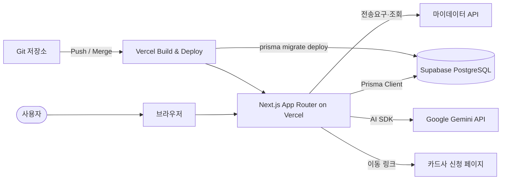
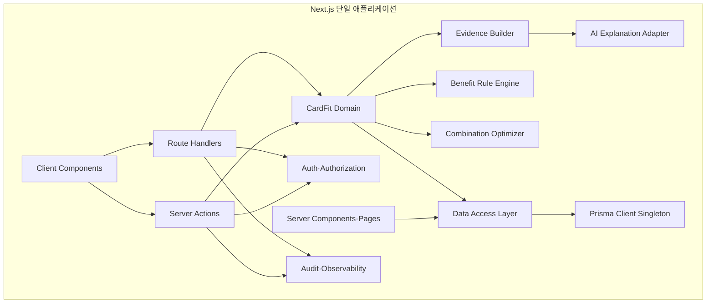
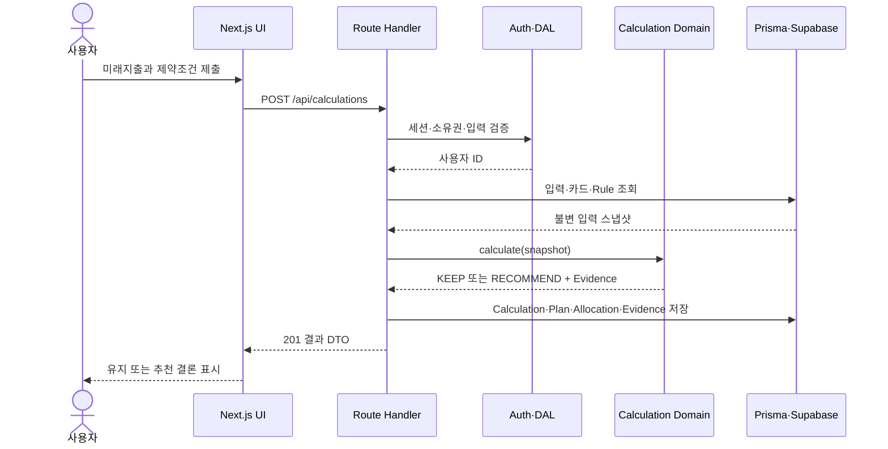
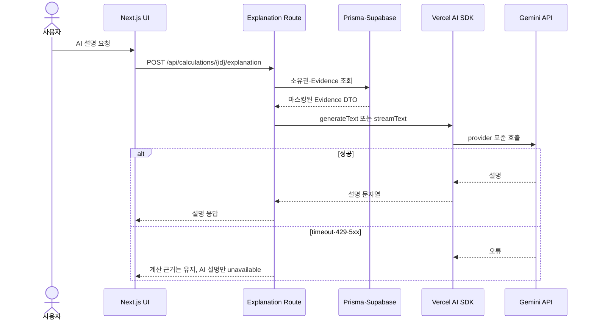
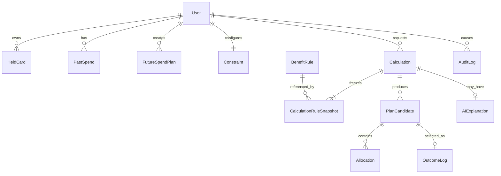
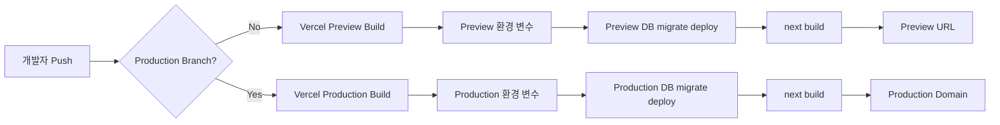

# CardFit 구현 기술 요구사항 명세서 (Technical SRS)

| 항목 | 내용 |
| --- | --- |
| 문서 ID | SRS-CARDFIT-TECH-001 |
| 버전 | 0.3-technical |
| 날짜 | 2026-08-24 |
| 문서 성격 | 제품 SRS와 독립된 구현 기준선 |
| 제품 요구사항 기준선 | `SRS_CardFit_v0.2.md` |
| 적용 범위 | CardFit MVP 웹 애플리케이션의 구조·데이터·AI·배포·검증 |
| 상태 | Proposed — 기술 책임자 승인 후 구현 기준선으로 사용 |

## 개요

이 문서는 기존 CardFit 제품 SRS를 변경하지 않고, C-TEC-001~007의 기술 제약을 정확히 적용했을 때 실제로 구현할 수 있는 소프트웨어 구조를 정의한다. 시스템은 Next.js App Router 하나로 UI와 서버 기능을 통합하고, Prisma를 통해 로컬 Supabase와 배포용 Supabase PostgreSQL에 접근한다. AI는 계산 결과를 생성하지 않고 결정론적 계산 근거를 설명하는 보조 기능으로 한정한다. Git 저장소와 Vercel을 연결하여 별도의 사용자 정의 CI/CD 파이프라인 없이 Push와 Merge만으로 Preview·Production 배포를 수행한다.

핵심 설계 결론은 다음과 같다.

- 브라우저가 Supabase DB에 직접 접근하지 않는다. 모든 업무 데이터 접근은 Next.js 서버 경계를 거친다.
- Server Actions는 화면 내부 명령과 폼 변경에 사용하고, 외부 호출·웹훅·명시적 HTTP 계약은 Route Handlers에 둔다.
- Prisma Client와 Gemini API 키는 서버 전용 모듈에서만 사용한다.
- 카드 혜택과 Net Benefit은 결정론적 TypeScript 도메인 로직으로 계산한다. Gemini는 저장된 계산 근거를 자연어로 설명할 뿐이다.
- Local·Preview·Production 데이터베이스와 비밀정보를 분리한다.
- Prisma migration을 Vercel 빌드에 포함하되, 환경별 DB에만 적용하며 모든 migration은 하위 호환 방식으로 작성한다.

### 목차

1. [서론](#1-서론)
2. [기술 제약과 해석](#2-기술-제약과-해석)
3. [구현 아키텍처](#3-구현-아키텍처)
4. [구현 요구사항](#4-구현-요구사항)
5. [인터페이스 명세](#5-인터페이스-명세)
6. [데이터 설계](#6-데이터-설계)
7. [AI 통합 설계](#7-ai-통합-설계)
8. [보안·운영·배포](#8-보안운영배포)
9. [검증 및 추적성](#9-검증-및-추적성)
10. [구현 순서](#10-구현-순서)
11. [결론과 인사이트](#11-결론과-인사이트)
12. [출처](#12-출처)

---

## 1. 서론

### 1.1 목적

이 문서의 목적은 CardFit 제품 요구사항을 지정된 기술 스택 안에서 구현할 수 있도록 시스템 경계, 모듈 책임, 데이터 계약, 외부 연동, 배포 방식과 검증 가능한 인수 기준을 정의하는 것이다.

### 1.2 범위

포함 범위는 다음과 같다.

- 미래지출·제약조건 입력, 마이데이터 연결 상태 관리
- 카드 혜택 규칙과 시나리오 계산
- 카드 조합 최적화와 Net Benefit 게이팅
- 결제수단 배분, 계산 근거 조회, 실행 범위 고지
- 조합 선택과 30일 후 완주·미완주·미응답 계측
- 선택적 Gemini 기반 근거 설명
- 로컬 Supabase 개발, Prisma migration, Vercel 배포

제외 범위는 다음과 같다.

- 별도 Express, NestJS, Spring 등의 백엔드 서버
- 별도 마이크로서비스와 메시지 브로커
- Supabase Edge Functions를 이용한 업무 로직
- 브라우저의 Prisma 사용 또는 서비스 역할 키 노출
- AI를 통한 혜택 금액·추천 조합·Net Benefit 산출
- 카드 해지·발급·전환 신청 대행
- Kubernetes, 자체 VM, 별도 배포 파이프라인

### 1.3 요구사항 용어

| 접두어 | 의미 |
| --- | --- |
| C-TEC | 사용자가 지정한 기술 제약 |
| REQ-ARCH | 시스템 구조 요구사항 |
| REQ-DATA | 데이터베이스·ORM 요구사항 |
| REQ-UI | UI·스타일 요구사항 |
| REQ-AI | AI 통합 요구사항 |
| REQ-DEPLOY | 배포·환경 요구사항 |
| REQ-SEC | 보안 요구사항 |
| ADR | 구현 방식에 관한 아키텍처 결정 |

### 1.4 우선순위와 상태

| 상태 | 의미 |
| --- | --- |
| Confirmed | C-TEC 또는 제품 SRS에서 직접 확정됨 |
| Derived | 확정 제약을 안전하고 일관되게 구현하기 위해 도출됨 |
| Proposed | 구현 가능하지만 책임자 승인이 필요한 선택 |
| TBD | 구현 전 값 또는 정책 확정이 필요함 |

### 1.5 Assumptions & Constraints

| ID | 제약조건 | 본 문서의 구현 해석 |
| --- | --- | --- |
| C-TEC-001 | 모든 서비스는 Next.js App Router 기반 단일 풀스택 프레임워크로 구현한다 | UI, 서버 렌더링, 서버 명령, HTTP API를 단일 Next.js 프로젝트에 배치한다 |
| C-TEC-002 | 서버 로직은 Server Actions 또는 Route Handlers를 사용한다 | 화면 내부 변경은 Server Actions, 외부 계약과 명시적 API는 Route Handlers로 구현한다 |
| C-TEC-003 | Prisma + 로컬 Supabase, 배포 시 Supabase PostgreSQL을 사용한다 | 동일한 Prisma schema와 migration을 Local·Preview·Production에 적용한다 |
| C-TEC-004 | Tailwind CSS와 shadcn/ui를 사용한다 | 디자인 토큰과 공용 UI 컴포넌트를 강제하고 임의 CSS를 제한한다 |
| C-TEC-005 | AI는 Vercel AI SDK로 외부 API를 호출한다 | AI 호출 어댑터를 Next.js 서버 전용 모듈에 둔다 |
| C-TEC-006 | Gemini API가 기본이며 환경 변수로 모델을 교체한다 | `AI_PROVIDER`, `AI_MODEL`, `GOOGLE_GENERATIVE_AI_API_KEY`로 런타임 설정을 분리한다 |
| C-TEC-007 | Vercel로 배포하고 Git Push만으로 자동화한다 | Git 연동 배포와 Vercel Build Command에 Prisma 생성·migration·Next.js build를 포함한다 |

전제 조건은 다음과 같다.

- 로컬 Supabase 실행을 위해 Docker 호환 런타임을 사용할 수 있다.
- 배포 전 Supabase의 Preview용 DB와 Production용 DB를 각각 준비할 수 있다.
- Vercel 프로젝트에 환경별 비밀정보를 한 번 설정할 수 있다. 이후 일상 배포는 Git Push와 Merge만으로 수행한다.
- 마이데이터 인가·제휴와 실제 API 명세가 확정되기 전에는 `MyDataProvider`의 Mock Adapter를 사용한다.
- Net Benefit의 D2 임계값과 계산 규칙이 확정되기 전에는 기능 플래그 뒤에서만 계산 기능을 노출한다.

---

## 2. 기술 제약과 해석

### 2.1 제약 적합성 판단

| 항목 | 판단 | 보완 조건 |
| --- | :---: | --- |
| Next.js 단일 풀스택 | 적합 | App Router와 Node.js runtime을 사용한다 |
| Server Actions·Route Handlers | 적합 | 인증·인가·입력검증을 양쪽에 동일하게 적용한다 |
| Prisma + Local Supabase | 적합 | Supabase CLI와 Docker가 필요하며 schema 변경의 단일 원천은 Prisma migration으로 고정한다 |
| Tailwind + shadcn/ui | 적합 | 디자인 토큰과 컴포넌트 허용 목록을 둔다 |
| Vercel AI SDK + Gemini | 적합 | AI를 비결정론적 설명 계층으로 격리한다 |
| Vercel Git 배포 | 조건부 적합 | DB migration과 환경 분리가 추가로 필요하다 |

### 2.2 기술적 충돌 해소 원칙

1. Supabase가 제공하는 기능이라도 업무 로직은 Next.js 서버 모듈에 둔다.
2. Prisma schema와 Supabase SQL migration을 동시에 수동 편집하지 않는다. Prisma migration을 스키마 변경의 기준선으로 사용한다.
3. Supabase Auth를 사용하더라도 업무 데이터 조회는 Prisma를 사용한다. 인증 세션 확인에만 Supabase SDK를 사용할 수 있다.
4. Preview 배포가 Production DB를 변경하지 않도록 환경별 `DATABASE_URL`과 `DIRECT_URL`을 분리한다.
5. AI 응답 실패가 카드 계산 결과의 성공 여부를 바꾸지 않도록 계산 트랜잭션과 AI 설명 요청을 분리한다.

---

## 3. 구현 아키텍처

### 3.1 시스템 컨텍스트



### 3.2 Next.js 내부 컴포넌트



### 3.3 실행 경계

| 기능 | 구현 수단 | 이유 |
| --- | --- | --- |
| 초기 화면·결과 화면 데이터 조회 | Server Component + DAL | 서버에서 직접 읽고 브라우저 번들을 줄인다 |
| 미래지출·제약조건 저장 | Server Action | 화면의 폼 변경과 결과 UI 갱신을 한 흐름에서 처리한다 |
| 계산 실행 | Route Handler `POST /api/calculations` | 시간 제한·오류 코드·재시도·성능 측정이 필요한 명시적 계약이다 |
| 근거 조회 | Route Handler `GET /api/calculations/{id}/evidence` | 공유 가능한 조회 계약과 소유권 검사가 필요하다 |
| 완주 응답 | Route Handler `POST /api/outcomes/{id}/completion` | 멱등성 키와 외부 링크 진입을 지원한다 |
| 관리자 Rule 관리 | Server Actions | 관리자 UI 내부에서만 사용하는 변경 명령이다 |
| AI 근거 설명 | Route Handler `POST /api/calculations/{id}/explanation` | 스트리밍·타임아웃·별도 실패 처리가 필요하다 |

### 3.4 권장 프로젝트 구조

```text
src/
  app/
    (product)/
      onboarding/page.tsx
      calculations/[id]/page.tsx
    admin/rules/page.tsx
    api/
      calculations/route.ts
      calculations/[id]/evidence/route.ts
      calculations/[id]/explanation/route.ts
      outcomes/[id]/completion/route.ts
      health/route.ts
    actions/
      future-spend.ts
      constraints.ts
      rules.ts
  components/
    ui/                 # shadcn/ui 생성 코드
    cardfit/            # 제품 조합 컴포넌트
  lib/
    auth/
    db/prisma.ts
    env.ts
    validation/
    observability/
  server/
    dal/
    domain/
      calculation/
      optimization/
      evidence/
    integrations/
      mydata/
      ai/
prisma/
  schema.prisma
  migrations/
supabase/
  config.toml
  seed.sql
```

---

## 4. 구현 요구사항

### 4.1 아키텍처 요구사항

| ID | 요구사항 | 인수 기준 | 상태 |
| --- | --- | --- | --- |
| REQ-ARCH-001 | 저장소에는 실행 가능한 Next.js App Router 애플리케이션이 하나만 존재해야 한다 | 별도 백엔드 프로세스·별도 API 저장소가 0개이며 `next build`가 성공한다 | Confirmed |
| REQ-ARCH-002 | 서버 업무 로직은 `src/server`와 `src/lib`의 server-only 모듈에 둬야 한다 | Prisma·비밀키 모듈을 Client Component에서 import하면 lint/build가 실패한다 | Derived |
| REQ-ARCH-003 | Server Actions는 UI 변경 명령에만 사용해야 한다 | Actions에 GET 성격의 대량 조회·외부 공개 API가 0개다 | Derived |
| REQ-ARCH-004 | 외부 계약과 장시간·스트리밍 처리는 Route Handlers로 구현해야 한다 | 5장의 모든 HTTP 인터페이스가 `app/api/**/route.ts`에 매핑된다 | Confirmed |
| REQ-ARCH-005 | 카드 혜택 계산은 순수 TypeScript 도메인 함수로 구현해야 한다 | 같은 입력 스냅샷과 `rule_version`에 대한 결과 해시가 100% 동일하다 | Derived |
| REQ-ARCH-006 | Prisma를 사용하는 Route Handler는 Node.js runtime을 사용해야 한다 | 대상 route에 `runtime = 'nodejs'`가 적용되고 Edge 번들에 Prisma가 포함되지 않는다 | Derived |

### 4.2 데이터 요구사항

| ID | 요구사항 | 인수 기준 | 상태 |
| --- | --- | --- | --- |
| REQ-DATA-001 | Prisma schema를 관계형 데이터 모델의 기준선으로 사용해야 한다 | 모든 업무 테이블과 관계가 `schema.prisma`에 존재한다 | Confirmed |
| REQ-DATA-002 | 로컬 개발은 Supabase CLI로 실행한 로컬 PostgreSQL을 사용해야 한다 | `supabase start` 후 `prisma migrate dev`와 seed가 성공한다 | Confirmed |
| REQ-DATA-003 | 배포 환경은 Supabase의 pooled runtime URL과 direct migration URL을 분리해야 한다 | 애플리케이션의 `DATABASE_URL`은 pooler, Prisma CLI의 `DIRECT_URL`은 direct 연결이며 환경별 값이 다르다 | Derived |
| REQ-DATA-004 | Prisma Client는 서버 프로세스당 재사용 가능한 singleton이어야 한다 | 개발 Hot Reload와 Vercel 함수에서 요청마다 무제한 인스턴스를 생성하지 않는다 | Derived |
| REQ-DATA-005 | schema 변경은 migration 파일로 버전 관리해야 한다 | `prisma/migrations`가 Git에 포함되고 Production에서 `db push`를 사용하지 않는다 | Confirmed |
| REQ-DATA-006 | 계산 입력·적용 Rule·결과를 불변 스냅샷으로 보존해야 한다 | 계산 재현 테스트에서 원본 입력과 `rule_version`을 조회할 수 있다 | Derived |
| REQ-DATA-007 | Local·Preview·Production DB를 물리적으로 분리해야 한다 | 각 Vercel 환경의 DB project ref가 서로 다르며 Preview가 Production 데이터를 변경할 수 없다 | Derived |

### 4.3 UI 요구사항

| ID | 요구사항 | 인수 기준 | 상태 |
| --- | --- | --- | --- |
| REQ-UI-001 | 모든 화면은 Tailwind CSS utility와 design token을 사용해야 한다 | 제품 코드의 인라인 style과 독립 CSS Module이 0개다. 단, 외부 라이브러리 필수 CSS는 예외다 | Confirmed |
| REQ-UI-002 | 기본 상호작용 요소는 shadcn/ui 컴포넌트를 사용해야 한다 | Button, Input, Select, Dialog, Form, Table, Alert가 `components/ui`를 통해 제공된다 | Confirmed |
| REQ-UI-003 | 제품 색상·간격·radius는 CSS 변수와 Tailwind theme token으로 관리해야 한다 | 임의 hex 색상과 arbitrary value 사용이 코드 리뷰 허용 목록 밖에서 0건이다 | Derived |
| REQ-UI-004 | 입력 폼은 서버와 클라이언트에서 같은 스키마로 검증해야 한다 | 유효하지 않은 금액·날짜·범위가 UI와 서버에서 모두 거부된다 | Derived |
| REQ-UI-005 | 핵심 흐름은 키보드와 스크린리더로 이용할 수 있어야 한다 | WCAG 2.2 AA 자동 점검의 critical 오류가 0건이다 | Derived |

### 4.4 AI 요구사항

| ID | 요구사항 | 인수 기준 | 상태 |
| --- | --- | --- | --- |
| REQ-AI-001 | AI 호출은 Vercel AI SDK의 공통 인터페이스로 구현해야 한다 | 도메인 코드가 Gemini 전용 REST 형식에 직접 의존하지 않는다 | Confirmed |
| REQ-AI-002 | 기본 provider는 `@ai-sdk/google`이어야 한다 | `AI_PROVIDER` 미설정 시 Google provider가 선택된다 | Confirmed |
| REQ-AI-003 | provider와 model은 환경 변수로 교체할 수 있어야 한다 | 코드 변경 없이 `AI_PROVIDER`, `AI_MODEL` 변경 후 Smoke Test가 통과한다 | Confirmed |
| REQ-AI-004 | AI는 계산 결과를 생성하거나 수정할 수 없다 | AI 입력은 확정된 Evidence DTO이고 AI 출력은 설명 문자열에만 저장된다 | Derived |
| REQ-AI-005 | AI 실패 시 결정론적 근거 화면을 계속 제공해야 한다 | timeout·429·5xx에서 계산 결과는 200으로 유지되고 설명만 unavailable 상태가 된다 | Derived |
| REQ-AI-006 | 사용자 원문과 개인신용정보를 최소화·마스킹해야 한다 | prompt에 이름·카드번호·가맹점 원문·식별자가 포함되지 않는다 | Derived |

### 4.5 배포 요구사항

| ID | 요구사항 | 인수 기준 | 상태 |
| --- | --- | --- | --- |
| REQ-DEPLOY-001 | Git 저장소를 Vercel 프로젝트에 연결해야 한다 | 브랜치 Push는 Preview, Production Branch Merge는 Production 배포를 생성한다 | Confirmed |
| REQ-DEPLOY-002 | 별도 GitHub Actions·Jenkins 등 배포 파이프라인을 두지 않아야 한다 | 배포 목적의 workflow 파일과 외부 CI 서비스가 0개다 | Confirmed |
| REQ-DEPLOY-003 | Vercel Build Command가 Prisma 생성·migration·Next.js build를 수행해야 한다 | `prisma generate`, `prisma migrate deploy`, `next build` 중 하나라도 실패하면 배포가 중단된다 | Derived |
| REQ-DEPLOY-004 | Preview와 Production 환경 변수를 분리해야 한다 | DB URL, Gemini 키, MyData 설정이 Vercel Environment별로 존재한다 | Derived |
| REQ-DEPLOY-005 | migration은 하위 호환 방식으로 작성해야 한다 | 컬럼 삭제·rename·NOT NULL 즉시 적용이 한 배포에서 수행되지 않는다 | Derived |
| REQ-DEPLOY-006 | 배포 후 health endpoint를 제공해야 한다 | `/api/health`가 앱 버전과 DB 연결 상태를 반환하되 비밀정보를 노출하지 않는다 | Derived |

### 4.6 보안 요구사항

| ID | 요구사항 | 인수 기준 | 상태 |
| --- | --- | --- | --- |
| REQ-SEC-001 | 모든 Server Action과 Route Handler는 세션과 리소스 소유권을 검사해야 한다 | 타 사용자 calculation ID 접근이 404 또는 403으로 거부된다 | Derived |
| REQ-SEC-002 | 모든 입력은 서버 경계에서 schema validation을 수행해야 한다 | 조작된 클라이언트 요청이 DB·AI·외부 API에 전달되지 않는다 | Derived |
| REQ-SEC-003 | 비밀정보는 Vercel 환경 변수와 로컬 `.env.local`에만 저장해야 한다 | Git secret scan 결과가 0건이고 `NEXT_PUBLIC_` 비밀키가 0개다 | Confirmed |
| REQ-SEC-004 | Prisma 연결 계정은 최소 권한을 사용해야 한다 | runtime 계정은 schema 변경 권한이 없고 migration 계정만 DDL을 수행한다 | Derived |
| REQ-SEC-005 | 계산·Rule 변경·외부 호출을 감사 로그에 남겨야 한다 | actor, action, target, result, correlation_id, timestamp가 기록된다 | Derived |

---

## 5. 인터페이스 명세

### 5.1 Route Handlers

| 메서드 | 경로 | 책임 | 인증 | 성공 | 주요 오류 |
| --- | --- | --- | --- | --- | --- |
| POST | `/api/calculations` | 입력 검증, 스냅샷 생성, 계산·게이팅 | 사용자 | 201 | 400 입력 없음, 401 미인증, 409 Rule 불일치, 422 계산 불가, 503 외부 데이터 불가 |
| GET | `/api/calculations/{id}/evidence` | 소유권 확인 후 근거 6항목 이상 반환 | 사용자 | 200 | 401, 404, 409 근거 미완성 |
| POST | `/api/calculations/{id}/explanation` | Evidence DTO를 Gemini로 설명 | 사용자 | 200 또는 stream | 404, 409 계산 미완료, 429 호출 제한, 503 AI unavailable |
| POST | `/api/outcomes/{id}/completion` | 완주·미완주 자기신고 멱등 저장 | 사용자 또는 서명 토큰 | 200 | 400, 404, 409 만료 |
| GET | `/api/health` | 앱·DB 상태 확인 | 없음 | 200 | 503 DB 연결 실패 |

### 5.2 Server Actions

| Action | 입력 | 출력 | transaction |
| --- | --- | --- | --- |
| `saveFutureSpend` | 카테고리, 금액 또는 범위, 시점, 확실도 | FutureSpendPlan ID | 단건 upsert |
| `saveConstraints` | 최대 카드 수, 연회비 상한, 신규 발급 허용 | Constraint ID | 사용자별 upsert |
| `selectPlan` | calculation ID, plan ID | selection ID | Plan 선택과 OutcomeLog 예약을 원자 처리 |
| `upsertBenefitRule` | 관리자 Rule DTO | rule version | Rule·version·audit log를 원자 처리 |

### 5.3 계산 요청 계약

```json
{
  "futureSpendPlanIds": ["uuid"],
  "constraintId": "uuid",
  "idempotencyKey": "uuid"
}
```

```json
{
  "calculationId": "uuid",
  "status": "SUCCEEDED",
  "decision": "KEEP_CURRENT | RECOMMEND_CHANGE",
  "asOfDate": "2026-08-24",
  "ruleVersions": ["card-rule:17"],
  "currentBenefit": 120000,
  "recommendedBenefit": 186000,
  "netBenefit": 66000,
  "evidenceAvailable": true
}
```

### 5.4 정상 계산 시퀀스



### 5.5 AI 설명 시퀀스



---

## 6. 데이터 설계

### 6.1 논리 ERD



### 6.2 핵심 모델과 제약

| 모델 | 주요 필드 | 필수 제약 |
| --- | --- | --- |
| User | id, auth_subject, consent_status, consent_scope | `auth_subject` unique |
| HeldCard | id, user_id, issuer, product_code, annual_fee | user FK, product 복합 index |
| PastSpend | id, user_id, category_code, amount, paid_at | amount ≥ 0, 날짜 index |
| FutureSpendPlan | id, user_id, category, amount_min/max, expected_at | min ≤ max, 사용자 소유권 |
| Constraint | id, user_id, max_cards, annual_fee_cap, allow_new_card | user_id unique |
| BenefitRule | id, product_code, version, valid_from/to, rule_json | product+version unique, 기간 겹침 검증 |
| Calculation | id, user_id, input_snapshot_json, as_of_date, status, result_hash | 성공 결과 불변, user+date index |
| CalculationRuleSnapshot | calculation_id, benefit_rule_id, version, rule_snapshot_json | 계산 당시 Rule 불변 복사 |
| PlanCandidate | id, calculation_id, gross_benefit, transition_cost, net_benefit, decision | decimal 원 단위, calculation FK |
| Allocation | id, plan_id, category, amount, card_id | plan 합계 정합성 |
| OutcomeLog | id, selection_id, plan_id, status, responded_at | selection_id unique, 상태 3분리 |
| AIExplanation | calculation_id, provider, model, prompt_version, text, status | calculation_id unique, 계산 값 저장 금지 |
| AuditLog | id, actor_id, action, target_type/id, result, correlation_id, created_at | append-only |

### 6.3 Prisma·Supabase 연결

본 기준선은 Prisma ORM 7.x의 설정 방식을 사용한다. Prisma 7에서는 `datasource.directUrl`이 제거됐으므로, runtime 연결은 Prisma Client adapter의 `DATABASE_URL`을 사용하고 migration 연결은 `prisma.config.ts`의 `DIRECT_URL`을 사용한다. 패키지의 major/minor 버전은 lockfile로 고정한다.

```prisma
datasource db {
  provider = "postgresql"
}
```

```ts
// prisma.config.ts: Prisma CLI와 migration 전용 direct 연결
import "dotenv/config";
import { defineConfig, env } from "prisma/config";

export default defineConfig({
  schema: "prisma/schema.prisma",
  migrations: { path: "prisma/migrations" },
  datasource: { url: env("DIRECT_URL") },
});
```

```ts
// src/lib/db/prisma.ts: 애플리케이션 runtime의 pooled 연결
const adapter = new PrismaPg({
  connectionString: process.env.DATABASE_URL!,
});
export const prisma = new PrismaClient({ adapter });
```

환경별 연결 규칙은 다음과 같다.

| 환경 | DATABASE_URL | DIRECT_URL | 목적 |
| --- | --- | --- | --- |
| Local | 로컬 Supabase PostgreSQL | 같은 로컬 direct URL | 개발·테스트 |
| Preview | Preview Supabase pooler | Preview Supabase direct | Preview 함수·migration |
| Production | Production Supabase pooler | Production Supabase direct | 운영 함수·migration |

### 6.4 migration 정책

1. 개발자는 Local Supabase에서 `prisma migrate dev --name <name>`을 실행한다.
2. 생성된 `schema.prisma`와 `prisma/migrations/**`를 함께 커밋한다.
3. Vercel Build Command는 환경별 `DIRECT_URL`을 사용해 `prisma migrate deploy`를 실행한다.
4. migration 실패 시 Next.js build와 배포를 중단한다.
5. 파괴적 변경은 Expand → Migrate Data → Contract의 최소 2개 배포로 나눈다.
6. Preview migration은 Preview DB에만 적용한다.

권장 build script는 다음과 같다.

```json
{
  "scripts": {
    "vercel-build": "prisma generate && prisma migrate deploy && next build"
  }
}
```

---

## 7. AI 통합 설계

### 7.1 Provider 추상화

```ts
type SupportedProvider = "google";

export function getLanguageModel() {
  const provider = process.env.AI_PROVIDER ?? "google";
  const model = process.env.AI_MODEL;

  if (provider === "google" && model) {
    return google(model);
  }
  throw new Error("Unsupported or incomplete AI provider configuration");
}
```

초기 버전은 Gemini만 지원하지만 도메인 계층은 AI SDK의 `LanguageModel` 계약에만 의존한다. 다른 provider를 추가할 때에는 provider factory와 환경 변수 검증만 확장한다.

### 7.2 환경 변수

| 변수 | 필수 | 공개 여부 | 설명 |
| --- | :---: | :---: | --- |
| AI_PROVIDER | 선택 | 서버 전용 | 기본값 `google` |
| AI_MODEL | AI 사용 시 필수 | 서버 전용 | 승인된 Gemini model ID |
| GOOGLE_GENERATIVE_AI_API_KEY | AI 사용 시 필수 | 서버 전용 | Gemini API 인증 키 |
| AI_EXPLANATION_ENABLED | 선택 | 서버 전용 | 기능 플래그 |
| AI_TIMEOUT_MS | 선택 | 서버 전용 | 기본 8,000ms 제안 |

### 7.3 Prompt 계약

AI 입력에는 다음 데이터만 허용한다.

- 유지 또는 변경 결론
- 혜택 차액, Net Benefit과 비용 구성
- 적용 Rule의 사람이 읽을 수 있는 요약
- 제외 조건과 기준일
- 마스킹된 카드 별칭

다음 데이터는 금지한다.

- 이름, 이메일, 전화번호, auth subject
- 전체 카드번호와 계좌 식별자
- 가맹점 원문과 자유입력 원문
- AI가 새 계산 값이나 추천 조합을 만들도록 하는 지시

### 7.4 AI 장애 처리

AI 호출은 계산 저장 트랜잭션 밖에서 수행한다. timeout, 429, provider 5xx가 발생하면 `AIExplanation.status = FAILED`로 기록하고 결정론적 Evidence UI를 그대로 노출한다. 자동 재시도는 지수 백오프로 최대 1회만 허용하며, 사용자 요청 한 건이 중복 과금을 일으키지 않도록 calculation ID 기준으로 잠금을 적용한다.

---

## 8. 보안·운영·배포

### 8.1 인증과 데이터 접근

Supabase Auth 사용은 `[Proposed]`로 채택한다. Next.js 서버에서 세션을 검증하고, 모든 DAL 메서드는 `userId`를 명시적으로 받아 소유권 조건을 쿼리에 포함한다. Prisma runtime DB 계정은 필요한 schema의 DML 권한만 가지며, migration 계정은 `DIRECT_URL`을 통해서만 DDL을 수행한다.

브라우저에는 다음 값만 공개할 수 있다.

- Supabase 공개 URL
- Supabase anon/publishable key
- 비민감 기능 플래그

DB 비밀번호, service role key, Gemini key, MyData client secret은 `NEXT_PUBLIC_` 접두어를 사용할 수 없다.

### 8.2 관찰 가능성

| 이벤트 | 필수 필드 | 민감정보 처리 |
| --- | --- | --- |
| calculation.requested/completed/failed | correlation_id, user_hash, duration, rule_versions, status | 입력 원문 제외 |
| evidence.viewed | calculation_id, item_count | 근거 본문 제외 |
| ai.requested/completed/failed | provider, model, prompt_version, duration, token usage | prompt·response 원문 기본 제외 |
| rule.changed | actor, product_code, from/to version | 변경 diff는 제한 접근 로그에 저장 |
| auth.denied | route/action, reason, correlation_id | 토큰 원문 제외 |

### 8.3 Vercel 배포 흐름



### 8.4 배포 전제와 제한

- Vercel 프로젝트와 Git 저장소 연결은 최초 1회 수동 설정한다.
- Vercel Environment Variables도 최초 및 변경 시 수동 설정한다.
- 이후 애플리케이션 배포는 Push와 Merge로 자동 수행한다.
- Git Push만으로 Supabase project 자체를 생성할 수는 없다. Preview·Production project 준비는 인프라 초기화 작업이다.
- Vercel 함수는 요청 간 메모리를 공유한다고 가정하지 않는다. 상태는 PostgreSQL 또는 외부 서비스에 저장한다.
- 파일시스템 쓰기를 영속 저장 방식으로 사용하지 않는다.
- 장시간 배치와 스케줄 작업이 필요해지면 Vercel Cron 또는 별도 승인된 외부 서비스가 필요하며 현재 범위에서는 제외한다.

### 8.5 환경 변수 검증

애플리케이션 시작과 build 시 schema validator로 다음을 검사한다.

```text
DATABASE_URL
DIRECT_URL
NEXT_PUBLIC_SUPABASE_URL
NEXT_PUBLIC_SUPABASE_ANON_KEY
SUPABASE_SERVICE_ROLE_KEY       # 필요한 서버 작업에만, 기본 미사용
MYDATA_BASE_URL
MYDATA_CLIENT_ID
MYDATA_CLIENT_SECRET
AI_PROVIDER
AI_MODEL
GOOGLE_GENERATIVE_AI_API_KEY
```

AI 기능이 꺼져 있으면 AI 관련 변수를 선택값으로 처리한다. Production에서 Mock MyData Adapter가 선택되면 build를 실패시킨다.

---

## 9. 검증 및 추적성

### 9.1 테스트 전략

| 계층 | 도구 범주 | 검증 대상 |
| --- | --- | --- |
| 정적 검사 | TypeScript, ESLint, dependency boundary rule | client/server 경계, 타입, 금지 import |
| 단위 테스트 | JavaScript test runner | Rule Engine, Optimizer, 게이팅, validation |
| DB 통합 테스트 | Local Supabase + Prisma | migration, PK/FK, transaction, idempotency |
| Route 통합 테스트 | Next.js test server | 인증, 상태 코드, timeout, DTO |
| UI 컴포넌트 테스트 | DOM test runner | shadcn 조합, 폼 오류, 접근성 |
| E2E | 브라우저 자동화 | 온보딩 → 계산 → 근거 → 선택 → 완주 |
| 배포 Smoke Test | Vercel Preview | health, DB, Gemini 실패 fallback |

### 9.2 기술 제약 추적성

| 제약 | 설계 반영 | 요구사항 | 검증 |
| --- | --- | --- | --- |
| C-TEC-001 | 단일 Next.js App Router 프로젝트 | REQ-ARCH-001/002 | `next build`, 저장소 구조 검사 |
| C-TEC-002 | Actions·Route Handlers 역할 분리 | REQ-ARCH-003/004 | 경로·import 검사, API 통합 테스트 |
| C-TEC-003 | Prisma + 환경별 Supabase | REQ-DATA-001~007 | local reset, migrate deploy, DB 격리 테스트 |
| C-TEC-004 | Tailwind + shadcn/ui | REQ-UI-001~005 | lint, Story/UI 테스트, 접근성 검사 |
| C-TEC-005 | Vercel AI SDK Adapter | REQ-AI-001/004/005 | provider mock, 장애 fallback 테스트 |
| C-TEC-006 | Gemini 기본·환경 변수 교체 | REQ-AI-002/003/006 | env 변경 Smoke Test, prompt 검사 |
| C-TEC-007 | Vercel Git 배포 | REQ-DEPLOY-001~006 | Preview/Production 배포와 migration 로그 |

### 9.3 제품 요구사항 연결

| 제품 요구사항 | 구현 모듈 | 기술 요구사항 |
| --- | --- | --- |
| REQ-FUNC-001A/B, 003A/B | Server Action, validation, FutureSpendPlan·Constraint | REQ-ARCH-003, REQ-UI-004, REQ-DATA-001 |
| REQ-FUNC-002 | MyData Adapter, Auth, DAL | REQ-ARCH-004, REQ-SEC-001~003 |
| REQ-FUNC-004/005 | Calculation Domain, Rule Engine, Optimizer | REQ-ARCH-005/006, REQ-DATA-006 |
| REQ-FUNC-006/007 | Allocation, Evidence Route | REQ-ARCH-004/005, REQ-SEC-001 |
| REQ-FUNC-008 | DefaultSuggestion Domain | REQ-ARCH-005, REQ-DATA-006 |
| REQ-FUNC-009 | ScopeNotice UI·scanner | REQ-UI-001~005 |
| REQ-FUNC-010 | Outcome Route·OutcomeLog | REQ-ARCH-004, REQ-DATA-006 |
| 선택적 근거 설명 | AI Explanation Adapter | REQ-AI-001~006 |

### 9.4 완료 기준

Technical SRS의 구현 완료는 다음 조건을 모두 충족해야 한다.

- `next build`와 정적 검사가 성공한다.
- Local Supabase를 초기화한 뒤 모든 Prisma migration과 seed가 성공한다.
- Preview Push가 Preview DB에만 migration과 배포를 수행한다.
- Production Merge가 Production DB migration과 배포를 수행한다.
- Route Handler 인증·소유권·입력검증 테스트가 모두 통과한다.
- 동일한 계산 입력과 Rule snapshot의 결과 해시가 일치한다.
- Gemini 장애 시 계산·근거 화면이 정상 작동한다.
- 브라우저 번들에 Prisma, DB URL, service role key, Gemini key가 포함되지 않는다.
- 핵심 사용자 E2E와 접근성 critical 검사가 통과한다.

---

## 10. 구현 순서

1. Next.js App Router, TypeScript, Tailwind CSS, shadcn/ui를 초기화한다.
2. Supabase CLI와 Local Supabase를 설정하고 Prisma datasource를 연결한다.
3. User, FutureSpendPlan, Constraint, BenefitRule, Calculation 중심의 1차 schema와 migration을 작성한다.
4. 인증·환경 변수 검증·Prisma singleton·DAL 경계를 구현한다.
5. 미래지출·제약조건 Server Actions와 UI를 구현한다.
6. 결정론적 Rule Engine, Optimizer, Net Benefit 게이팅을 구현하고 회귀 테스트를 작성한다.
7. 계산·근거·완주 Route Handlers와 감사 로그를 구현한다.
8. Vercel AI SDK와 Gemini 설명 Adapter를 기능 플래그 뒤에 구현한다.
9. Vercel Preview·Production 환경 변수와 Supabase DB를 분리 연결한다.
10. Git Push 배포, migration, E2E, 장애 fallback을 검증한다.

---

## 11. 결론과 인사이트

C-TEC-001~007은 CardFit MVP에 적용할 수 있다. 가장 중요한 설계 원칙은 단일 프레임워크를 단일 책임 덩어리로 오해하지 않는 것이다. 배포 단위는 Next.js 하나지만 UI, 서버 경계, 도메인 계산, 데이터 접근, 외부 연동을 내부 모듈로 분리해야 테스트 가능성과 변경 안전성을 확보할 수 있다.

구현 가능성을 좌우하는 핵심 조건은 세 가지다. 첫째, Preview와 Production Supabase를 분리하지 않으면 Git Push 기반 자동 migration이 운영 데이터를 훼손할 수 있다. 둘째, Gemini를 계산 엔진에서 분리하지 않으면 결정론성, 감사 가능성, 장애 격리가 무너진다. 셋째, Server Actions와 Route Handlers를 인증된 서버 코드로 보지 않고 단순 내부 함수처럼 취급하면 직접 POST 요청을 통한 우회가 가능하다.

따라서 본 설계는 Next.js 단일 풀스택이라는 제작 효율을 유지하면서도 Prisma migration, 서버 전용 데이터 경계, AI 격리, 환경별 배포를 필수 안전장치로 둔다. 이 문서는 제품 SRS의 미확정 사업 규칙을 임의로 확정하지 않으며, D2와 마이데이터 계약이 확정되면 해당 값과 Adapter 계약만 갱신하도록 설계했다.

---

## 12. 출처

- 제품 요구사항 기준선: `SRS-Drafts/SRS_CardFit_v0.2.md`
- [Next.js Route Handlers](https://nextjs.org/docs/app/getting-started/route-handlers)
- [Next.js Backend for Frontend 및 Server Actions](https://nextjs.org/docs/app/guides/backend-for-frontend)
- [Next.js Authentication 가이드](https://nextjs.org/docs/app/guides/authentication)
- [Supabase CLI 로컬 개발](https://supabase.com/docs/guides/local-development/cli/getting-started)
- [Supabase 로컬 개발 워크플로](https://supabase.com/docs/guides/local-development/cli-workflows)
- [Prisma PostgreSQL·Supabase 연결](https://www.prisma.io/docs/orm/v6/overview/databases/supabase)
- [Prisma 7 설정 파일과 directUrl 변경](https://docs.prisma.io/docs/orm/reference/prisma-config-reference)
- [Prisma Migrate 명령](https://docs.prisma.io/docs/cli/migrate)
- [Tailwind CSS의 Next.js 설치](https://tailwindcss.com/docs/installation/framework-guides/nextjs)
- [shadcn/ui의 Next.js 설치](https://ui.shadcn.com/docs/installation/next)
- [Vercel AI SDK Google Generative AI Provider](https://ai-sdk.dev/providers/ai-sdk-providers/google-generative-ai)
- [Vercel Git 배포](https://vercel.com/docs/git)
- [Vercel 환경 변수](https://vercel.com/docs/environment-variables)
