# 소프트웨어 요구사항 명세서 (SRS)

| 항목 | 내용 |
| --- | --- |
| 문서 ID | SRS-CARDFIT-MVP-001 |
| 개정 버전 | 1.2 |
| 날짜 | 2026-08-24 |
| 기준 서식 | 예시 SRS 문서(AD-Core-Platform SRS)의 7섹션 포맷 |
| 참고 표준 | ISO/IEC/IEEE 29148:2018 (예시 포맷을 벗어나는 내용에 한해 8·9·11장에서 인용) |
| 원천 문서 | `SRS_CardFit_v1.1.md`(직전 기준선), `PRD/PRD_CardFit_v1.0.md`, `team-project_2nd/master-deck`, C-TEC-001~007 |

> 📘 **HTML 버전**: `SRS-Drafts/SRS_CardFit_v1.2.html`

---

## 개요 (Summary)

CardFit은 소비 구조가 곧 바뀔 사용자가 과거 소비가 아닌 **미래 지출 계획**을 기준으로 보유·신규 카드 조합을 다시 계산받고, 계산 근거를 스스로 검증해 결제 포트폴리오를 결정하게 하는 서비스다. 본 SRS는 `PRD/PRD_CardFit_v1.0.md`를 제품 요구사항 기준선으로 삼고 `team-project_2nd/master-deck`을 제품 의도와 결정 근거로 참고한다. SRS에서 더 안전하고 검증 가능하게 구체화한 내용은 출처·확정 상태를 표시해 반영한다. 문서 구조는 예시 SRS 문서(AD-Core-Platform)의 7섹션 포맷을 기본으로 하며, 가정·제약·의존성, 검증 계획, 참고자료를 ISO/IEC/IEEE 29148:2018에 근거해 확장했다.

- **기능 요구사항**: REQ-FUNC 13건(Must 8·Should 3·Could 2) — PRD 3장의 Given/When/Then 인수기준을 조건-결과 요약형으로 정리했으며, 문항별 출처는 [PRD]/[Derived]/[Design Decision]/[TBD]로 구분한다(4.1 서두 참조)
- **비기능 요구사항**: REQ-NF 9건 — 성능(p95 5초)·신뢰성(오류율 0.1%, 가용성 99.5%)·보안(오조회 0건)·비용(호출당 과금 관리)
- **제품 측정 요구사항**: REQ-METRIC 7건·REQ-GR 6건 — KPI를 시스템 품질 요구사항과 분리하고, 미측정 목표는 가정으로 유지한다
- **구현 기술 요구사항**: C-TEC 7건과 REQ-ARCH·DATA·UI·AI·DEPLOY·SEC 38건 — Next.js 단일 풀스택에서 제품 요구사항을 구현하는 의무 기준
- **미해결 선결 조건**: 마이데이터 인가·제휴 확정(A5), Net Benefit 임계값(D2) 확정 — 8장 참조
- **검증 경로**: E0~E7b 실험 로드맵과 중단 조건 — 9장 참조
- **설계 다이어그램**: Use Case(3.5) · Sequence 5개(3.6) · Component(3.7) · 전체 흐름 Flow Chart(3.8) · 핵심 의사결정 Flow Chart(4.3) · Class Diagram(5.1) · ERD·상태전이(6.2) — 배경지식이 없어도 각 다이어그램 앞의 "읽는 법" 설명만으로 이해할 수 있도록 배치했다

### 목차

1. [서론](#1-서론)
2. [이해관계자](#2-이해관계자)
3. [시스템 맥락 및 인터페이스](#3-시스템-맥락-및-인터페이스)
4. [구체적 요구사항](#4-구체적-요구사항)
5. [추적성 매트릭스](#5-추적성-매트릭스)
6. [부록](#6-부록)
7. [향후 개선 사항](#7-향후-개선-사항)
8. [가정·제약 및 의존성](#8-가정제약-및-의존성) *(확장 챕터 — ISO §9.6.7·9.6.8 근거)*
9. [검증 (Verification)](#9-검증-verification) *(확장 챕터 — ISO §9.6.19 근거)*
10. [결론](#10-결론)
11. [참고 자료 (References)](#11-참고-자료-references) *(확장 챕터 — ISO §9.2.4·9.6.20 근거)*

---

## 1. 서론

### 1.1 목적

본 문서는 CardFit(미래지출 카드설계 서비스)의 소프트웨어 요구사항을 정의한다. CardFit은 소비 구조가 곧 바뀔 사용자가 과거 소비가 아닌 **미래 지출 계획**을 기준으로 보유·신규 카드의 조합을 다시 계산받고, 그 계산 근거를 스스로 검증해 결제 포트폴리오를 결정할 수 있게 하는 서비스다.

### 1.2 범위

**포함 범위 (In-Scope)**

- F-01 미래지출 입력(카테고리·금액·시점, 이벤트 비종속)
- F-02 마이데이터 연동 + 제약조건 입력
- F-03 시나리오 계산(실적구간·한도·연회비 반영)
- F-04 조합 최적화 + Net Benefit 게이팅
- F-05 결제수단 배분
- F-06 근거 공개(적용 규칙 + 제외조건·기준일)
- F-07 단계적 전환 제안
- F-08 이벤트 비종속 입력(자유 카테고리·양방향)
- F-09 소득·지출 범위 입력
- F-11 과거 패턴 기반 초기값 자동 제안
- F-12 스코프 경계 고지 + 금지어 자동 검수
- F-13 실행 완주율 계측(측정 전용)

**제외 범위 (Out-of-Scope)**

- F-10 정기 재진단 알림, F-14 카드 20장+ 대량 처리 최적화 (v1 이후로 보류)
- 해지·전환 실행 대행·상담·만류 대응 안내(직권·대행 권한 없음)
- 신규카드 자동 발급, 자동결제, 대출·BNPL, 리텐션 전용 기능

### 1.3 정의, 약어, 축약어

| 용어 | 정의 |
| --- | --- |
| Net Benefit | 조합안의 총혜택(Gross Benefit)에서 전환비용 3항목(연회비·실적 재적립 손실·발급 대기)을 뺀 순혜택 |
| Net Benefit 게이팅 | Net Benefit이 임계값(D2) 미만이면 "현재 조합 유지"를 정상 결과로 반환하는 판정 로직 |
| rule_version | 카드사 약관(BenefitRule)의 버전 식별자. 변경 시 기존 조합안(PlanCandidate)을 만료시킨다 |
| 마이데이터 | 본인신용정보관리업 기반 데이터 전송요구 체계. 카드 보유내역·과거 소비 데이터의 유일한 수집 채널 |
| 오조회 | 사용자 동의 범위를 초과해 타인의 개인신용정보를 조회하는 사고 |
| Guardrail(GR) | 하나라도 초과 시 롤아웃을 즉시 중단시키는 운영 임계치(GR1~GR5, 오조회) |
| SOM Beachhead | 시장 진입 최우선 세그먼트. 본 서비스에서는 혼인(Q1) 세그먼트 |
| p95 | 95번째 백분위수. 응답시간 등 지연 지표의 상위 5% 이상치를 배제한 실질 성능 기준 |

---

## 2. 이해관계자

| 역할 | 이름/부서 | 책임 |
| --- | --- | --- |
| 제품(PM) | 진정가 팀 | 지표 집계·보고, GR1~GR4 중단 최종 결정, 금지어 스캐너 예외 승인 |
| 개발 엔지니어 | 백엔드 개발팀 | 계산 엔진·마이데이터 연동·조합 최적화·완주 계측 구현 |
| 계산 품질 담당 | 백엔드 개발팀 | 경계값 회귀 테스트, `rule_version` 변경 시 결정론성 검증, GR1 발의 |
| 데이터 운영 담당 | 데이터팀 | 카드사 8곳 약관 수집·`rule_version` 관리, GR5 최신성 경고 해제 |
| 컴플라이언스·보안 담당 | 법무/보안팀 | 마이데이터 동의 범위 점검, 오조회 감시(PM 우회 중단 권한), 문구 규제 검토 |
| End User — 핵심(Core) 세그먼트 | 이서연·김도윤·박서준·한지민·최유리 | 미래지출 입력, 계산 결과·근거 확인, 조합 선택 또는 유지 |
| End User — 확장(Adjacent) 세그먼트 | 정하늘·오세훈·강민재 | 이벤트명에 매이지 않는 소비 변화(증가·감소) 입력 |
| 마이데이터 사업자(외부) | 외부 기관 | 카드 보유내역·과거 소비 데이터 제공(단일 채널, 호출당 과금) |
| 카드사(외부, 8개사) | 외부 기관 | 카드 혜택 약관(BenefitRule) 제공, 신규카드 신청 페이지 운영 |

---

## 3. 시스템 맥락 및 인터페이스

### 3.1 클라이언트 인터페이스

사용자는 온보딩(마이데이터 연동·미래지출 입력·제약조건 설정), 결과·근거 확인, 완주 여부 응답의 3단계 상호작용을 수행하는 클라이언트 앱을 통해 서비스에 접근한다. 구체적 클라이언트 플랫폼(웹/모바일 등)은 PRD에 명시되지 않아 본 SRS의 범위 밖이며, 별도 UX 설계 문서에서 정의한다.

### 3.2 외부 시스템 연동

| 외부 시스템 | 연동 내용 | 제약 |
| --- | --- | --- |
| 마이데이터 카드 업권 API | 카드 보유내역(HeldCard)·과거 소비(PastSpend) 수집, 동의 상태 관리 | 단일 채널 — 대체 공급자 없음, 장애 시 우회 경로 없음, 호출당 과금 |
| 카드 혜택 Rule 데이터(카드사 8개사) | 전월실적 구간·통합할인한도·제외항목 등 BenefitRule 수집 | 공식 통합 API 없음 — 자체 수집·`rule_version` 관리 필수 |
| 카드사 신청 페이지 | 신규카드 신청 이동 링크 제공 | 신청서 작성·제출 대행 없음, 이동 링크만 제공 |

### 3.3 내부 논리 구성요소

| 구성요소 | 역할 |
| --- | --- |
| 마이데이터 연동 모듈(F-02) | 동의 상태 전이 관리, HeldCard/PastSpend 수집 |
| 규칙 엔진(Calculation, F-03) | 결정론적 시나리오 계산, 적용 `rule_version` 스냅샷 기록 |
| Net Benefit 게이팅(F-04) | 조합 후보(PlanCandidate) 생성 및 임계 통과 여부 판정 |
| 배분 엔진(Allocation, F-05) | 확정 조합안의 카테고리별 결제수단 배분 산출 |
| 근거 공개 서비스(F-06) | 근거 6항목 이상 검증 및 노출, 미달 시 응답 거부 |
| 초기값 제안 모듈(F-11) | 과거 소비 패턴 기반 미래지출 기본값 생성 |
| 완주 계측 모듈(F-13) | 선택 +30일 계측 대상 생성, 재방문 시 in-app 1회 노출·응답 집계, 무응답·중복 처리 |

### 3.4 API 개요

| 인터페이스 | 입출력 | 제약 |
| --- | --- | --- |
| `POST /calculate` | 입력: 미래지출·제약조건 / 출력: 조합안 또는 유지 결론 | p95 ≤ 5초, 미래 입력 0건이면 400 반환 |
| `GET /calculations/{id}/evidence` | 출력: 근거 항목 목록(실적구간·한도·연회비·제외조건·기준일·rule_version) | 근거 6항목 미달 시 응답 거부 |
| `POST /outcomes/{id}/completion` | 입력: 완주 여부 자기신고 | 측정 전용 — 실행 개입 엔드포인트 없음 |

### 3.5 Use Case Diagram

아래 다이어그램은 3.2~3.4의 액터(사용자·마이데이터 API·카드사 시스템·데이터 운영·계산 품질·컴플라이언스)와 4.1의 기능 요구사항(REQ-FUNC) 간 관계를 나타낸다. 실선은 액터-유스케이스 연관, 점선 화살표는 `<<include>>`/`<<extend>>` 관계다.

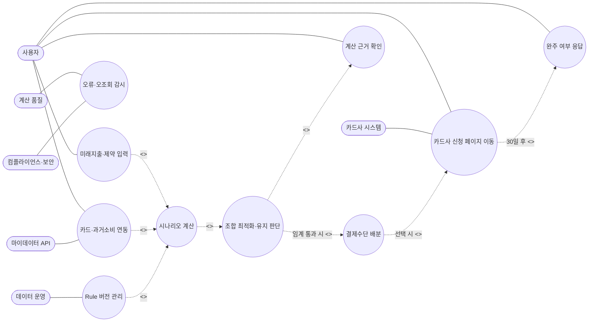

> 이 Mermaid 다이어그램을 정본으로 사용한다. 기존 PNG·SVG는 호환용 산출물로 유지하되, 내용이 달라질 경우 Mermaid 원본을 먼저 갱신한다.

### 3.6 핵심 기능 인터랙션 시퀀스

PRD가 "핵심 기능 1개"로 지목한 조합 최적화(F-04)를 축으로, 3.2~3.4의 인터페이스가 실제로 어떤 순서로 호출되는지 시퀀스 다이어그램으로 나타낸다. 각 분기는 4.1의 해당 REQ-FUNC 인수기준과 1:1로 대응한다.

**3.6.1 시나리오 계산 + Net Benefit 게이팅 (`POST /calculate`, REQ-FUNC-004·005)**

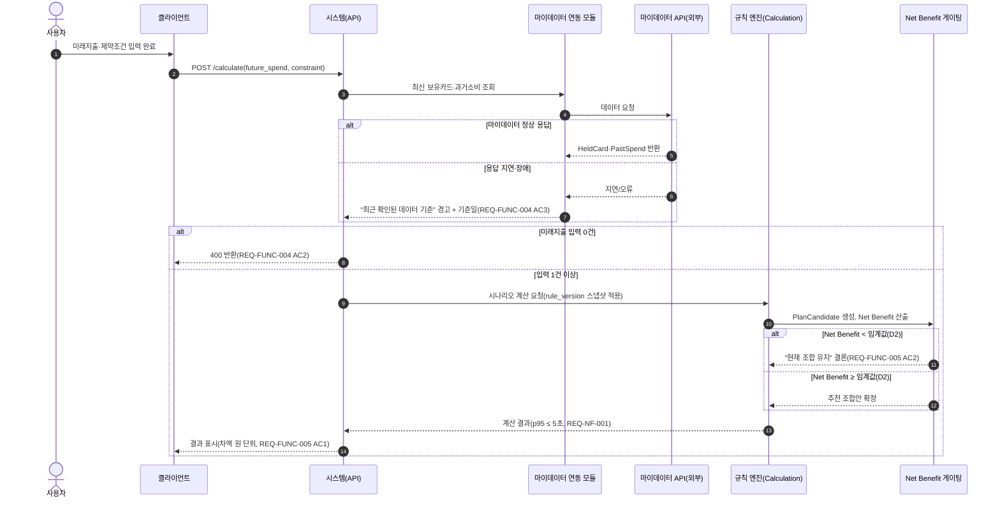

**3.6.2 근거 공개 (`GET /calculations/{id}/evidence`, REQ-FUNC-007)**

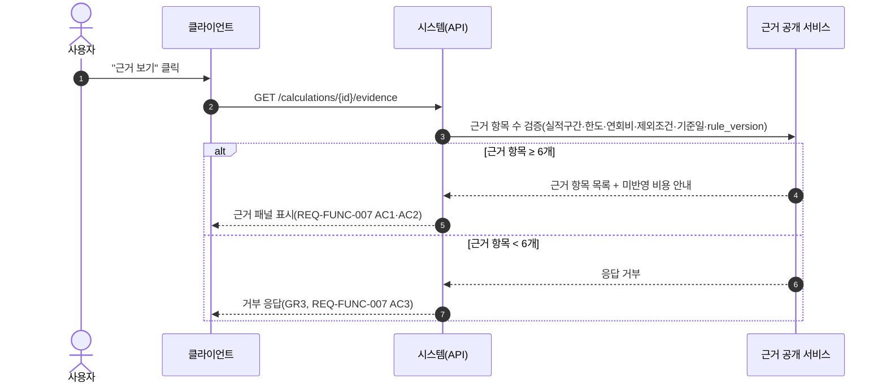

**3.6.3 실행 완주율 계측 (`POST /outcomes/{id}/completion`, REQ-FUNC-010)**

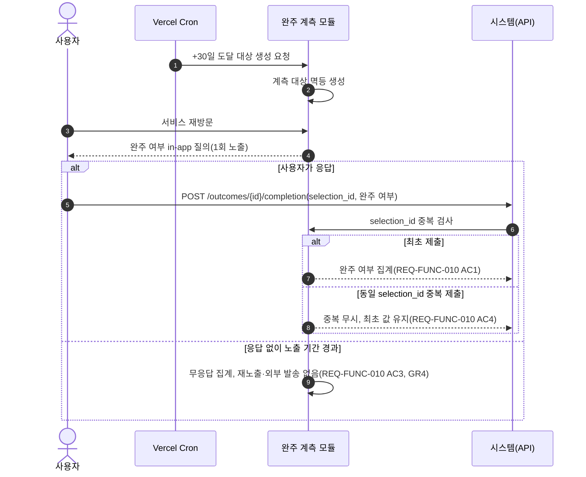

**3.6.4 마이데이터 연동 및 동의 관리 (REQ-FUNC-002)**

> 읽는 법: 화살표는 "누가 누구에게 무엇을 요청/응답하는지"를 시간 순서(위→아래)로 보여준다. `alt`/`else` 박스는 조건 분기(if/else)다.

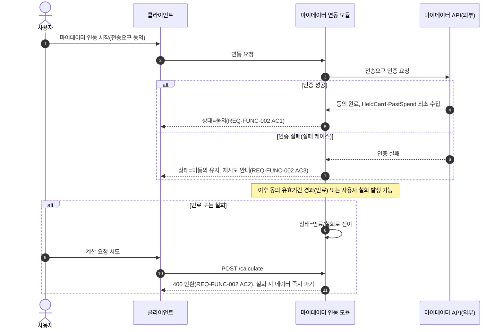

**3.6.5 과거 패턴 기반 초기값 자동 제안 (REQ-FUNC-008)**

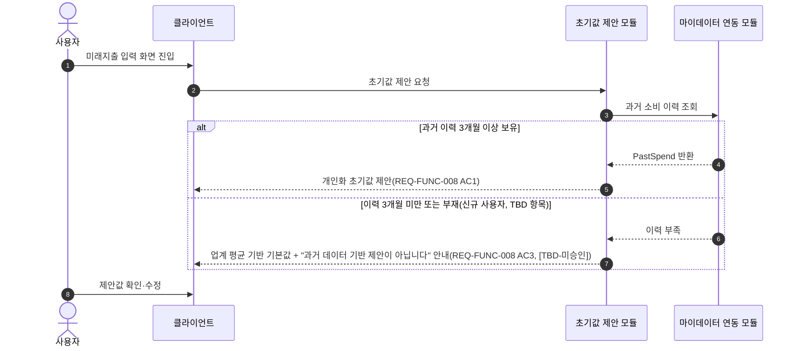

### 3.7 컴포넌트 다이어그램 (Component Diagram)

> 읽는 법: 큰 상자는 클라이언트·CardFit 시스템·외부 시스템의 경계를, 작은 상자는 시스템 내부 컴포넌트(3.3의 논리 구성요소)를 나타낸다. 화살표는 "어느 컴포넌트가 어느 컴포넌트를 호출/의존하는지"를 뜻한다. 코드가 아니라 "부품이 어떻게 나뉘어 있고 서로 무엇을 주고받는지"를 보는 그림이다.

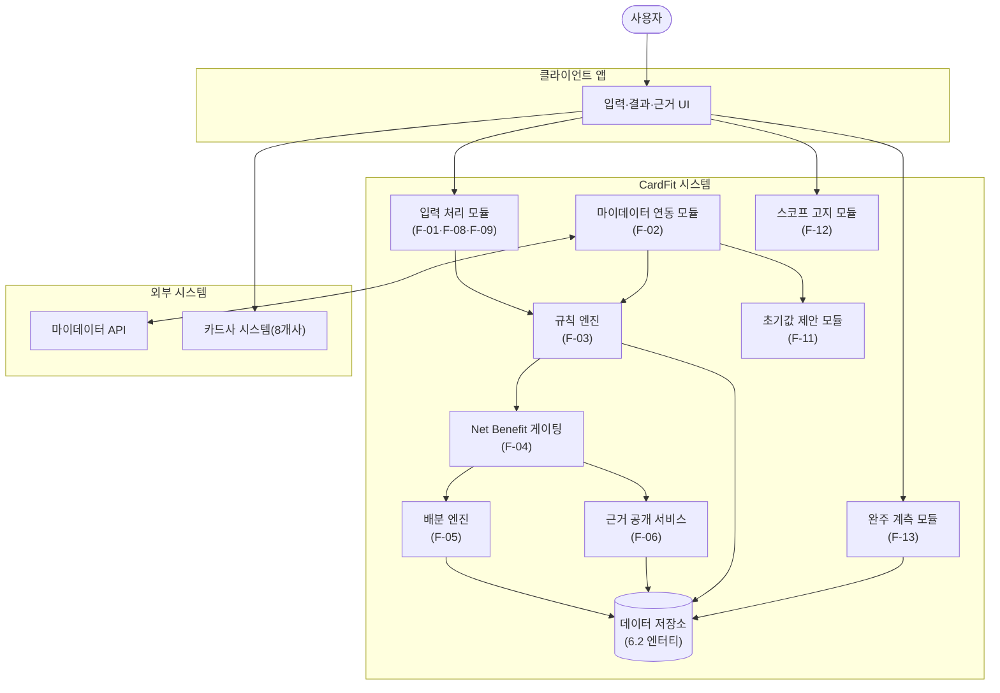

### 3.8 전체 서비스 논리 흐름 개요 (Flow Chart)

배경지식이 없는 독자를 위해, 3.5~3.7의 세부 다이어그램에 앞서 사용자 한 명이 서비스를 이용하는 전체 흐름을 한 장으로 요약한다. 각 단계는 4장의 REQ-FUNC ID로 연결된다.

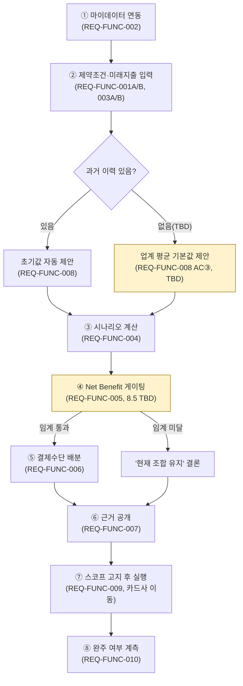

> 노란색 상자(④·과거이력없음 분기)는 8.5·4.1에서 아직 확정되지 않은 규칙(TBD)이 걸린 단계임을 표시한다.

---

## 4. 구체적 요구사항

### 4.1 기능 요구사항

> **출처 유형 표기 원칙**: 각 인수기준은 원칙적으로 PRD 원문(3·4장)에서 그대로 가져온다. PRD 문장을 그대로 옮기지 않고 SRS 작성 과정에서 구체화한 항목은 **[Derived]**(PRD 사실로부터 논리적으로 도출), **[Design Decision]**(PRD에 없는 구현 설계를 SRS 저자가 추가), **[TBD]**(이해관계자 승인이 아직 없어 확정 요구사항으로 볼 수 없음)로 표시한다. 태그가 없는 항목은 PRD 원문 그대로다.
>
> 하나의 요구사항은 하나의 우선순위·하나의 PRD 출처 기능에 대응하도록 원자 단위로 분리한다. 서로 다른 우선순위가 섞여 있던 REQ-FUNC-001·003은 아래와 같이 분리했다.

| ID | 제목 | 출처 | 우선순위 | 유형 | 검증 방식 | 인수 기준 | 상태 | 담당자 |
| --- | --- | --- | --- | --- | --- | --- | --- | --- |
| **REQ-FUNC-001A** | 미래지출 입력(카테고리·금액·시점) | US-A / F-01 | Must | Functional | 1) 단위테스트 2) 경계값 테스트 3) QA 검증 | ① 카테고리·금액·시점 입력이 계산에 정상 반영된다 ②(실패) 음수·비숫자·상한 초과 입력 시 오류 표시, 계산 반영 0건 | Proposed | 개발 엔지니어 |
| **REQ-FUNC-001B** | 이벤트 비종속 입력(자유 카테고리·양방향) | US-F / F-08 | Should | Functional | 1) 단위테스트 2) 경계값 테스트 3) QA 검증 | ① 이벤트 종류 필수 선택 단계 0개 ② 증가·감소 양방향 처리 오류율 0% ③ 자유 카테고리 계산 반영률 100% ④(실패)**[Design Decision]** 특수문자·이모지 등 비정형 텍스트는 크래시 없이 "기타"로 정규화 처리(처리 실패율 0%) — PRD는 자유 입력을 허용한다고만 명시하며, 비정형 텍스트 처리 방식은 PRD에 없어 SRS 작성 시 도출했다 | Proposed | 개발 엔지니어 |
| **REQ-FUNC-002** | 마이데이터 연동(카드 내역·과거소비 수집) | US-A / F-02 | Must | Functional | 1) 연동 통합테스트 2) 동의 상태전이 테스트 3) QA 검증 | ① 연동 완료 시 HeldCard·PastSpend가 수집된다 ②(실패) 동의 만료·철회 시 계산 요청은 400을 반환하며, 철회 시 수집 데이터는 즉시 파기된다 ③(실패)**[Derived]** 최초 연동 시 마이데이터 인증(전송요구) 자체가 실패하면 상태는 `미동의`로 유지되고, 사용자에게 재시도 안내가 표시된다(6.2.4 상태전이 근거) | Proposed | 개발 엔지니어 |
| **REQ-FUNC-003A** | 제약조건 입력(최대 카드 수·연회비 상한·신규발급 허용) | US-D / F-02 | Must | Functional | 1) 입력검증 테스트 2) QA 검증 | 제약조건이 계산 요청에 정상 반영되며, 상한을 벗어난 값은 저장 전 거부된다 | Proposed | 개발 엔지니어 |
| **REQ-FUNC-003B** | 소득·지출 금액 범위 입력 | US-D / F-09 | Could | Functional | 1) 입력검증 테스트 2) 경계값 테스트 | ① 범위(최소·최대) 입력 처리 성공률 100% ②(실패) 최소값이 최대값보다 큰 등 잘못된 범위 입력 시 오류 표시, 계산 반영 0건 | Proposed | 개발 엔지니어 |
| **REQ-FUNC-004** | 시나리오 계산(실적구간·한도·연회비 반영) | US-A / F-03 | Must | Functional | 1) 부하테스트 2) 회귀테스트 3) QA 검증 | ① `POST /calculate` p95 응답 ≤ 5초 ②(실패) 미래지출 입력 0건이면 400 반환, 과거만으로 계산한 결과를 노출하지 않음 ③(실패) 마이데이터 응답 지연·장애 시 "최근 확인된 데이터 기준" 경고와 기준일을 표시하며 계산을 지속함 | Proposed | 개발 엔지니어 |
| **REQ-FUNC-005** | 조합 최적화 + Net Benefit 게이팅 | US-A / F-04 | Must | Functional | 1) 게이팅 로직 테스트 2) 임계값 회귀테스트 3) QA 검증 | ① 유지 시 예상혜택과 추천 조합 예상혜택의 차액이 원 단위로 표시됨(누락률 0%) ②(실패) Net Benefit 임계 미달 시 "현재 조합 유지" 반환률 100%이며, 임계 미달인데 변경을 제안한 건수는 0건(1건 발생 시 롤아웃 중단). **계산식 세부 규칙 9개 항목이 미확정(8.5 체크리스트 참조)** | Proposed — 핵심 로직 미확정(8.5 참조) | 개발 엔지니어 |
| **REQ-FUNC-006** | 결제수단 배분(계산·배분까지) | F-05 | Must | Functional | 1) 배분 로직 테스트 2) 정합성 검증 테스트 3) QA 검증 | ① 조합안 확정 시 카테고리별 배분 금액(Allocation)이 산출된다. 실행 대행은 포함하지 않는다 ②(실패)**[Derived]** 배분 금액의 카테고리별 합계가 원본 `FutureSpendPlan` 금액 합계와 불일치하면 오류로 처리하고 결과를 노출하지 않는다(불일치 건수 0건 유지) | Proposed | 개발 엔지니어 |
| **REQ-FUNC-007** | 근거 공개(적용 규칙 + 제외조건·기준일) | US-B / F-06 | Must | Functional | 1) 근거항목 카운트 테스트 2) 거부 로직 테스트 3) QA 검증 | ① "근거 보기" 클릭 시 근거 항목 ≥ 6개 펼쳐짐 ② 미반영 비용은 "이 계산에는 포함되지 않았습니다" 문구로 누락률 0% 표시 ③(실패) 근거 항목 6개 미만 시 응답 거부(GR3 위반 0건) ④(실패) 마이데이터 응답 지연 시 기준일 미표시 건수 0건 | Proposed | 개발 엔지니어 |
| **REQ-FUNC-008** | 과거 패턴 기반 초기값 자동 제안 | US-D / F-11 | Must | Functional | 1) A/B 테스트(n=500, 250/250) 2) QA 검증 | ① 제안 커버리지 100% ② 온보딩 완료율이 대조군 대비 +15%p 이상 개선 ③(실패)**[TBD — 미승인]** 과거 소비 이력 3개월 미만·부재 신규 사용자는 업계 평균 기반 기본값과 "과거 데이터 기반 제안이 아닙니다" 안내를 제공(대체 제안 커버리지 100%, 무제안 노출 0건). **업계 평균값의 데이터 출처·최신성·편향 검토가 아직 승인되지 않았으므로, AC③은 승인 전까지 Must 확정 요구사항이 아니라 제안 상태로 취급한다** | Proposed — ①·② 확정, ③ TBD | 개발 엔지니어 |
| **REQ-FUNC-009** | 스코프 경계 고지 + 금지어 자동 검수 | US-C / F-12 | Should | Functional | 1) 금지어 스캐너 테스트 2) 사용자 인지도 설문 | ① 온보딩·결과 화면 노출 후 "해지·전환 대행을 제공하지 않는다"에 대한 사용자 범위 인지율 ≥ 90% ②(실패)**[Derived]** 금지어 스캐너가 실행 대행을 암시하는 사전 정의 문구(UI·푸시·FAQ·CS)를 탐지하면 게시 전 자동 차단되며, GR4(오인 문구 노출) 위반 0건을 유지한다 | Proposed | 제품(PM) |
| **REQ-FUNC-010** | 실행 완주율 계측(측정 전용) | US-C / F-13 | Should | Functional | 1) Cron·계측 로직 테스트 2) 멱등성 테스트 3) QA 검증 | ① 조합안 선택 +30일 시점에 Vercel Cron이 계측 대상을 생성하고 사용자 재방문 시 in-app 질의를 1회 노출한다 ② 완주율·북극성 지표 격차 20%p 이상 시 경보 ③(실패) 노출 기간 내 무응답은 별도 상태로 집계하고 재노출·외부 발송을 하지 않는다 ④(실패) 동일 `selection_id` 중복 제출 시 최초 1건만 유효 처리한다 | Proposed | 개발 엔지니어 |
| **REQ-FUNC-011** | 단계적 전환 제안(효과 큰 카드부터) | F-07 | Could | Functional | 1) 정렬 로직 테스트 2) 동률 케이스 테스트 | 카드 다량 보유 사용자 대상으로 REQ-FUNC-005/007 결과를 재정렬해 표시한다. 정렬 기준:**[Design Decision — 확정 필요]** 카드별 기여 순혜택(Allocation 기준) 내림차순. 동률 처리 규칙은 **[TBD]**(PRD·SRS 어디에도 정의되지 않음) | Proposed | 개발 엔지니어 |

> REQ-FUNC-011은 신규 계산 로직 없이 REQ-FUNC-005/007 결과의 표시 순서만 바꾸는 경량 확장이라 구현 규모가 작다(PRD 4장 근거). 이는 우선순위 산정의 참고 근거일 뿐 합격 판정 기준이 아니므로 인수 기준에서 제외했다.

### 4.2 비기능 요구사항

| ID | 제목 | 출처 | 우선순위 | 유형 | 검증 방식 | 인수 기준 | 상태 | 담당자 |
| --- | --- | --- | --- | --- | --- | --- | --- | --- |
| **REQ-NF-001** | 계산 응답시간 | PRD §5 성능 | Must | Performance | 부하 테스트(대량 요청) | `POST /calculate` p95 ≤ 5초 | Proposed | 시스템 운영자 |
| **REQ-NF-002** | 근거 조회 응답 | PRD §5 성능 | Must | Performance | 통합 테스트 | `GET /evidence`의 6항목 미달 거부 응답은**[Design Decision]** p95 ≤ 500ms 이내에 반환된다(계산 경로 5초 SLA와 분리된 경량 검증이므로 그보다 짧게 설정 — PRD에 없는 수치라 Derived가 아닌 Design Decision으로 표기) | Proposed | 개발 엔지니어 |
| **REQ-NF-003** | 계산 오류율(GR1) | PRD §5 신뢰성 | Must | Reliability | `rule_version` 변경 시마다 경계값 회귀 테스트(≥200건) | 계산 오류율 ≤ 0.1%, 재계산 불일치 0건 | Proposed | 계산 품질 담당 |
| **REQ-NF-004** | 월 가용성 | PRD §5 신뢰성 | Must | Reliability | 업타임 모니터링(1분 주기 헬스체크) | 월 가용성 ≥ 99.5%. 다운타임 정의: 5xx 응답 또는 10초 초과 타임아웃 연속 3회 이상 | Proposed | 시스템 운영자 |
| **REQ-NF-005** | 마이데이터 오조회 방지 | PRD §5 보안 | Must | Security | 실시간 접근 로그 규칙 감사 | 오조회 0건. 발생 시 서비스 중단 + 감독당국 신고 | Proposed | 컴플라이언스·보안 |
| **REQ-NF-006** | 데이터 최신성(GR5) | PRD §5 | Must | Reliability | 약관 수집 배치 결과 대조 | 갱신 지연 7일 초과 시 최신성 경고 + 데이터 운영 일간 알림, 30일 초과 시 해당 카드 계산 대상 자동 제외 | Proposed | 데이터 운영 담당 |
| **REQ-NF-007** | 비용 관리(호출당 과금) | PRD §5 비용 | Should | Cost | 비용 대시보드 모니터링 | 마이데이터 API 호출 비용을 일별·월별로 대시보드에 기록하고 성과 지표와 분리 관리한다. 월 예산 상한 및 초과 알림 임계치는**[TBD — 사업팀 확정 필요]**(PRD에 금액 미기재) | Proposed — 예산 임계치 TBD | 제품(PM) |
| **REQ-NF-008** | 감사 로그 보존 | PRD §5 보안 | Must | Security | 로그 보존 정책 점검 | 계산 요청·응답, 적용 `rule_version`, 입력 스냅샷, 마이데이터 응답 코드를 로그로 남긴다. 보존 기간·접근 권한·마스킹·삭제 방식은**[TBD]**(8.3 리스크·6.2.3 참조, 개발 착수 전 확정 필요) | Proposed — 로깅 항목 확정, 보존정책 TBD | 컴플라이언스·보안 |
| **REQ-NF-009** | Guardrail 모니터링·알림 | PRD §5 모니터링 | Must | Observability | 알림 테스트 | GR1~GR5·오조회 각각에 대해 정의된 탐지 방법과 알림 지연 SLA(5분~24시간)를 충족 | Proposed | 계산 품질/데이터 운영/PM/컴플라이언스 |

### 4.3 제품 측정 및 Guardrail 요구사항

> KPI는 제품 성과를 판단하는 측정 요구사항이며 시스템 품질을 규정하는 비기능 요구사항과 성격이 다르다. 따라서 `REQ-METRIC`으로 분리한다. 기준선이 없는 목표는 `[Assumption]`, 검증 기간 밖의 항목은 `Deferred`, 위반 시 중단해야 하는 안전 지표는 `REQ-GR`로 관리한다.

| ID | 지표 | 산식·판정 기준 | 상태 | 검증 |
| --- | --- | --- | --- | --- |
| **REQ-METRIC-001** | 조합안 선택률(북극성) | 결과 도달자 중 7일 이내 저장·확정한 사용자 비율 ≥ 40%. "유지" 결론 사용자는 분모 제외 | Proposed `[Assumption]` | E2 Concierge |
| **REQ-METRIC-002** | 결론 도달 소요시간 | 사용자 진입부터 유지·추천 결론까지 p95 ≤ 5분 | Proposed `[Assumption]` | E2·사용성 로그 |
| **REQ-METRIC-003** | 온보딩 완료율 | 온보딩 시작 사용자 중 계산 가능한 입력 완료 비율 ≥ 60% | Proposed `[Assumption]` | E3 A/B |
| **REQ-METRIC-004** | 근거 열람률 | 결과 도달 사용자 중 근거 화면 열람 비율 ≥ 50% | Proposed `[Assumption]` | 이벤트 로그 |
| **REQ-METRIC-005** | 실행 완주율 | 조합안 선택 후 30일 시점의 완주·미완주·미응답을 분리 집계. 초기 목표 없음 | Derived — 기준선 측정 | E7b |
| **REQ-METRIC-006** | 이벤트 비종속 진입률 | 이벤트 선택 없이 자유 입력으로 진입한 사용자 비율 ≥ 20% | Proposed `[Assumption]` | 이벤트 로그 |
| **REQ-METRIC-007** | D+90 재방문율 | 최초 결과 후 90일 이내 재방문 사용자 비율. 검증 기간 내 합격 판정에서 제외 | Deferred | 장기 코호트 |

| ID | Guardrail | 중단·합격 기준 | 상태 | 책임자 |
| --- | --- | --- | --- | --- |
| **REQ-GR-001** | 계산 오류율 | ≤ 0.1%, 재계산 불일치 0건. 초과 시 롤아웃 중단 | Confirmed | 계산 품질 |
| **REQ-GR-002** | 불필요 신규카드 추천 | 임계 미달 변경 추천 0건. 1건 발생 시 중단 | Confirmed — D2 값 TBD | 계산 품질·PM |
| **REQ-GR-003** | 근거 미공개 결과 | 근거 6항목 미달 결과 노출 0건 | Confirmed | 계산 품질·PM |
| **REQ-GR-004** | 실행 대행 오인 문구 | UI·푸시·FAQ·CS 노출 0건 | Confirmed | PM |
| **REQ-GR-005** | 최신성 경고 누락 | 갱신 지연 데이터의 경고 누락률 0% | Confirmed | 데이터 운영 |
| **REQ-GR-006** | 마이데이터 오조회 | 0건. 발생 시 서비스 중단·신고 | Confirmed | 컴플라이언스·보안 |

### 4.4 핵심 의사결정 흐름 — Net Benefit 게이팅 (Flow Chart)

REQ-FUNC-005(Net Benefit 게이팅)는 PRD가 "핵심 기능 1개"로 지목한 요구사항이자 8.5에서 계산식 세부가 아직 TBD로 남아있는 항목이다. 코드나 표보다 그림이 이해하기 쉬우므로, **결정되어 있는 부분(회색)**과 **아직 정해지지 않은 부분(노란색)**을 구분해 흐름도로 나타낸다.

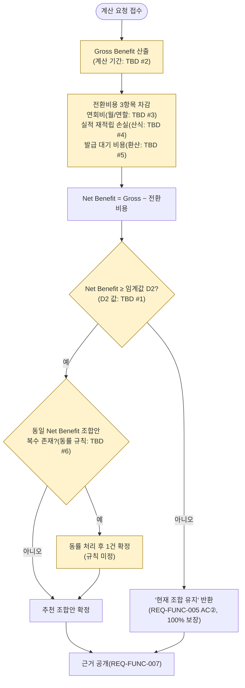

> 노란색 상자의 "TBD #1~#6"은 8.5 체크리스트의 항목 번호와 같다. 이 흐름도는 로직의 **순서**만 확정하며, 노란 상자 안의 **계산식 자체는 아직 정의되지 않았다** — 임의로 공식을 만들지 않고 도형으로만 그 존재와 위치를 표시했다.

---

## 5. 추적성 매트릭스

### 5.1 클래스 다이어그램 (Class Diagram)

> 읽는 법: 각 상자는 하나의 "부품"(클래스)이다. 위 칸은 이름, 가운데 칸은 그 부품이 들고 있는 데이터(속성), 아래 칸은 그 부품이 할 수 있는 동작(메서드)이다. 실선 화살표는 "이 부품이 저 부품을 사용한다"는 뜻이다. 왼쪽은 3.3의 로직 컴포넌트를, 오른쪽은 6.2.1의 데이터 엔터티를 클래스 형태로 표현한 것이다 — 즉 5.2 추적성 매트릭스의 "설계 구성요소" 열을 그림으로 풀어쓴 것이다.

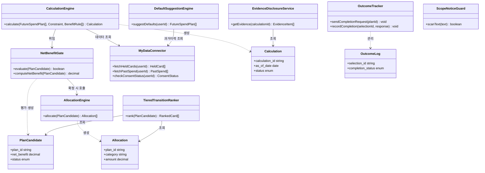

### 5.2 추적성 매트릭스

> GPT 검토에서 REQ-NF-002·007·008이 매트릭스에서 누락된 것을 확인해 추가했다. 또한 PRD 출처와 검증 상태 열을 더해 "PRD 출처 → 요구사항 → 설계 구성요소 → 테스트 케이스 → 검증 상태"의 양방향 추적이 가능하도록 확장했다. 아직 테스트가 실행되지 않았으므로 검증 상태는 전 항목 "미실시"이며, 이는 상태 열의 "Proposed"(4장)와 일관된다.

| PRD 출처 | 요구사항 ID | 설계 구성요소(3.3 참조) | 테스트 케이스 ID | 검증 상태 |
| --- | --- | --- | --- | :---: |
| US-A / F-01 | REQ-FUNC-001A | FutureSpendInputHandler | TC-FUNC-001A | 미실시 |
| US-F / F-08 | REQ-FUNC-001B | FreeCategoryNormalizer | TC-FUNC-001B | 미실시 |
| US-A / F-02 | REQ-FUNC-002 | MyDataConnector | TC-FUNC-002 | 미실시 |
| US-D / F-02 | REQ-FUNC-003A | ConstraintInputHandler | TC-FUNC-003A | 미실시 |
| US-D / F-09 | REQ-FUNC-003B | SpendRangeInputHandler | TC-FUNC-003B | 미실시 |
| US-A / F-03 | REQ-FUNC-004 | CalculationEngine | TC-FUNC-004 | 미실시 |
| US-A / F-04 | REQ-FUNC-005 | NetBenefitGate | TC-FUNC-005 | 미실시 |
| F-05 | REQ-FUNC-006 | AllocationEngine | TC-FUNC-006 | 미실시 |
| US-B / F-06 | REQ-FUNC-007 | EvidenceDisclosureService | TC-FUNC-007 | 미실시 |
| US-D / F-11 | REQ-FUNC-008 | DefaultSuggestionEngine | TC-FUNC-008 | 미실시(③은 TBD, 4.1 참조) |
| US-C / F-12 | REQ-FUNC-009 | ScopeNoticeGuard | TC-FUNC-009 | 미실시 |
| US-C / F-13 | REQ-FUNC-010 | OutcomeTracker | TC-FUNC-010 | 미실시 |
| F-07 | REQ-FUNC-011 | TieredTransitionRanker | TC-FUNC-011 | 미실시 |
| PRD §5 성능 | REQ-NF-001 | PerformanceMonitor | TC-NF-001 | 미실시 |
| PRD §5 성능 | REQ-NF-002 | ValidationResponseMonitor | TC-NF-002 | 미실시 |
| PRD §5 신뢰성 | REQ-NF-003 | RegressionTestRunner | TC-NF-003 | 미실시 |
| PRD §5 신뢰성 | REQ-NF-004 | UptimeMonitor | TC-NF-004 | 미실시 |
| PRD §5 보안 | REQ-NF-005 | AccessAuditLogger | TC-NF-005 | 미실시 |
| PRD §5 | REQ-NF-006 | RuleFreshnessMonitor | TC-NF-006 | 미실시 |
| PRD §5 비용 | REQ-NF-007 | CostDashboard | TC-NF-007 | 미실시(예산 임계치 TBD) |
| PRD §5 보안 | REQ-NF-008 | AuditLogStore | TC-NF-008 | 미실시(보존정책 TBD) |
| PRD §5 모니터링 | REQ-NF-009 | GuardrailAlertDispatcher | TC-NF-009 | 미실시 |

### 5.3 Story·AC 단위 추적성

> PRD의 문장 순서를 식별 가능한 AC ID로 고정했다. 한 AC가 기능과 품질을 함께 요구하면 관련 REQ를 모두 연결한다. SRS에서 파생한 실패 기준은 원문 AC와 혼동하지 않도록 `DER-AC-*`로 분리한다.

| Story | AC ID | PRD 인수 기준 요약 | 반영 요구사항 | 검증 ID | 상태 |
| --- | --- | --- | --- | --- | :---: |
| US-A | AC-US-A-01 | 미래지출 입력 후 p95 5초 이내 결과 표시 | REQ-FUNC-004, REQ-NF-001 | TC-AC-A-01 | 미실시 |
| US-A | AC-US-A-02 | 미래 입력 0건이면 400, 과거 단독 결과 금지 | REQ-FUNC-004 | TC-AC-A-02 | 미실시 |
| US-A | AC-US-A-03 | 유지안·추천안 혜택 차액을 원 단위 표시 | REQ-FUNC-005 | TC-AC-A-03 | 미실시 |
| US-B | AC-US-B-01 | 근거 6항목 이상 공개 | REQ-FUNC-007 | TC-AC-B-01 | 미실시 |
| US-B | AC-US-B-02 | 미반영 비용 고지 누락 0% | REQ-FUNC-007 | TC-AC-B-02 | 미실시 |
| US-B | AC-US-B-03 | 6항목 미달 시 응답 거부 | REQ-FUNC-007, REQ-GR-003 | TC-AC-B-03 | 미실시 |
| US-C | AC-US-C-01 | 선택 후 30일에 완주 여부 집계 | REQ-FUNC-010, REQ-METRIC-005 | TC-AC-C-01 | 미실시 |
| US-C | AC-US-C-02 | 완주율을 북극성과 병렬 보고, 격차 20%p 경보 | REQ-FUNC-010, REQ-METRIC-001/005 | TC-AC-C-02 | 미실시 |
| US-C | AC-US-C-03 | 미완주 사유는 집계만 하고 자동 개입 금지 | REQ-FUNC-010, REQ-GR-004 | TC-AC-C-03 | 미실시 |
| US-C | AC-US-C-04 | 실행 대행 범위 인지율 90% 이상 | REQ-FUNC-009 | TC-AC-C-04 | 미실시 |
| US-F | AC-US-F-01 | 이벤트 종류 필수 선택 단계 0개 | REQ-FUNC-001B | TC-AC-F-01 | 미실시 |
| US-F | AC-US-F-02 | 증가·감소 양방향 처리 오류율 0% | REQ-FUNC-001B | TC-AC-F-02 | 미실시 |
| US-F | AC-US-F-03 | 자유 입력 카테고리 계산 반영 | REQ-FUNC-001B | TC-AC-F-03 | 미실시 |
| 공통 | AC-GATE-01 | 임계 미달 시 현재 조합 유지 반환 100% | REQ-FUNC-005, REQ-GR-002 | TC-AC-GATE-01 | D2 TBD |
| US-D | AC-US-D-DER-01 | 제약조건과 범위 입력의 유효성 검증 | REQ-FUNC-003A/003B | TC-FUNC-003A/B | Derived |
| US-E | AC-US-E-DEF-01 | 정기 재진단·D+90 재방문 | F-10, REQ-METRIC-007 | TC-METRIC-007 | Deferred |

### 5.4 KPI·Guardrail 추적성

| Master Deck/PRD 출처 | 요구사항 | 수집·통제 구성요소 | 검증 | 상태 |
| --- | --- | --- | --- | --- |
| p30 북극성 | REQ-METRIC-001 | ProductAnalytics | E2 | 목표값 Assumption |
| p30 전환 KPI | REQ-METRIC-002~004 | FunnelAnalytics | E2·E3·이벤트 로그 | 목표값 Assumption |
| p30 유지 KPI | REQ-METRIC-005~007 | OutcomeTracker·CohortAnalytics | E7b·장기 코호트 | 005 기준선 측정, 007 Deferred |
| p30 GR1 | REQ-GR-001 | RegressionTestRunner | TC-NF-003 | 미실시 |
| p30 GR2 | REQ-GR-002 | NetBenefitGate | TC-FUNC-005 | D2 TBD |
| p30 GR3 | REQ-GR-003 | EvidenceDisclosureService | TC-FUNC-007 | 미실시 |
| p30 GR4 | REQ-GR-004 | ScopeNoticeGuard | TC-FUNC-009 | 미실시 |
| p30 GR5 | REQ-GR-005 | RuleFreshnessMonitor | TC-NF-006 | 미실시 |
| p31 오조회 | REQ-GR-006 | AccessAuditLogger | TC-NF-005 | 미실시 |

---

## 6. 부록

### 6.1 API 엔드포인트 목록

| 메서드 | 엔드포인트 | 요청(요지) | 응답(요지) | 제약 |
| --- | --- | --- | --- | --- |
| POST | `/calculate` | 미래지출·제약조건 | 조합안 또는 "현재 조합 유지" 결론 | p95 ≤ 5초, 미래 입력 0건이면 400 |
| GET | `/calculations/{id}/evidence` | calculation_id | 근거 항목 목록(≥6개) | 6항목 미달 시 응답 거부 |
| POST | `/outcomes/{id}/completion` | selection_id, 완주 여부 자기신고 | 집계 확인 | 측정 전용, 중복 제출은 멱등 처리 |

### 6.2 데이터 모델 정의 (ERD)

> 읽는 법: 상자는 하나의 데이터 묶음(엔터티)이고, 상자 사이 선은 관계다. 선 끝의 기호(`||`, `o{` 등)는 "몇 개씩 연결되는지"를 뜻한다 — 예를 들어 `User ||--o{ HeldCard`는 "사용자 1명은 보유카드를 0개 이상 가질 수 있다"는 뜻이다.

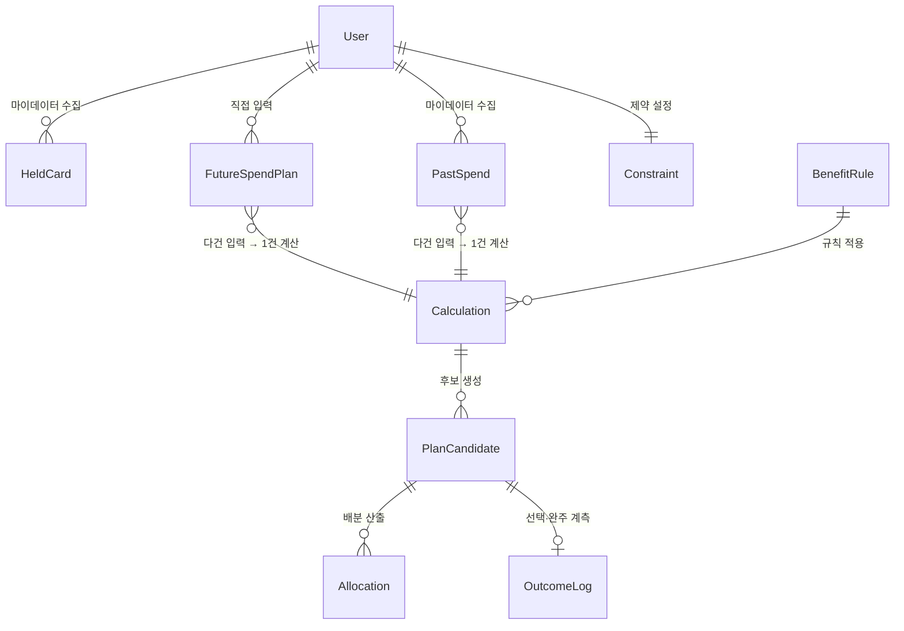

> 아래 6.2.1~6.2.4는 ISO/IEC/IEEE 29148:2018 §9.6.15(Logical database requirements — 정보 유형, 엔터티·관계, 무결성 제약, 보안, 보존 요건)의 항목 구성을 따라 6장(부록) 안에서 확장했다. 필드 타입은 PRD에 명시된 값에서 직접 추론했으며, PRD가 값을 정하지 않은 항목은 창작하지 않고 "미정"으로 표시했다.

#### 6.2.1 엔터티 및 필드 정의 (필드:타입)

| 엔터티 | 필드(명:타입) | 출처 |
| --- | --- | --- |
| User | user_id:string(PK), mydata_consent_status:enum(미동의\|동의\|만료\|철회), mydata_consent_scope:string, mydata_consent_at:datetime | 자체 |
| HeldCard | card_id:string(PK), issuer:string, card_name:string, annual_fee:decimal, issued_at:date, billing_cycle_month:int | 마이데이터 API |
| PastSpend | merchant:string, mcc_code:string, amount:decimal, paid_at:date | 마이데이터 API |
| FutureSpendPlan | category:string(자유 입력), amount_min:decimal, amount_max:decimal(단일값이면 min=max), planned_at:date, confidence:enum(**값 미정 — PRD 미명시**) | 사용자(F-01) |
| Constraint | max_card_count:int, annual_fee_cap:decimal, allow_new_card_issuance:boolean | 사용자(F-02) |
| BenefitRule | card_id:string(FK), tier_threshold:decimal, combined_discount_cap:decimal, excluded_items:array\<string\>, effective_from:date, effective_to:date, rule_version:string | 카드사 약관(수집·버전관리) |
| Calculation | calculation_id:string(PK), input_snapshot:json, applied_rule_versions:array\<string\>, as_of_date:date, unreflected_items:array\<string\>, status:enum(성공\|실패\|부분) | 규칙 엔진 |
| PlanCandidate | plan_id:string(PK), calculation_id:string(FK), composition:json, gross_benefit:decimal, conversion_cost_annual_fee:decimal, conversion_cost_reenrollment_loss:decimal, conversion_cost_issuance_wait:decimal, net_benefit:decimal, threshold_passed:boolean, status:enum(제시\|선택\|미선택\|만료) | 규칙 엔진 |
| Allocation | plan_id:string(FK), category:string, amount:decimal | 규칙 엔진 |
| OutcomeLog | plan_id:string(FK), selection_id:string(중복 방지 키), selected_at:datetime, completion_sent_at:datetime, completion_status:enum(미발송\|발송\|응답\|무응답) | 자체(F-13) |

#### 6.2.2 무결성 제약 (Integrity Constraints)

- `BenefitRule.rule_version`이 변경되면, 이를 참조하는 모든 `PlanCandidate`는 자동으로 `상태=만료`가 된다(재계산 전까지 유효하지 않음).
- `PlanCandidate.status=만료`인 레코드는 실행(선택) 대상이 될 수 없다.
- `Calculation.status=부분`(필수 데이터 누락)인 레코드는 결과로 노출되지 않으며 `result_viewed` 집계에서 제외된다.
- `OutcomeLog.selection_id`는 유일해야 하며, 동일 값으로 중복 제출되면 최초 1건만 유효 처리된다(REQ-FUNC-010 AC4).
- `User.mydata_consent_status`가 `만료` 또는 `철회`인 동안에는 신규 `Calculation` 생성이 거부된다(400).
- `GET /evidence` 응답은 근거 항목이 6개 미만인 `Calculation`에 대해 생성되지 않는다(REQ-FUNC-007).
- `Calculation.input_snapshot`은 계산 시점의 `FutureSpendPlan`·`PastSpend` 값을 복사한 스냅샷이며 라이브 참조가 아니다. 따라서 동일한 `FutureSpendPlan`·`PastSpend` 레코드가 이후 재계산에서 다시 읽혀 다른 `Calculation`의 스냅샷에 포함될 수 있다(ERD의 `}o--||`는 "다건 입력이 1건 계산에 반영됨"을 뜻하며, 동일 입력의 재사용을 배제하지 않는다).

#### 6.2.3 보안 및 보존 (Security & Retention)

- `HeldCard`·`PastSpend`는 마이데이터 API로 수집되는 개인신용정보로 분류되며, 접근 범위는 `User.mydata_consent_scope`를 벗어날 수 없다(REQ-NF-005, 오조회 방지).
- `User.mydata_consent_status=철회` 시 `HeldCard`·`PastSpend`는 즉시 파기된다.
- `Calculation`의 입력 스냅샷·적용 `rule_version`·마이데이터 응답 코드는 감사 목적으로 전건 로그 보존된다(REQ-NF-008).
- **미해결 항목**: 위 감사 로그의 구체적 보존 기간(예: N개월/N년)이 PRD에 명시되어 있지 않다. 임의로 정하지 않고 8.3 리스크에 확정 필요 항목으로 별도 등재할 것을 권고한다.

#### 6.2.4 엔터티 상태 전이 — 4개 객체

> 읽는 법: 동그라미/상자는 "상태"(예: 미동의, 동의)이고, 화살표는 "무엇을 하면 다음 상태로 바뀌는지"를 뜻한다. 아래는 마이데이터 동의 상태가 시간에 따라 어떻게 바뀌는지를 보여준다.

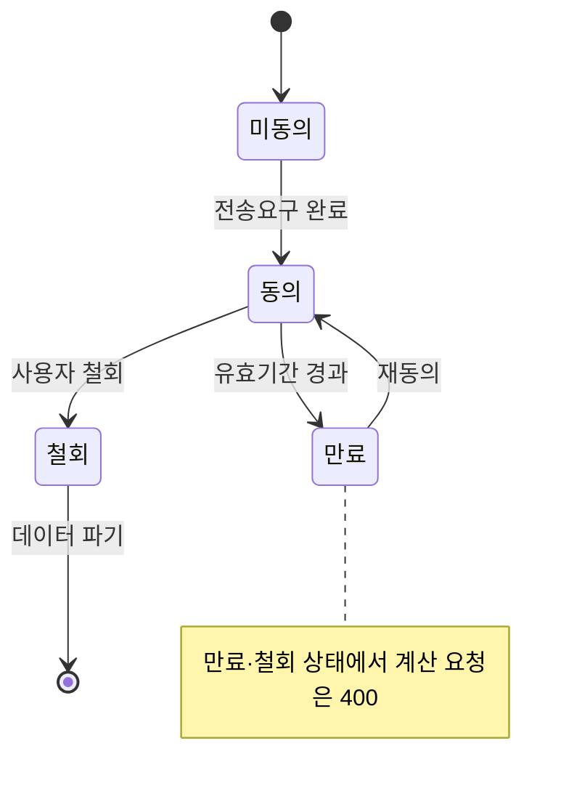

| 객체 | 상태값 | 전이 규칙 |
| --- | --- | --- |
| 마이데이터 동의 | 미동의 → 동의 → (만료/철회) | 만료·철회 시 계산 요청 400. 철회 시 데이터 파기 |
| 계산(Calculation) | 요청 → (성공/실패/부분) | 부분 = 필수 데이터 누락 → 결과로 취급하지 않고 추천 중단 |
| 조합안(PlanCandidate) | 제시 → (선택/미선택) → 만료 | `rule_version` 변경 또는 기준일 +30일 경과 시 만료 — 재계산 없이 실행 대상 아님 |
| 완주 응답(OutcomeLog) | 예정 → 대상생성 → 노출 → (응답/무응답) | Vercel Cron이 선택 +30일에 대상을 생성하고 재방문 시 in-app 1회 노출. 무응답은 별도 집계하며 재노출·외부 발송 없음 |

#### 6.2.5 계산 가용성 조건 구분

GPT 검토는 "마이데이터 장애 시 계산 지속"·"부분 계산은 결과 미노출"·"동의 만료 시 400 거부"가 서로 모순돼 보인다고 지적했다. 세 규칙은 서로 다른 조건에 적용되므로 아래와 같이 구분한다.

| 조건 | 트리거 | 처리 | 근거 |
| --- | --- | --- | --- |
| ① 동의 상태 문제 | `User.mydata_consent_status = 만료 \| 철회` (인가 자체가 없음) | 계산 요청을 즉시 400으로 거부. 캐시 유무와 무관 | REQ-FUNC-002, 6.2.2 |
| ② 마이데이터 API 일시 장애 | 동의는 `유효`(동의 상태)이나 API 호출이 타임아웃·5xx (직전 확인된 캐시 데이터는 존재) | 캐시된 최신 데이터로 계산을 계속하고 "최근 확인된 데이터 기준" 경고 + 기준일 표시 | REQ-FUNC-004 AC3 |
| ③ 필수 데이터 자체 부재 | 동의는 유효하나 최초 연동 실패 등으로 캐시조차 없어 계산에 필요한 최소 데이터가 없음 | `Calculation.status = 부분`으로 처리하고 결과로 노출하지 않음(추천 중단) | 6.2.2, PRD §6 상태전이 |

②와 ③을 구분하는 기준은 **"직전에 확인된 캐시 데이터가 존재하는가"**다. 캐시가 있으면 ②(경고와 함께 계속), 캐시조차 없으면 ③(결과 미노출)이다.

### 6.3 비즈니스 규칙 요약

1. **Net Benefit 게이팅**: 임계값(D2) 미만이면 "현재 조합 유지"를 정상 결과로 반환한다. 무조건적 신규카드 추천은 하지 않는다.
2. **미래 입력 필수**: 미래지출 입력이 0건이면 과거 데이터만으로 계산한 결과를 내놓지 않고 400을 반환한다.
3. **근거 공개 최소 기준**: 근거 항목이 6개 미만이면 응답 자체를 거부한다.
4. **이벤트 비종속 원칙**: 이벤트 종류를 사전 정의해 선택하게 하지 않는다. 증가·감소 양방향과 자유 입력 카테고리를 모두 계산에 반영한다.
5. **조합안 만료**: `rule_version` 변경 또는 제시 후 30일 경과 시 조합안은 만료되며 재계산 없이 실행 대상이 되지 않는다.
6. **완주 계측은 측정 전용**: Vercel Cron은 선택 +30일에 계측 대상만 생성하고, 사용자 재방문 시 in-app 질의를 1회 노출한다. 외부 발송·재노출·독려는 하지 않는다.
7. **동의 상태 강제**: 마이데이터 동의가 만료·철회된 상태에서는 계산 요청을 400으로 거부한다.
8. **오조회 최우선 대응**: 오조회 발생 시 PM의 사업적 판단을 거치지 않고 컴플라이언스가 즉시 서비스를 중단하고 신고한다.

### 6.4 데이터베이스 스키마 개요

```
-- 핵심 테이블 요약
users                     -- 사용자 및 마이데이터 동의 상태
held_cards                -- 마이데이터 수집 보유카드
past_spends               -- 마이데이터 수집 과거 소비
future_spend_plans        -- 사용자 직접 입력 미래지출
constraints               -- 사용자 제약조건(최대카드수·연회비상한 등)
benefit_rules             -- 카드사 약관(rule_version 관리)
calculations              -- 계산 스냅샷 및 적용 규칙 버전
plan_candidates           -- 조합 후보(Net Benefit·임계 통과 여부)
allocations               -- 배분 산출 결과
outcome_logs              -- 선택·완주 응답 계측
```

---

## 7. 향후 개선 사항

현재 v1.0 SRS는 혼인(Q1) 세그먼트 베타를 전제로 한 MVP 범위에 초점을 둔다. 다음 항목은 향후 버전에서 검토한다.

- **F-10 정기 재진단 알림**: 지속 사용 동기(Job E) 대응. 현재는 비MVP.
- **F-14 카드 20장+ 대량 처리 최적화**: 대상 세그먼트 우선순위가 낮아 v1 범위에서 제외.
- **D+90 재방문율 측정**: 베타 검증 기간(12주) 내에는 측정하지 않으며, 정식 서비스 전환 후 D+90 코호트 분석으로 이관한다.
- **JTBD 인터뷰 실사용자 전환**: E1(n=15)을 모의 응답에서 실제 사용자 인터뷰로 전면 실행해 가정 A2의 검증 근거를 승격한다.
- **수익모델(D3) 확정**: Net Benefit 임계값(D2) 확정 이후, 이와 정합하는 수익모델을 후속 결정한다(8.3 리스크 참조).

---

## 8. 가정·제약 및 의존성

> 본 챕터는 예시 SRS 포맷(1~7장)의 범위를 벗어나는 PRD 내용을 다룬다. ISO/IEC/IEEE 29148:2018 §9.6.7(Limitations) 및 §9.6.8(Assumptions and dependencies)의 "SRS에 명시된 요구사항에 영향을 주는 요인과, 공급자의 선택지를 제한하는 항목을 기술한다"는 규정을 근거로 추가했다.

### 8.1 가정 (Assumptions)

| # | 가정 | 검증 우선순위 | 반증되면 무엇이 무너지나 | 검증 |
| :---: | --- | --- | --- | :---: |
| A5 | 마이데이터 인가·제휴를 확보할 수 있다 | 0순위 — 착수 전 선결 | 계산 성립 자체 | 착수 전 선결 |
| A1 | 미래 지출 입력의 수고가 혜택 최적화 보상으로 정당화된다 | 1순위 — 서비스 성립 전제 | 서비스 전체 — 온보딩이 성립하지 않음 | E2 |
| A4 | 계산상 유리하면 사용자가 선택한다 | 1순위 — 북극성 전제 | 북극성 지표 자체 | E2 |
| A2 | 사용자가 미래 지출을 숫자로 표현할 수 있다 | 2순위 | REQ-FUNC-001A 입력 설계(REQ-FUNC-008로 완화) | E1·E3 |
| A3 | 근거 공개가 신뢰를 만든다 | 2순위 | 차별점 ③ | E2(2군 비교) |
| A6 | 실행 완주율이 낮다 | 3순위 — 참고 가설 | REQ-FUNC-010의 존재 이유 | E7 |

### 8.2 주요 설계 결정 (ADR, Architecture Decision Record)

| ID | 결정 | 배경/이유 | 상태 |
| :---: | --- | --- | :---: |
| ADR-001 | 계산 로직은 결정론적 규칙 엔진으로 구현하고, AI는 근거 설명에만 사용한다 | "AI가 혜택을 보장한다"는 오해를 방지해 재무자문·투자권유 분류 리스크를 차단한다 | 확정 |
| ADR-002 | 카드 해지·전환 실행은 시스템 범위에서 제외하고 REQ-FUNC-010(측정)으로만 대응한다 | 카드 해지 절차에 대한 직권·대행 권한이 없으며, 대행 시 모집인 등록 등 업역 리스크가 발생한다 | 확정 |
| ADR-003 | Net Benefit 게이팅에서 "유지"를 정상 결과로 반환하며, 무조건적 신규카드 추천을 하지 않는다 | 무조건 신규카드를 추천하면 근거 기반 검증이라는 차별점이 무너지고, 발급 연계 수익모델과 충돌한다 | 확정 |
| ADR-004 | 마이데이터 API를 카드 데이터의 유일한 채널로 사용하고 자체 크롤링·스크래핑은 하지 않는다 | 카드 약관 통합 API가 없고, 개인신용정보 수집은 마이데이터 표준 인가 체계를 통해서만 한다 | 확정 |
| ADR-005 | Vercel Cron이 선택 +30일에 계측 대상을 만들고 재방문 시 in-app으로 1회 노출하며 외부 발송·재노출·독려는 하지 않는다 | 지정 기술 스택 안에서 계측하고 실행 개입 오인과 외부 알림 의존성을 차단한다 | 확정 |

### 8.3 리스크 및 제약사항

| 축 | 리스크/제약 | 대응 | 상태 |
| --- | --- | --- | :---: |
| 인가 | 마이데이터(본인신용정보관리업) 인가·제휴가 MVP 전제인데 미확정 | 직접 인가 또는 기존 사업자 제휴 — 착수 전 선결 | 결정 필요 — 착수 전 |
| 업역 | 카드사 신청 페이지 연결이 여신전문금융업법상 모집인 등록 대상인지 미확인 | 링크 이동만 제공(대행 없음), 1차 출처 확인 과제 | 확인 필요 — 베타 전 완료 목표 |
| 인센티브 | 수익모델 미정 — 발급 연계 수수료 모델이면 "유지" 결론은 수익 0원 | Net Benefit 임계값(D2)을 먼저 확정 후 정합한 수익모델을 선정(ADR-003) | 결정 필요 — D2 확정 직후 |
| 데이터 | 카드 약관 통합 API 부재 — 수집 실패 시 계산 신뢰도 붕괴 | rule_version 관리 + 최신성 경고(REQ-NF-006) + 초기 범위 축소 | 관리 중 |
| 운영 | 마이데이터 호출당 과금 — 사용자 증가가 곧 비용 증가 | 계산 요청 건수를 비용으로 관리(REQ-NF-007) | 관리 중 |
| 데이터 | 감사 로그(계산 요청·응답, rule_version, 마이데이터 응답코드)의 보존 기간이 PRD에 미정(6.2.3 참조) | 개인정보보호법·마이데이터 가이드라인 기준으로 보존 기간을 확정 | 결정 필요 — 개발 착수 전 |

### 8.4 의존성

- 마이데이터 카드 업권 API 인가·제휴(선결 조건, 미확정 시 베타 진입 불가)
- 카드사 8곳 약관 데이터 수집·`rule_version` 관리 체계
- Net Benefit 임계값(D2) 확정 → 이후 수익모델(D3) 결정 순서 준수

### 8.5 Net Benefit 계산 규칙 — 확정 필요 항목 (TBD 체크리스트)

REQ-FUNC-005(조합 최적화 + Net Benefit 게이팅)는 PRD가 "핵심 기능 1개"로 지목한 요구사항이지만, 임계값(D2) 외에도 계산식 자체의 세부 규칙이 PRD·SRS 어디에도 확정되어 있지 않다. 이 상태로 개발에 들어가면 개발자마다 다른 계산 결과를 구현할 위험이 있으므로, 임의로 값을 정하지 않고 **개발 착수 전 확정이 필요한 항목**으로 명시한다.

| # | 미확정 항목 | 확정 필요 시점 |
| :---: | --- | :---: |
| 1 | Net Benefit 임계값(D2) 자체 | 착수 전(8.3 리스크) |
| 2 | Gross Benefit 계산 기간(월/분기/연 단위 중 무엇을 기준으로 산출하는지) | 착수 전 |
| 3 | 연회비의 월할·연할 처리 방식 | 착수 전 |
| 4 | 실적 재적립 손실의 계산식 | 착수 전 |
| 5 | 발급 대기 비용의 금액 환산 방식 | 착수 전 |
| 6 | Net Benefit이 동일한 조합안 간 정렬·선택 규칙 | 착수 전 |
| 7 | 범위로 입력된 미래지출 금액 중 최소·최대·기대값 중 무엇을 계산에 사용하는지 | 착수 전 |
| 8 | 부가서비스·프로모션·가족카드 등 특수 혜택의 처리 방식 | 착수 전 |
| 9 | 반올림 규칙 및 통화 정밀도(원 단위 절사/반올림 등) | 착수 전 |

> 위 9개 항목이 모두 확정되기 전까지 REQ-FUNC-005는 "Proposed — 핵심 로직 미확정" 상태로 유지하며, 확정 즉시 본 SRS와 4.1 표를 갱신한다.

### 8.6 요구사항 출처·확정 상태 관리

Master Deck은 제품 의도와 의사결정 근거로 사용하되, 미확정 내용까지 절대적인 정답으로 간주하지 않는다. 충돌이 발생하면 `법·규제·보안 필수조건 → PRD 목표·범위·AC → 확정된 Master Deck 결정 → SRS 파생 요구사항 → 구현 설계 결정` 순으로 검토한다. 하위 항목이 상위 항목을 더 안전하고 검증 가능하게 구체화하는 경우에는 SRS에 반영할 수 있지만, 출처와 승인 상태를 반드시 기록한다.

| 상태 | 의미 | 승인·사용 원칙 |
| --- | --- | --- |
| **Confirmed** | PRD 또는 승인된 제품 결정에 근거하고 합격 기준이 명확함 | 구현 기준으로 사용 가능 |
| **Derived** | 확정 사실에서 논리적으로 도출한 안전·정합성 요구사항 | 근거와 영향을 기록하고 기술 검토 후 사용 |
| **Proposed** | 타당하지만 제품·운영 책임자의 승인이 필요한 제안 | 승인 전 구현 기준선으로 고정하지 않음 |
| **Design Decision** | API 경로, 저장 구조, 인덱스처럼 구현 방식에 관한 선택 | ADR과 대안·영향을 기록 |
| **TBD** | 값·정책·책임 주체가 결정되지 않음 | 개발 착수 전 결정 기한과 Owner 지정 |
| **Deferred** | v1 범위 밖이지만 추적성을 위해 보존 | 현 릴리스 합격 판정에서 제외 |

모든 신규 요구사항과 변경 결정은 최소한 `ID·Source·Status·Rationale·Owner·Verification·Dependencies`를 기록한다. Master Deck과 다른 결정을 채택할 때에는 ADR에 기존 내용, 변경안, 변경 이유, 영향 범위와 승인자를 함께 남긴다.

### 8.7 구현 기술 제약 (C-TEC)

본 절은 제품 요구사항을 변경하는 별도 문서가 아니라, 이 SRS를 구현 가능한 시스템 기준선으로 구체화한다. **C-TEC-001~007은 권고사항이나 예시가 아니라 구현 시 반드시 준수해야 하는 기술 스택 제약이다.** 구현 목표가 이 제약을 충족하지 못하면 임의의 기술을 추가하지 않고 8.7.2의 기술 적합성 예외로 기록한 뒤 제품 책임자와 기술 책임자의 승인을 받아야 한다.

| ID | 제약조건 | 구현 기준 |
| --- | --- | --- |
| **C-TEC-001** | Next.js App Router 기반 단일 풀스택 | UI·서버 렌더링·서버 명령·HTTP API를 단일 Next.js 프로젝트에 배치한다 |
| **C-TEC-002** | Server Actions 또는 Route Handlers 사용 | UI 폼 명령은 Server Actions, 외부 계약·명시적 API·스트리밍은 Route Handlers로 구현한다 |
| **C-TEC-003** | Prisma + 로컬/배포 Supabase PostgreSQL | 하나의 Prisma schema와 migration을 Local·Preview·Production DB에 적용한다 |
| **C-TEC-004** | Tailwind CSS + shadcn/ui | design token과 공용 UI 컴포넌트를 사용하며 임의 스타일을 제한한다 |
| **C-TEC-005** | Vercel AI SDK 사용 | AI 호출은 Next.js 서버 전용 Adapter에서 수행한다 |
| **C-TEC-006** | Gemini 기본, 환경 변수로 모델 교체 | `AI_PROVIDER`, `AI_MODEL`, API key를 코드와 분리한다 |
| **C-TEC-007** | Vercel 단일 배포, Git Push 자동화 | Git 연동 배포와 Vercel Build Command로 migration·build를 수행한다 |

#### 8.7.1 허용·금지 기술 경계

| 구분 | 허용 | 금지 또는 사전 승인 필요 |
| --- | --- | --- |
| 애플리케이션 | 단일 Next.js App Router 프로젝트 | 별도 Frontend 저장소, Express·NestJS·Spring 등 별도 Backend |
| 서버 로직 | Server Actions, Route Handlers, Server Components의 직접 DAL 조회 | 별도 API 서버, 상시 실행 Worker, 요청 간 메모리 상태 공유 |
| 데이터 | Prisma ORM, Local Supabase, 환경별 Supabase PostgreSQL | 별도 운영 DB, 브라우저의 Prisma 사용, Production에서 `prisma db push` |
| UI | Tailwind CSS, shadcn/ui, CSS design token | 별도 UI 프레임워크, 무제한 inline style·임의 CSS 체계 |
| AI | Vercel AI SDK, Google Gemini 기본 provider | Gemini REST 직접 호출, 자체 AI 서버, AI의 계산·추천 결정 |
| 배포 | Vercel Git Integration, Vercel Build, Vercel Cron | 별도 VM·Kubernetes, Jenkins·GitHub Actions 기반 배포 파이프라인 |
| 외부 연결 | 마이데이터 API, Gemini API, 카드사 공식 링크 | 요구사항에 없는 외부 SaaS·메시지 브로커·알림 사업자 |

#### 8.7.2 구현 목표의 기술 스택 적합성

| 구현 목표 | 판정 | 지정 스택 내 구현 | 스택을 벗어나는 조건 |
| --- | :---: | --- | --- |
| 미래지출·제약 입력, 계산, 근거 조회 | 적합 | Next.js UI·Actions·Routes + Prisma·Supabase | 없음 |
| 마이데이터 연동 | 적합 | Route Handler에서 외부 마이데이터 API 호출 | 별도 중계 Backend를 신설하면 C-TEC-001·002 위반 |
| 카드 조합 최적화 | 적합 | 요청 시간 안에 끝나는 결정론적 TypeScript 로직 | 장시간 분산 계산·상시 Worker가 필요하면 범위 밖 |
| AI 근거 설명 | 적합 | Vercel AI SDK + Gemini, 실패 시 기존 근거 유지 | 자체 AI 서버나 Gemini 직접 REST 호출은 C-TEC-005·006 위반 |
| 30일 후 완주 상태 산출 | 적합 | Supabase에 due date 저장 후 Vercel Cron이 보안 Route Handler를 호출 | 프로세스 내 타이머·상시 Queue Worker 사용은 C-TEC-001·007 위반 |
| 30일 후 사용자에게 알림 발송 | **조건부** | 재방문 시 in-app 안내는 지정 스택으로 구현 가능 | 이메일·SMS·모바일 Push를 능동 발송하려면 외부 알림 사업자가 필요하므로 현재 스택 밖 |
| Rule 최신성 일간 점검 | 적합 | Vercel Cron + Route Handler + Prisma 상태 갱신 | 장시간 Headless Browser 크롤링·상시 수집 Worker는 현재 스택 밖 |
| 카드 약관 자동 수집 | **조건부** | 관리자 업로드 또는 실행시간 내 제한된 HTTP 수집은 가능 | CAPTCHA, 브라우저 자동화, 장시간 대량 크롤링이 필요하면 별도 실행 인프라가 필요함 |
| Guardrail·비용 대시보드 | 적합 | Supabase 집계 + Next.js 관리자 UI + Vercel Logs | Slack·이메일 등 외부 능동 알림은 별도 사업자 승인 필요 |
| F-10 정기 재진단 알림 | **Deferred·조건부** | in-app 재진단 표시는 가능 | 외부 채널 알림은 현재 기술 스택만으로 구현 불가 |
| WebSocket 기반 실시간 처리 | **범위 밖** | 현재 요구사항에는 필요하지 않음 | Vercel 함수의 장기 연결을 전제로 하면 별도 실시간 서비스가 필요함 |

현재 MVP에서 기술 스택을 벗어날 가능성이 있는 항목은 세 가지다. 첫째, F-13의 “발송”을 이메일·SMS·모바일 Push로 해석하는 경우 외부 알림 사업자가 필요하다. 둘째, 카드 약관을 Headless Browser로 장시간 자동 수집하면 Vercel 함수 실행 제약과 충돌한다. 셋째, 향후 F-10을 능동 알림으로 구현하면 같은 외부 알림 의존성이 생긴다. 따라서 v1.2 MVP는 F-13을 **Vercel Cron으로 응답 대상을 생성하고, 사용자 재방문 시 in-app으로 1회 노출하는 방식**으로 확정한다. 외부 채널 발송은 별도 기술 제약 변경이 승인될 때까지 구현하지 않는다.

### 8.8 기술 아키텍처

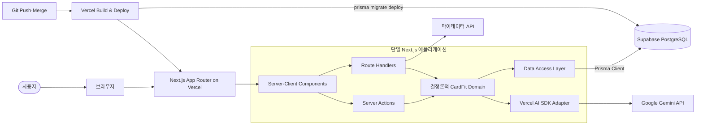

아키텍처 경계는 다음과 같이 강제한다.

- 브라우저는 업무 데이터베이스에 직접 접근하지 않는다.
- Prisma Client, DB URL, Gemini key, MyData secret은 서버 전용 모듈에서만 사용한다.
- Server Actions와 Route Handlers는 모두 공개 요청 경계로 취급하여 세션·인가·입력 검증을 수행한다.
- 혜택·조합·Net Benefit은 순수 TypeScript 도메인 로직으로 계산한다.
- AI는 확정된 Evidence DTO를 설명할 뿐 계산 값과 추천 조합을 생성하거나 변경하지 않는다.
- Prisma를 사용하는 Route Handler는 Node.js runtime을 사용하고 요청 간 메모리 공유를 전제로 하지 않는다.

### 8.9 기술 요구사항

| ID 범위 | 요구사항 | 핵심 인수 기준 |
| --- | --- | --- |
| **REQ-ARCH-001~008** | 단일 Next.js 앱, server-only 경계, Actions·Routes 역할 분리, 결정론적 도메인, 예약 작업 | 별도 백엔드 0개, `next build` 성공, Client bundle의 Prisma·비밀키 0건, 동일 입력 결과 해시 100% 일치 |
| **REQ-DATA-001~007** | Prisma schema·migration 기준선, Local Supabase, pooled/direct 연결 분리, 환경별 DB 격리 | `supabase start`·`prisma migrate dev/deploy` 성공, Preview의 Production DB 접근 0건 |
| **REQ-UI-001~005** | Tailwind·shadcn/ui·design token·공통 validation·접근성 | 임의 inline style과 비허용 arbitrary value 0건, WCAG 2.2 AA critical 오류 0건 |
| **REQ-AI-001~006** | AI SDK 표준 인터페이스, Gemini 기본, 환경 변수 교체, 계산 격리·fallback·마스킹 | 코드 변경 없는 model 교체, AI 장애 시 계산·근거 정상 제공, prompt의 직접 식별정보 0건 |
| **REQ-DEPLOY-001~007** | Vercel Git 배포, 별도 CI/CD 없음, migration·build, 환경 분리, health·Cron | Push는 Preview, Production Branch Merge는 Production 배포, 단계 실패 시 배포 중단 |
| **REQ-SEC-001~005** | 인증·소유권·서버 입력 검증·비밀정보·최소권한·감사 로그 | 타 사용자 데이터 접근 0건, `NEXT_PUBLIC_` 비밀키 0개, 감사 필드 누락 0건 |

개별 요구사항 식별자는 다음과 같다.

| ID | 요구사항 요약 |
| --- | --- |
| REQ-ARCH-001 | 실행 가능한 Next.js App Router 애플리케이션은 하나만 둔다 |
| REQ-ARCH-002 | Prisma와 비밀키 모듈은 server-only 경계에 둔다 |
| REQ-ARCH-003 | Server Actions는 UI 변경 명령에 사용한다 |
| REQ-ARCH-004 | 외부 HTTP 계약·스트리밍은 Route Handlers로 구현한다 |
| REQ-ARCH-005 | 카드 계산은 순수하고 결정론적인 TypeScript 도메인 함수로 구현한다 |
| REQ-ARCH-006 | Prisma 사용 경로는 Node.js runtime을 사용한다 |
| REQ-ARCH-007 | 예약 작업은 Vercel Cron이 보안 Route Handler를 호출하는 방식으로 구현한다 |
| REQ-ARCH-008 | 장시간 실행·상시 Worker·요청 간 메모리 상태 공유를 사용하지 않는다 |
| REQ-DATA-001 | Prisma schema를 관계형 모델의 기준선으로 사용한다 |
| REQ-DATA-002 | 로컬 개발은 Supabase CLI의 로컬 PostgreSQL을 사용한다 |
| REQ-DATA-003 | runtime pooler URL과 migration direct URL을 분리한다 |
| REQ-DATA-004 | Prisma Client를 서버 프로세스에서 안전하게 재사용한다 |
| REQ-DATA-005 | 모든 schema 변경을 Prisma migration으로 버전 관리한다 |
| REQ-DATA-006 | 계산 입력·Rule·결과를 불변 스냅샷으로 보존한다 |
| REQ-DATA-007 | Local·Preview·Production DB를 물리적으로 분리한다 |
| REQ-UI-001 | 제품 UI는 Tailwind CSS utility와 token을 사용한다 |
| REQ-UI-002 | 기본 상호작용 요소는 shadcn/ui 컴포넌트를 사용한다 |
| REQ-UI-003 | 색상·간격·radius를 design token으로 관리한다 |
| REQ-UI-004 | 클라이언트와 서버가 같은 입력 schema를 사용한다 |
| REQ-UI-005 | 핵심 흐름은 WCAG 2.2 AA를 충족한다 |
| REQ-AI-001 | AI 호출은 Vercel AI SDK 표준 인터페이스를 사용한다 |
| REQ-AI-002 | 기본 provider는 Google Generative AI로 한다 |
| REQ-AI-003 | provider·model을 환경 변수로 교체한다 |
| REQ-AI-004 | AI가 계산 값이나 추천 조합을 생성·수정하지 못하게 한다 |
| REQ-AI-005 | AI 장애 시 결정론적 계산·근거를 계속 제공한다 |
| REQ-AI-006 | AI prompt의 개인신용정보를 최소화·마스킹한다 |
| REQ-DEPLOY-001 | Git Push와 Merge가 Vercel 배포를 자동 생성한다 |
| REQ-DEPLOY-002 | 별도 배포용 CI/CD 서비스를 두지 않는다 |
| REQ-DEPLOY-003 | Vercel build에서 Prisma 생성·migration·Next build를 수행한다 |
| REQ-DEPLOY-004 | Preview·Production 환경 변수를 분리한다 |
| REQ-DEPLOY-005 | DB migration을 하위 호환 방식으로 작성한다 |
| REQ-DEPLOY-006 | 앱 버전과 DB 상태를 확인하는 health endpoint를 제공한다 |
| REQ-DEPLOY-007 | Cron endpoint는 `CRON_SECRET`을 검증하고 작업을 멱등 처리한다 |
| REQ-SEC-001 | 모든 Actions·Routes가 세션과 리소스 소유권을 검사한다 |
| REQ-SEC-002 | 모든 외부 입력을 서버 경계에서 검증한다 |
| REQ-SEC-003 | 비밀정보를 Vercel 환경 변수와 로컬 비추적 파일에만 둔다 |
| REQ-SEC-004 | runtime DB 계정과 migration 계정에 최소 권한을 적용한다 |
| REQ-SEC-005 | 계산·Rule 변경·외부 호출을 감사 로그에 남긴다 |

### 8.10 Next.js 인터페이스 배치

| 기능 | 구현 수단 | 경로·Action |
| --- | --- | --- |
| 미래지출·제약 저장 | Server Actions | `saveFutureSpend`, `saveConstraints` |
| 계산 실행 | Route Handler | `POST /api/calculations` |
| 근거 조회 | Route Handler | `GET /api/calculations/{id}/evidence` |
| AI 근거 설명 | Route Handler | `POST /api/calculations/{id}/explanation` |
| 조합 선택 | Server Action | `selectPlan` |
| 완주 응답 | Route Handler | `POST /api/outcomes/{id}/completion` |
| Rule 관리 | 관리자 Server Actions | `upsertBenefitRule` |
| 상태 확인 | Route Handler | `GET /api/health` |
| 30일 완주 대상·Rule 최신성 점검 | Vercel Cron → Route Handler | `GET /api/cron/outcomes`, `GET /api/cron/rules` |

모든 Route Handler와 Server Action은 사용자 세션과 리소스 소유권을 다시 검증한다. 클라이언트 검증 결과는 신뢰하지 않으며 서버에서 동일한 schema validation을 수행한다.

### 8.11 Prisma·Supabase 구현 기준

Prisma ORM 7.x 기준으로 runtime과 migration 연결을 분리한다. `schema.prisma`에는 PostgreSQL provider만 선언하고, `prisma.config.ts`는 `DIRECT_URL`을 사용한다. Next.js runtime의 Prisma Client는 Supabase pooler용 `DATABASE_URL`과 driver adapter를 사용한다.

```ts
// prisma.config.ts: CLI·migration direct 연결
export default defineConfig({
  schema: "prisma/schema.prisma",
  migrations: { path: "prisma/migrations" },
  datasource: { url: env("DIRECT_URL") },
});
```

```text
Local       → Local Supabase DB
Preview     → Preview Supabase DB
Production  → Production Supabase DB
```

`Calculation`에는 입력 스냅샷과 결과 해시를, `CalculationRuleSnapshot`에는 적용 Rule 원본과 version을 보존한다. `AIExplanation`은 provider·model·prompt version·설명·상태만 저장하며 계산 값의 원천이 될 수 없다.

### 8.12 AI·배포·검증 기준

Gemini는 Vercel AI SDK의 Google provider를 통해 호출한다. 기본 provider는 `google`이며 model은 `AI_MODEL`로 지정한다. timeout·429·5xx가 발생하면 AI 설명만 `unavailable`로 처리하고 6항목 이상의 결정론적 근거 화면을 계속 제공한다.

권장 Vercel build script는 다음과 같다.

```json
{
  "scripts": {
    "vercel-build": "prisma generate && prisma migrate deploy && next build"
  }
}
```

Preview와 Production은 서로 다른 `DATABASE_URL`, `DIRECT_URL`, Gemini key와 MyData 설정을 사용한다. Migration은 Expand → Data Migration → Contract 순서의 하위 호환 방식으로 작성한다. 다음 조건이 모두 충족되어야 기술 제약 구현이 완료된 것으로 판정한다.

- Local Supabase 초기화, migration, seed가 성공한다.
- Preview Push와 Production Merge가 각 환경 DB에만 migration·배포를 수행한다.
- 동일 입력과 Rule snapshot의 계산 결과 해시가 일치한다.
- Gemini 장애 상태에서도 계산과 근거 조회가 성공한다.
- 브라우저 bundle에 Prisma, DB URL, service role key, Gemini key가 포함되지 않는다.
- Route Handler 인증·소유권·입력 검증 및 핵심 E2E 테스트가 통과한다.

---

## 9. 검증 (Verification)

> 본 챕터는 예시 SRS 포맷의 범위를 벗어나는 PRD 내용을 다룬다. ISO/IEC/IEEE 29148:2018 §9.6.19(Verification) — "소프트웨어를 검증하기 위해 계획된 검증 접근법과 방법을 제공한다"는 규정을 근거로 추가했다.

### 9.1 북극성·보조 KPI 및 Guardrail

**북극성 KPI**

| 지표 | 정의(분자/분모) | 기준선 | 목표값 | 측정 경로 | 주기 |
| --- | --- | :---: | :---: | --- | :---: |
| 조합안 선택률 | 결과 화면 도달자 중 조합안을 저장·확정한 인원 수 ÷ 결과 화면 도달 인원 수("유지" 결론 대상자는 분모 제외) | 미측정 — E2로 확보 | ≥ 40%(중단선 20%) | `result_viewed`·`plan_selected` 이벤트 로그 | 주간 |

**보조 KPI**

| 지표 | 목표값 | 측정 경로 |
| --- | :---: | --- |
| 결론 도달 소요시간 p95 | ≤ 5분 | `onboarding_started`~`result_viewed` 타임스탬프 차 |
| 온보딩 완료율 | ≥ 60% | `onboarding_started`/`onboarding_completed` 이벤트 로그 |
| 근거 열람률 | ≥ 50% | `evidence_panel_opened` 클릭 로그 |
| 실행 완주율(측정 전용) | 목표 없음 — 실태 파악 | `POST /outcomes/{id}/completion` 응답 로그 |
| 이벤트 비종속 진입률 | ≥ 20% | `FutureSpendPlan.category` 자유입력 플래그 집계 |

**Guardrail** — REQ-NF-003·005·006·009 및 PRD 1장 참조. 하나라도 초과 시 롤아웃을 즉시 중단한다.

### 9.2 실험 로드맵

| 실험 | 가설 | 설계 | 성공 기준 |
| :---: | --- | --- | --- |
| E0 베이스라인 | 수기 계산 소요시간이 약 240분 수준이다 | n=15~20 스톱워치 실측·자기보고, E2 착수 전 완료 | 소요시간 분포(p50·p95) 확정 |
| E2 Concierge | 계산 결과를 받으면 조합안을 선택한다 | 혼인 모집 40 / 유효 30, 사람이 직접 계산. 근거 공개 유/무 2군 | 선택률 ≥ 40%(중단선 20%) |
| E1 인터뷰 | 미래 입력 의향이 실재한다 | 실제 사용자 n=15 | Job A 언급률 ≥ 60% |
| E3 A/B | REQ-FUNC-008이 온보딩 이탈을 줄인다 | n=500(250/250) | B군 ≥ 60% 및 A군 대비 +15%p |
| E4 회귀 | 규칙 엔진이 경계값에서 정확하다 | 경계값 케이스 ≥ 200건 | 오류율 ≤ 0.1%, 재계산 불일치 0건 |
| E5 벤치마크 | 조합 단위 계산이 경쟁 대안보다 정확하다 | 동일 스냅샷 n=20, 뱅크샐러드 vs CardFit | 3축 전부 우위, 순혜택 차액 > 0 케이스 ≥ 70% |
| E7a/E7b | 미완주 사유·비율을 안다 | 선택자/베타 선택자, 30일 후(개입 없음) | 목표 없음 — 실태 파악 |

### 9.3 중단 조건

- E0 미완료 = E2 착수 불가
- GR1 초과 또는 GR2·GR3·GR4 1건 = 즉시 중단
- E2 선택률 < 20% = A1 전제 재검토(피벗)
- E2 제외군("유지" 결론) 비율 > 30% = 북극성 산식 재설계
- E3 +15%p 미달 또는 수정률 비정상 = REQ-FUNC-008 재설계
- 마이데이터 인가·제휴 미확정 = 베타 진입 불가

---

## 10. 결론

CardFit MVP의 요구사항은 기능(REQ-FUNC 13건)·비기능(REQ-NF 9건)·제품 측정(REQ-METRIC 7건)·Guardrail(REQ-GR 6건)과 구현 기술 요구사항 38건으로 구분했다. PRD의 Story·AC는 5.3에서 요구사항과 테스트까지 추적하며, C-TEC-001~007은 8.7~8.12에서 기존 기능을 Next.js·Prisma·Supabase·Tailwind·shadcn/ui·Vercel AI SDK·Gemini·Vercel 배포 구조로 구현하는 의무 기준과 연결한다. 현재 스택 밖으로 판정된 외부 알림과 장시간 자동 수집은 구현 범위에서 제외하고, F-13은 Vercel Cron과 in-app 1회 노출로 구체화했다.

다만 베타 착수를 위해서는 세 가지가 선결되어야 한다 — ① 마이데이터 인가·제휴 확정(가정 A5, 8.4 의존성), ② Net Benefit 임계값(D2)과 계산식 세부 규칙 9개 항목 확정(8.5 체크리스트, ADR-003), ③ 감사 로그 보존정책·비용 예산 임계치 등 TBD로 표시된 항목의 승인(REQ-NF-007·008, REQ-FUNC-008 AC③). 이 조건이 충족되면 9장의 실험 로드맵(E0→E2)을 순서대로 진행해 북극성 KPI(조합안 선택률 ≥ 40%)를 검증하고, 이후 정식 개발에 착수한다.

본 SRS는 예시 SRS 문서(AD-Core-Platform)의 7섹션 포맷을 그대로 따르되, 그 포맷이 담지 못하는 PRD 내용(가정·제약·의존성, 검증 계획, 참고자료)만 ISO/IEC/IEEE 29148:2018 표준 조항을 근거로 8·9·11장에 한정 추가했다 — 표준 전체를 기계적으로 채운 완전판이 아니라, PRD 원문의 범위에 정확히 대응하는 확장이다.

---

## 11. 참고 자료 (References)

### 문서 개정 이력

| 버전 | 날짜 | 변경 내용 |
| --- | --- | --- |
| 1.0 | 2026-08-24 | 초기 확정 SRS 구조, 기능·비기능 요구사항과 핵심 다이어그램 작성 |
| 1.1 | 2026-08-24 | Mermaid Use Case, AC·KPI·Guardrail 추적성 및 C-TEC-001~007 구현 제약 통합 |
| 1.2 | 2026-08-24 | C-TEC-001~007을 의무 스택으로 명시하고 기능별 적합성·예외 및 Vercel Cron 기반 F-13 구현 확정 |

> 본 챕터는 예시 SRS 포맷의 범위를 벗어나는 PRD 내용을 다룬다. ISO/IEC/IEEE 29148:2018 §9.2.4(References) 및 §9.6.20(Supporting information) — "참조 문서 목록을 포함하고, 독자에게 도움이 되는 배경 정보를 제공한다"는 규정을 근거로 추가했다.

### 11.1 핵심 주장 ↔ 검증 매핑

| 주장 | 실험 설계 | 측정 지표 |
| --- | --- | --- |
| 판단 소요시간이 약 240분이다(기준선) | E0 베이스라인(n=15~20) | 소요시간 분포 p50·p95 |
| 판단 소요시간 240분 → p95 5분(약 48배 개선) | E0 + E2 | 결론 도달 소요시간 p95, 조합안 선택률 |
| 조합 단위 계산이 카드 1장 비교보다 정확도 우위 | E5 벤치마크(n=20) | 순혜택 차액 > 0 케이스 비율(≥70%) |
| REQ-FUNC-008이 온보딩 이탈을 줄인다 | E3 A/B(n=500) | 온보딩 완료율, 수정률 |
| 미래 지출 입력 의향이 실재한다 | E1 인터뷰(n=15) | Job A 언급률(≥60%) |
| 규칙 엔진이 경계값에서 정확하다 | E4 회귀(≥200건) | 오류율(≤0.1%), 재계산 불일치 0건 |
| 해지 실행 마찰이 실재한다 | 금감원 민원 통계 로그 분석 | 민원 건수(2022 6,720건→2025 12,661건, +88.4%) |
| 미래소비 반영 서비스가 시장에 없다 | 경쟁사 6곳 기능 실측 | 미래소비 반영 기능 보유 비율(0/6) |

### 11.2 출처 목록

- 원천 PRD: `PRD/PRD_CardFit_v1.0.md`
- 인터뷰/실험: E0~E7b(PRD 8장), E2 Concierge Test 결과 로그
- 로그: 금감원 민원 통계(2022~2025), 여신금융협회 월간 카드 통계
- 벤치마크: 경쟁사 유저플로우 실측 자료, E5 동일 스냅샷 n=20 비교표
- 다이어그램: `PRD/diagrams/usecase_diagram_cardfit_v0.1.svg` / `.png`
- Master Deck 제품 흐름: <https://github.com/jennie-brain/team-project_2nd/blob/main/master-deck/p21-23_To-Be_%EC%82%AC%EC%9A%A9%EC%9E%90%ED%9D%90%EB%A6%84_%ED%95%B5%EC%8B%AC%ED%99%94%EB%A9%B4.md>
- Master Deck 데이터·시스템: <https://github.com/jennie-brain/team-project_2nd/blob/main/master-deck/p24-25_%EB%8D%B0%EC%9D%B4%ED%84%B0_%EC%8B%9C%EC%8A%A4%ED%85%9C_%EC%A0%95%EC%B1%85_%EC%83%81%ED%83%9C_%EC%98%88%EC%99%B8_%EC%9A%B4%EC%98%81%EC%97%AD%ED%95%A0.md>
- Master Deck PRD·KPI: <https://github.com/jennie-brain/team-project_2nd/blob/main/master-deck/PRD/p26-29_PRD.md>, <https://github.com/jennie-brain/team-project_2nd/blob/main/master-deck/p30_KPI_%EA%B2%80%EC%A6%9D.md>
- Next.js App Router·Route Handlers: <https://nextjs.org/docs/app/getting-started/route-handlers>
- Next.js Server Actions·Backend for Frontend: <https://nextjs.org/docs/app/guides/backend-for-frontend>
- Supabase 로컬 개발: <https://supabase.com/docs/guides/local-development/cli/getting-started>
- Prisma·Supabase 연결 및 Prisma Config: <https://www.prisma.io/docs/orm/v6/overview/databases/supabase>, <https://docs.prisma.io/docs/orm/reference/prisma-config-reference>
- Tailwind CSS·shadcn/ui: <https://tailwindcss.com/docs/installation/framework-guides/nextjs>, <https://ui.shadcn.com/docs/installation/next>
- Vercel AI SDK Google Provider: <https://ai-sdk.dev/providers/ai-sdk-providers/google-generative-ai>
- Vercel Git 배포·환경 변수: <https://vercel.com/docs/git>, <https://vercel.com/docs/environment-variables>
- Vercel Cron Jobs·보안: <https://vercel.com/docs/cron-jobs>, <https://vercel.com/docs/cron-jobs/manage-cron-jobs>
