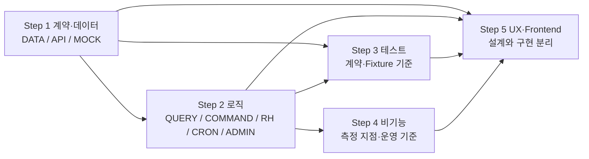

# GitHub Project 용 TASK 풀버전 추출 계획

## 개요

이 계획은 CardFit 최신 SRS를 구현 가능한 GitHub Project TASK로 변환하는 순서를 정의한다. 목적은 태스크 개수를 빠르게 늘리는 것이 아니라, 후행 태스크가 의존하는 계약을 먼저 고정하고 각 태스크의 입력·출력·차단 관계를 추적 가능하게 만드는 것이다. 이 문서 작성 시점에는 개별 TASK 본문을 생성하지 않는다.

## 목차

1. 기준선과 작성 원칙
2. 권장 추출 순서
3. 단계 간 상호작용
4. 단계별 사용자 확인 지점
5. 산출물 명명 규칙
6. 결론
7. 출처

## 1. 기준선과 작성 원칙

- 제품 기준선: `PRD/PRD_CardFit_v1.3.md`
- 구현 기준선: `SRS-Drafts/SRS_CardFit_v1.6_GPT-5.6-SOL.md`
- TASK 형식: `TASK/GitHub_Project_TASK_템플릿.md`
- 최초 구현 합격선: SRS의 `M1 저장 가능한 포트폴리오 MVP`
- M2·M3 요구사항은 M1의 필수 태스크와 분리하며, 후속 단계임을 명시한다.
- SRS의 `[TBD]`나 확정 필요 항목은 개발 태스크에 임의 값으로 숨기지 않고 결정 태스크 또는 Blocker로 기록한다.
- 각 단계가 끝날 때 사용자가 검토·승인한 뒤 다음 단계로 넘어간다.

## 2. 권장 추출 순서

| 단계 | 추출 영역 | 먼저 작성하는 이유 | 주요 산출물 | 다음 단계 착수 조건 |
|---|---|---|---|---|
| **Step 1** | 계약·데이터 (`DATA/API/MOCK`) | 프론트엔드·서버·테스트가 공유할 필드, 상태, 오류, Fixture를 먼저 고정한다. | Prisma 엔터티·상태전이 TASK, API/Server Action 계약 TASK, Mock Adapter·Fixture TASK | 엔터티 관계, 요청·응답, 오류 코드, Mock 시나리오의 충돌이 없어야 한다. |
| **Step 2** | 로직 (`QUERY/COMMAND/RH/CRON/ADMIN`) | Step 1 계약을 소비하는 계산·저장·조회·배치 작업의 실행 경계를 확정한다. | 계산 엔진, 조회 Query, 저장 Command, Route Handler, M2 Cron, Rule 관리 TASK | 각 로직이 소비·생성하는 계약과 REQ-FUNC가 연결되고 핵심 TBD가 Blocker로 드러나야 한다. |
| **Step 3** | 테스트 (`TEST`) | 계약과 로직이 정해진 뒤 정상·경계·실패·보안 회귀를 독립 검증 단위로 만든다. | 단위, 계약, 통합, E2E, Fixture 회귀 TASK | 모든 Must AC와 주요 실패 케이스에 검증 수단과 증거 위치가 있어야 한다. |
| **Step 4** | 비기능 (`NFR`) | 기능 경로가 정해진 뒤 성능·신뢰성·보안·비용의 측정 지점과 중단 조건을 배치한다. | 부하·오류율·최신성·비밀정보·비용·배포 검증 TASK | REQ-NF별 임계치, 관측 방법, 책임자, 실패 시 조치가 명확해야 한다. |
| **Step 5** | UX 설계·Frontend 구현 (`UX/UI`) | UX는 흐름·상태·카피를 결정하고 UI는 승인 명세를 코드로 구현한다. | UX 정보구조 TASK, 입력·결과·근거·이행 Frontend TASK | UX와 구현 책임이 분리되고 핵심 여정·접근성·모든 서버 상태 대응이 확인되어야 한다. |

## 3. 단계 간 상호작용



### 변경 전파 규칙

| 변경 발생 위치 | 반드시 다시 확인할 후행 영역 |
|---|---|
| Prisma 엔터티·상태전이 | API DTO, Mock Fixture, Query/Command, migration, 데이터 테스트 |
| API 요청·응답·오류 계약 | Route Handler, 프론트엔드 상태 처리, 계약 테스트, E2E |
| Mock Adapter 시나리오 | 계산 fallback, 최신성 경고, UI 빈 상태·부분 상태, 회귀 테스트 |
| 계산·게이팅 규칙 | 결과 DTO, Evidence, 배분, 성능 테스트, 결과 UI |
| REQ-NF 임계치 | 테스트 데이터 규모, 모니터링, DoD, 배포 중단 조건 |
| UI 사용자 흐름 | 필요한 Query/Command, 이벤트 계측, 접근성·E2E 시나리오 |

## 4. 단계별 사용자 확인 지점

### Step 1 확인

- CardFit이 저장하는 파생 데이터와 저장하지 않는 원본 금융 데이터의 경계가 분명한가?
- `정상·부분·오래됨·동의 만료·연결 해제·장애` 상태가 서로 구분되는가?
- 프론트엔드가 백엔드 완성 전에도 Mock만으로 모든 핵심 상태를 구현할 수 있는가?
- 실제 뱅크샐러드 연동을 추측하지 않고 Mock/Production Adapter 계약으로 분리했는가?

### Step 2 확인

- 미래지출 → 계산 → 유지·변경 판단 → 배분 → 근거의 핵심 가치 흐름이 끊기지 않는가?
- 결정론적 계산과 선택적 Gemini 설명이 분리되어 있는가?
- Server Action, Route Handler, Cron의 역할이 SRS 8.10과 일치하는가?
- SRS 8.5의 미확정 계산 규칙을 구현자가 임의 결정하지 않도록 차단했는가?

### Step 3 확인

- 모든 Must 요구사항에 정상 사례와 실패 사례가 각각 연결되는가?
- 동일 입력·동일 `rule_version` 결과 일치, 배분 합계, 근거 6항목을 자동 검증하는가?
- Mock과 Production Adapter가 같은 계약 테스트를 통과하도록 설계했는가?

### Step 4 확인

- p95 5초, 계산 오류율 0.1%, 오조회 0건, 데이터 최신성, 비용 상한을 실제로 측정할 수 있는가?
- 비밀정보와 Prisma 코드가 Client bundle에 포함되지 않는지 검증하는가?
- M1과 M2의 운영 기준을 섞어 M1 개발 범위를 불필요하게 키우지 않았는가?

### Step 5 확인

- 사용자가 미래지출 입력 후 현재 카드 유지 또는 변경 결론과 차액을 이해할 수 있는가?
- 계산 근거 6개 이상과 미반영 비용, 기준일, 오래된 데이터 경고가 보이는가?
- `유지 추천`을 실패나 미완주로 오인하지 않고 별도 결과로 표현하는가?
- 로딩·빈 상태·부분 데이터·오류·AI 설명 불가 상태에서도 핵심 계산 결과가 유지되는가?

## 5. 산출물 명명 규칙

개별 TASK 파일은 아래 규칙을 사용한다. 번호는 단계별 의존 순서에 따라 부여하고, 하나의 TASK에는 하나의 검증 가능한 결과만 둔다.

```text
TASK/{TYPE}-{NNN}_{기능-요약}.md
```

- 계약·데이터: `DATA`, `API`, `MOCK`
- 로직: `QUERY`, `COMMAND`, `RH`, `CRON`, `ADMIN`
- 테스트: `TEST`
- 비기능: `NFR`
- 화면·상호작용: `UI`

예시 파일명은 `TASK/API-001_계산-요청응답-계약.md`이다. GitHub Issue 번호는 실제 등록 후 `Dependencies & Interactions`에 별도로 기록한다.

## 6. 결론

권장 추출 순서는 `계약·데이터 → 로직 → 테스트 → 비기능 → UX 설계 → Frontend 구현`이다. 이 순서를 따르면 프론트엔드는 승인된 UX와 Mock 계약을 기반으로 작업하고, 후행 구현이 데이터 구조·상태 의미·카피를 다시 추측하는 일을 줄일 수 있다. 실제 구현은 수직 경로마다 Logic·UX·Frontend·Test·NFR을 병렬 진행한다.

## 7. 출처

- `SRS-Drafts/SRS_CardFit_v1.6_GPT-5.6-SOL.md`
- `PRD/PRD_CardFit_v1.3.md`
- `TASK/GitHub_Project_TASK_템플릿.md`
