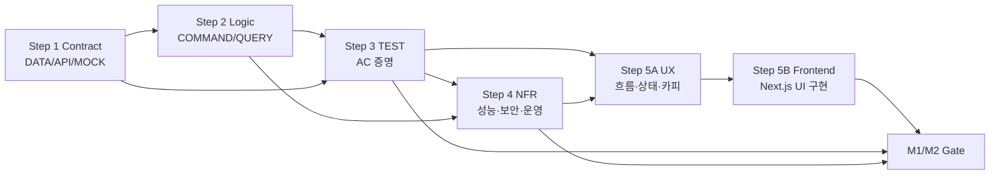

# Step 1~5 전체 TASK 의존성 매트릭스

## 개요

Step 1~5의 Contract→Logic→Test→NFR→UX→Frontend 연결을 GitHub Project의 `Depends on`과 `Blocks`로 옮기기 위한 기준표다. 문서 파일 ID는 GitHub Issue 발급 후 실제 Issue 번호로 치환한다.

## 핵심 실행 경로

## 요구사항별 6계층 체크

| REQ | Contract | Logic | Test | NFR | UX | Frontend | 판정 |
|---|---|---|---|---|---|---|---|
| 001A/B | DATA-001, API-002·006 | COMMAND-001, QUERY-001 | TEST-001·006 | NFR-004 | UX-002 | UI-003 | 충족 |
| 002 | DATA-001, API-001·006, MOCK-001 | COMMAND-002, QUERY-001 | TEST-001·005·006 | NFR-004 | UX-002 | UI-002·004 | 충족(M3 실제 계약 별도) |
| 003A/B | DATA-001, API-002·006 | COMMAND-001, QUERY-001 | TEST-001 | NFR-004 | UX-002 | UI-003 | 충족 |
| 004 | DATA-002, API-003·006 | COMMAND-003, QUERY-002 | TEST-002·006 | NFR-001·002 | UX-003 | UI-004·005 | 정책 확정 조건부 |
| 005 | DATA-002, API-003·006 | COMMAND-003·004, QUERY-002 | TEST-002·006 | NFR-001·002 | UX-003·005 | UI-005·007 | SRS 8.5 조건부 |
| 006 | DATA-002, API-003·006 | COMMAND-003, QUERY-002 | TEST-002·006 | NFR-002 | UX-004 | UI-006 | 충족 |
| 007 | DATA-002, API-003·006 | QUERY-002, COMMAND-009(M2) | TEST-003·006·007 | NFR-001·006 | UX-004 | UI-006 | 충족 |
| 008 | DATA-001, API-001·006 | QUERY-001 | TEST-001·007 | NFR-004·006 | UX-002 | UI-003 | M2 실험 |
| 009 | COMMAND-008 정책 계약, API-006 | COMMAND-008 검수, QUERY-001 | TEST-003·006 | NFR-004·006 | UX-001·002·004·005 | UI-002·006·007 | 승인 문구 조건부 |
| 010 | DATA-003, API-004~006, COMMAND-010 이벤트 계약, MOCK-001 | COMMAND-004~006·010, QUERY-003 | TEST-004·005·007 | NFR-003·004·006 | UX-005·006 | UI-007·008 | M2·승인 조건부 |
| 011 | DATA-002, API-003·006 | QUERY-002 | TEST-003 | NFR-001·004 | UX-003 | UI-005 | 동률 정책 조건부 |

## UX·Frontend 연결

| 사용자 흐름 | UX 설계 | Frontend 구현 | Logic | Test/NFR |
|---|---|---|---|---|
| 공통 기반 | UX-001 | UI-001 | 모든 Query/Command | TEST-005·006, REQ-UI-001~005 |
| 온보딩·입력 | UX-002 | UI-002·003 | COMMAND-001·002·008·010, QUERY-001 | TEST-001·003·006, NFR-004 |
| 계산 상태·결과 | UX-003 | UI-004·005 | COMMAND-003·010, QUERY-002·004 | TEST-002·006, NFR-001·002·005 |
| 배분·근거·선택 | UX-004·005 | UI-006·007 | QUERY-002, COMMAND-004·008~010 | TEST-003·005·006, NFR-001·004·006 |
| 이행 측정 | UX-006 | UI-008 | COMMAND-005·006·010, QUERY-003 | TEST-004·005·007, NFR-004·006 |
| 운영 | UX-007 | UI-009 | QUERY-004, COMMAND-007·010 | TEST-005·006·007, NFR-002~006 |

## 단계별 Gate

### M1 Gate

- DATA-001·002·004, API-001~003·005~007, MOCK-001의 M1 부분 완료
- COMMAND-001~004·007·008·010, QUERY-001·002·004의 M1 부분 완료
- TEST-001~003·005·006 통과
- NFR-001~006의 M1 기준 통과
- UX-001~005·007과 UI-001~007·009의 M1 범위 및 TEST-006 통과
- SRS 8.5 최소 계산 정책과 승인 문구 확정

### M2 Gate

- DATA-003, API-003~006과 COMMAND-010 이벤트 계약의 M2 부분 완료
- COMMAND-005·006·009·010, QUERY-001·003·004의 M2 부분 완료
- TEST-004·005·007 및 M1 회귀 통과
- NFR-003·004·006의 M2 기준 통과
- UX-004·006·007, UI-006·008·009의 M2 범위와 TEST-007 통과
- 후속 관측 목적·범위·보존 정책 승인

## AI 에이전트 Task 추출 체크리스트 판정

| 질문 | 확인 방법 | 현재 판정 |
|---|---|---|
| Contract가 있는가? | 모든 REQ가 DATA/API/MOCK 열에 매핑되는지 확인 | 충족 — 외부 정책·실제 통합 값은 Blocker로 유지 |
| Read/Write 로직이 분리됐는가? | 상태 변경은 COMMAND, 읽기 전용은 QUERY에 존재 | 충족 |
| 완료를 증명할 TEST가 있는가? | 모든 REQ가 TEST-001~007에 연결 | 충족 |
| 성능·보안 NFR이 있는가? | 각 기능이 관련 NFR과 TEST-005에 연결 | 충족 |
| UX와 Frontend가 분리됐는가? | UX-001~007은 설계, UI-001~009는 코드 구현에 한정 | 충족 |

## 외부 Blocker

- SRS 8.5 Net Benefit 정책 9개와 D2·D5·D6
- REQ-FUNC-011 동률 처리
- 관리자 역할·승인 문구·금지어 예외 승인자
- Production Adapter의 Identity·Consent·MyData·Catalog 계약
- M2 관측 목적·범위·보존기간·실제 카드 상태 의미 승인
- 실제 MyData 호출 비용

## 결론

Step 1~5는 모든 기능 요구사항을 Contract, Logic, Test, NFR, UX, Frontend의 여섯 계층으로 연결한다. UX 결정과 코드 구현을 분리하면서도 수직 경로에서는 병렬 진행할 수 있게 했다. M1은 핵심 가치 흐름을 우선하고 M2 자동화와 실제 통합은 별도 Gate로 분리한다. GitHub Issue 발급 후에는 이 표의 문서 ID를 Issue 번호로 바꾸고 Project의 선후 관계에 반영한다.

## 출처
- `SRS-Drafts/SRS_CardFit_v1.6_GPT-5.6-SOL.md`
- `TASK/STEP1_계약-데이터_TASK_인덱스.md`
- `TASK/STEP2_CQRS_로직_TASK_인덱스.md`
- `TASK/STEP3_AC_TEST_TASK_인덱스.md`
- `TASK/STEP4_NFR_의존성_TASK_인덱스.md`
- `TASK/STEP5_UIUX_TASK_인덱스.md`
