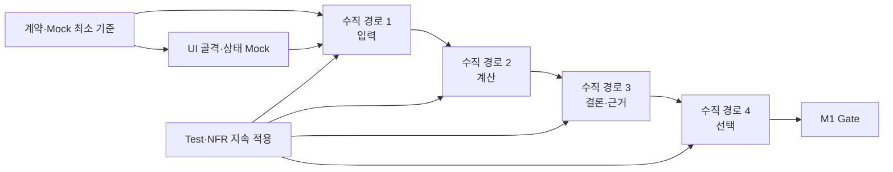

# CardFit 5단계 TASK 추출 체계 적절성 검토

## 개요

현재 체계인 `계약·데이터 → CQRS 로직 → 테스트 → 비기능 → UI/UX`가 CardFit 풀버전 TASK 추출에 적합한지 검토한다. 결론은 **TASK 문서를 누락 없이 추출하는 순서로는 적절하지만, 실제 개발을 완전히 직렬로 수행하는 순서로 사용하면 비효율적**이다.

## 목차

1. 종합 판정
2. 단계별 적절성
3. 추출 순서와 구현 순서의 차이
4. 체크리스트 충족도
5. 보완 운영 규칙
6. 결론
7. 출처

## 1. 종합 판정

| 평가축 | 판정 | 근거 |
|---|---|---|
| 계약 일관성 | 적절 | DATA/API/MOCK을 먼저 고정해 프론트·서버·테스트의 공통 기준을 만든다. |
| 로직 분해 | 적절 | Query와 Command를 분리해 조회·상태 변경·인가·트랜잭션 책임을 명확히 한다. |
| 검증 가능성 | 적절 | AC를 TEST TASK로 승격하고 로직 DoD에 역연결한다. |
| 품질·운영성 | 적절 | 성능·보안·가용성·비용을 독립 NFR과 Gate로 관리한다. |
| 사용자 가치 보존 | 조건부 적절 | UI를 마지막에 명세하되 UX 골격과 Mock 기반 작업은 계약 확정 직후 병렬 착수해야 한다. |
| 초급자·AI 개발 적합성 | 적절 | 작은 책임 단위와 명시적 의존성은 AI 생성 코드의 범위 이탈을 줄인다. 문서 수가 많아 M1/M2 필터가 필수다. |

## 2. 단계별 적절성

| 단계 | 장점 | 위험 | 판정·보완 |
|---|---|---|---|
| Step 1 계약·데이터 | 재작업과 Mock 불일치 감소 | 정책 미확정을 schema에 숨길 위험 | 적절. Open Decisions와 External Blocker 유지 |
| Step 2 CQRS 로직 | 상태 변경과 조회 책임 분리 | 작은 MVP에 과도한 계층·보일러플레이트 가능 | 적절. CQRS는 논리 분리로 적용하고 별도 서비스/서버는 만들지 않음 |
| Step 3 TEST | AC를 실행 증거로 전환 | 구현 완료 후 테스트를 작성하는 것으로 오해 가능 | 적절. TASK 추출은 3단계지만 코드는 각 로직과 TDD 병행 |
| Step 4 NFR | 비기능 누락 방지 | 마지막에 적용하면 구조 변경 비용 증가 | 적절. 추출은 4단계, 보안·성능 예산은 Step 1·2 구현 때 즉시 적용 |
| Step 5 UI/UX | 확정 계약을 기반으로 모든 상태 구현 | UI를 완전히 마지막에 만들면 가치 검증과 피드백 지연 | 조건부 적절. Wireframe·Mock UI는 Step 1 직후 병렬, 최종 연결·DoD만 Step 5 |

## 3. 추출 순서와 구현 순서의 차이

### TASK 추출 순서

```text
Contract → Logic → Test → NFR → UI/UX
```

누락을 통제하고 의존성을 문서화하기에 적합하다.

### 권장 실제 구현 순서



실제 코딩은 `입력→계산→결론·근거→선택`의 수직 경로별로 UI·Logic·Test·NFR을 함께 완료한다. 전체 Backend를 끝낸 뒤 UI를 시작하지 않는다.

## 4. AI 에이전트 체크리스트 충족도

| 체크 | 결과 | 근거 |
|---|---|---|
| Contract | 조건부 충족 | DATA 3·API 5·MOCK 1. 정책·실제 연동 미확정은 Blocker로 분리 |
| Logic | 충족 | COMMAND 8·QUERY 4 |
| Test | 충족 | TEST 7, 모든 REQ-FUNC 매핑 |
| NFR | 충족 | NFR 6, REQ-NF 9건 전체 매핑 |
| UI/UX | 충족 | UI 9, UX-V-001~008·REQ-UI-001~005 매핑 |

## 5. 보완 운영 규칙

1. **Step 0 결정 Gate를 별도 단계가 아닌 착수 조건으로 둔다.** Net Benefit 정책, 동률 규칙, 보존기간처럼 구현 결과가 달라지는 항목은 해결 전 관련 TASK를 `Blocked`로 둔다.
2. **M1 필터를 기본 View로 둔다.** M2·M3 TASK가 초급자 MVP의 작업량과 완료율을 왜곡하지 않게 한다.
3. **TDD는 Step 3 이후가 아니라 로직별 병행 실행한다.** Step 3은 테스트 TASK를 추출하는 순서일 뿐 테스트 코딩을 미루는 지시가 아니다.
4. **NFR budget을 Definition of Ready에도 넣는다.** 보안 경계·성능 예산·비용 한도를 구현 후반에 추가하지 않는다.
5. **UI 골격은 Mock과 함께 조기 검증한다.** Step 5 완료는 마지막이지만 Wireframe과 Fixture 기반 화면은 API 구현과 병렬로 진행한다.
6. **Issue 발급 후 문서 ID를 실제 Issue 번호로 치환한다.** Project의 `Depends on`·`Blocks`가 문서와 달라지지 않게 자동 또는 수동 감사한다.

## 6. 결론

5단계 체계는 CardFit SRS를 풀버전 GitHub TASK로 추출하는 데 적절하다. 특히 Contract→Logic→Test→NFR의 추적성은 AI 생성 결과의 누락과 범위 이탈을 줄인다. 다만 실제 개발에서는 UI, 테스트, NFR을 마지막까지 기다리면 안 된다. 계약과 Mock을 먼저 확정한 뒤 M1 수직 경로마다 Logic·UI·Test·NFR을 함께 완료하는 방식이 개발 속도와 사용자 가치 검증에 더 적합하다.

## 7. 출처
- `SRS-Drafts/SRS_CardFit_v1.6_GPT-5.6-SOL.md`
- `PRD/PRD_CardFit_v1.3.md`
- `TASK/STEP1_계약-데이터_TASK_인덱스.md`
- `TASK/STEP2_CQRS_로직_TASK_인덱스.md`
- `TASK/STEP3_AC_TEST_TASK_인덱스.md`
- `TASK/STEP4_NFR_의존성_TASK_인덱스.md`
- `TASK/STEP5_UIUX_TASK_인덱스.md`
