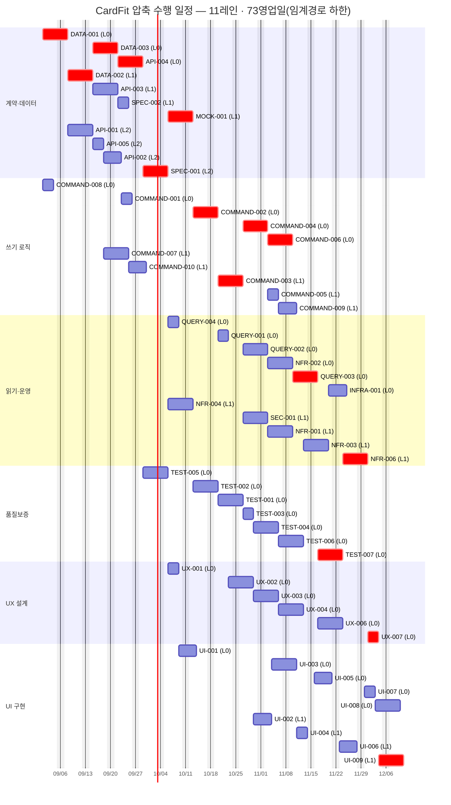

# [총괄] CardFit 압축 수행 일정

**문서 ID:** PLAN-CARDFIT-FAST-001

**개정 버전:** 2.0

**날짜:** 2026-08-26

**기본 계획:** PLAN-CARDFIT-MVP-001 (`02_총괄_개발_실행_계획.md` · 10레인 · 81영업일)

**근거 문서:** `TASK/task2/*.md`(54건), `02_총괄_개발_실행_계획.md` §2(의존성 구조)

> ⚙️ 이 문서는 기본 계획을 대체하지 않는다 — **일정을 최대한 병렬·독립적으로 압축했을 때 실제로 어디까지 당겨지는지**를 보여주는 대안이다. `02` §2.2의 간소화된(트랙 수준) 의존성 다이어그램을 기준으로, 임계 경로 하한(73영업일)까지 압축했을 때 필요한 레인 수·주차별 동시 작업량·인원 투입 곡선을 다시 계산했다. 개별 TASK 상세는 `TASK/task2/<TASK-ID>.md`를 따른다.

---

## 0. 이 문서를 언제 쓰는가

기본 계획(10레인 · 81영업일)이 표준이다. 아래 상황에서만 이 압축안을 검토한다.

- 출시일이 고정되어 있고 **8영업일을 줄여야** 할 때(81일 → 73일)
- M1 게이트 통과 시점을 앞당겨 의사결정을 빨리 받아야 할 때
- 인력을 일시 투입할 수 있고 투입 기간이 제한적일 때

압축의 효과는 **8영업일 단축**이며, 그 대가는 레인 10 → 11(주로 계약·데이터·UI 증편)과 §5의 리스크다.

---

## 1. 세 가지 편성안 비교

| 안 | 레인 | 완료 | 총 공수 | 평균 가동률\* | 성격 |
| --- | --- | --- | --- | --- | --- |
| **기본안**(`02`) | 10 | 81일 | 234pd | 64% | 트랙별 균등 배정(2·2·2·2·1·1) |
| **압축안**(본 문서) | **11** | **73일** | 234pd | **73%** | **임계 경로 하한 도달**, 워크로드 비례 배정(3·2·2·1·1·2) |
| 최대 병렬 | 17 | 73일 | 234pd | 69%\*\* | 참고 — 더 넣어도 안 빨라진다 |

\* 가동률 = 실제 작업 공수 ÷ (주차별 실사용 레인 수 × 5영업일의 합). \*\* 최대 병렬 시나리오는 명목 레인 17개 중 실제 동시 사용 최대치는 8개뿐이다.

> ⚠️ **압축안이 기본안보다 가동률도 더 높다.** 보통은 압축할수록 유휴가 늘지만, 기본안(`02`)의 트랙별 2·2·2·2·1·1 배정은 워크로드(계약·데이터 49d, 품질보증 33d, UI 37d)에 비례하지 않는다 — 품질보증에 과잉 배정하고 계약·데이터·UI에는 과소 배정했다. 압축안의 3·2·2·1·1·2 배정이 실제 병목과 더 잘 맞아 **더 빠르면서 더 효율적**이다. `02`의 레인 배정을 이 비율로 조정하는 것도 별도 검토 대상이다.

### 왜 73일 밑으로 못 가는가

**임계 경로가 73영업일**이기 때문이다. 이 사슬은 전부 선후 관계로 묶여 있어 동시에 할 수 없다. 인원을 아무리 늘려도 결과는 같다(위 "최대 병렬" 행 참고).

```mermaid
flowchart LR
  DATA001["DATA-001<br/>5d"]:::ctr
  DATA002["DATA-002<br/>5d"]:::ctr
  DATA003["DATA-003<br/>5d"]:::ctr
  API004["API-004<br/>5d"]:::ctr
  SPEC001["SPEC-001<br/>5d"]:::ctr
  MOCK001["MOCK-001<br/>5d"]:::ctr
  COMMAND002["COMMAND-002<br/>5d"]:::wr
  COMMAND003["COMMAND-003<br/>5d"]:::wr
  COMMAND004["COMMAND-004<br/>5d"]:::wr
  COMMAND006["COMMAND-006<br/>5d"]:::wr
  QUERY003["QUERY-003<br/>5d"]:::rd
  TEST007["TEST-007<br/>5d"]:::tst
  NFR006["NFR-006<br/>5d"]:::rd
  UX007["UX-007<br/>3d"]:::dsg
  UI009["UI-009<br/>5d"]:::ui
  DATA001 --> DATA002
  DATA002 --> DATA003
  DATA003 --> API004
  API004 --> SPEC001
  SPEC001 --> MOCK001
  MOCK001 --> COMMAND002
  COMMAND002 --> COMMAND003
  COMMAND003 --> COMMAND004
  COMMAND004 --> COMMAND006
  COMMAND006 --> QUERY003
  QUERY003 --> TEST007
  TEST007 --> NFR006
  NFR006 --> UX007
  UX007 --> UI009
  classDef ctr fill:#f8d7da,stroke:#dc3545
  classDef wr fill:#d1e7dd,stroke:#198754
  classDef rd fill:#e7f1ff,stroke:#0d6efd
  classDef tst fill:#ede7f6,stroke:#7e57c2
  classDef dsg fill:#fce4ec,stroke:#ec407a
  classDef ui fill:#e0f2f1,stroke:#009688
```

**15단계 · 73영업일.** 압축안은 이 하한에 정확히 도달했으므로 더 줄일 방법은 인원이 아니라 §6의 범위·구조 변경뿐이다.

### 최소 레인 도출

트랙당 1레인(6레인)에서 시작해, 완료일이 가장 많이 줄어드는 트랙에 한 레인씩 늘려 갔다.

| 단계 | 편성 | 완료 | 단축 |
| --- | --- | --- | --- |
| 균등 배정 | 6레인(전 트랙 1) | 110일 | — |
| 계약·데이터 +1 | 7레인 | 94일 | −16일 |
| 읽기·운영 +1 | 8레인 | 84일 | −10일 |
| UI 구현 +1 | 9레인 | 79일 | −5일 |
| 계약·데이터 +1 | 10레인 | 76일 | −3일 |
| 쓰기 로직 +1 | 11레인 | **73일**(하한) | −3일 |

**품질보증·UX 설계는 늘리지 않았다** — 두 트랙은 임계 경로를 제약하지 않는다. 늘려도 완료일이 바뀌지 않으므로 순수 비용이다.

---

## 2. 압축 수행 Gantt

같은 시각에 여러 레인이 차 있으면 그만큼 병렬로 진행된다. `crit`(붉은 계열)이 임계 경로 위 TASK다.

시작 2026-09-01 · 완료 **2026-12-11**(약 15주).

---

## 3. 동시 작업 프로파일

압축의 효과가 어느 구간에 몰려 있는지 보여준다. "지금부터 병렬·독립적으로 진행할 수 있는 범위"를 주차 단위로 읽는다.

| 주차 | 시작일 | 동시 작업 | 착수 TASK | 투입 필요(트랙별 레인 수) |
| --- | --- | ---: | --- | --- |
| W1 | 2026-09-01 | 2 | `COMMAND-008`, `DATA-001` | 계약·데이터 1 · 쓰기 로직 1 |
| W2 | 2026-09-08 | 2 | `API-001`, `DATA-002` | 계약·데이터 2 |
| W3 | 2026-09-15 | 5 | `API-002`, `API-003`, `API-005`, `COMMAND-007`, `DATA-003` | 계약·데이터 3 · 쓰기 로직 1 |
| W4 | 2026-09-22 | 6 | `API-004`, `COMMAND-001`, `COMMAND-010`, `SPEC-002` | 계약·데이터 3 · 쓰기 로직 2 |
| W5 | 2026-09-29 | 3 | `SPEC-001`, `TEST-005` | 계약·데이터 1 · 쓰기 로직 1 · 품질보증 1 |
| W6 | 2026-10-06 | 5 | `MOCK-001`, `NFR-004`, `QUERY-004`, `UI-001`, `UX-001` | 계약·데이터 1 · 읽기·운영 2 · UX 설계 1 · UI 구현 1 |
| W7 | 2026-10-13 | 3 | `COMMAND-002`, `TEST-002` | 쓰기 로직 1 · 품질보증 1 · UI 구현 1 |
| W8 | 2026-10-20 | 4 | `COMMAND-003`, `QUERY-001`, `TEST-001`, `UX-002` | 쓰기 로직 1 · 읽기·운영 1 · 품질보증 1 · UX 설계 1 |
| W9 | 2026-10-27 | 8 | `COMMAND-004`, `QUERY-002`, `SEC-001`, `TEST-003`, `TEST-004`, `UI-002`, `UX-003` | 쓰기 로직 1 · 읽기·운영 2 · 품질보증 1 · UX 설계 1 · UI 구현 1 |
| W10 | 2026-11-03 | **11** | `COMMAND-005`, `COMMAND-006`, `COMMAND-009`, `NFR-001`, `NFR-002`, `TEST-006`, `UI-003`, `UX-004` | 쓰기 로직 2 · 읽기·운영 2 · 품질보증 1 · UX 설계 1 · UI 구현 2 |
| W11 | 2026-11-10 | 8 | `NFR-003`, `QUERY-003`, `UI-004`, `UI-005` | 쓰기 로직 1 · 읽기·운영 2 · 품질보증 1 · UX 설계 1 · UI 구현 2 |
| W12 | 2026-11-17 | 6 | `INFRA-001`, `TEST-007`, `UI-006`, `UX-006` | 읽기·운영 2 · 품질보증 1 · UX 설계 1 · UI 구현 2 |
| W13 | 2026-11-24 | 4 | `NFR-006`, `UI-007` | 읽기·운영 2 · UI 구현 2 |
| W14 | 2026-12-01 | 4 | `UI-008`, `UI-009`, `UX-007` | UX 설계 1 · UI 구현 2 |
| W15 | 2026-12-08 | 2 | - | UI 구현 2 |

### 압축이 통하는 구간과 통하지 않는 구간

- **W3~W4, W9~W11 — 압축이 통한다.** 동시 작업이 6~11건까지 오른다(피크 W10). 인원을 넣으면 실제로 빨라진다.
- **W1~W2, W13 이후 — 압축이 통하지 않는다.** 동시 작업이 2~4건으로 떨어진다. `DATA-001 → DATA-002`, `NFR-006 → UX-007 → UI-009`처럼 순수 직렬 구간이라 인원을 넣어도 대기만 늘어난다.

**그래서 인원을 상시 유지할 필요가 없다.** 아래 §4의 투입 곡선을 따른다.

---

## 4. 인원 투입 곡선

주차별로 실제 필요한 레인 수다. 압축안의 명목 레인은 11개지만 전 기간 유지할 필요는 없다 — 피크는 W10의 8레인이다.

| 주차 | 계약·데이터 | 쓰기 로직 | 읽기·운영 | 품질보증 | UX 설계 | UI 구현 | 합계 |
| --- | ---: | ---: | ---: | ---: | ---: | ---: | ---: |
| W1 | 1 | 1 | - | - | - | - | **2** |
| W2 | 2 | - | - | - | - | - | **2** |
| W3 | 3 | 1 | - | - | - | - | **4** |
| W4 | 3 | 2 | - | - | - | - | **5** |
| W5 | 1 | 1 | - | 1 | - | - | **3** |
| W6 | 1 | - | 2 | - | 1 | 1 | **5** |
| W7 | - | 1 | - | 1 | - | 1 | **3** |
| W8 | - | 1 | 1 | 1 | 1 | - | **4** |
| W9 | - | 1 | 2 | 1 | 1 | 1 | **6** |
| W10 | - | 2 | 2 | 1 | 1 | 2 | **8** |
| W11 | - | 1 | 2 | 1 | 1 | 2 | **7** |
| W12 | - | - | 2 | 1 | 1 | 2 | **6** |
| W13 | - | - | 2 | - | - | 2 | **4** |
| W14 | - | - | - | - | 1 | 2 | **3** |
| W15 | - | - | - | - | - | 2 | **2** |

**레인×기간 = 320 person-day 확보 필요**(실제 작업 234pd · 유휴 86pd, 가동률 73%). 기본안(`02`)은 365 person-day 확보에 유휴 131pd(가동률 64%)다 — 압축안이 더 빠르면서 확보해야 할 여유 인력도 더 적다.

### 투입·철수 권고

| 시점 | 조치 | 근거 |
| --- | --- | --- |
| W1 시작 | 계약·데이터 1 · 쓰기 로직 1 전원 투입 | `DATA-001`이 17건을 막고, `COMMAND-008`은 선행 없이 즉시 착수 가능 |
| W2~W4 | 계약·데이터 3레인 전원 가동 | 계약 확정 구간. 여기서 밀리면 이후 전부 밀린다(§1) |
| W5~W6 | **계약·데이터 2레인 철수** | `MOCK-001`을 끝으로 계약 트랙 작업이 소진된다 |
| W9~W11 | **쓰기 로직·읽기·운영·UI 풀가동** | 동시 작업 피크 구간(§3) |
| W13 이후 | **읽기·운영·쓰기 로직 철수, UI 구현만 유지** | `NFR-006 → UX-007 → UI-009`가 순수 직렬 사슬로 넘어간다 |

---

## 5. 압축의 대가

일정 8일을 줄이는 대신 아래를 감수한다.

| 항목 | 기본안(`02`) | 압축안 | 영향 |
| --- | --- | --- | --- |
| 레인 | 10 | 11 | +1(계약·데이터+1, UI 구현+1, 품질보증−1) |
| 완료 | 81일 | 73일 | **−8일** |
| 확보 공수 | 365pd | 320pd | 절감 45pd |
| 평균 가동률 | 64% | 73% | 오히려 개선(§1 참고) |

### 정량 외 리스크

| 리스크 | 왜 압축에서 커지는가 | 완화 |
| --- | --- | --- |
| 리뷰 병목 | 동시 작업 최대 11건(W10) → PR이 몰린다 | 임계 경로 위 TASK(§1 다이어그램의 15건)를 리뷰 최우선으로 |
| 통합 충돌 | 계약·데이터 3레인이 같은 시기에 `DATA`·`API`·`SPEC` 여러 계약을 동시 작업 | 계약 변경은 한 레인이 소유하고 나머지는 소비자 PR로 뒤따른다(`02` §1.5) |
| 온보딩 비용 | 추가 인력이 SRS·PRD·계약 체계를 익혀야 한다 | W1~W2를 온보딩 겸 착수 구간으로 두되, 이 문서의 일정에는 반영되지 않음 — 별도 버퍼 필요 |
| 유휴 인원 | W13 이후 계약·데이터·쓰기 로직·품질보증이 소진된다 | §4 투입 곡선대로 철수. 상시 11레인이면 압축 이득이 사라진다 |

> ⚠️ 온보딩 시간이 일정에 없다. §1의 −8일은 추가 인력이 즉시 생산성을 낸다는 가정이다. 이미 이 프로젝트 맥락(SRS·정책·계약 상태)을 아는 인력을 투입할 때만 압축이 성립한다.

---

## 6. 73일보다 더 줄이려면

레인으로는 불가능하다(§1 "왜 73일 밑으로 못 가는가"). 남는 방법은 임계 경로 자체를 짧게 만드는 것뿐이다.

| 방법 | 대상 | 대가 |
| --- | --- | --- |
| **M2 범위 재검토** — 임계 경로 15건 중 `COMMAND-006`(이행 관측), `QUERY-003`(이행 조회), `TEST-007`(M2 E2E), `NFR-006`(M2 확장), `UX-007`·`UI-009`(관리자, M2 확장분)는 `01` 기준 M2 이후 확장 범위와 맞닿아 있다 | 임계 경로 후반부 | M1과 M2 체크포인트가 하나의 TASK 안에 섞여 있어(`01` §8) 정확한 단축량은 별도로 M1 전용 DAG를 다시 계산해야 확정된다 — 이 문서에서 숫자를 단정하지 않는다 |
| **태스크 재분해** — `DATA-001`(5d)을 엔터티/상태·보관 경계로 분리 | 임계 경로 최상류, 후행 17건 | 재분해 비용과 재작업 위험 — `DATA-001`은 병목 1위(`02` §2.5)라 신중해야 한다 |
| **선행 완화** — `COMMAND-006`이 `API-001·004·005`를 모두 선행으로 갖는데 실제 필요한 것만 남기면 단축 가능 | 임계 경로 중반 | Adapter 계약을 부분적으로만 승인한 상태로 진행해야 해 리스크가 있다 |
| **정책 선점** — Net Benefit 정책 9개(SRS 8.5)를 L0~L4 구간에 미리 확정 | `COMMAND-003` 착수 지연 제거 | `02` §1.3에 이미 반영된 전제이며, 미확정 시 오히려 늘어난다 |

**가장 확실한 방향은 M2 범위 재검토다.** 임계 경로 73일 중 마지막 6단계(`COMMAND-006` ~ `UI-009`, 총 28일)가 M2/관리자 확장과 맞닿아 있어, M1 게이트만 목표로 하면 실제 체감 완료 시점은 더 당겨질 가능성이 크다. 정확한 수치는 M1 전용 부분 DAG를 다시 계산한 뒤 이 문서에 반영한다.

---

## 7. 권고

1. **기본안(`02`, 10레인 · 81일)을 표준으로 유지한다.** 리뷰·통합 부담이 작다.
2. 출시일 압박이 실재할 때만 압축안(11레인 · 73일)을 채택하고, **§4 투입 곡선대로 W13 이후 철수**한다. 상시 11레인이면 압축 이득이 사라진다.
3. **17레인 편성은 채택하지 않는다.** 11레인과 완료일이 같고 가동률만 낮아진다.
4. 압축을 택하면 **온보딩 버퍼를 별도로** 잡는다. 그러지 않으면 −8일이 장부상 숫자로만 남는다.
5. `02`의 기본 레인 배정(2·2·2·2·1·1)을 이 문서의 워크로드 비례 배정(3·2·2·1·1·2)으로 조정하는 안을 다음 개정에서 검토한다 — 레인 수를 늘리지 않고도 기본안 자체를 더 효율적으로 만들 수 있다.
6. 더 큰 단축이 필요하면 레인이 아니라 **M2 범위를 재검토**한다(§6).

---

## Decision Log

### 2026-08-26 — 03을 압축 수행 일정으로 재작성(v2.0)

- 결정: 기존 "간소화 병렬 실행 Gantt 로드맵"(작업 묶음 기준 한눈보기)을 폐기하고, `02_총괄_개발_실행_계획.md`의 정본 의존성 데이터를 그대로 이어받아 **압축 수행 일정**(레인을 늘렸을 때 임계 경로 하한까지 어디까지 당겨지는지)으로 재작성한다.
- 근거: 기존 문서는 `02` 재작성(2026-08-26) 이후 재동기화되지 않은 상태였고, 사용자는 "지금부터 병렬·독립적으로 진행할 수 있는 범위를 한눈에 보여주는" 문서를 요청했다 — 이는 작업 묶음 나열보다 레인 증설에 따른 압축 한계(임계 경로)와 주차별 동시 작업량을 보여주는 편이 더 직접적으로 답한다.
- 수행: 6레인(트랙당 1)에서 시작해 완료일 감소가 가장 큰 트랙에 순차로 레인을 늘려 임계 경로 하한(73영업일)까지 도달하는 최소 레인 조합(11레인: 계약·데이터3·쓰기 로직2·읽기·운영2·품질보증1·UX 설계1·UI 구현2)을 계산하고, 이 편성의 Gantt·주차별 동시 작업·인원 투입 곡선을 생성했다.
- 영향: 이 압축안이 기본안(`02`, 10레인)보다 빠르면서 가동률도 높다는 사실을 확인했다(§1). `02`의 레인 배정을 조정할지는 별도 결정 사항으로 남긴다.

## 출처

- `TASK/task1/02_총괄_개발_실행_계획.md`
- `TASK/task1/01_전체_TASK_목록_및_기준선.md`
- `TASK/task2/*.md`(54건)

---

**PLAN-CARDFIT-FAST-001 · v2.0 · 2026-08-26 · 11레인 · 73영업일 · 임계경로 하한 도달**
