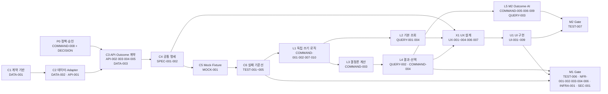
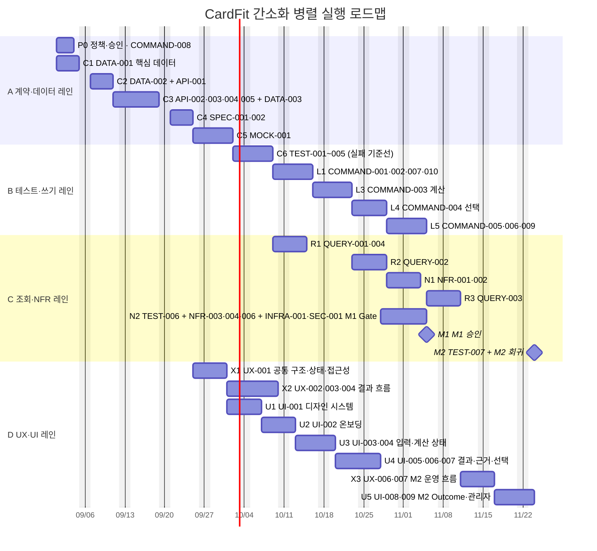

# CardFit 간소화 병렬 실행 Gantt 로드맵

## 목적

이 문서는 [총괄 개발 실행 계획](02_총괄_개발_실행_계획.md)의 상세 DAG를 실행 그룹 단위로 압축한 한눈보기용 로드맵이다. 막대 하나는 새 TASK가 아니라, `TASK/task2`의 상세 TASK 여러 개를 같은 의존성 구간에서 병렬로 실행하는 **작업 묶음**이다.

> ⚠️ 2026-08-26 기준 `02_총괄_개발_실행_계획.md`가 task2 정본을 직접 대조해 DAG·Wave·Gantt를 다시 계산했다. 이 문서의 그룹·묶음·날짜는 아직 그 결과와 재동기화되지 않았으므로, 두 문서가 다를 경우 `02`를 정본으로 따른다.

기준 일정은 2026년 9월 1일 착수, 주 5일, 최대 4개 작업 레인이다. 실제 착수일이나 인원 수가 달라지면 날짜만 이동하고 그룹 간 선행 관계는 유지한다.

## 1. 한눈에 보는 의존성 DAG

### 읽는 법

- 같은 열 또는 같은 기간에 겹쳐 있는 작업 묶음은 병렬 실행 대상이다.
- 화살표가 없는 두 묶음은 직접 의존하지 않으므로 서로 독립적인 레인에서 진행할 수 있다.
- `X1`은 Query 구현 완료까지 기다리지 않고 승인된 `SPEC-001` ViewModel 계약으로 시작한다.
- `U1`은 UX 승인 후 시작한다. UX 설계와 서버 Logic은 서로의 직접 선행 조건이 없는 범위에서 병렬이다.
- M1 Gate는 M2 Outcome·AI 묶음과 분리한다. M2 지연이 M1 시연을 자동으로 차단하지 않는다.
- `INFRA-001`(배포·마이그레이션·rollback)과 `SEC-001`(입력 검증·마스킹)은 각각 NFR-003과 NFR-004 확보 직후 시작하는 M1 Gate 구성 TASK다. 두 TASK 모두 별도 묶음 대신 `N2`(M1 Gate) 묶음에 포함해 관리한다.

## 2. 한눈보기 Gantt

범례: `P` = 병렬 묶음, `→` = 직접 선행, `M1/M2` = 마일스톤 검증.

## 3. 병렬 실행 그룹 정의

| 그룹 | 포함 상세 TASK | 직접 선행 | 병렬 가능 범위 | 결과 |
| --- | --- | --- | --- | --- |
| P0 | COMMAND-008 | 승인 책임자·문구 초안 | C1과 병렬 | 정책 계약 |
| C1 | DATA-001 | 없음 | P0과 병렬 | 핵심 데이터 계약 |
| C2 | DATA-002, API-001 | C1 | 서로 병렬 | 계산·Adapter 계약 |
| C3 | API-002~005, DATA-003 | C2, 정책 | API별 내부 병렬 | 외부·Outcome 계약 |
| C4 | SPEC-001, SPEC-002 | C3, KPI 승인 | 두 SPEC 병렬 | ViewModel·이벤트 계약 |
| C5 | MOCK-001 | C4 | 단독 | Fixture·Mock |
| C6 | TEST-001~005 | C5, Decision | 다섯 테스트 병렬 | 실패 기준선 |
| L1 | COMMAND-001, 002, 007, 010 | C6 또는 SPEC-002 | 네 Command 병렬 | 입력·동기화·Rule·이벤트 |
| R1 | QUERY-001, QUERY-004 | L1 일부 | 두 Query 병렬 | 온보딩·운영 조회 |
| L3 | COMMAND-003 | L1, 계산 정책 | 단독 H 작업 | 계산 엔진 |
| R2 | QUERY-002 | L3 | 단독 | 결과·근거 조회 |
| L4 | COMMAND-004 | L3, R2 | 단독 | 선택 기준선 |
| L5 | COMMAND-005, 006, 009, QUERY-003 | L4/R2 | Outcome·AI 내부 병렬 | M2 Logic |
| X1 | UX-001 | C4, P0 | R1·L3과 병렬 | 공통 UX |
| X2 | UX-002, 003, 004 | X1, API 계약 | 흐름별 순차 | M1 wireflow |
| U1~U4 | UI-001~007 | X1/X2와 해당 Logic·Query | 화면 흐름 순차, 서버 레인과 병렬 | M1 UI |
| N1 | NFR-001, NFR-002 | L3/R2, TEST-002·003 | 두 NFR 병렬 | 계산 성능·신뢰성 |
| N2 | NFR-003, NFR-004, NFR-006, INFRA-001, SEC-001 | M1 Logic·TEST-005·006, DATA-001~003, API 계약·SPEC-001 | NFR·INFRA·SEC 병렬 | 배포·보안·비용·마이그레이션·입력검증 |
| X3/U5 | UX-006·007, UI-008·009 | R3, N2 | Outcome·관리자 병렬 | M2 UI |
| M1/M2 | TEST-006, TEST-007 | 각각 해당 UI·Logic·NFR | Gate는 병렬 작업 종료 후 검증 | 릴리스 판정 |

## 4. 전체 TASK 커버리지

이 로드맵의 막대는 묶음 표시지만, 아래 접두사별 개수가 `TASK/task2`의 상세 문서 전체를 포함한다.

| 영역 | TASK ID 범위 | 개수 | 배치 그룹 |
| --- | --- | ---: | --- |
| 데이터 | DATA-001~003 | 3 | C1~C3 |
| API | API-001~005 | 5 | C2~C3 |
| 명세 | SPEC-001~002 | 2 | C4 |
| Mock | MOCK-001 | 1 | C5 |
| Command | COMMAND-001~010 | 10 | P0, L1, L3~L5 |
| Query | QUERY-001~004 | 4 | R1~R3 |
| Test | TEST-001~007 | 7 | C6, M1/M2 |
| NFR | NFR-001~004, NFR-006 | 5 | N1~N2 |
| UX | UX-001~004, UX-006~007 | 6 | X1~X3 |
| UI | UI-001~009 | 9 | U1~U5 |
| 인프라 | INFRA-001 | 1 | N2 |
| 보안 | SEC-001 | 1 | N2 |
| **합계** |  | **54** |  |

## 5. 병렬 실행 시 주의사항

- 병렬이라는 이유로 같은 Prisma schema, DTO, 상태 enum을 여러 레인이 동시에 변경하지 않는다. 계약 변경은 C 레인이 소유한다.
- `UI-002→UI-003→UI-004→UI-005→UI-006→UI-007`은 사용자 상태 전이가 이어지므로 화면 TASK를 임의로 병렬화하지 않는다.
- `TEST-001~005`는 구현 전에 실패 기준선을 고정하고, Logic 구현 후 같은 테스트를 재실행한다.
- `TEST-006`은 UI를 선행하는 작업이 아니라 M1 통합 Gate다.
- M2의 `COMMAND-005·006·009`, `QUERY-003`, `UX-006·007`, `UI-008·009`는 M1 핵심 경로와 독립 레인으로 진행한다.
- 정책 미승인 상태에서는 테스트 expected 값이나 계산 기본값을 임의로 확정하지 않고 `Blocked`로 둔다.

## 6. 일정 변경 규칙

- 시작일이 바뀌면 Gantt의 첫 날짜만 이동한다.
- 작업자 수가 4명보다 적으면 각 레인의 막대를 순차화하고, 의존성 DAG는 변경하지 않는다.
- 작업자 수가 늘어도 Contract·Data 레인의 완료 전에는 후행 Logic을 조기 착수하지 않는다.
- TASK가 변경되면 이 문서의 그룹 정의와 전체 TASK 커버리지 표를 함께 갱신한다.

## 근거 문서

- [총괄 개발 실행 계획](02_총괄_개발_실행_계획.md)
- [상세 TASK 폴더](../task2)
