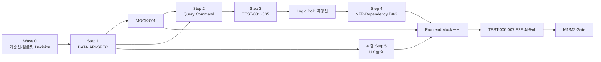

# CardFit TASK 품질검토·감사·단계별 판정 보고서

## 기술 요약

현재 CardFit TASK 체계는 사용자가 제시한 표준 방법론의 네 영역인 `Contract/Data`, `Query/Command`, `Test`, `NFR/Dependency`를 모두 갖추고 있다. 개별 개발 TASK 파일은 현재 **50개**이며, 50개 모두 공통 템플릿의 핵심 11개 섹션을 포함한다. 따라서 TASK 유형의 누락보다 **기준선 정합성과 실행 순서의 교정**이 우선이다.

다만 현재 상태를 그대로 풀버전 작성 기준선으로 사용하기에는 세 가지 문제가 있다.

1. `MOCK-001`이 Query ViewModel과 `COMMAND-010` 이벤트 계약에 의존하지만, Query와 Command는 Step 2에 배치되어 Step 1을 독립적으로 완료할 수 없다. 일부 경로에서는 `MOCK-001 → COMMAND-002 → QUERY-001 ViewModel → MOCK-001` 형태의 순환 가능성도 생긴다.
2. 제거된 계약 TASK의 책임을 다른 TASK로 이동했지만 `API-003·006`, `NFR-004·005·006`, `UX-004·005`처럼 존재하지 않는 ID를 의미하는 축약 참조가 남아 있다. 문서 간 의존성 기준선이 하나로 수렴하지 않았다.
3. 템플릿에는 Summary, AC, DoD와 의존성은 있으나 `Reads`, `Writes`, `Side Effects`, `Transaction Boundary`, `Idempotency`, `Test Gate`, `NFR Gate`, `Decision Log`가 독립 필드로 강제되지 않는다. 현재 14개 Query·Command는 모두 TEST를 참조하지만, 멱등성을 명시한 문서는 4개에 그친다.

따라서 권장 조치는 다음과 같다.

- 먼저 템플릿과 Contract Registry를 수정하고 기준선을 동결한다.
- 읽기 ViewModel과 제품 이벤트 계약을 Step 1에서 고정할 독립 계약 산출물을 둔다.
- 50개 TASK의 폐기 ID 참조와 단계별 인덱스 숫자를 정합화한다.
- 풀버전 문서는 `계약 → 로직 → 테스트 → NFR·의존성` 순서로 작성하되, 테스트 문서 작성 후 연결 로직 TASK의 DoD를 역갱신한다.
- UX와 Frontend는 표준 네 단계 이후의 확장 단계로 관리하되, 실제 구현에서는 Mock이 준비되는 즉시 수직 경로별로 병렬 진행한다.

> **2026-08-26 실행 상태:** Step 1 수행으로 SPEC-001·002를 채택해 기준선을 52개로 변경했고, Step 4에서 `INFRA-001`·`SEC-001`을 추가 추출해 현재 개발 TASK 기준선은 **54개**로 확정됐다. DATA·API·SPEC·MOCK 11개 문서는 개정 템플릿의 Execution Contract, Verification Gates와 문서 말미 Decision Log를 갖췄다.

## 1. 평가 범위와 판정 기준

### 1.1 평가 대상

- 구현 기준선: `SRS-Drafts/SRS_CardFit_v1.6_GPT-5.6-SOL.md`
- 제품 기준선: `PRD/PRD_CardFit_v1.3.md`
- TASK 템플릿: `TASK/task1/05_GitHub_TASK_템플릿.md`
- 통합 목록: `TASK/task1/01_전체_TASK_목록_및_기준선.md`
- 단계별 인덱스와 전체 의존성 매트릭스
- `DATA/API/MOCK/COMMAND/QUERY/TEST/NFR/UX/UI` 개별 TASK 파일
- 기존 중복·누락 감사 보고서와 Macro/Micro 추출 파이프라인

### 1.2 비교 기준

사용자가 제시한 네 단계 방법론을 다음과 같이 판정 기준으로 변환했다.

| 단계 | 필수 질문 | 합격 기준 |
|---|---|---|
| Step 1 Contract/Data | 데이터·API·Mock이 후행 작업의 단일 기준인가? | 엔터티, DTO, 오류, 상태, Fixture가 로직보다 먼저 고정되고 Step 1 내부 순환이 없다. |
| Step 2 Logic | Read와 Write가 분리됐는가? | Query는 상태를 변경하지 않고 Command는 변경 범위·트랜잭션·멱등성을 명시한다. |
| Step 3 Test | AC가 실행 가능한 테스트 TASK로 변환됐는가? | 정상·경계·실패 GWT가 자동화 대상과 연결되고 Feature DoD에 테스트 ID가 역연결된다. |
| Step 4 NFR/Dependency | 비기능 요구와 선후 관계를 실행 가능하게 관리하는가? | 임계치·측정법·실패 조치가 있고 존재하는 ID만으로 비순환 의존성 그래프를 구성한다. |

### 1.3 정량 점검 결과

| 점검 항목 | 결과 | 해석 |
|---|---:|---|
| 현재 개발 TASK 파일 | 50개 | 전체 목록의 최신 선언과 일치한다. |
| 고유 TASK ID | 50개 | 파일명 기준 중복이 없다. |
| 템플릿 핵심 11개 섹션 충족 | 50/50 | 풀버전 문서의 기본 외형은 일관된다. |
| Query·Command의 TEST 참조 | 14/14 | 테스트 연결 자체는 존재한다. |
| Query·Command의 트랜잭션 언급 | 7/14 | 모든 Command의 트랜잭션 경계가 명시적으로 고정된 것은 아니다. |
| Query·Command의 멱등성 언급 | 4/14 | 재시도·중복 요청 정책이 템플릿 필수값이 아니다. |
| 표준형 `Depends on`/`Blocks`가 아닌 단계별 표기 | 2개 | TEST-003과 UI-006은 M1/M2별 의존성을 사용하므로 파서 규약을 확장하거나 표기를 정규화해야 한다. |

## 2. 현재 TASK 리스트는 방법론을 대부분 반영했지만 Step 1의 독립성이 부족하다

### 2.1 Step 1: Contract/Data/Mock 판정

현재 Step 1은 DATA 3개, API 5개, MOCK 1개로 구성되어 데이터·통신 계약을 먼저 고정한다는 원칙을 반영했다. 실제 플랫폼을 Adapter로 격리하고 Mock이 동일 schema를 구현하도록 한 점도 적절하다.

그러나 읽기 ViewModel 계약을 QUERY-001~004가 직접 소유하고 제품 이벤트 계약을 COMMAND-010이 소유하게 바꾸면서 Step 1이 Step 2 산출물을 기다리게 되었다. `MOCK-001`은 ViewModel과 이벤트 계약을 모두 필요로 하므로 Step 1 안에서 Mock까지 완결한다는 원래 목표와 충돌한다.

#### 수정 선택지

| 선택지 | 변경 내용 | 장점 | 단점 | 권장도 |
|---|---|---|---|:---:|
| A. 독립 계약 TASK 추가 | 읽기 ViewModel 계약과 이벤트 schema를 별도 `SPEC` TASK로 만든다. | Contract가 Logic보다 먼저 끝나고 Mock·Frontend 병렬화가 명확하다. | TASK가 2개 늘고 기존 책임 이동 결정을 다시 조정해야 한다. | **권장** |
| B. 기존 TASK의 2단계 완료 | QUERY-001~004와 COMMAND-010에 `Contract Freeze`와 `Implementation Complete` 상태를 둔다. | TASK 수를 늘리지 않는다. | 하나의 Issue가 Step 1과 Step 2에 걸쳐 있고 완료 상태가 복잡해진다. | 조건부 |
| C. Mock 범위 축소 | MOCK-001을 Adapter Fixture만 담당하게 하고 ViewModel Mock은 각 UI TASK가 소유한다. | Step 1 순환을 줄일 수 있다. | Mock 규격이 여러 UI로 분산되어 불일치 위험이 커진다. | 비권장 |

권장안 A를 적용한다면 다음 계약 TASK를 추가한다.

- `SPEC-001 읽기 ViewModel·오류·상태 계약`: QUERY-001~004가 구현할 출력 schema를 소유한다.
- `SPEC-002 제품·Guardrail 이벤트 계약`: COMMAND-010이 기록할 이벤트명, payload, 멱등 키와 버전을 소유한다.

`SPEC`는 구현 로직이 아니라 JSON Schema, TypeScript 타입, 상태·오류 사전과 버전 정책을 산출한다. Query와 Command는 이 계약을 소비하고 재정의하지 않는다.

### 2.2 Step 2: CQRS 분리는 적절하지만 Pure Calculation 경계가 희미하다

현재 10개 Command와 4개 Query는 Read와 Write를 명확하게 구분한다. 특히 계산 결과를 생성·저장하는 흐름을 Command로, 결과와 Evidence 조회를 Query로 분리한 점은 적절하다.

반면 `COMMAND-003`은 세 시나리오 계산, Net Benefit 게이팅, 배분과 결과 저장을 한 TASK에 포함한다. 이 묶음은 강하게 결합되어 있지만, 결정론적 순수 계산과 DB 상태 변경의 경계가 문서상 독립 산출물로 드러나지 않는다.

#### 수정 선택지

| 선택지 | 변경 내용 | 장점 | 단점 | 권장도 |
|---|---|---|---|:---:|
| A. TASK는 유지하고 하위 경계 명시 | COMMAND-003 안에 `Pure Calculation`, `Transaction Orchestration`, `Persistence` 하위 산출물을 둔다. | 현재 ID와 링크를 유지하고 과도한 분해를 피한다. | 하나의 TASK 복잡도는 계속 높다. | **권장** |
| B. 계산 TASK 분리 | `CALC` 유형을 도입해 계산·게이팅·배분을 순수 함수 TASK로 분리한다. | 테스트와 재사용 경계가 가장 명확하다. | TASK와 의존성이 늘고 현재 전체 목록을 크게 수정해야 한다. | 조건부 |
| C. 현 상태 유지 | 현재 Task Breakdown만 사용한다. | 수정 비용이 없다. | AI가 계산과 저장을 한 계층에 결합할 위험이 있다. | 비권장 |

또한 모든 Command에는 다음 항목이 필요하다.

- 상태 변경 대상과 허용 전이
- 트랜잭션 시작·종료 지점
- 중복 요청을 식별하는 멱등 키
- 재시도 가능한 오류와 불가능한 오류
- 감사 이벤트와 외부 부작용

모든 Query에는 `Writes: None`과 캐시 갱신 같은 숨은 쓰기 여부를 명시해야 한다.

### 2.3 Step 3: TEST TASK는 충분하지만 작성 순서와 역연결 규칙을 명확히 해야 한다

TEST-001~007은 Contract, 계산, Evidence, Outcome, 보안, M1 E2E, M2 E2E를 담당한다. 기능 요구사항의 성공·실패 AC가 테스트 문서로 변환되어 있어 방법론의 목적을 충족한다.

다만 사용자가 제시한 표준 순서는 `Logic → Test`이므로, 풀버전 문서 제작에서는 다음 두 번의 패스를 명시해야 한다.

1. Step 2에서 Logic TASK의 AC와 임시 Test Gate를 작성한다.
2. Step 3에서 TEST TASK를 완성한 다음 연결 Logic TASK의 DoD와 `Blocks`에 실제 TEST ID를 역삽입한다.

실제 코드 구현 순서는 이 문서 제작 순서와 다르다. 코드는 관련 TEST의 실패 기준선을 먼저 작성한 뒤 Logic을 구현하는 TDD 흐름을 사용할 수 있다.

현재 TEST-003처럼 `Depends on(M1)`과 `Depends on(M2)`를 구분하는 방식은 의미상 타당하지만 자동 검사기는 표준 `Depends on` 필드를 찾지 못한다. 다음 중 하나를 선택해야 한다.

- 파서가 단계별 필드를 공식 지원하게 한다.
- 표준 `Depends on`을 합집합으로 기록하고 하위에 M1/M2 조건을 별도로 설명한다. 이 방식을 권장한다.

### 2.4 Step 4: NFR 범위는 충족하지만 의존성 문서의 기준선이 흔들린다

현재 NFR 5개는 성능, 신뢰성, 배포·가용성, 보안·보존, 최신성·비용·Guardrail을 다룬다. 별도 TASK를 과도하게 늘리지 않고 횡단 관심사를 묶은 구성은 MVP에 적절하다.

문제는 삭제·통합된 ID가 일부 문서에 축약형으로 남아 있다는 점이다.

- `API-003·006`: 존재하지 않는 API-006을 포함하는 것으로 읽힌다.
- `NFR-004·005·006`: 제거된 NFR-005를 포함한다.
- `UX-004·005`: 제거된 UX-005를 포함한다.
- 단계별 적절성 검토 문서는 `COMMAND 8`, `NFR 6`, `UX 7`이라고 기록하지만 현재는 각각 10, 5, 6개다.

축약 표기는 실제 존재하는 ID가 연속일 때만 허용해야 한다. 번호가 비어 있으면 모든 ID를 개별 표기한다.

```text
잘못된 예: API-003·006
올바른 예: API-003, SPEC-001

잘못된 예: NFR-004·005·006
올바른 예: NFR-004·006
```

## 3. 템플릿은 실행 메타데이터를 더 강하게 요구해야 한다

현재 템플릿은 설명 품질은 높지만, 자동 실행과 의존성 검증에 필요한 필드가 일부 서술문 안에 흩어져 있다. 다음 구조로 보완하는 것을 권장한다.

### 3.1 모든 TASK에 추가할 필드

```markdown
## Execution Contract

- Reads:
- Writes:
- Side Effects:
- Transaction Boundary:
- Idempotency:
- Retry Policy:

## Verification Gates

- Test Gate:
- NFR Gate:
- Evidence Location:
```

### 3.2 의존성 표기 규약

```markdown
## Dependencies & Interactions

- Depends on:
- Blocks:
- External Blockers:
- Parallelizable with:
- Change Propagation:
```

- 존재하는 TASK ID만 기록한다.
- `Depends on`은 착수 조건, `Blocks`는 완료 조건으로 구분한다.
- 정책 승인은 TASK ID와 섞지 않고 `External Blockers`에 기록한다.
- M1/M2 범위는 별도 필드로 설명하되 기본 `Depends on`과 `Blocks`는 생략하지 않는다.

### 3.3 문서 말미 Decision Log

새 문서를 만들거나 기존 문서를 수정했을 때는 문서 가장 마지막에 다음 형식으로 기록한다.

```markdown
## Decision Log

### YYYY-MM-DD — 결정 제목

- 결정:
- 근거:
- 영향:
```

`Open Decisions`는 아직 결정되지 않은 항목이고, `Decision Log`는 승인된 변경 이력이므로 서로 대체하지 않는다.

## 4. 기준선 수정 우선순위

| 우선순위 | 수정 대상 | 필요한 조치 | 완료 증거 |
|:---:|---|---|---|
| P0 | TASK 템플릿 | Execution Contract, Verification Gates, 표준 의존성, Decision Log 추가 | 새 샘플 TASK가 모든 필드를 포함한다. |
| P0 | Contract 책임 | ViewModel과 이벤트 계약을 Step 1에서 독립적으로 고정한다. | MOCK-001이 Step 2 TASK 없이 작성 가능하다. |
| P0 | 전체 의존성 | 순환 의존성과 존재하지 않는 ID 참조를 제거한다. | DAG 검사 결과 순환 0건, 미존재 ID 0건이다. |
| P1 | 전체 목록·인덱스 | TASK 수, 통합·삭제 이력, M1/M2 범위를 한 기준선으로 통일한다. | 모든 문서가 현재 50개 또는 승인된 신규 총수를 동일하게 표시한다. |
| P1 | Logic TASK | Command의 트랜잭션·멱등성·부작용과 Query의 `Writes: None`을 명시한다. | 14개 Logic TASK의 Execution Contract가 완성된다. |
| P1 | TEST 역연결 | TEST ID를 연결 Logic의 DoD와 Blocks에 역삽입한다. | Logic 14개 모두 Test Gate가 기계 판독 가능하다. |
| P2 | NFR Gate | 임계치뿐 아니라 측정 도구·데이터 규모·실패 조치·증거 위치를 통일한다. | NFR 5개 모두 재현 가능한 검증 명령 또는 절차를 가진다. |
| P2 | UX/UI 확장 | 표준 네 단계와 제품 확장 단계를 구분한다. | 추출 순서와 실제 구현 순서가 별도 표로 관리된다. |

## 5. 풀버전 TASK 문서 제작 순서

다음 순서는 **문서를 작성하고 승인하는 순서**다. 실제 코딩은 제7장의 수직 경로 순서를 사용한다.

### 5.1 Wave 0: 기준선과 템플릿 고정

| 순서 | 산출물 | 완료 조건 |
|---:|---|---|
| 0-1 | SRS·PRD 기준선 | 버전과 커밋이 고정되고 추출 중 변경 규칙이 정해진다. |
| 0-2 | 정책 Decision Log | 미승인 계산·동률·보존 정책과 차단 TASK가 연결된다. |
| 0-3 | 수정된 TASK 템플릿 | Execution Contract, Test/NFR Gate, Decision Log가 포함된다. |
| 0-4 | Contract Registry·ID Registry | 활성·폐기 ID, 엔터티, DTO, 오류, enum의 소유자가 한 곳에 기록된다. |

### 5.2 Step 1: Contract/Data/Mock 풀버전 작성

| 순서 | TASK | 선행 조건 | 병렬 가능 |
|---:|---|---|---|
| 1 | DATA-001 | Wave 0 | 없음 |
| 2A | DATA-002 | DATA-001 | API-001과 병렬 |
| 2B | API-001 | DATA-001 | DATA-002와 병렬 |
| 3A | API-002 | DATA-001·002 | API-003·005와 병렬 |
| 3B | API-003 | DATA-001·002, API-001 | API-002·005와 병렬 |
| 3C | API-005 | DATA-001, API-001 | API-002·003과 병렬 |
| 4A | DATA-003 | DATA-002, API-001 | M2 계약으로 별도 승인 가능 |
| 4B | SPEC-001 | DATA-001~003, API-001~005 | SPEC-002와 병렬 |
| 4C | SPEC-002 | DATA-001~003, KPI·Guardrail 정의 | SPEC-001과 병렬 |
| 5 | API-004 | DATA-003, API-001 | M2 범위 |
| 6 | MOCK-001 | 모든 적용 대상 DATA·API·SPEC 계약 | Step 1 최종 Gate |

권장안 A를 채택해 `SPEC-001`은 QUERY-001~004보다 먼저 읽기 ViewModel을 고정하고, `SPEC-002`는 COMMAND-010보다 먼저 이벤트 계약을 고정한다. 이에 따라 MOCK-001은 Step 2 Logic에 의존하지 않고 Step 1에서 완결된다.

### 5.3 Step 2: Logic 풀버전 작성

#### M1 핵심 로직

| 순서 | TASK | 이유 |
|---:|---|---|
| 1A | COMMAND-001 | 입력·제약 저장이 계산의 출발점이다. |
| 1B | COMMAND-002 | 플랫폼 스냅샷과 데이터 품질 상태를 만든다. |
| 1C | COMMAND-007 | 계산에 적용할 Rule과 최신성 상태를 고정한다. |
| 1D | COMMAND-008 | 스코프 문구와 금지어 정책을 고정한다. |
| 1E | COMMAND-010 | 승인된 이벤트 계약을 구현한다. |
| 2A | QUERY-001 | COMMAND-001·002 결과를 온보딩 ViewModel로 읽는다. |
| 2B | QUERY-004 | COMMAND-007·010 결과를 운영 ViewModel로 읽는다. |
| 3 | COMMAND-003 | 입력·스냅샷·Rule을 사용해 계산·게이팅·배분하고 저장한다. |
| 4 | QUERY-002 | 계산 결과·Evidence·단계 제안을 읽는다. |
| 5 | COMMAND-004 | 확정된 조합을 선택하고 M2 기준선을 생성한다. |

동일 순서 번호의 TASK는 계약이 준비되면 병렬 작성할 수 있다. COMMAND-003은 계산 정책이 승인되지 않으면 풀버전 초안은 작성하되 `Blocked` 상태로 유지하고 예상 결과를 임의로 확정하지 않는다.

#### M2 확장 로직

| 순서 | TASK | 선행 조건 |
|---:|---|---|
| 6A | COMMAND-005 | COMMAND-004, DATA-003, API-004 |
| 6B | COMMAND-009 | COMMAND-003, QUERY-002, AI 계약 |
| 7 | COMMAND-006 | COMMAND-004, 관측 계약·컴플라이언스 승인 |
| 8 | QUERY-003 | COMMAND-004~006과 이벤트 기록 |

### 5.4 Step 3: AC를 TEST 풀버전으로 변환

| 순서 | TASK | 대상 Logic | 작성 후 역갱신 대상 |
|---:|---|---|---|
| 1 | TEST-001 | COMMAND-001·002, QUERY-001 | 세 Logic TASK의 Test Gate·DoD |
| 2 | TEST-002 | COMMAND-003·007 | 두 Command와 NFR-002 |
| 3 | TEST-003 | QUERY-002, COMMAND-008·009 | M1/M2 Gate를 분리해 역연결 |
| 4 | TEST-004 | COMMAND-004~006, QUERY-003 | Outcome Logic의 상태전이 DoD |
| 5 | TEST-005 | 모든 API·Command·Query | 모든 구현 TASK의 보안 Gate |
| 6 | TEST-006 | M1 수직 사용자 여정 | M1 Gate와 UI-002~007 |
| 7 | TEST-007 | M2 자동화·이행 여정 | M2 Gate와 UI-006·008·009 |

TEST-006·007은 문서 초안을 Step 3에서 만들 수 있지만, UI와 실제 연동 경로가 확정된 뒤 최종 승인해야 한다.

### 5.5 Step 4: NFR와 전체 의존성 확정

| 순서 | TASK | 주요 선행 | 완료 기준 |
|---:|---|---|---|
| 1A | NFR-001 | COMMAND-003, QUERY-002, TEST-002·003 | 성능 데이터 규모·도구·p95 증거 위치가 명확하다. |
| 1B | NFR-002 | COMMAND-003·007, TEST-002 | 오류율·결정성·Rule 회귀 Gate가 자동화된다. |
| 1C | NFR-004 | 모든 데이터·API 경계, TEST-005 | 오조회·감사·보존·파기 정책이 검증된다. |
| 2A | NFR-003 | API-005, QUERY-004, TEST-005·006 | Health·배포·가용성 Gate가 정의된다. |
| 2B | NFR-006 | COMMAND-007·010, QUERY-004, TEST-002·006·007 | 최신성·비용·Guardrail 중단 조건이 연결된다. |
| 3 | 전체 의존성 매트릭스 | Step 1~4 승인본 | 순환 0건, 미존재 ID 0건, M1/M2 Gate가 분리된다. |

### 5.6 확장 Step 5: UX와 Frontend 풀버전 작성

표준 방법론의 핵심 네 단계는 Step 4에서 끝난다. CardFit은 제품 UI가 핵심이므로 다음 확장 단계를 유지하는 것이 적절하다.

#### M1 UX·UI 작성 순서

```text
UX-001 → UI-001
       → UX-002 → UI-002 → UI-003
       → UX-003 → UI-004 → UI-005
       → UX-004 → UI-006 → UI-007
       → UX-007 → UI-009
```

- UX-001은 상태 언어·접근성·정책 문구의 공통 기준을 정한다.
- UX-002~004는 입력, 결과, 근거·선택 순서로 사용자 여정을 완성한다.
- UI-001은 모든 화면의 코드 기반이므로 UX-001 직후 작성한다.
- UX-007과 UI-009는 운영 Query와 NFR 기준이 확정된 뒤 작성한다.

#### M2 UX·UI 작성 순서

```text
UX-006 → UI-008
COMMAND-009 승인 → UI-006의 AI 확장
NFR-003·004·006 승인 → UI-009의 M2 운영 확장
```

## 6. 권장 의존성 그래프



이 그래프에서 문서 추출은 Step 1부터 Step 4까지 순차적으로 통제하지만, UX 골격과 Mock UI는 Contract와 Fixture가 고정되는 즉시 병렬로 시작할 수 있다.

## 7. 실제 개발은 수직 경로로 진행해야 한다

전체 Backend를 먼저 구현한 뒤 Frontend를 시작하면 사용자 가치 검증이 늦어진다. 풀버전 문서가 모두 승인된 뒤 실제 개발은 다음 순서가 적절하다.

| 구현 파동 | 포함 TASK | 종료 조건 |
|---|---|---|
| V1 기반 | DATA-001·002, API-001~003·005, Mock M1, UI-001 | 로컬 DB·공통 계약·Fixture·UI 기반이 재현된다. |
| V2 온보딩·입력 | COMMAND-001·002·008·010, QUERY-001, TEST-001, UX-001·002, UI-002·003, NFR-004 일부 | 미래지출과 제약을 저장하고 오류·동의·스코프 상태를 표시한다. |
| V3 계산 | COMMAND-007·003, TEST-002, UX-003, UI-004, NFR-001·002 | 동일 입력·동일 Rule 결과가 재현되고 실패·오래된 데이터 상태를 처리한다. |
| V4 결과·근거 | QUERY-002, TEST-003 M1, UI-005·006, NFR-001 | 유지·변경 결론, 차액, 배분과 근거가 표시된다. |
| V5 선택·M1 Gate | COMMAND-004, UX-004, UI-007, TEST-005·006, NFR-003·004·006 M1 | 조합 선택까지의 M1 E2E와 운영 Gate가 통과한다. |
| V6 M2 | DATA-003, API-004, COMMAND-005·006·009, QUERY-003, TEST-004·007, UX-006, UI-008 | 자기보고·관측·AI 확장이 M1 회귀 없이 동작한다. |

## 8. 완료 판정과 자동 감사 규칙

풀버전 TASK 제작 완료는 파일 존재 여부만으로 판정하지 않는다. 다음 검사를 통과해야 한다.

1. 모든 활성 TASK ID는 한 파일에서만 정의된다.
2. 모든 `Depends on`과 `Blocks`의 ID가 실제로 존재한다.
3. 의존성 그래프에 순환이 없다.
4. 모든 Query는 `Writes: None`이거나 예외의 근거를 명시한다.
5. 모든 Command는 상태 전이, 트랜잭션, 멱등성과 부작용을 명시한다.
6. 모든 Logic TASK는 적어도 하나의 TEST Gate와 적용 가능한 NFR Gate를 가진다.
7. 모든 TEST는 GWT의 정상·경계·실패 조건과 자동화 증거 위치를 가진다.
8. 모든 NFR은 임계치, 측정 도구, 데이터 규모, 실패 조치와 책임자를 가진다.
9. 모든 정책 미확정 항목은 `External Blocker`이며 테스트 expected 값으로 숨지 않는다.
10. 수정되거나 새로 생성된 문서는 가장 마지막에 Decision Log를 가진다.

## 9. 한계와 추가 확인 사항

- 현재 작업 트리에는 다수의 기존 수정과 TASK 통합·삭제가 포함되어 있다. 이 보고서는 해당 변경을 되돌리지 않고 현재 파일 상태를 기준으로 평가했다.
- 기존 감사 보고서는 활성 요구사항 미매핑이 없다고 판정했지만, 이는 요구사항 커버리지 판정이다. 본 보고서의 순환 의존성·폐기 ID·실행 메타데이터 문제와는 별개의 품질 축이다.
- SPEC-001·002 추가를 확정해 총 TASK 수는 50개에서 52개로 변경됐다. 총수보다 Step 1의 독립성과 단일 계약 소유권을 우선한 결정이다.
- Net Benefit, 동률, 보존·관측 목적 같은 정책 Blocker가 해결되지 않으면 관련 문서는 풀버전 형식으로 작성할 수 있어도 구현 준비 완료 상태가 되지는 않는다.

## 10. 권장 다음 작업

1. `05_GitHub_TASK_템플릿.md`를 먼저 개정한다.
2. 읽기 ViewModel과 이벤트 계약을 별도 SPEC TASK로 둘지, 기존 TASK의 Contract Freeze 단계로 둘지 결정한다. 권장안은 별도 SPEC TASK다.
3. 폐기 ID와 축약 참조를 전체 문서에서 정리한다.
4. 수정된 기준으로 Step 1 TASK부터 한 문서씩 풀버전 검토를 재개한다.
5. Step 1 승인 후 Step 2, Step 3, Step 4 순서로 진행하고 각 단계가 끝날 때 사용자 승인을 받는다.

## 11. 추가로 결정해야 할 질문

### 결정 1: ViewModel·이벤트 계약 소유 방식

- 옵션 A: `SPEC-001·002`를 추가한다. **권장안**이다.
- 옵션 B: 기존 QUERY·COMMAND에 Contract Freeze 상태를 추가한다.
- 옵션 C: Mock과 UI가 각자 계약을 소유하게 한다. 권장하지 않는다.

### 결정 2: COMMAND-003 분해 수준

- 옵션 A: TASK ID는 유지하고 Pure Calculation과 Persistence 하위 경계를 명시한다. **권장안**이다.
- 옵션 B: 별도 CALC TASK로 분리한다.
- 옵션 C: 현재 문서를 그대로 유지한다. 권장하지 않는다.

### 결정 3: 현재 52개 문서의 처리 방식

- 옵션 A: 현재 문서를 초안으로 보존하고 새 템플릿에 맞춰 순서대로 개정한다. **권장안**이다.
- 옵션 B: 기존 문서를 삭제하고 처음부터 다시 생성한다.
- 옵션 C: 인덱스만 고치고 개별 TASK는 유지한다.

기존 문서에는 유효한 SRS 추적성과 AC가 이미 있으므로 옵션 A가 가장 안전하다.

## 출처

- `SRS-Drafts/SRS_CardFit_v1.6_GPT-5.6-SOL.md`
- `PRD/PRD_CardFit_v1.3.md`
- `TASK/task1/05_GitHub_TASK_템플릿.md`
- `TASK/task1/01_전체_TASK_목록_및_기준선.md`
- `TASK/task1/02_총괄_개발_실행_계획.md`
- `TASK/task1/01_전체_TASK_목록_및_기준선.md`
- `TASK/task1/01_전체_TASK_목록_및_기준선.md`
- `TASK/task1/01_전체_TASK_목록_및_기준선.md`
- `TASK/task1/01_전체_TASK_목록_및_기준선.md`
- `TASK/task1/02_총괄_개발_실행_계획.md`
- `TASK/task1/01_전체_TASK_목록_및_기준선.md`
- `TASK/task1/07_TASK_품질검토_감사_및_단계별_판정.md`
- `TASK/task1/06_AI_TASK_추출_및_검토_방법론.md`

## Decision Log

### 2026-08-26 — 표준 방법론 기준의 TASK 재평가 보고서 생성

- 결정: 현재 50개 TASK를 삭제하지 않고 초안 기준선으로 보존하며, 사용자 제시 방법론인 Contract/Data → Logic → Test → NFR/Dependency 순서로 풀버전 문서를 개정하는 계획을 제안한다.
- 근거: 현재 TASK는 요구사항 커버리지와 기본 문서 구조를 갖췄지만 Step 1의 Logic 역의존성, 폐기 ID 참조와 실행 메타데이터 누락이 남아 있다.
- 영향: 템플릿과 계약 소유권을 먼저 확정한 뒤 Step 1부터 단계별 사용자 승인 방식으로 재검토해야 한다. UX·Frontend는 표준 네 단계 이후의 확장 단계로 유지하되 실제 구현에서는 수직 경로별로 병렬화한다.

### 2026-08-26 — Step 1 Contract/Data/Mock 풀버전 TASK 추출 완료

- 결정: 권장안 A를 채택해 SPEC-001 읽기 ViewModel 계약과 SPEC-002 제품·Guardrail 이벤트 계약을 추가하고 개발 TASK 기준선을 52개로 변경한다.
- 수행: DATA-001~003, API-001~005, SPEC-001·002, MOCK-001의 11개 문서를 개정 템플릿에 맞춰 완성했다.
- 검증: 11개 문서 모두 Execution Contract, Verification Gates와 문서 말미 Decision Log를 포함하며 MOCK-001의 Logic TASK 의존성은 0건이다.
- 영향: 다음 작성 단계는 Step 2 Logic 풀버전 TASK이며 QUERY-001~004는 SPEC-001을, COMMAND-010은 SPEC-002를 구현해야 한다.

### 2026-08-26 — Step 4 INFRA-001·SEC-001 추출과 기준선 54개 확정

- 결정: NFR·전체 의존성 검토 중 배포·마이그레이션 검증(`INFRA-001`)과 입력 검증·로그 마스킹 경계(`SEC-001`)를 기존 NFR TASK와 분리된 독립 TASK로 추출하고, 개발 TASK 기준선을 52개에서 **54개**로 변경한다.
- 근거: `NFR-003`(배포·Health)과 `NFR-004`(보안·감사)는 합격선 검증(Gate)이 책임이며, 실제 migration pipeline 구축과 공통 validation middleware 구현은 별도 소유자와 DoD가 필요하다.
- 수행: `TASK/task1/01_전체_TASK_목록_및_기준선.md`, `02_전체_TASK_실행전략_및_의존성.md`(2026-08-26 `02_총괄_개발_실행_계획.md`로 전면 재작성됨), `03_병렬실행_Gantt_로드맵.md`의 목록·DAG·Wave·Gantt·Milestone 기준을 54개 기준으로 갱신했다.
- 영향: `INFRA-001`은 `NFR-003`·`TEST-006` 통과 직후 M2 UX·UI 레인과 병렬로, `SEC-001`은 `NFR-004` 확보 직후 `UX-001`과 병렬로 진행하며 둘 다 M1 배포를 막는 Gate로 관리한다.

## 단계별 최신 판정 요약

| 단계 | 검토 범위 | 최신 판정 | 다음 단계 조건 |
| --- | --- | --- | --- |
| Step 1 | Contract·Data·Mock 11개 | **PASS WITH OPEN DECISIONS** | M1/M2 계약 분리, 외부 승인 Blocker 유지 |
| Step 2 | Command 10개·Query 4개 | **PASS WITH OPEN DECISIONS** | CQRS·실행 계약·검증 Gate 통과, 정책 미승인 항목은 구현 차단 |
| Step 3 | AC와 TEST-001~007 | **PASS WITH OPEN DECISIONS** | GWT 자동 검증과 계산·Rule 정책 확정 |
| Step 4 | NFR·전체 의존성 | 기준선 반영 | 성능·보안·비용 임계치와 Gate를 실행 |
| Step 5 | UX·UI 및 추출체계 | 기준선 반영 | UX 승인 후 UI 구현, M1/M2 병렬 레인 운영 |

### Step 1 핵심 판정

- SPEC-001·002를 Logic보다 먼저 소유하는 구조를 승인했다.
- MOCK-001에서 Query·Command 직접 의존성을 제거해 Step 1 독립성을 확보했다.
- DATA-001 금액 타입, 외부 승인 항목, 후행 TASK ID 정규화를 확인했다.

### Step 2 핵심 판정

- Command와 Query의 책임 분리, Reads/Writes, Side Effects, Transaction Boundary, Idempotency, Retry, Test/NFR Gate를 확인했다.
- M1 계산·선택 경로와 M2 Outcome·AI 경로를 분리해 병렬 실행할 수 있다.

### Step 3 핵심 판정

- TEST-001~005는 구현 전에 실패 기준선을 고정하고, TEST-006·007은 통합 후 E2E Gate로 둔다.
- 계산 정책, Rule 최신성, AI fallback, 상태전이, 보안 경계는 각각 자동 채점 항목으로 연결했다.

### Step 4 핵심 판정

- NFR-001~004·006의 합격선 검증과 별개로 `INFRA-001`(배포·마이그레이션·rollback), `SEC-001`(입력 검증·로그 마스킹)을 독립 실행 TASK로 분리했다.
- 개발 TASK 기준선을 52개에서 54개로 변경하고 `01`~`03` 문서의 목록·DAG·Wave·Gantt를 동일 기준으로 갱신했다.

## 문서 축약 기준

기존 Step별 인덱스, SRS 대비 감사보고서, 단계별 개별 검토보고서는 이 문서의 단계별 판정과 기존 통합 기준선에 흡수했다. 실행에 필요한 상세 내용은 [전체 TASK 목록·기준선](01_전체_TASK_목록_및_기준선.md), [총괄 개발 실행 계획](02_총괄_개발_실행_계획.md), [병렬실행 Gantt](03_병렬실행_Gantt_로드맵.md)에서 관리한다.
