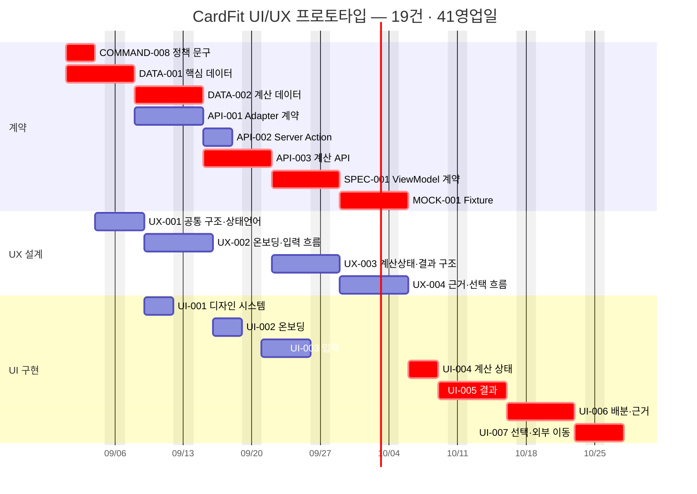

# CardFit 시각 프로토타입 전체 계획

## 개요

CardFit 54개 TASK 중에서 **"화면으로 가치를 눈으로 확인하는 것"** 을 목표로 하는 최소 슬라이스를 골라낸 문서다. 목적은 데모용 목업이 아니라, **이 프로토타입의 산출물이 그대로 본 개발로 이어지는 것**이다.

- 선정: **19건** (계약 8 · UX 4 · UI 7)
- 공수: 81 person-day · 임계 경로 **41영업일(약 8주)**
- 산출물: 온보딩 → 미래지출 입력 → 계산 상태 → 세 시나리오 결과 → 배분·근거 → 조합 선택까지 Mock 데이터로 완주하는 화면

핵심 판단 두 가지를 먼저 밝힌다.

1. **계약(DATA·API·SPEC)을 함께 넣는다.** 빼면 35영업일, 넣으면 41영업일로 **6영업일 차이**뿐이다. 그 6일을 아끼려고 UI가 임의로 만든 데이터 모양에 붙으면, 실제 계약이 나올 때 화면을 다시 짜야 한다. 이어서 개발할 프로토타입이라면 계약을 빼는 선택은 이득이 없다.
2. **프로토타입 완료는 TASK 완료가 아니다.** 아래 19건은 "시각 확인 체크포인트"까지만 진행하고 `Done`으로 닫지 않는다. 이유는 4장에 적었다.

### 실행 정책 — 19건 정본 + 3개 경량 시각 체크포인트

이 문서의 **19건을 계획 정본으로 유지**한다. 다만 최초 시각 검토에서 19건 전체의 산출물을 한 번에 구현하지 않고, 아래 3개 경량 체크포인트로 핵심 가설부터 확인한다.

| 체크포인트 | 참조 TASK | 이번에 구현할 최소 범위 |
| --- | --- | --- |
| `P-VIS-01` 최소 화면 기반 | `UX-001`, `UI-001` | 타이포·간격·버튼·입력·탭·결과 카드·모바일 focus |
| `P-VIS-02` 미래지출 입력 | `UX-002`, `UI-003` | 선택형 대분류, ONE_TIME/MONTHLY, SINGLE 만원 입력, 비개인화 예시 |
| `P-VIS-03` 결과와 핵심 근거 | `UX-003`, `UX-004` 일부, `UI-005`, `UI-006` 일부 | 세 시나리오 유지·변경 결과, 차액, 정형 근거 6개, 기준일·미반영 항목 |

최초 체크포인트에서는 `/plan`과 `/result` 두 라우트만 구현한다. `UI-002` 플랫폼 온보딩, `UI-004` 데이터 품질 상태 전체, `UI-007` 조합 선택·외부 이동, RANGE, AI 설명, 검토자 상태 패널은 후속 체크포인트로 미룬다. 계약 8건은 19건 계획에서 제거하지 않으며, 시각 방향 승인 후 정본 의존 순서에 따라 진행한다.

## 목차

1. 선별 기준
2. 선정한 19건
3. UI만 따로 뽑을 수 없는 이유
4. 프로토타입 완료의 의미 — 체크포인트이지 TASK 완료가 아니다
5. 실행 순서와 일정
6. 제외한 TASK와 이유
7. 대안 비교
8. 프로토타입 완료 판정 기준
9. 본 개발로 잇는 방법
10. 결론
11. 출처

## 1. 선별 기준

포함 여부는 아래 네 질문으로 판단했다.

| # | 질문 | 적용 |
|---|---|---|
| 1 | 화면에 보이는가? | UX 설계와 UI 구현은 후보 |
| 2 | 없으면 화면이 임의 데이터에 붙는가? | 그렇다면 계약도 포함 |
| 3 | Mock으로 대체 가능한가? | 가능하면 제외하고 `MOCK-001`이 대신함 |
| 4 | M1 핵심 가치 경로 위에 있는가? | M2(AI·이행 관측)·관리자·운영은 제외 |

기준 4의 "M1 핵심 가치 경로"는 SRS가 정의한 것을 그대로 따랐다 — 사용자가 미래지출을 입력하고, 세 시나리오의 유지·변경 결론과 차액·배분·근거를 이해한 뒤, 조합안을 선택하는 경험이다.

## 2. 선정한 19건

### 계약 — 8건

화면이 붙을 데이터 모양을 고정한다. 프로토타입을 재작업 없이 이어가기 위한 최소 집합이다.

| TASK | Issue | 왜 필요한가 |
|---|---|---|
| `COMMAND-008` | [#9](https://github.com/jennie-brain/CardFit-prd-to-srs/issues/9) | 스코프 고지·금지어 정책. **선행이 없어 첫날 착수 가능**하고, UI-002·UI-007의 법적 문구 근거다 |
| `DATA-001` | [#1](https://github.com/jennie-brain/CardFit-prd-to-srs/issues/1) | 입력·플랫폼·Rule 엔터티. 모든 화면 데이터의 뿌리 |
| `DATA-002` | [#2](https://github.com/jennie-brain/CardFit-prd-to-srs/issues/2) | 계산·후보·배분 엔터티. 결과·근거 화면의 데이터 |
| `API-001` | [#3](https://github.com/jennie-brain/CardFit-prd-to-srs/issues/3) | Platform Adapter 계약. UI-002가 표시할 연동 상태(부분·오래됨·동의만료)의 정의 |
| `API-002` | [#4](https://github.com/jennie-brain/CardFit-prd-to-srs/issues/4) | 입력·선택 Server Action 계약. UI-003·UI-007이 호출할 형태 |
| `API-003` | [#5](https://github.com/jennie-brain/CardFit-prd-to-srs/issues/5) | 계산·근거 HTTP 계약. UI-004·UI-005·UI-006이 호출할 형태 |
| `SPEC-001` | [#12](https://github.com/jennie-brain/CardFit-prd-to-srs/issues/12) | **읽기 ViewModel·오류·상태 계약. 이 프로토타입의 핵심** — UI가 실제로 바인딩하는 대상 |
| `MOCK-001` | [#14](https://github.com/jennie-brain/CardFit-prd-to-srs/issues/14) | 비식별 Fixture. **백엔드 없이 화면을 실제로 돌리는 수단** |

### UX 설계 — 4건

| TASK | Issue | 산출물 |
|---|---|---|
| `UX-001` | [#37](https://github.com/jennie-brain/CardFit-prd-to-srs/issues/37) | 공통 정보구조·상태 언어·접근성 기준 |
| `UX-002` | [#38](https://github.com/jennie-brain/CardFit-prd-to-srs/issues/38) | 온보딩·미래지출 입력 흐름 |
| `UX-003` | [#39](https://github.com/jennie-brain/CardFit-prd-to-srs/issues/39) | 계산 상태·세 시나리오 결과 구조 |
| `UX-004` | [#40](https://github.com/jennie-brain/CardFit-prd-to-srs/issues/40) | 결과 근거·조합 선택·외부 이동 흐름 |

### UI 구현 — 7건

| TASK | Issue | 화면 |
|---|---|---|
| `UI-001` | [#42](https://github.com/jennie-brain/CardFit-prd-to-srs/issues/42) | 디자인 시스템·접근성 기반 (Tailwind + shadcn/ui) |
| `UI-002` | [#43](https://github.com/jennie-brain/CardFit-prd-to-srs/issues/43) | 온보딩·플랫폼 상태·스코프 고지 |
| `UI-003` | [#44](https://github.com/jennie-brain/CardFit-prd-to-srs/issues/44) | 미래지출·카드 제약 입력 |
| `UI-004` | [#45](https://github.com/jennie-brain/CardFit-prd-to-srs/issues/45) | 계산 진행·오류·데이터 품질 상태 |
| `UI-005` | [#46](https://github.com/jennie-brain/CardFit-prd-to-srs/issues/46) | 세 시나리오·유지/변경 결과 |
| `UI-006` | [#51](https://github.com/jennie-brain/CardFit-prd-to-srs/issues/51) | 배분·근거 (**M1 정적 근거까지만. AI 설명 확장은 제외**) |
| `UI-007` | [#52](https://github.com/jennie-brain/CardFit-prd-to-srs/issues/52) | 조합 선택·카드사 외부 이동 경계 |

## 3. UI만 따로 뽑을 수 없는 이유

`UI-002`~`UI-007`은 문서상 서버 로직에 의존한다. 이 의존을 무엇으로 대체하는지가 프로토타입 설계의 전부다.

| UI TASK | 문서상 선행 | 프로토타입에서의 대체 |
|---|---|---|
| `UI-002` | `QUERY-001`, `COMMAND-002` | `MOCK-001` Fixture |
| `UI-003` | `COMMAND-001`, `QUERY-001` | `MOCK-001` Fixture |
| `UI-004` | `COMMAND-003` | `MOCK-001` Fixture (정상·부분·오래됨·실패 상태) |
| `UI-005` | `QUERY-002` | `MOCK-001` Fixture |
| `UI-006` | `QUERY-002`, `COMMAND-009` | `MOCK-001` Fixture. `COMMAND-009`(AI)는 M2라 제외 |
| `UI-007` | `COMMAND-004` | `MOCK-001` Fixture |
| `UX-002` | `QUERY-001` | `SPEC-001` 승인 계약 |
| `UX-004` | `COMMAND-004` | `SPEC-001` 승인 계약 |

**대체되는 선행이 전부 `QUERY`·`COMMAND`라는 점이 중요하다.** `MOCK-001`은 원래 이 목적으로 설계된 TASK다 — "비식별 Fixture·Mock 응답 규격"이고, 정본 문서상 Logic TASK 의존성이 0건이다. 프로토타입은 새로운 편법이 아니라 이미 계획에 있던 경로를 먼저 밟는 것이다.

## 4. 프로토타입 완료의 의미 — 체크포인트이지 TASK 완료가 아니다

**이 19건을 프로토타입 종료 시점에 `Done`으로 닫으면 안 된다.**

각 UI TASK의 `Definition of Done`에는 자동 테스트 증거가 들어 있고, `Verification Gates`는 `TEST-006`(M1 E2E)·`NFR-001`(성능) 통과를 요구한다. 프로토타입에서는 이것들을 하지 않는다. 지금 `Done`으로 닫으면 M1 게이트가 이미 통과한 것처럼 보이면서 실제로는 검증되지 않은 상태가 된다.

권장 운영:

- GitHub Project `Status`를 `In progress`로 두고 **`Done`으로 옮기지 않는다.**
- 각 Issue 본문의 Task Breakdown에 `[ ] 프로토타입 시각 확인` 체크포인트를 추가해 그 항목만 체크한다.
- 프로토타입 산출물 링크(스크린샷·Preview URL)를 해당 Issue에 댓글로 남긴다.

이 방식은 저장소의 기존 규칙과 맞는다 — `.agents/rules/001`이 M0 단계에서 정적 Fixture를 허용하고, `01` 문서가 각 TASK를 M1/M2 체크포인트로 나눠 관리하도록 하고 있다.

## 5. 실행 순서와 일정

2026-09-01 착수, 주 5일, 2레인 기준이다. 레인을 3개로 늘려도 임계 경로가 지배해서 완료일이 같다.

임계 경로는 `DATA-001 → DATA-002 → API-003 → SPEC-001 → MOCK-001 → UI-004 → UI-005 → UI-006 → UI-007`이다. 계약이 굳고 Fixture가 나온 뒤의 UI 화면 전이가 나머지를 결정한다.

### 원안 대비 11일을 줄인 지점

정본 계획에서 `UX-001`은 `SPEC-001` 승인을 선행으로 갖는다. 그대로 두면 52영업일이다. 프로토타입에서는 **`UX-001`을 `COMMAND-008`(정책 문구)만 선행으로 두고 먼저 착수해 41영업일로 줄였다.**

- 근거: `UX-001`의 산출물 중 정보구조·타이포·간격·접근성 기준은 ViewModel 확정 전에도 정할 수 있다.
- 감수하는 위험: **상태 언어(state language)는 `SPEC-001`이 정의하는 오류·상태 enum에 의존한다.** `SPEC-001` 승인 시점(2026-09-29)에 `UX-001`의 상태 문구를 반드시 재정합해야 하며, 이 재정합을 건너뛰면 UI-004의 상태 표시가 계약과 어긋난다.
- 이 완화를 받아들이지 않으려면 원안대로 52영업일(2026-11-12 종료)로 잡는다.

## 6. 제외한 TASK와 이유

| 제외 | 건수 | 이유 |
|---|---:|---|
| `COMMAND-001~007`, `009`, `010` | 9 | 실제 쓰기 로직. `MOCK-001` Fixture로 대체한다 |
| `QUERY-001~004` | 4 | 실제 조회. `MOCK-001` Fixture로 대체한다 |
| `DATA-003`, `API-004` | 2 | 이행 관측 데이터·API. M2 범위 |
| `API-005`, `SPEC-002` | 2 | 운영·Cron 계약, 제품 이벤트 계약. 화면 가치 확인과 무관 |
| `UX-006`, `UX-007`, `UI-008`, `UI-009` | 4 | 이행 자기보고·관리자 대시보드. M2 범위 |
| `TEST-001~007` | 7 | 자동 테스트. 판단 근거는 아래 |
| `NFR-001~004`, `006`, `SEC-001`, `INFRA-001` | 7 | 성능·보안·배포 Gate. 프로토타입은 배포 대상이 아니다 |

### `TEST`를 제외한 것에 대한 단서

저장소 규칙 `.agents/rules/004`는 실패하는 테스트를 먼저 쓰도록 요구한다. 프로토타입에서 `TEST-001~007`을 착수하지 않는 것은 **그 규칙의 예외가 아니라 유예**다.

- 프로토타입 단계의 판정 근거는 자동 테스트가 아니라 **사람이 화면을 보고 내리는 시각 확인**이다. 그래서 이 단계에서는 테스트를 붙이지 않는다.
- 대신 4장대로 **어떤 TASK도 `Done`으로 닫지 않는다.** 본 개발에서 해당 UI TASK를 실제로 완료할 때 `TEST-001~003`·`TEST-006`을 정상 순서대로 먼저 작성한다.
- 예외는 `MOCK-001`이다. Fixture schema validation은 프로토타입 안에서 통과시켜야 한다 — 그러지 않으면 화면이 붙은 Mock이 계약과 맞는지 아무도 모른다.

## 7. 대안 비교

| 안 | 범위 | 건수 | 공수 | 완료 | 성격 |
|---|---|---:|---:|---|---|
| **권장 (A′)** | 계약 8 + UX 4 + UI 7, `UX-001` 조기 착수 | 19 | 81pd | **41일 · 2026-10-28** | 산출물이 본 개발로 이어짐 |
| A (원안 순서) | 위와 동일, `UX-001`이 `SPEC-001` 대기 | 19 | 81pd | 52일 · 2026-11-12 | 가장 안전하지만 11일 느림 |
| B (화면만) | `COMMAND-008` + UX 4 + UI 7 | 12 | 48pd | 35일 · 2026-10-20 | **6일 빠른 대신 재작업 발생** |

**B안을 권하지 않는 이유가 이 문서의 결론이다.** 계약 7건(33pd)을 빼도 완료일은 6영업일밖에 당겨지지 않는다. 임계 경로의 대부분은 UI 화면 전이(`UI-004`→`005`→`006`→`007`)라서 계약을 빼도 짧아지지 않기 때문이다. 그 6일을 얻는 대가로 UI가 임의 데이터 모양에 결합되고, `SPEC-001`이 확정될 때 화면·타입·Fixture를 다시 맞춰야 한다.

## 8. 프로토타입 완료 판정 기준

아래를 모두 만족하면 프로토타입을 끝낸 것으로 본다.

- [ ] Mock 데이터로 온보딩 → 입력 → 계산 상태 → 결과 → 근거 → 선택까지 **끊김 없이 완주**된다.
- [ ] `UI-004`가 정상·부분·오래됨·조회 실패 상태를 **시각적으로 구분**해 보여준다.
- [ ] `UI-005`가 LOW·BASE·HIGH 세 시나리오와 유지/변경 결론, 차액을 보여준다.
- [ ] `UI-006`이 배분과 근거를 보여준다. AI 설명이 없어도 화면이 완전하다.
- [ ] `UI-002`·`UI-007`의 스코프 고지 문구가 `COMMAND-008` 승인 문구와 일치한다.
- [ ] 화면이 바인딩한 타입이 `SPEC-001` ViewModel과 **일치한다**(임의 타입 0건).
- [ ] `MOCK-001` Fixture가 schema validation을 통과한다.
- [ ] `web-design-guidelines` 스킬로 접근성 리뷰를 1회 수행하고 지적 사항을 기록했다.
- [ ] 19건 중 `Done`으로 닫힌 TASK가 0건이다.

## 9. 본 개발로 잇는 방법

프로토타입이 끝난 뒤 실제 백엔드를 붙일 때 바뀌는 것과 바뀌지 않는 것을 미리 구분해 둔다.

**바뀌지 않는 것** — 이것이 계약을 함께 만든 이유다.

- 화면 컴포넌트와 레이아웃
- 바인딩하는 ViewModel 타입 (`SPEC-001`)
- 상태·오류 표시 분기
- 스코프 고지 문구

**바뀌는 것**

- 데이터 출처: `MOCK-001` Fixture → `QUERY-001`·`QUERY-002` 실제 조회
- 쓰기 경로: 없음 → `COMMAND-001`·`COMMAND-003`·`COMMAND-004`
- `UI-006`에 `COMMAND-009` AI 설명 확장 추가 (M2)
- 각 UI TASK에 `TEST-001~003`·`TEST-006` 증거 추가 후 비로소 `Done`

이어붙이는 순서는 `MOCK-001` Fixture와 실제 Query 응답이 같은 schema를 만족하는지부터 확인한다. 여기서 어긋나면 프로토타입의 전제가 깨진 것이므로 화면이 아니라 계약을 먼저 고친다.

## 10. 결론

프로토타입 슬라이스는 **19건 · 41영업일**이다. 화면 11건(UX 4 + UI 7)만 뽑고 싶은 유혹이 있지만, 계약 8건을 함께 넣어도 완료일은 6영업일밖에 차이 나지 않는다. 임계 경로를 지배하는 것은 계약이 아니라 UI 화면 전이의 순차성이기 때문이다. 그러므로 **계약을 포함하는 것이 이 프로토타입을 버리지 않고 본 개발로 잇는 가장 싼 방법이다.**

두 가지를 지켜야 이 계획이 의도대로 동작한다. 첫째, `UX-001`을 먼저 착수해 얻은 11일은 `SPEC-001` 승인 시점에 상태 언어를 재정합하는 조건부 이득이다. 둘째, 프로토타입 종료 시점에 어떤 TASK도 `Done`으로 닫지 않는다 — 이 단계는 시각 확인 체크포인트이지 검증 완료가 아니다.

## 11. 출처

- [`01_전체_TASK_목록_및_기준선.md`](01_전체_TASK_목록_및_기준선.md) — TASK 정의와 M1/M2 범위
- [`02_총괄_개발_실행_계획.md`](02_총괄_개발_실행_계획.md) — 정본 의존성 DAG와 임계 경로
- [`03_병렬실행_Gantt_로드맵.md`](03_병렬실행_Gantt_로드맵.md) — 압축 수행 일정
- [`TASK/task2/*.md`](../task2) — 각 TASK의 AC·DoD·Verification Gates
- `SRS-Drafts/SRS_CardFit_v1.6_GPT-5.6-SOL.md` — M1 핵심 가치 경로 정의
- `.agents/rules/001-project-scope.md`, `.agents/rules/004-testing-quality.md` — M0 Fixture 허용과 TDD 규칙
- [GitHub Project](https://github.com/users/jennie-brain/projects/1) — 이슈 번호와 일정 필드

## 12. 결정 과정과 판단 근거

이 절은 `grill-it` 인터뷰에서 나온 질문을 그대로 기능으로 확정하지 않고, PRD·SRS·TASK의 기존 경계와 대조해 프로토타입 착수 결론으로 좁힌 과정이다. 상세 토픽 상태와 반영 파일은 [`docs/grill/GRILL_LEDGER.md`](../../docs/grill/GRILL_LEDGER.md), 화면별 명세는 [`10_시각_프로토타입_화면_명세.md`](10_시각_프로토타입_화면_명세.md)를 따른다.

### 12.1 계획 범위와 최초 구현 범위의 분리

처음에는 화면 TASK 11건만 별도 시각 슬라이스로 보는 안을 검토했다. 그러나 이 방식은 `07_시각_프로토타입_전체_계획.md`가 산정한 계약 8건을 계획에서 누락한 것처럼 읽히고, Fixture와 실제 계약이 달라질 때 화면 재작업 위험도 남겼다. 따라서 다음처럼 정리했다.

- **계획 정본은 19건**으로 유지한다. 계약 8건은 삭제하거나 완료 처리하지 않는다.
- **최초 구현만 `P-VIS-01~03`으로 경량화**한다. 입력→결과→근거가 이해되는지 확인하는 데 필요한 `/plan`, `/result`만 먼저 만든다.
- 이 단계는 시각 확인 체크포인트이므로 관련 TASK를 `Done`으로 닫지 않는다.

즉, 19건은 본 개발까지 이어지는 의존성 범위이고 3개 체크포인트는 디자인 가설을 싸게 검증하는 실행 단위다. 두 숫자는 서로 다른 대상을 가리킨다.

### 12.2 사용자 입력 부담을 줄이는 기준

입력값을 많이 받는다고 계산이 반드시 정확해지는 것은 아니다. 아직 계산 정책이 없는 값은 사용자가 입력해도 결과에 정직하게 반영할 수 없으므로 다음 원칙을 적용했다.

- 미래지출 금액은 빈 값으로 시작한다. 사용자가 원할 때만 수정 가능한 **비개인화 예시**를 적용하며, 출처가 검증되지 않은 수치를 업계 평균이라고 부르지 않는다.
- 미래지출은 여러 건을 입력할 수 있고 각 항목은 `ONE_TIME` 또는 `MONTHLY`로 구분한다. 증가·감소는 비교 가능한 과거 월평균이 있을 때 시스템이 계산하고, 기준값이 없으면 방향을 만들지 않는다.
- 카테고리는 `가구·가전`, `여행` 같은 대분류를 선택하게 하고 `신혼 가구`, `신혼여행` 같은 좁은 이벤트명은 강제하지 않는다. 자유 입력은 `기타`에서만 허용한다.
- 할부 귀속·수수료·월별 실적 반영 정책이 미정이므로 할부 옵션은 최초 프로토타입에서 제외하고 결과의 미반영 항목으로 알린다.
- 실제 제품 상한의 근거가 없으므로 임의의 최대 금액과 상한 오류를 만들지 않는다.

이 판단은 입력 편의보다 **입력한 값이 결과에 어떤 의미로 쓰이는지 설명할 수 있는가**를 우선한 것이다.

### 12.3 금액 입력 방식의 검토

`원·만 원·억 원` 단위 전환 탭도 검토했지만, 이를 현재 은행 앱의 공통 표준이라고 볼 근거는 확인하지 못했다. 공식 화면에서는 용도에 따라 서로 다른 고정 단위를 사용했다.

- 신한 SOL 이체 화면은 원 단위 정수 입력과 숫자 키패드를 사용한다: [신한 SOL 이체 가이드](https://nsol.shinhan.com/contents/guide/step05__send-money/03.html)
- KB 금융계산기는 만원 단위 고정 입력을 사용한다: [KB 금융계산기](https://obiz.kbstar.com/quics?cc=b065687%3Ab065741&isNew=N%3Cbr%3E&page=C016144&prcode=DP01001615)

CardFit의 예상 지출은 일상 이체보다 큰 금액을 다루므로 **만원 단위 고정 입력 + 전체 원 금액 환산 표시 + 빠른 금액 추가 버튼**을 채택했다. 단위 전환 상태와 소수 입력 규칙을 없애면서도 오입력을 눈으로 확인할 수 있기 때문이다.

### 12.4 문체와 책임 표현

뱅크샐러드 공개 화면에서 친근한 안내에는 해요체가, 사실·조건·고지에는 합니다체가 함께 사용되는 점을 참고했다. CardFit도 한 문체만 기계적으로 적용하지 않고 다음처럼 역할을 나눈다.

- 상태 제목과 일반 안내: 차분한 해요체
- 계산 사실, 적용 조건, 책임·범위 고지: 합니다체
- 버튼: 행동형 명사구

이는 친근함을 유지하면서 계산 결과와 금융 조건을 제안이나 보장처럼 오해하지 않게 하기 위한 구분이다.

### 12.5 아직 확정하지 않은 사항

아래 사항은 최초 체크포인트의 구현을 막지 않으므로 임의로 확정하지 않는다.

- 변경 후보끼리 계산 결과가 같은 경우의 정렬 규칙
- 세부 디자인 토큰, breakpoint, 플랫폼 브랜드 표기
- 시각 검토 판정 기록과 접근성 리뷰 방식
- 할부의 월별 실적·혜택 귀속 정책과 실제 입력 상한

현재 조합과 변경 조합의 값이 같으면 `유지`로 분류할 수 있지만, **여러 변경 후보끼리의 동률 순서**는 별도 정책이다. 최초 체크포인트에서는 다중 변경 후보 정렬을 구현하지 않아 이 결정을 앞당기지 않는다.

결과 근거는 전부 펼치거나 전부 숨기지 않는다. 예상 순혜택·총 예상 혜택·연회비·결과에 큰 영향을 준 영역별 한도·기준일을 먼저 보여주고, 세부 계산식과 조건은 `계산 근거 보기`에서 제공한다. 최초 체크포인트에는 AI 영역을 만들지 않아 정형 근거만으로 화면이 완전한지 검증한다.

## 13. Decision Log

| 날짜 | 토픽 | 결정 | 핵심 근거 |
| --- | --- | --- | --- |
| 2026-08-26 | 실행 기반 | 저장소 루트의 단일 Next.js App Router 앱과 공통 ViewModel·타입 적용 Fixture를 사용 | 프로토타입을 본 개발이 이어받고 화면별 임의 데이터 구조를 막기 위해서 |
| 2026-08-26 | 상태 재현 | 상태별 URL을 사용하고 검토자 패널은 사용자 화면과 분리 | 사용자가 데이터 상태를 고르는 잘못된 제품 경험 없이 시각 상태를 재현하기 위해서 |
| 2026-08-27 | 문체 | 일반 안내는 해요체, 사실·조건·고지는 합니다체, CTA는 행동형 명사구 | 공개 금융 서비스의 문맥별 문체와 금융 조건의 명확성을 함께 반영하기 위해서 |
| 2026-08-27 | 고지 | PRD 기반 후보 고지를 사용하고 `COMMAND-008` 승인 시 교체 | 신청·발급·해지 대행 또는 혜택 보장으로 오인되는 표현을 막기 위해서 |
| 2026-08-27 | 입력 초기값 | 빈 값으로 시작하고 사용자 선택 시에만 수정 가능한 비개인화 예시 적용 | 출처 없는 업계 평균의 오인 위험을 피하면서 빈 폼의 부담을 낮추기 위해서 |
| 2026-08-27 | 입력 흐름 | `/plan` 2단계, `SINGLE` 기본, 선택형 대분류와 `기타` 직접 입력 | 핵심 질문을 순차적으로 제시하고 불필요한 자유 입력을 줄이기 위해서 |
| 2026-08-27 | 금액 입력 | 만원 단위 고정, 전체 원 금액 환산, 빠른 금액 추가 제공 | 공식 금융 화면에서 공통 단위 전환 탭은 확인되지 않았고 큰 금액의 입력·검산 편의가 중요하기 때문 |
| 2026-08-27 | 할부 | 최초 프로토타입에서 옵션 제외, 결과에 미반영 항목 고지 | 미정 계산 정책을 지원하는 것처럼 보이지 않게 하기 위해서 |
| 2026-08-27 | 미래지출 구조 | 다건 + `ONE_TIME`/`MONTHLY` + 연·월, 비교 가능할 때만 변화 방향 자동 계산 | 중복 입력을 줄이고 일회성 총액과 반복 월 금액의 의미를 구분하기 위해서 |
| 2026-08-27 | 입력 상한 | 임의 상한과 상한 초과 상태를 구현하지 않음 | 근거 없는 임시 수치가 제품 계약으로 굳는 것을 막기 위해서 |
| 2026-08-27 | 실행 범위 | 19건을 계획 정본으로 유지하고 최초 실행은 `P-VIS-01~03`과 `/plan`·`/result`로 제한 | 본 개발 연결성을 보존하면서 핵심 시각 가설을 먼저 저비용으로 검증하기 위해서 |
| 2026-08-27 | 시나리오와 동률 | `더 적게`·`예상한 만큼`·`더 많이`, BASE 기본, 현재 대비 동률은 `유지`; 다중 후보 동률 순위는 미구현 | 짧은 사용자 언어와 내부 계약을 함께 유지하고 차이가 없는 결과에서 변경을 유도하지 않기 위해서 |
| 2026-08-27 | 결과 근거 | 예상 순혜택을 대표값으로 두고 영역별 혜택 한도를 요약하며 계산식·조건은 disclosure로 제공; AI 영역 제외 | 비용을 반영한 판단값과 카드별 한도 구조를 정확히 전달하고 정형 근거만으로 화면을 완성하기 위해서 |
| 2026-08-27 | 미확정 경계 | 다중 변경 후보 동률 정렬, 세부 토큰, 리뷰 방식은 후속 결정으로 유지 | 최초 입력→결과→근거 검토를 막지 않는 사항을 임의로 제품 정책화하지 않기 위해서 |
