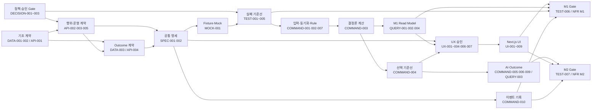
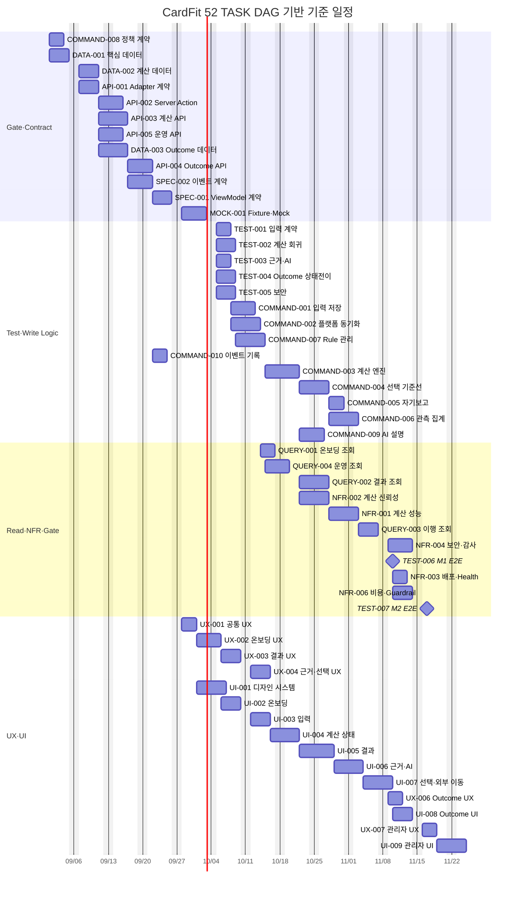

# CardFit 전체 TASK 구현 실행계획

## 1. 기술 요약

이 문서는 `TASK/task2`의 상세 TASK 52개를 실제 개발 작업으로 전환하기 위한 총괄 실행 기준이다. 구현 TASK 50개와 사전 명세 TASK 2개를 모두 포함하며, 기존 통합 목록과 의존성 매트릭스보다 실행 순서·병렬 작업·통합 Gate를 더 구체적으로 정의한다.

핵심 전략은 다음과 같다.

- 데이터와 외부 인터페이스 계약을 먼저 고정한다.
- 구현 전에 `TEST-001~005`의 실패 기준선을 만든다.
- 서버의 쓰기(`COMMAND`)와 읽기(`QUERY`)를 분리하되 같은 사용자 여정 안에서 통합한다.
- UX 설계와 UI 구현은 별도 TASK로 유지한다. UX가 상태·흐름·문구를 승인한 뒤 UI가 코드를 작성한다.
- M1은 저장 가능한 포트폴리오 MVP를 완성하고, M2의 AI·자동 관측은 M1의 배포를 차단하지 않는다.
- 각 TASK 문서의 M1/M2 범위는 새 TASK로 분할하지 않고 GitHub Issue 체크리스트와 완료 체크포인트로 관리한다.

권장 기준 일정은 **4개 작업 레인, 12주**다. 이는 2026년 9월 1일 착수를 가정한 예비 일정이며, 1인 개발이면 병렬 레인을 순차 실행하여 약 18~24주로 환산한다. 일정은 승인 지연과 외부 API 실제 연동(M3)을 포함하지 않는다.

## 2. 기준선과 일정 산정 규칙

### 2.1 범위

| 구분 | TASK | 개수 | 실행 기준 |
| --- | --- | ---: | --- |
| 계약·명세 | DATA, API, SPEC, MOCK | 11 | DB·DTO·상태·오류·Fixture를 먼저 확정한다. |
| 쓰기 로직 | COMMAND | 10 | 상태 변경과 외부 부수효과를 담당한다. |
| 읽기 로직 | QUERY | 4 | 승인된 ViewModel 계약만 반환한다. |
| 자동 검증 | TEST | 7 | TEST-001~005는 선행 실패 기준선, TEST-006~007은 통합 Gate다. |
| 비기능 | NFR | 5 | 성능·신뢰성·배포·보안·비용 합격선을 검증한다. |
| UX 설계 | UX | 6 | 정보구조·상태·흐름·카피를 결정한다. |
| UI 구현 | UI | 9 | 승인된 UX와 ViewModel을 Next.js로 구현한다. |
| **합계** |  | **52** | Decision 항목은 TASK 수에서 제외한다. |

### 2.2 작업량 가정

- `M`: 2~3 작업일, `H`: 3~5 작업일을 기본값으로 사용한다.
- 계약 승인, 보안 검토, E2E 안정화에는 일반 구현보다 20%의 버퍼를 둔다.
- 하나의 작업 레인은 동시에 하나의 고난도 TASK만 수행한다.
- 같은 레인에서 중간 난이도 TASK 두 개를 병렬로 잡지 않는다.
- Gantt의 종료일은 개발 완료 예상일이며, Gate를 통과하기 전에는 `Done`으로 변경하지 않는다.

### 2.3 작업 레인

| 레인 | 주 책임 | 대표 TASK |
| --- | --- | --- |
| A. Contract·Data | Prisma, API 계약, Fixture, migration | DATA, API, SPEC, MOCK |
| B. Write·Test | 실패 테스트, Command, 계산 엔진 | TEST-001~005, COMMAND |
| C. Read·NFR | Query, 성능·보안·배포·관측 | QUERY, NFR, E2E |
| D. UX·UI | UX 승인, 디자인 시스템, 화면 구현 | UX, UI |

작업자가 한 명이면 레인 우선순위는 `A → B → C → D`다. 여러 AI 에이전트를 사용하더라도 동일 파일, 동일 Prisma schema, 동일 DTO를 동시에 수정하지 않는다.

## 3. 착수 전 정합성 Gate

현재 상세 TASK 본문에는 실제 구현 전에 정리해야 할 의존성 표현이 있다. 이 항목은 일정 추정의 전제이며, 승인되지 않은 정책을 코드 기본값으로 대체해서는 안 된다.

1. `TEST-006`은 UI 완료를 검증하는 E2E이므로 UI를 차단하는 선행 구현이 아니라 `UI-001~007` 뒤의 M1 Gate로 실행한다.
2. `SPEC-001`, `MOCK-001`, UX 공통 계약은 M1과 M2 범위를 체크리스트로 구분한다. M2 Outcome 계약 미완료가 M1 Mock·UX를 막지 않게 한다.
3. `NFR-006`은 M1 비용·최신성 Gate와 M2 AI·Outcome 관측 Gate를 같은 Issue 안의 별도 체크포인트로 판정한다.
4. `DECISION-001~003`, 승인 문구, 권한·관측·보존 정책은 코드 작업과 병렬로 추진하되 연결 TASK의 완료를 차단한다.

### 착수 승인 조건

- [ ] `DECISION-001~003`의 Owner와 승인 기한을 확정했다.
- [ ] M1과 M2의 완료 체크리스트가 각 공용 TASK에 표시됐다.
- [ ] 존재하지 않는 TASK ID 참조가 0건이다.
- [ ] GitHub Project에 `Depends on`, `Blocks`, `Milestone`, `Workstream`, `Complexity` 필드가 있다.
- [ ] 모든 H TASK에는 한 명의 최종 소유자와 한 개의 검증 명령이 있다.

## 4. 실행 DAG

### 4.1 전체 의존성 구조



이 DAG의 핵심 경로는 `DATA-001 → DATA-002/API-001 → API-003 → SPEC-001 → MOCK-001 → TEST-001/002 → COMMAND-001/002/007 → COMMAND-003 → QUERY-002/COMMAND-004 → UX-004 → UI-005~007 → TEST-006 → NFR-003/006`이다. 계약과 계산 경로가 늦어지면 UI 인력을 추가해도 M1 종료일은 당겨지지 않는다.

### 4.2 병렬화 원칙

- `DATA-002`와 `API-001`은 `DATA-001` 승인 후 병렬로 진행한다.
- `API-002`, `API-003`, `API-005`, `DATA-003`은 각자의 직접 선행 계약만 충족하면 병렬로 진행한다.
- `SPEC-001`과 `SPEC-002`는 필요한 계약과 정책이 준비된 뒤 병렬로 검토한다.
- `TEST-001~005`는 Mock 기준선이 고정되면 기능 구현 전에 병렬 작성한다.
- `COMMAND-001`, `COMMAND-002`, `COMMAND-007`, `COMMAND-010`은 각각의 실패 테스트가 준비되면 병렬 구현한다.
- UX는 해당 ViewModel의 구현 완료가 아니라 승인된 `SPEC-001` 계약을 기준으로 시작할 수 있다.
- UI는 화면별로 무리하게 병렬화하지 않는다. `UI-002 → 003 → 004 → 005 → 006 → 007`은 사용자 상태 전이가 이어지는 순차 경로다.
- `COMMAND-005·006`, `QUERY-003`, `UX-006`, `UI-008`은 M1 핵심 경로와 분리한 M2 레인에서 진행한다.

## 5. 실행 Wave와 모든 TASK 배치

아래 표는 52개 TASK를 빠짐없이 한 번씩 배치한 실행 기준표다. 같은 Wave 안에서도 `Depends on`이 충족된 TASK만 착수한다.

| Wave | 목적 | TASK | 병렬 실행 조건 | 종료 Gate |
| ---: | --- | --- | --- | --- |
| 0 | 정책·프로젝트 준비 | COMMAND-008 | 승인 책임자 지정과 문구 초안 확보 | 정책 계약 검토 가능 |
| 1 | 핵심 데이터 기반 | DATA-001 | 없음 | 엔터티·상태·보관 경계 승인 |
| 2 | 계산·Adapter 기반 | DATA-002, API-001 | DATA-001 승인 | 계산 데이터와 Adapter 계약 무충돌 |
| 3 | Action·계산·운영 계약 | API-002, API-003, API-005, DATA-003 | Wave 2의 직접 의존성 충족 | M1/M2 API 계약 초안 승인 |
| 4 | Outcome·공통 명세 | API-004, SPEC-001, SPEC-002 | DATA-003과 관련 API·정책 확보 | ViewModel·이벤트 schema 승인 |
| 5 | 개발용 대체 인프라 | MOCK-001 | DATA/API/SPEC의 대상 범위 승인 | Fixture schema validation 통과 |
| 6 | 구현 전 자동 채점표 | TEST-001, TEST-002, TEST-003, TEST-004, TEST-005 | Mock·정책 기준선 확보 | 의도한 실패가 재현됨 |
| 7 | 독립 쓰기 기반 | COMMAND-001, COMMAND-002, COMMAND-007, COMMAND-010 | 연결 TEST 실패 기준선 확보 | 입력·동기화·Rule·이벤트 단위 테스트 통과 |
| 8 | 핵심 계산과 M1 조회 | COMMAND-003, QUERY-001, QUERY-004 | COMMAND-001·002·007 완료 | 결정론 계산과 초기·운영 조회 통과 |
| 9 | 결과·선택 기준선 | QUERY-002, COMMAND-004, NFR-002 | 계산과 회귀 테스트 통과 | 결과 hash·Rule 회귀·선택 기준선 통과 |
| 10 | M2 로직과 M1 성능 | COMMAND-005, COMMAND-006, COMMAND-009, NFR-001 | COMMAND-004 또는 QUERY-002 완료 | Outcome·AI 단위 경로와 성능 기준 확보 |
| 11 | 이행 조회·보안 | QUERY-003, NFR-004 | Outcome Command와 보안 경계 확보 | 소유권·감사·보존 검증 통과 |
| 12 | UX 공통 기반 | UX-001 | SPEC-001, COMMAND-008 승인 | 상태 언어·접근성·정보구조 승인 |
| 13 | UX 수직 흐름 | UX-002, UX-003, UX-004 | 각 선행 흐름과 서버 계약 확보 | M1 wireflow 승인 |
| 14 | UI 기반과 온보딩 | UI-001, UI-002 | UX-001·002와 QUERY-001 완료 | 디자인 시스템·온보딩 통과 |
| 15 | 입력·계산 상태 | UI-003, UI-004 | 선행 UI와 Command 완료 | 입력 저장·오류 복구 통과 |
| 16 | 결과·근거·선택 | UI-005, UI-006, UI-007 | QUERY-002, UX-004, COMMAND-004 완료 | M1 핵심 사용자 여정 완성 |
| 17 | M1 통합 검증 | TEST-006 | UI-001~007과 M1 로직 완료 | 핵심 E2E 통과 |
| 18 | M1 운영 Gate | NFR-003, NFR-006 | TEST-006과 운영 조회 완료 | 배포·Health·비용 중단 기준 통과 |
| 19 | M2 UX·UI | UX-006, UX-007, UI-008, UI-009 | QUERY-003·004와 NFR 결과 확보 | Outcome·관리자 흐름 승인 |
| 20 | M2 통합 검증 | TEST-007 | M2 Logic·UI 완료 | M2 E2E와 M1 회귀 통과 |

## 6. 12주 병렬 일정

아래 Gantt는 2026년 9월 1일 착수, 주 5일, 최대 4개 레인을 가정한 기준 일정이다. Mermaid의 `after`는 대표적인 최장 선행 노드만 표시하며, 다중 의존성의 정본은 5장의 Wave 표와 개별 TASK의 `Dependencies & Interactions`다.



### 일정 해석

- 1~4주는 계약·Mock·실패 테스트에 집중한다. 이 구간이 늦어지면 모든 후속 레인이 밀린다.
- 5~7주는 입력·계산·조회 로직과 UX를 병렬로 진행한다.
- 7~10주는 UI의 핵심 상태 전이를 순차 통합하고, 서버 레인은 Outcome·NFR을 진행한다.
- 11주는 M1 E2E와 배포·비용 Gate를 통과한다.
- 12주는 M2 Outcome·관리자 흐름과 회귀 검증을 마무리한다.
- 실제 Production Adapter와 MyData 연동은 M3이며 이 일정에 포함하지 않는다.

## 7. 수직 Slice별 통합 전략

| Slice | Contract | 실패 테스트 | Logic | UX | UI | 완료 Gate |
| --- | --- | --- | --- | --- | --- | --- |
| 온보딩·입력 | DATA-001, API-001·002, SPEC-001, MOCK-001 | TEST-001·005 | COMMAND-001·002·008·010, QUERY-001 | UX-001·002 | UI-001~003 | 저장·재조회·오류·인가 통과 |
| 계산·결과 | DATA-002, API-003, SPEC-001 | TEST-002·003 | COMMAND-003·007, QUERY-002·004 | UX-003 | UI-004·005 | 동일 입력·동일 hash, 세 시나리오 표시 |
| 근거·선택 | API-002·003, DATA-002·003 | TEST-002·003·005 | COMMAND-004·009, QUERY-002 | UX-004 | UI-006·007 | 근거·배분·고지·선택 기준선 통과 |
| 이행 관측 | DATA-003, API-004, SPEC-001·002 | TEST-004·005 | COMMAND-005·006·010, QUERY-003 | UX-006 | UI-008 | 상태전이·판정 불가·소유권 통과 |
| 운영 | API-005, SPEC-002 | TEST-002·005 | COMMAND-007·010, QUERY-004 | UX-007 | UI-009 | Health·Rule·비용·중단 기준 통과 |

각 Slice는 계약, 실패 테스트, 서버 로직, UX, UI, NFR 증거가 모두 연결돼야 완료된다. 서버 코드만 합쳐졌거나 화면만 보이는 상태는 `Done`이 아니다.

## 8. GitHub Project 운영 규칙

### 8.1 상태

```text
Backlog → Ready → In Progress → In Review → Verification → Done
                    ↘ Blocked ↗
```

- `Ready`: 모든 직접 선행 TASK가 완료됐고 외부 승인 자료가 있다.
- `In Progress`: 담당자와 검증 명령이 지정됐다.
- `In Review`: 코드·schema·UX 산출물이 작성됐지만 자동 검증 전이다.
- `Verification`: 관련 TEST와 NFR Gate를 실행 중이다.
- `Done`: Acceptance Criteria와 증거 링크가 모두 있다.
- `Blocked`: 승인·계약·외부 시스템을 기다리며 임시 값을 코드에 넣지 않는다.

### 8.2 브랜치·통합 단위

- PR 하나는 원칙적으로 TASK 하나를 닫는다.
- 계약 변경 PR은 생성된 migration, Fixture, 계약 테스트를 같은 PR에 포함한다.
- H TASK끼리 합친 PR을 만들지 않는다.
- UI PR은 UX 산출물 링크와 Mock 상태별 캡처 또는 E2E 증거를 포함한다.
- 공용 schema 변경은 레인 A가 소유하며, 다른 레인은 소비자 수정 PR로 뒤따른다.

### 8.3 일일 운영

1. DAG에서 `Ready`인 노드만 선택한다.
2. 고난도 TASK는 레인당 한 개만 `In Progress`로 둔다.
3. 실패 테스트를 먼저 재현하고 구현 후 같은 명령으로 통과를 증명한다.
4. 계약 변경이 생기면 `Change Propagation`에 적힌 후행 TASK를 다시 `Ready` 검토한다.
5. 매일 종료 시 critical path의 예상 종료일과 Blocker 나이를 갱신한다.

## 9. Milestone 합격 기준

### M1 저장 가능한 포트폴리오 MVP

- [ ] DATA-001·002, API-001~003·005, SPEC·MOCK의 M1 범위가 승인됐다.
- [ ] COMMAND-001~004·007·008·010과 QUERY-001·002·004가 완료됐다.
- [ ] TEST-001~003·005·006이 통과했다.
- [ ] NFR-001~004·006의 M1 기준이 통과했다.
- [ ] UX-001~004와 UI-001~007의 핵심 여정이 완료됐다.
- [ ] 계산 결과는 Gemini 장애와 무관하게 결정론적으로 제공된다.
- [ ] 승인되지 않은 Production Adapter를 Mock으로 명확히 표시했다.

### M2 AI·자동화·이행 관측

- [ ] DATA-003, API-004와 SPEC·MOCK의 M2 범위가 승인됐다.
- [ ] COMMAND-005·006·009·010과 QUERY-003이 완료됐다.
- [ ] UX-006·007과 UI-008·009가 완료됐다.
- [ ] TEST-004·005·007과 M1 회귀가 통과했다.
- [ ] NFR-003·004·006의 M2 기준과 비용 중단 조건이 통과했다.
- [ ] 관측 목적·범위·보존기간·판정 불가 상태가 승인됐다.

### M3 실제 플랫폼 통합

M3는 현재 52개 TASK의 Mock 기반 PoC 완료 후 별도 계획으로 다룬다. Identity, Consent, MyData, Catalog, 실제 호출 비용과 계약이 확인되기 전에는 Production Adapter 구현 일정을 확정하지 않는다.

## 10. 위험과 일정 완충

| 위험 | 영향 | 조기 신호 | 대응 |
| --- | --- | --- | --- |
| 계산 정책 승인 지연 | critical path 전체 지연 | TEST-002 expected 결과 미작성 | Decision Owner가 Wave 0에서 승인 기한을 고정한다. |
| M1/M2 계약 혼합 | M1이 Outcome 승인까지 대기 | Mock·SPEC이 부분 완료로 멈춤 | Issue 안에서 M1/M2 체크포인트와 Gate를 분리한다. |
| 고난도 TASK 동시 수행 | 재작업·충돌 증가 | Prisma·DTO·계산 파일 동시 수정 | 레인별 H TASK WIP를 1로 제한한다. |
| UI 조기 구현 | 상태·오류 계약 재작업 | 임시 ViewModel이 화면에 확산 | SPEC-001과 Mock schema 승인 후 UI를 시작한다. |
| E2E 의존성 역전 | 순환 의존성·가짜 완료 | TEST-006이 UI를 선행 차단 | Unit/Contract Test와 E2E Gate의 역할을 분리한다. |
| 비용·외부 API 불확실성 | M2 운영 불가 | Gemini/MyData 비용 추적 불가 | M1은 Dummy/Mock으로 증명하고 NFR-006에서 중단 기준을 검증한다. |

일정 버퍼는 critical path 종료 뒤 일괄 배치하지 않는다. 계약 승인 2일, 계산 통합 2일, M1 E2E 3일을 해당 구간에 각각 둔다.

## 11. 유지관리 규칙

- 상세 TASK의 `Depends on`이 바뀌면 이 문서의 Wave 표와 Mermaid DAG를 함께 갱신한다.
- TASK가 추가·삭제되면 5장에 모든 상세 TASK ID가 정확히 한 번 존재하는지 검사한다.
- Gantt 날짜는 팀 규모나 착수일이 바뀔 때만 재산정한다.
- 실제 진행률은 문서의 예상 날짜가 아니라 GitHub Project 상태를 기준으로 판단한다.
- 리포트·인덱스는 `TASK/task1`, 실행 가능한 상세 TASK는 `TASK/task2`에 둔다.

## 12. 근거 문서

- [전체 개발 TASK 목록](CardFit_전체_개발_TASK_리스트.md)
- [전체 TASK 의존성 매트릭스](STEP4_전체_TASK_의존성_매트릭스.md)
- [TASK 풀버전 추출 계획](PLAN_GitHub_Project_TASK_풀버전_추출순서.md)
- [정책 Decision Log](CardFit_정책_DECISION_LOG.md)
- [`TASK/task2` 상세 TASK 52개](../task2)
- `SRS-Drafts/SRS_CardFit_v1.6_GPT-5.6-SOL.md`
- `PRD/PRD_CardFit_v1.3.md`
