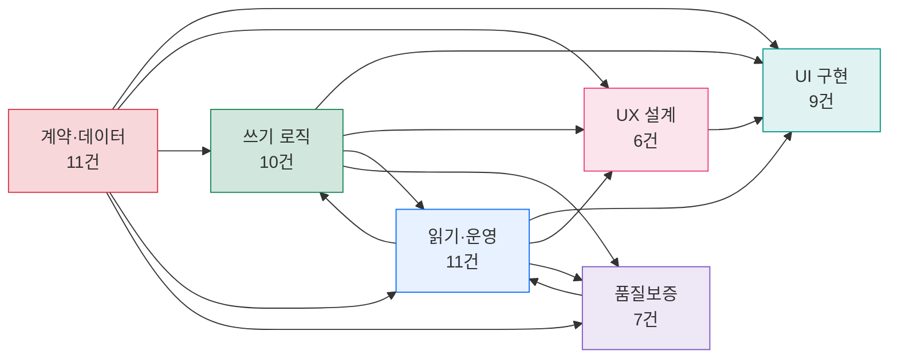
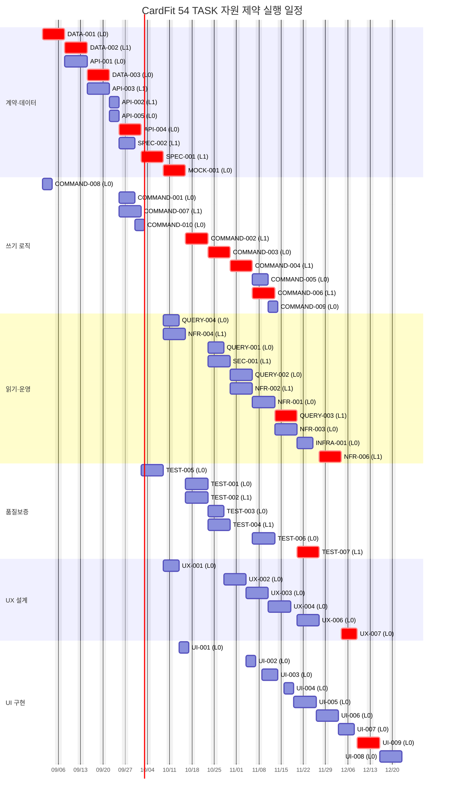

# [총괄] CardFit 개발 실행 계획

**문서 ID:** PLAN-CARDFIT-MVP-001

**개정 버전:** 1.0

**날짜:** 2026-08-26

**근거 문서:** `docs/tasks/task1/01_전체_TASK_목록_및_기준선.md`(54건) · `docs/tasks/task2/*.md`(TASK별 이슈 명세 54건)

> ⚙️ 이 문서는 `docs/tasks/task2` 54개 TASK 본문의 `Dependencies & Interactions`를 직접 대조해 계산한 정본 실행계획이다.

---

## 0. 이 문서의 위치

| 문서 | 답하는 질문 |
| --- | --- |
| SRS (`docs/technical/SRS_CardFit_v1.6_GPT-5.6-SOL.md`) | **무엇을** 만드는가 |
| PRD (`docs/product/PRD_CardFit_v1.3.md`) | **왜** 만드는가 |
| TASK 목록 (`01_전체_TASK_목록_및_기준선.md`) | **무엇을 쪼개** 만드는가 |
| `docs/tasks/task2/*.md` | **각 조각을 어떻게** 끝내는가 (AC·DoD) |
| **본 문서** | **어떤 순서로, 누가, 언제** 만드는가 |

실무자는 본 문서에서 자기 트랙과 착수 시점을 확인하고, 실제 작업은 `docs/tasks/task2/<TASK-ID>.md`의 Task Breakdown과 Acceptance Criteria를 따른다.

---

## 1. 실행 전략

### 1.1 원칙

| # | 원칙 | 근거 | 어기면 |
| --- | --- | --- | --- |
| 1 | **계약을 먼저 확정한다** — `DATA-001·002·003`, `API-001~005`, `SPEC-001·002`가 모든 구현의 기준점 | `01` §1 | 서로 다른 TASK가 같은 계약을 다르게 구현해도 탐지되지 않는다 |
| 2 | **실패하는 테스트를 먼저 세운다** — `TEST-001~005`를 로직 구현 전에 작성한다 | `07` Step 3 판정 | 회귀를 사후에만 발견한다 |
| 3 | **Mock으로 병행한다** — `MOCK-001` Fixture로 UX·UI가 서버 로직 완료를 기다리지 않는다 | `01` §7 | Frontend가 직렬 대기하며 임계 경로가 늘어난다 |
| 4 | **M1과 M2를 분리한다** — `COMMAND-005·006·009`, `QUERY-003`, `UX-006·007`, `UI-008·009`는 M1 핵심 경로를 막지 않는다 | `01` M1/M2 범위 | AI·자동 관측 지연이 저장 가능한 MVP 출시까지 지연시킨다 |
| 5 | **게이트를 통과해야 다음으로 간다** — `SEC-001`·`INFRA-001`은 M1 배포를 막는 독립 Gate다 | `docs/tasks/task2/SEC-001`·`INFRA-001` | 검증되지 않은 보안·배포 상태로 릴리스한다 |

### 1.2 트랙 구성

역할은 TASK 접두사(유형)를 기준으로 나눈다 — Epic이 아니라 유형이 담당자를 정한다.

| 트랙 | 레인 수 | TASK 수 | 총 공수 |
| --- | ---: | ---: | ---: |
| 계약·데이터 (`DATA`·`API`·`SPEC`·`MOCK`) | 2 | 11 | 49d |
| 쓰기 로직 (`COMMAND`) | 2 | 10 | 40d |
| 읽기·운영 (`QUERY`·`NFR`·`INFRA`·`SEC`) | 2 | 11 | 49d |
| 품질보증 (`TEST`) | 2 | 7 | 33d |
| UX 설계 (`UX`) | 1 | 6 | 26d |
| UI 구현 (`UI`) | 1 | 9 | 37d |
| **합계** | **10** | **54** | **234d** |

**최소 인원 근거** — 총 234 person-day를 임계 경로 73영업일 안에 소화하려면 이론상 **3.2명**(234÷73)이 필요하다. 트랙별 부하(계약·데이터·읽기·운영 각 49일)와 `TEST-001~005`·`API-002·003·005`·`COMMAND-001·002·007·010`의 명시적 병렬 요구(§1.1 원칙 2·3, §2.6)를 고려해 부하가 큰 4개 트랙(계약·데이터, 쓰기 로직, 읽기·운영, 품질보증)에 각 2레인, 흐름이 순차적인 UX·UI에 각 1레인을 배정해 총 **10레인**으로 구성했다.

인원이 적으면 레인을 줄이고 그만큼 일정이 늘어난다 — §3.1의 대안 시나리오를 참고한다.

### 1.3 착수 전에 풀어야 할 것

외부 의존은 코드로 해결되지 않는다. 아래가 막히면 해당 트랙이 통째로 멈춘다.

| 외부 의존 | 막는 TASK | 필요 시점 | 미확보 시 |
| --- | --- | --- | --- |
| SRS 8.5 Net Benefit 정책 9개, D2·D5·D6 | `COMMAND-003`, `TEST-002` | L7(계산 착수 전) | 계산 로직과 회귀 expected 값을 확정할 수 없다 |
| REQ-FUNC-011 동률 처리 규칙 | `COMMAND-004`, `TEST-003` | L8 | 조합 선택 기준선이 임의값으로 굳는다 |
| 관리자 역할·승인 문구·금지어 예외 승인자 | `COMMAND-008`, `UX-001` | L0(착수 즉시) | 컴플라이언스 문구와 UX 공통 기반이 시작되지 않는다 |
| Production Adapter의 Identity·Consent·MyData·Catalog 계약 | M3 전체 | M1·M2 이후 | M3 일정을 확정할 수 없다(이 문서의 계획 대상 아님) |
| M2 관측 목적·범위·보존기간 승인 | `UX-006`, `COMMAND-005·006` | L9~L11 | M2 Outcome 레인이 Mock 이상으로 진행하지 못한다 |
| 실제 MyData 호출 비용 확인 | M3 Adapter 산정 | M1·M2 이후 | `NFR-006` 비용 상한의 실측 기준을 세울 수 없다 |

이 6건은 `docs/tasks/task1/04_정책_결정_로그.md`의 Decision Log로 추적하며, 개발 TASK 수(54개)와 분리해 관리한다.

### 1.4 게이트와 중단 조건

| 게이트 | 판정 TASK | 통과 조건(요약) | 미달 시 |
| --- | --- | --- | --- |
| M1 게이트 | `TEST-006`, `NFR-001~004·006` M1 기준, `SEC-001`, `INFRA-001` | M1 Command·Query·UX·UI 완료, 계산 결과가 Gemini 장애와 무관하게 결정론적 | M1 배포를 시작하지 않는다 |
| M2 게이트 | `TEST-007`, `NFR-003·004·006` M2 기준 | M2 Outcome·AI·관리자 흐름 완료, M1 회귀 유지 | M2 베타를 열지 않는다 |
| M3 게이트 | 별도 계획(이 문서의 범위 밖) | Identity·Consent·MyData·Catalog 계약 확정 | Production Adapter 구현을 시작하지 않는다 |

상세 통과 기준은 `01` §8과 `docs/tasks/task2`의 개별 `Verification Gates`를 정본으로 한다.

### 1.5 운영 규칙

- 한 TASK = 한 PR = 한 GitHub Issue.
- 계약(`DATA`·`API`·`SPEC`) 변경 PR은 관련 Prisma migration, Fixture, 계약 테스트를 같은 PR에 포함한다.
- H 복잡도 TASK끼리 합친 PR을 만들지 않는다.
- UI PR은 UX 산출물 링크와 Mock 상태별 캡처 또는 E2E 증거를 포함한다.
- 정책 미승인 상태에서는 테스트 expected 값이나 계산 기본값을 임의로 확정하지 않고 `Blocked`로 둔다.

---

## 2. 의존성 구조

TASK 54건 · 의존 간선 230개 · 진입점(선행 없음) 2건(`DATA-001`, `COMMAND-008`) · 말단(후행 없음) 4건(`SEC-001`, `INFRA-001`, `UI-008`, `UI-009`) · 순환 0.

### 2.1 DAG 레벨 — 동시 착수 가능 묶음

같은 레벨의 TASK는 선행이 모두 끝난 시점에 동시 착수할 수 있다. 자원이 무한하면 이 레벨 수가 곧 단계 수다.

| 레벨 | 건수 | TASK |
| --- | ---: | --- |
| L0 | 2 | `COMMAND-008`, `DATA-001` |
| L1 | 2 | `API-001`, `DATA-002` |
| L2 | 4 | `API-002`, `API-003`, `API-005`, `DATA-003` |
| L3 | 4 | `API-004`, `COMMAND-001`, `COMMAND-007`, `SPEC-002` |
| L4 | 3 | `COMMAND-010`, `SPEC-001`, `TEST-005` |
| L5 | 4 | `MOCK-001`, `NFR-004`, `QUERY-004`, `UX-001` |
| L6 | 6 | `COMMAND-002`, `TEST-001`, `TEST-002`, `TEST-003`, `TEST-004`, `UI-001` |
| L7 | 3 | `COMMAND-003`, `QUERY-001`, `SEC-001` |
| L8 | 4 | `COMMAND-004`, `NFR-002`, `QUERY-002`, `UX-002` |
| L9 | 7 | `COMMAND-005`, `COMMAND-006`, `COMMAND-009`, `NFR-001`, `TEST-006`, `UI-002`, `UX-003` |
| L10 | 4 | `NFR-003`, `QUERY-003`, `UI-003`, `UX-004` |
| L11 | 4 | `INFRA-001`, `TEST-007`, `UI-004`, `UX-006` |
| L12 | 2 | `NFR-006`, `UI-005` |
| L13 | 2 | `UI-006`, `UX-007` |
| L14 | 2 | `UI-007`, `UI-009` |
| L15 | 1 | `UI-008` |

**레벨 16단계** — 자원이 무한해도 이보다 적은 단계로 끝낼 수 없다. L9(7건)가 가장 넓은 동시 착수 구간이다.

### 2.2 트랙 수준 의존 구조

> ⚠️ `읽기·운영 ↔ 쓰기 로직`, `읽기·운영 ↔ 품질보증`은 트랙 수준에서만 생기는 양방향 관계다. TASK 수준에서는 순환이 없다 — `COMMAND-009`(AI 설명)가 `QUERY-002`(계산 결과 조회)를 필요로 하고, `QUERY-001·002·004`가 `COMMAND-001·002·003·007`을 필요로 하는 서로 다른 TASK 쌍이기 때문이다. 마찬가지로 `TEST-006`이 `QUERY-001·002·004`를 필요로 하고, `NFR-001~004·006`·`SEC-001`·`INFRA-001`이 `TEST-001~007`을 필요로 하는 관계도 트랙으로 접으며 생긴 착시다. 둘 다 착수 순서에는 영향을 주지 않는다.

### 2.3 전체 TASK DAG

세로 묶음(`L0`~`L15`)이 DAG 레벨이며, 같은 묶음 안의 TASK는 서로 의존하지 않아 동시에 착수할 수 있다. ◆ 표시는 임계 경로(§2.4) 위의 TASK다. 화면이 넓지 않으면 가로 스크롤로 본다.

```mermaid
flowchart LR
  subgraph LV0["L0"]
    direction TB
    COMMAND008["COMMAND-008"]:::wr
    DATA001["◆DATA-001"]:::ctr
  end
  subgraph LV1["L1"]
    direction TB
    API001["API-001"]:::ctr
    DATA002["◆DATA-002"]:::ctr
  end
  subgraph LV2["L2"]
    direction TB
    API002["API-002"]:::ctr
    API003["API-003"]:::ctr
    API005["API-005"]:::ctr
    DATA003["◆DATA-003"]:::ctr
  end
  subgraph LV3["L3"]
    direction TB
    API004["◆API-004"]:::ctr
    COMMAND001["COMMAND-001"]:::wr
    COMMAND007["COMMAND-007"]:::wr
    SPEC002["SPEC-002"]:::ctr
  end
  subgraph LV4["L4"]
    direction TB
    COMMAND010["COMMAND-010"]:::wr
    SPEC001["◆SPEC-001"]:::ctr
    TEST005["TEST-005"]:::tst
  end
  subgraph LV5["L5"]
    direction TB
    MOCK001["◆MOCK-001"]:::ctr
    NFR004["NFR-004"]:::rd
    QUERY004["QUERY-004"]:::rd
    UX001["UX-001"]:::dsg
  end
  subgraph LV6["L6"]
    direction TB
    COMMAND002["◆COMMAND-002"]:::wr
    TEST001["TEST-001"]:::tst
    TEST002["TEST-002"]:::tst
    TEST003["TEST-003"]:::tst
    TEST004["TEST-004"]:::tst
    UI001["UI-001"]:::ui
  end
  subgraph LV7["L7"]
    direction TB
    COMMAND003["◆COMMAND-003"]:::wr
    QUERY001["QUERY-001"]:::rd
    SEC001["SEC-001"]:::rd
  end
  subgraph LV8["L8"]
    direction TB
    COMMAND004["◆COMMAND-004"]:::wr
    NFR002["NFR-002"]:::rd
    QUERY002["QUERY-002"]:::rd
    UX002["UX-002"]:::dsg
  end
  subgraph LV9["L9"]
    direction TB
    COMMAND005["COMMAND-005"]:::wr
    COMMAND006["◆COMMAND-006"]:::wr
    COMMAND009["COMMAND-009"]:::wr
    NFR001["NFR-001"]:::rd
    TEST006["TEST-006"]:::tst
    UI002["UI-002"]:::ui
    UX003["UX-003"]:::dsg
  end
  subgraph LV10["L10"]
    direction TB
    NFR003["NFR-003"]:::rd
    QUERY003["◆QUERY-003"]:::rd
    UI003["UI-003"]:::ui
    UX004["UX-004"]:::dsg
  end
  subgraph LV11["L11"]
    direction TB
    INFRA001["INFRA-001"]:::rd
    TEST007["◆TEST-007"]:::tst
    UI004["UI-004"]:::ui
    UX006["UX-006"]:::dsg
  end
  subgraph LV12["L12"]
    direction TB
    NFR006["◆NFR-006"]:::rd
    UI005["UI-005"]:::ui
  end
  subgraph LV13["L13"]
    direction TB
    UI006["UI-006"]:::ui
    UX007["◆UX-007"]:::dsg
  end
  subgraph LV14["L14"]
    direction TB
    UI007["UI-007"]:::ui
    UI009["◆UI-009"]:::ui
  end
  subgraph LV15["L15"]
    direction TB
    UI008["UI-008"]:::ui
  end
  DATA001 --> DATA002
  DATA002 --> DATA003
  API001 --> DATA003
  DATA001 --> API001
  DATA001 --> API002
  DATA002 --> API002
  DATA001 --> API003
  DATA002 --> API003
  API001 --> API003
  DATA003 --> API004
  API001 --> API004
  DATA001 --> API005
  API001 --> API005
  DATA001 --> SPEC001
  DATA002 --> SPEC001
  DATA003 --> SPEC001
  API001 --> SPEC001
  API002 --> SPEC001
  API003 --> SPEC001
  API004 --> SPEC001
  API005 --> SPEC001
  DATA001 --> SPEC002
  DATA002 --> SPEC002
  DATA003 --> SPEC002
  DATA001 --> MOCK001
  DATA002 --> MOCK001
  DATA003 --> MOCK001
  API001 --> MOCK001
  API002 --> MOCK001
  API003 --> MOCK001
  API004 --> MOCK001
  API005 --> MOCK001
  SPEC001 --> MOCK001
  SPEC002 --> MOCK001
  DATA001 --> COMMAND001
  API002 --> COMMAND001
  DATA001 --> COMMAND002
  API001 --> COMMAND002
  MOCK001 --> COMMAND002
  DATA001 --> COMMAND007
  DATA002 --> COMMAND007
  API005 --> COMMAND007
  COMMAND001 --> COMMAND003
  COMMAND002 --> COMMAND003
  COMMAND007 --> COMMAND003
  DATA002 --> COMMAND003
  API003 --> COMMAND003
  COMMAND003 --> COMMAND004
  DATA003 --> COMMAND004
  API002 --> COMMAND004
  COMMAND004 --> COMMAND005
  DATA003 --> COMMAND005
  API004 --> COMMAND005
  COMMAND004 --> COMMAND006
  API001 --> COMMAND006
  API004 --> COMMAND006
  API005 --> COMMAND006
  API003 --> COMMAND009
  COMMAND003 --> COMMAND009
  QUERY002 --> COMMAND009
  SPEC002 --> COMMAND010
  DATA001 --> COMMAND010
  DATA002 --> COMMAND010
  DATA003 --> COMMAND010
  SPEC001 --> QUERY001
  COMMAND001 --> QUERY001
  COMMAND002 --> QUERY001
  API001 --> QUERY001
  SPEC001 --> QUERY002
  COMMAND003 --> QUERY002
  DATA002 --> QUERY002
  API003 --> QUERY002
  SPEC001 --> QUERY003
  SPEC002 --> QUERY003
  COMMAND004 --> QUERY003
  COMMAND005 --> QUERY003
  COMMAND006 --> QUERY003
  DATA003 --> QUERY003
  SPEC001 --> QUERY004
  SPEC002 --> QUERY004
  COMMAND007 --> QUERY004
  API005 --> QUERY004
  DATA001 --> TEST001
  API001 --> TEST001
  API002 --> TEST001
  MOCK001 --> TEST001
  DATA001 --> TEST002
  DATA002 --> TEST002
  API003 --> TEST002
  API005 --> TEST002
  MOCK001 --> TEST002
  API003 --> TEST003
  MOCK001 --> TEST003
  DATA003 --> TEST004
  API002 --> TEST004
  API004 --> TEST004
  MOCK001 --> TEST004
  DATA001 --> TEST005
  DATA002 --> TEST005
  DATA003 --> TEST005
  API001 --> TEST005
  API002 --> TEST005
  API003 --> TEST005
  API004 --> TEST005
  API005 --> TEST005
  COMMAND001 --> TEST006
  COMMAND002 --> TEST006
  COMMAND003 --> TEST006
  COMMAND004 --> TEST006
  COMMAND007 --> TEST006
  COMMAND008 --> TEST006
  COMMAND010 --> TEST006
  QUERY001 --> TEST006
  QUERY002 --> TEST006
  QUERY004 --> TEST006
  TEST001 --> TEST006
  TEST002 --> TEST006
  TEST003 --> TEST006
  TEST005 --> TEST006
  COMMAND005 --> TEST007
  COMMAND006 --> TEST007
  COMMAND009 --> TEST007
  COMMAND010 --> TEST007
  QUERY003 --> TEST007
  TEST004 --> TEST007
  TEST005 --> TEST007
  COMMAND003 --> NFR002
  COMMAND007 --> NFR002
  TEST002 --> NFR002
  COMMAND003 --> NFR001
  QUERY002 --> NFR001
  TEST002 --> NFR001
  TEST003 --> NFR001
  DATA001 --> NFR004
  DATA002 --> NFR004
  DATA003 --> NFR004
  API001 --> NFR004
  API002 --> NFR004
  API003 --> NFR004
  API004 --> NFR004
  API005 --> NFR004
  TEST005 --> NFR004
  API005 --> NFR003
  QUERY004 --> NFR003
  TEST005 --> NFR003
  TEST006 --> NFR003
  COMMAND007 --> NFR006
  QUERY004 --> NFR006
  TEST002 --> NFR006
  TEST006 --> NFR006
  TEST007 --> NFR006
  API001 --> SEC001
  API002 --> SEC001
  API003 --> SEC001
  API004 --> SEC001
  API005 --> SEC001
  SPEC001 --> SEC001
  NFR004 --> SEC001
  TEST001 --> SEC001
  TEST005 --> SEC001
  DATA001 --> INFRA001
  DATA002 --> INFRA001
  DATA003 --> INFRA001
  NFR003 --> INFRA001
  TEST006 --> INFRA001
  COMMAND008 --> UX001
  SPEC001 --> UX001
  UX001 --> UX002
  QUERY001 --> UX002
  UX001 --> UX003
  UX002 --> UX003
  API003 --> UX003
  UX001 --> UX004
  UX003 --> UX004
  API002 --> UX004
  API003 --> UX004
  COMMAND004 --> UX004
  COMMAND008 --> UX004
  UX001 --> UX006
  UX004 --> UX006
  DATA003 --> UX006
  QUERY003 --> UX006
  UX001 --> UX007
  API005 --> UX007
  QUERY004 --> UX007
  COMMAND010 --> UX007
  NFR001 --> UX007
  NFR002 --> UX007
  NFR003 --> UX007
  NFR004 --> UX007
  NFR006 --> UX007
  UX001 --> UI001
  UX002 --> UI002
  UI001 --> UI002
  QUERY001 --> UI002
  COMMAND002 --> UI002
  COMMAND008 --> UI002
  UX002 --> UI003
  UI001 --> UI003
  UI002 --> UI003
  COMMAND001 --> UI003
  QUERY001 --> UI003
  UX003 --> UI004
  UI003 --> UI004
  COMMAND003 --> UI004
  MOCK001 --> UI004
  UX003 --> UI005
  UI004 --> UI005
  QUERY002 --> UI005
  UX004 --> UI006
  UI005 --> UI006
  QUERY002 --> UI006
  COMMAND009 --> UI006
  UX004 --> UI007
  UI005 --> UI007
  UI006 --> UI007
  COMMAND004 --> UI007
  COMMAND008 --> UI007
  UX006 --> UI008
  UI007 --> UI008
  COMMAND005 --> UI008
  QUERY003 --> UI008
  UX007 --> UI009
  UI001 --> UI009
  QUERY004 --> UI009
  NFR001 --> UI009
  NFR002 --> UI009
  NFR003 --> UI009
  NFR004 --> UI009
  NFR006 --> UI009
  classDef ctr fill:#f8d7da,stroke:#dc3545
  classDef wr fill:#d1e7dd,stroke:#198754
  classDef rd fill:#e7f1ff,stroke:#0d6efd
  classDef tst fill:#ede7f6,stroke:#7e57c2
  classDef dsg fill:#fce4ec,stroke:#ec407a
  classDef ui fill:#e0f2f1,stroke:#009688
```

### 2.4 임계 경로

**15단계 · 73영업일(약 14.6주).** 인원을 아무리 늘려도 이보다 짧아지지 않으며, 이 사슬 위 TASK가 하루 밀리면 전체가 하루 밀린다.

```mermaid
flowchart LR
  DATA001["DATA-001<br/>5d"]:::ctr
  DATA002["DATA-002<br/>5d"]:::ctr
  DATA003["DATA-003<br/>5d"]:::ctr
  API004["API-004<br/>5d"]:::ctr
  SPEC001["SPEC-001<br/>5d"]:::ctr
  MOCK001["MOCK-001<br/>5d"]:::ctr
  COMMAND002["COMMAND-002<br/>5d"]:::wr
  COMMAND003["COMMAND-003<br/>5d"]:::wr
  COMMAND004["COMMAND-004<br/>5d"]:::wr
  COMMAND006["COMMAND-006<br/>5d"]:::wr
  QUERY003["QUERY-003<br/>5d"]:::rd
  TEST007["TEST-007<br/>5d"]:::tst
  NFR006["NFR-006<br/>5d"]:::rd
  UX007["UX-007<br/>3d"]:::dsg
  UI009["UI-009<br/>5d"]:::ui
  DATA001 --> DATA002
  DATA002 --> DATA003
  DATA003 --> API004
  API004 --> SPEC001
  SPEC001 --> MOCK001
  MOCK001 --> COMMAND002
  COMMAND002 --> COMMAND003
  COMMAND003 --> COMMAND004
  COMMAND004 --> COMMAND006
  COMMAND006 --> QUERY003
  QUERY003 --> TEST007
  TEST007 --> NFR006
  NFR006 --> UX007
  UX007 --> UI009
  classDef ctr fill:#f8d7da,stroke:#dc3545
  classDef wr fill:#d1e7dd,stroke:#198754
  classDef rd fill:#e7f1ff,stroke:#0d6efd
  classDef tst fill:#ede7f6,stroke:#7e57c2
  classDef dsg fill:#fce4ec,stroke:#ec407a
  classDef ui fill:#e0f2f1,stroke:#009688
```

| # | TASK | 트랙 | 소요 | 누적(영업일) |
| --- | --- | --- | --- | ---: |
| 1 | `DATA-001` | 계약·데이터 | 5d | 5 |
| 2 | `DATA-002` | 계약·데이터 | 5d | 10 |
| 3 | `DATA-003` | 계약·데이터 | 5d | 15 |
| 4 | `API-004` | 계약·데이터 | 5d | 20 |
| 5 | `SPEC-001` | 계약·데이터 | 5d | 25 |
| 6 | `MOCK-001` | 계약·데이터 | 5d | 30 |
| 7 | `COMMAND-002` | 쓰기 로직 | 5d | 35 |
| 8 | `COMMAND-003` | 쓰기 로직 | 5d | 40 |
| 9 | `COMMAND-004` | 쓰기 로직 | 5d | 45 |
| 10 | `COMMAND-006` | 쓰기 로직 | 5d | 50 |
| 11 | `QUERY-003` | 읽기·운영 | 5d | 55 |
| 12 | `TEST-007` | 품질보증 | 5d | 60 |
| 13 | `NFR-006` | 읽기·운영 | 5d | 65 |
| 14 | `UX-007` | UX 설계 | 3d | 68 |
| 15 | `UI-009` | UI 구현 | 5d | 73 |

### 2.5 병목 — 후행이 많은 TASK

아래 TASK가 밀리면 표에 적힌 수만큼이 직접 밀린다. 리뷰를 최우선으로 배정한다.

| TASK | 트랙 | 직접 후행 | 임계 경로 | 소요 |
| --- | --- | ---: | :---: | --- |
| `DATA-001` | 계약·데이터 | 17건 | ✅ 포함 | 5d |
| `DATA-002` | 계약·데이터 | 14건 | ✅ 포함 | 5d |
| `API-001` | 계약·데이터 | 13건 | — | 5d |
| `DATA-003` | 계약·데이터 | 13건 | ✅ 포함 | 5d |
| `API-003` | 계약·데이터 | 12건 | — | 5d |
| `API-005` | 계약·데이터 | 11건 | — | 3d |
| `API-002` | 계약·데이터 | 10건 | — | 3d |
| `API-004` | 계약·데이터 | 8건 | ✅ 포함 | 5d |
| `SPEC-001` | 계약·데이터 | 7건 | ✅ 포함 | 5d |
| `COMMAND-003` | 쓰기 로직 | 7건 | ✅ 포함 | 5d |

### 2.6 병렬 가능성이 큰 구간

- **L9(7건)** — 쓰기 로직 3건(`COMMAND-005·006·009`), 읽기·운영 1건(`NFR-001`), 품질보증 1건(`TEST-006`), UI 1건(`UI-002`), UX 1건(`UX-003`). 6개 트랙이 모두 가동되는 구간이다.
- **L6(6건)** — 품질보증 4건(`TEST-001~004`)이 동시에 착수 가능하다. `TEST-001~005`를 병렬 작성한다는 §1.1 원칙 2가 실제로 실현되는 구간이다.
- **L2·L3(각 4건)** — 계약 트랙 내부에서 `API-002·003·005`·`DATA-003`, 그리고 `API-004`·`COMMAND-001·007`·`SPEC-002`가 각각 병렬이다.
- 선행이 없는 TASK는 `DATA-001`, `COMMAND-008` 2건뿐이며 둘 다 L0에서 서로 다른 트랙(계약·데이터/쓰기 로직)에 있어 착수 첫날부터 병렬로 진행한다(§3.2 Gantt).

---

## 3. 일정

### 3.1 산정 기준

| 항목 | 값 | 근거 |
| --- | --- | --- |
| 복잡도 → 소요 | **H 5일 · M 3일** | `01`의 복잡도 등급(H 3~5일, M 2~3일)의 상한을 영업일로 환산 |
| 총 공수 | 234 person-day | 54건 합계 |
| 임계 경로 | **73영업일** | §2.4 |
| 트랙 구성 | 6트랙 · 10레인 | §1.2 |
| **자원 제약 완료** | **81영업일(약 16.2주)** | §3.2 시뮬레이션 |
| 시작일 | 2026-09-01(화) | 주말 제외 |
| 완료일 | 2026-12-23 | 약 16주 |

**임계 경로 73일 대비 실제 81일** — 차이 8일은 레인 대기다. 계약·데이터, 읽기·운영 트랙에 레인을 더 투입해도 임계 경로 아래로는 내려가지 않는다.

**대안 시나리오** — 트랙 구분 없이 유연하게 투입되는 4인 교차기능 팀으로도 같은 우선순위 규칙(레벨 → 병목 순)으로 배정하면 76영업일(약 15.2주)까지 좁힐 수 있다. 10레인 대비 인원은 줄지만 트랙별 전문성은 포기해야 한다. 1인 개발이면 순차 실행 기준으로 234 person-day, 약 47주로 환산한다.

> ⚠️ 소요일은 복잡도 등급에서 기계적으로 환산한 값이다. 실제 팀 역량으로 재산정해야 한다.

### 3.2 트랙별 Gantt

같은 시각에 여러 레인이 차 있으면 그만큼 병렬로 진행된다. `crit`(붉은 계열)이 임계 경로 위 TASK다. 레인 표시(`L0`/`L1`)는 §1.2의 트랙별 2레인 배정을 뜻한다.

### 3.3 Milestone 일정

| Milestone | 판정 TASK | 완료 예정 | 근거 |
| --- | --- | --- | --- |
| M1 게이트 | `TEST-006` | 2026-11-13 | 계약·계산·M1 Query·UX·UI 완료 후 |
| M1 운영 Gate | `NFR-003·006`, `INFRA-001`, `SEC-001` | 2026-12-04(`NFR-006` 기준) | M1 게이트 통과 후 배포·보안·비용 검증 |
| M2 게이트 | `TEST-007` | 2026-11-27 | M2 Outcome·AI 로직과 `QUERY-003` 완료 후 |
| 프로젝트 종료 | `UI-008·009` | 2026-12-23 | 마지막 레인 종료 |

> M1 운영 Gate가 M2 게이트(`TEST-007`, 11-27)보다 늦게 끝나는 것은 우연이 아니다 — `NFR-006`은 `TEST-007` 결과를 입력으로 쓴다(§2.2의 `품질보증 → 읽기·운영` 간선). M1 상용 배포 최종 승인과 M2 자동화 코드 완성은 서로 다른 트랙에서 겹쳐 진행되며, M1 운영 승인이 M2 게이트 이후로 밀릴 수 있다는 뜻이다.

---

## 4. 리스크와 대응

일정 관점의 리스크다. 제품·정책 리스크는 `01` §8 "주요 외부 Blocker"와 `04_정책_결정_로그.md`에 있다.

| 리스크 | 일정 영향 | 조기 신호 | 대응 |
| --- | --- | --- | --- |
| `DATA-001` 지연 | 후행 17건이 함께 밀린다. 임계 경로 위 | L0에서 엔터티·상태·보관 경계 승인이 3일 이상 지연 | 스키마 리뷰를 최우선 착수 항목으로 고정 |
| `SPEC-001` 지연 | 후행 7건(`MOCK-001`, `QUERY-001~004`, `SEC-001`, `UX-001`) | L4에서 ViewModel 승인이 지연 | 승인 전이라도 초안 계약으로 Query·UX·Mock을 착수하고, 승인 후 스냅샷 테스트로 차이를 가시화 |
| Net Benefit 정책(SRS 8.5) 미확정 | `COMMAND-003`·`TEST-002` 착수 불가 → 계산 전체 지연 | L7 진입 시점까지 정책 값 미확정 | Decision Owner가 L0~L4 구간에서 승인 기한을 고정(§1.3) |
| `TEST-001~005` 병렬 작성 실패 | L6 구간이 순차화되며 후행 로직 착수가 밀린다 | 품질보증 트랙 2레인 중 1개만 가동 | `MOCK-001` 완료 직후 5개 테스트를 동시 배정 |
| `SEC-001`·`INFRA-001` 후순위화 | M1 배포 승인 지연(둘 다 M1 배포를 막는 Gate) | L10~L11 진입 시점까지 담당자 미지정 | 읽기·운영 트랙에서 `NFR-003·004`와 같은 우선순위로 관리 |
| M1/M2 계약 혼합 | M1이 Outcome 승인까지 대기 | Mock·SPEC이 부분 완료로 멈춤 | Issue 안에서 M1/M2 체크포인트와 Gate를 분리(§1.1 원칙 4) |

### 일정 버퍼

임계 경로 73일에 버퍼가 포함되어 있지 않다. 권장 버퍼는 M1 게이트·M2 게이트 통과 시점마다 **2~3영업일** — 게이트 판정과 미달 시 재작업 시간이다.

---

## 5. 진척 추적

### 5.1 무엇을 본다

| 지표 | 정의 | 위험 신호 |
| --- | --- | --- |
| 임계 경로 진척 | 임계 경로 15건 중 완료 수 | 계획 대비 2건 이상 지연 |
| 병목 TASK 리드타임 | 직접 후행 8건 이상 TASK(`DATA-001~003`, `API-001~005`)의 착수~머지 | 예상 소요의 1.5배 초과 |
| 차단된 TASK 수 | 선행 미완으로 착수 못 하는 수 | 트랙 하나가 3일 이상 유휴 |
| 외부 블로커 미해소 | §1.3의 6건 중 미확보 | 착수 시점 도달 전 미해소 |

### 5.2 운영 리듬

- **일간** — 임계 경로 위 15개 TASK의 상태만 확인한다.
- **주간** — §2.1 DAG 레벨 대비 실제 착수를 대조하고, 밀린 것의 후행 영향을 §2.5 병목 표로 계산한다.
- **Milestone 종료** — §1.4 게이트 조건을 판정한다.

### 5.3 계획 갱신

TASK가 추가·삭제되거나 의존성이 바뀌면 이 문서 §2·§3을 다시 계산한다. 단일 원천은 `docs/tasks/task2/*.md`의 `Dependencies & Interactions`이며, 이 문서는 그 값을 옮긴 결과물이다. `docs/tasks/task1/01_전체_TASK_목록_및_기준선.md`의 "선행 태스크" 열은 이 문서와 항상 같은 값을 가져야 한다.

---

## 부록 A. TASK별 일정 전체표

`01`의 요약 표에 없는 실제 착수·종료일, 배정 레인을 포함한 54건 전체표다. 날짜는 §3.2 시뮬레이션 결과이며, 실제 착수일이 바뀌면 §3.2를 다시 계산해 갱신한다.

| TASK | 트랙 | 레인 | 시작 | 종료 | 소요 | 선행 | 임계경로 |
| --- | --- | :---: | --- | --- | --- | --- | :---: |
| `DATA-001` | 계약·데이터 | L0 | 2026-09-01 | 2026-09-08 | 5d | - | Y |
| `DATA-002` | 계약·데이터 | L1 | 2026-09-08 | 2026-09-15 | 5d | `DATA-001` | Y |
| `API-001` | 계약·데이터 | L0 | 2026-09-08 | 2026-09-15 | 5d | `DATA-001` | |
| `DATA-003` | 계약·데이터 | L0 | 2026-09-15 | 2026-09-22 | 5d | `DATA-002`, `API-001` | Y |
| `API-003` | 계약·데이터 | L1 | 2026-09-15 | 2026-09-22 | 5d | `DATA-001`, `DATA-002`, `API-001` | |
| `API-002` | 계약·데이터 | L1 | 2026-09-22 | 2026-09-25 | 3d | `DATA-001`, `DATA-002` | |
| `API-005` | 계약·데이터 | L0 | 2026-09-22 | 2026-09-25 | 3d | `DATA-001`, `API-001` | |
| `API-004` | 계약·데이터 | L0 | 2026-09-25 | 2026-10-02 | 5d | `DATA-003`, `API-001` | Y |
| `SPEC-002` | 계약·데이터 | L1 | 2026-09-25 | 2026-09-30 | 3d | `DATA-001`, `DATA-002`, `DATA-003` | |
| `SPEC-001` | 계약·데이터 | L1 | 2026-10-02 | 2026-10-09 | 5d | `DATA-001~003`, `API-001~005` | Y |
| `MOCK-001` | 계약·데이터 | L0 | 2026-10-09 | 2026-10-16 | 5d | `DATA-001~003`, `API-001~005`, `SPEC-001·002` | Y |
| `COMMAND-008` | 쓰기 로직 | L0 | 2026-09-01 | 2026-09-04 | 3d | - | |
| `COMMAND-001` | 쓰기 로직 | L0 | 2026-09-25 | 2026-09-30 | 3d | `DATA-001`, `API-002` | |
| `COMMAND-007` | 쓰기 로직 | L1 | 2026-09-25 | 2026-10-02 | 5d | `DATA-001`, `DATA-002`, `API-005` | |
| `COMMAND-010` | 쓰기 로직 | L0 | 2026-09-30 | 2026-10-05 | 3d | `SPEC-002`, `DATA-001~003` | |
| `COMMAND-002` | 쓰기 로직 | L1 | 2026-10-16 | 2026-10-23 | 5d | `DATA-001`, `API-001`, `MOCK-001` | Y |
| `COMMAND-003` | 쓰기 로직 | L0 | 2026-10-23 | 2026-10-30 | 5d | `COMMAND-001·002·007`, `DATA-002`, `API-003` | Y |
| `COMMAND-004` | 쓰기 로직 | L1 | 2026-10-30 | 2026-11-06 | 5d | `COMMAND-003`, `DATA-003`, `API-002` | Y |
| `COMMAND-005` | 쓰기 로직 | L0 | 2026-11-06 | 2026-11-11 | 3d | `COMMAND-004`, `DATA-003`, `API-004` | |
| `COMMAND-006` | 쓰기 로직 | L1 | 2026-11-06 | 2026-11-13 | 5d | `COMMAND-004`, `API-001·004·005` | Y |
| `COMMAND-009` | 쓰기 로직 | L0 | 2026-11-11 | 2026-11-16 | 3d | `API-003`, `COMMAND-003`, `QUERY-002` | |
| `QUERY-004` | 읽기·운영 | L0 | 2026-10-09 | 2026-10-14 | 3d | `SPEC-001·002`, `COMMAND-007`, `API-005` | |
| `NFR-004` | 읽기·운영 | L1 | 2026-10-09 | 2026-10-16 | 5d | `DATA-001~003`, `API-001~005`, `TEST-005` | |
| `QUERY-001` | 읽기·운영 | L0 | 2026-10-23 | 2026-10-28 | 3d | `SPEC-001`, `COMMAND-001·002`, `API-001` | |
| `SEC-001` | 읽기·운영 | L1 | 2026-10-23 | 2026-10-30 | 5d | `API-001~005`, `SPEC-001`, `NFR-004`, `TEST-001·005` | |
| `QUERY-002` | 읽기·운영 | L0 | 2026-10-30 | 2026-11-06 | 5d | `SPEC-001`, `COMMAND-003`, `DATA-002`, `API-003` | |
| `NFR-002` | 읽기·운영 | L1 | 2026-10-30 | 2026-11-06 | 5d | `COMMAND-003·007`, `TEST-002` | |
| `NFR-001` | 읽기·운영 | L0 | 2026-11-06 | 2026-11-13 | 5d | `COMMAND-003`, `QUERY-002`, `TEST-002·003` | |
| `QUERY-003` | 읽기·운영 | L1 | 2026-11-13 | 2026-11-20 | 5d | `SPEC-001·002`, `COMMAND-004·005·006`, `DATA-003` | Y |
| `NFR-003` | 읽기·운영 | L0 | 2026-11-13 | 2026-11-20 | 5d | `API-005`, `QUERY-004`, `TEST-005·006` | |
| `INFRA-001` | 읽기·운영 | L0 | 2026-11-20 | 2026-11-25 | 3d | `DATA-001~003`, `NFR-003`, `TEST-006` | |
| `NFR-006` | 읽기·운영 | L1 | 2026-11-27 | 2026-12-04 | 5d | `COMMAND-007`, `QUERY-004`, `TEST-002·006·007` | Y |
| `TEST-005` | 품질보증 | L0 | 2026-10-02 | 2026-10-09 | 5d | `DATA-001~003`, `API-001~005` | |
| `TEST-001` | 품질보증 | L0 | 2026-10-16 | 2026-10-23 | 5d | `DATA-001`, `API-001·002`, `MOCK-001` | |
| `TEST-002` | 품질보증 | L1 | 2026-10-16 | 2026-10-23 | 5d | `DATA-001·002`, `API-003·005`, `MOCK-001` | |
| `TEST-003` | 품질보증 | L0 | 2026-10-23 | 2026-10-28 | 3d | `API-003`, `MOCK-001` | |
| `TEST-004` | 품질보증 | L1 | 2026-10-23 | 2026-10-30 | 5d | `DATA-003`, `API-002·004`, `MOCK-001` | |
| `TEST-006` | 품질보증 | L0 | 2026-11-06 | 2026-11-13 | 5d | `COMMAND-001~004·007·008·010`, `QUERY-001·002·004`, `TEST-001~003·005` | |
| `TEST-007` | 품질보증 | L1 | 2026-11-20 | 2026-11-27 | 5d | `COMMAND-005·006·009·010`, `QUERY-003`, `TEST-004·005` | Y |
| `UX-001` | UX 설계 | L0 | 2026-10-09 | 2026-10-14 | 3d | `COMMAND-008`, `SPEC-001` | |
| `UX-002` | UX 설계 | L0 | 2026-10-28 | 2026-11-04 | 5d | `UX-001`, `QUERY-001` | |
| `UX-003` | UX 설계 | L0 | 2026-11-04 | 2026-11-11 | 5d | `UX-001·002`, `API-003` | |
| `UX-004` | UX 설계 | L0 | 2026-11-11 | 2026-11-18 | 5d | `UX-001·003`, `API-002·003`, `COMMAND-004·008` | |
| `UX-006` | UX 설계 | L0 | 2026-11-20 | 2026-11-27 | 5d | `UX-001·004`, `DATA-003`, `QUERY-003` | |
| `UX-007` | UX 설계 | L0 | 2026-12-04 | 2026-12-09 | 3d | `UX-001`, `API-005`, `QUERY-004`, `COMMAND-010`, `NFR-001~004·006` | Y |
| `UI-001` | UI 구현 | L0 | 2026-10-14 | 2026-10-19 | 3d | `UX-001` | |
| `UI-002` | UI 구현 | L0 | 2026-11-04 | 2026-11-09 | 3d | `UX-002`, `UI-001`, `QUERY-001`, `COMMAND-002·008` | |
| `UI-003` | UI 구현 | L0 | 2026-11-09 | 2026-11-16 | 5d | `UX-002`, `UI-001·002`, `COMMAND-001`, `QUERY-001` | |
| `UI-004` | UI 구현 | L0 | 2026-11-16 | 2026-11-19 | 3d | `UX-003`, `UI-003`, `COMMAND-003`, `MOCK-001` | |
| `UI-005` | UI 구현 | L0 | 2026-11-19 | 2026-11-26 | 5d | `UX-003`, `UI-004`, `QUERY-002` | |
| `UI-006` | UI 구현 | L0 | 2026-11-26 | 2026-12-03 | 5d | `UX-004`, `UI-005`, `QUERY-002`, `COMMAND-009` | |
| `UI-007` | UI 구현 | L0 | 2026-12-03 | 2026-12-08 | 3d | `UX-004`, `UI-005·006`, `COMMAND-004·008` | |
| `UI-009` | UI 구현 | L0 | 2026-12-09 | 2026-12-16 | 5d | `UX-007`, `UI-001`, `QUERY-004`, `NFR-001~004·006` | Y |
| `UI-008` | UI 구현 | L0 | 2026-12-16 | 2026-12-23 | 5d | `UX-006`, `UI-007`, `COMMAND-005`, `QUERY-003` | |

---

## Decision Log

### 2026-08-26 — 02 문서를 총괄 실행 계획으로 재작성

- 결정: 기존 `02_전체_TASK_실행전략_및_의존성.md`를 삭제하고, `docs/tasks/task2` 54개 TASK 본문의 `Dependencies & Interactions`를 직접 대조해 재계산한 이 문서로 대체한다.
- 근거: `TEST-006/007`·`COMMAND-010`·`UI-004·006`·`UX-003`의 의존성을 정본(task2)과 대조해 실행계획·DAG·Gantt를 일치시켰다.
- 수행: `docs/tasks/task2`에서 `API-003·006`(존재하지 않는 `API-006`) 3건, `UX-005`(제거된 ID) 1건을 제거하고 `COMMAND-010`에 누락됐던 `SPEC-002` 의존을 추가한 뒤, 수정된 정본을 기준으로 DAG 레벨·임계 경로·병목·자원 제약 일정을 다시 계산했다.
- 영향: `01`의 "선행 태스크" 열과 이 문서의 의존성 데이터가 일치함을 확인했다(§5.3). 향후 TASK 의존성이 바뀌면 `task2` 본문을 먼저 고치고 이 문서를 재계산한다. `03_병렬실행_Gantt_로드맵.md`는 2026-08-26 이 문서의 §2 의존성 데이터를 이어받아 임계 경로 압축 대안(레인 증설 시나리오)으로 재작성됐다 — 두 문서가 다르면 이 문서(`02`)가 기본 계획, `03`이 대안이다.

## 출처

- `docs/technical/SRS_CardFit_v1.6_GPT-5.6-SOL.md`
- `docs/product/PRD_CardFit_v1.3.md`
- `docs/tasks/task1/01_전체_TASK_목록_및_기준선.md`
- `docs/tasks/task2/*.md`(54건)
- `docs/tasks/task1/04_정책_결정_로그.md`

---

**PLAN-CARDFIT-MVP-001 · v1.0 · 2026-08-26 · TASK 54건 · 임계경로 73영업일 · 자원제약 81영업일(10레인)**
